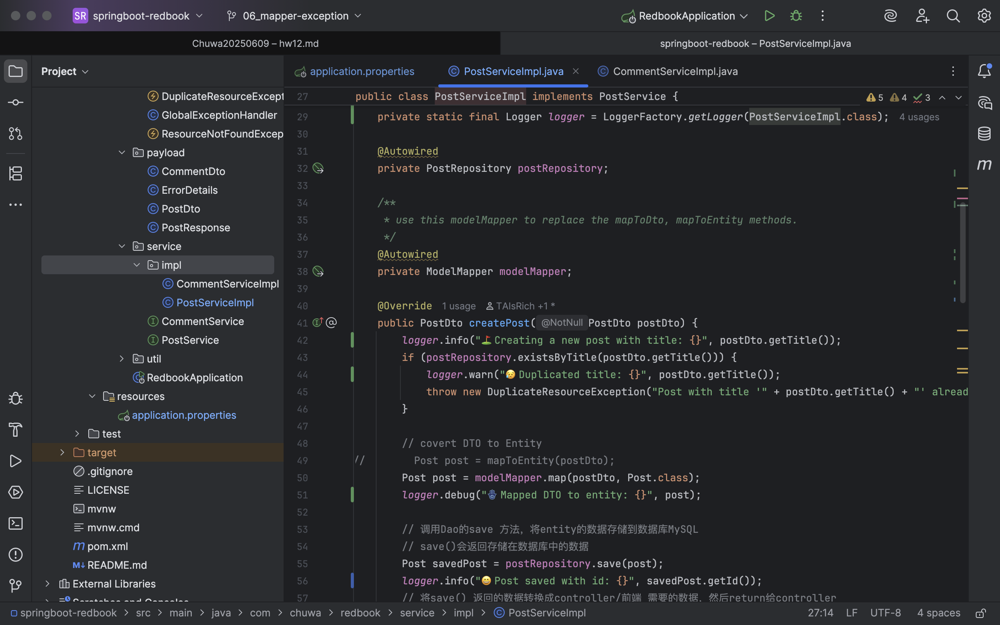
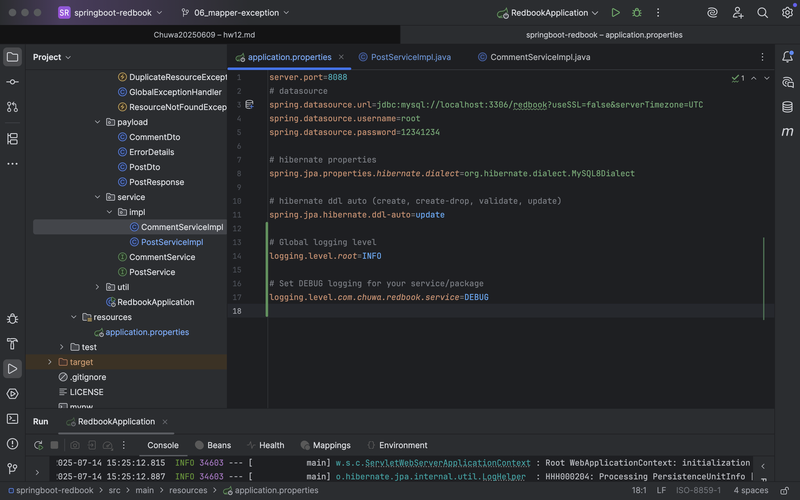
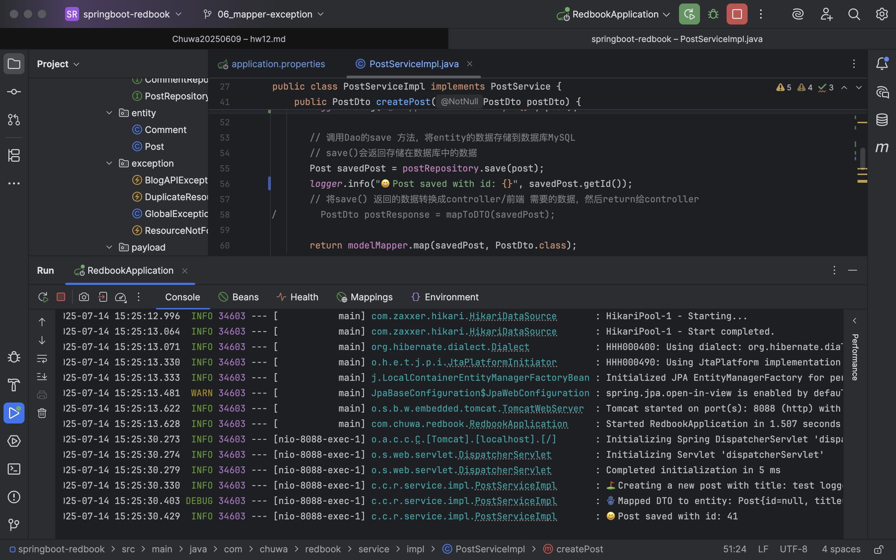
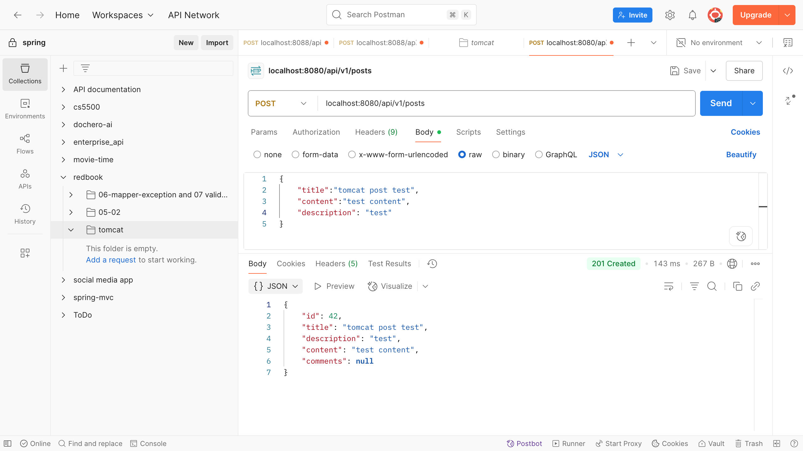
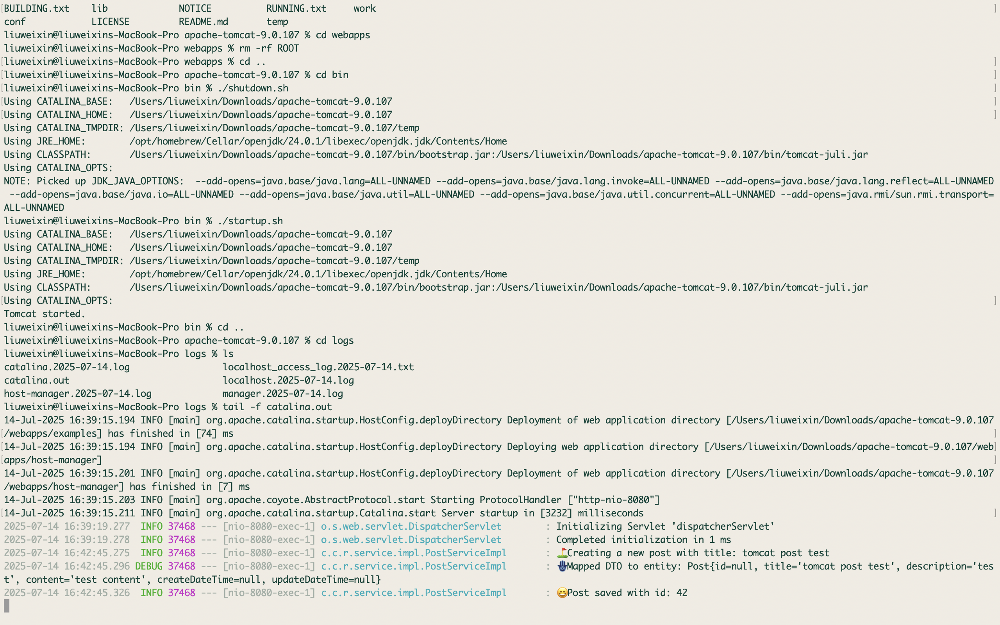

# HW12 Tomcat, Logging

---

#### On branch https://github.com/CTYue/springboot-redbook/commits/06_mapper-exception, add:
1. Add proper logging statements for this project, please use slf4j as your logger.
2. Set up proper logging level.

| Level   | Use it for...                                 |
| ------- | --------------------------------------------- |
| `ERROR` | Unexpected crashes, failed transactions       |
| `WARN`  | Suspicious situations that aren't fatal       |
| `INFO`  | Business flow steps (e.g., "Post created")    |
| `DEBUG` | Internal values, control flow, mapping steps  |
| `TRACE` | Super-fine detail, usually too noisy for prod |

3. Take screenshots







4. Instead of using embedded tomcat, setup an external tomcat server to bring up above application. Take screenshots.

- 修改 pom.xml
```xml
- <packaging>war</packaging>
```
- 排除内置 Tomcat，改为 provided
```xml
<dependency>
    <groupId>org.springframework.boot</groupId>
    <artifactId>spring-boot-starter-web</artifactId>
    <exclusions>
        <exclusion>
            <groupId>org.springframework.boot</groupId>
            <artifactId>spring-boot-starter-tomcat</artifactId>
        </exclusion>
    </exclusions>
</dependency>

<!-- 内置 Tomcat 变成外部依赖，仅 JAR 运行时有效 -->
<dependency>
    <groupId>org.springframework.boot</groupId>
    <artifactId>spring-boot-starter-tomcat</artifactId>
    <scope>provided</scope>
</dependency>

```

- change `RedbookApplication` 
```java
@SpringBootApplication
public class RedbookApplication extends SpringBootServletInitializer {

	@Override
	protected SpringApplicationBuilder configure(SpringApplicationBuilder builder) {
		return builder.sources(RedbookApplication.class);
	}

	public static void main(String[] args) {
		SpringApplication.run(RedbookApplication.class, args);
	}

}

```

- package war
```java
mvn clean package
```

- run apache tomcat
  - 把war包改名为ROOT，并且删除原有的webapps里的ROOT, 这样api就是 ./api/v1/
  - `cd /apache-tomcat-9.0.107/bin`
  - `./startup.sh`
  - test with http://localhost:8080/api/v1/posts or using postman
  - see logs:
    - `cd /apache-tomcat-9.0.107/logs/`
    - `tail -f catalina.out`
  - shutdown server under `bin`
    - `./shutdown.sh`


