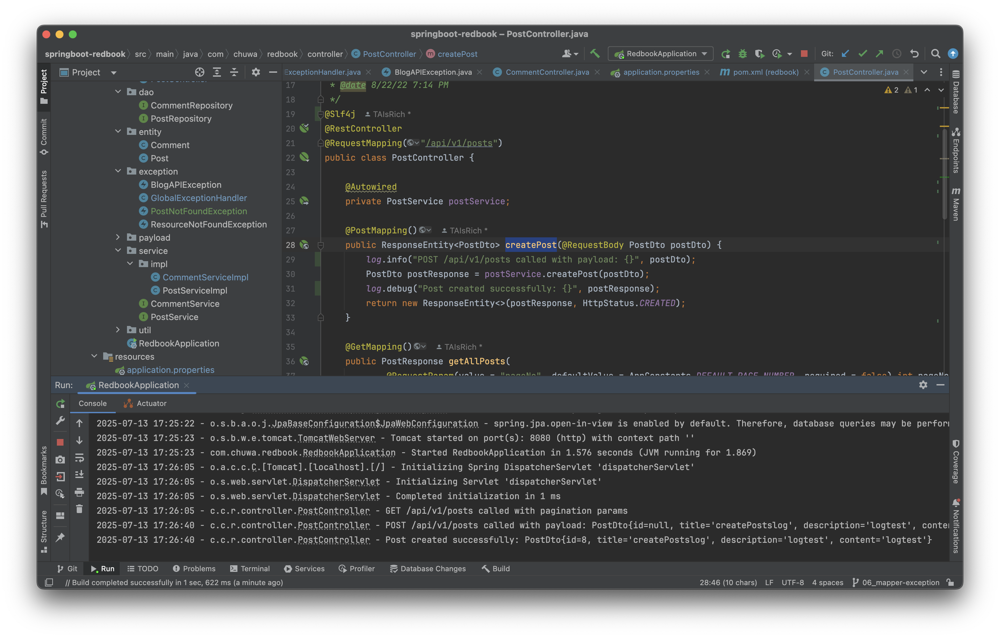
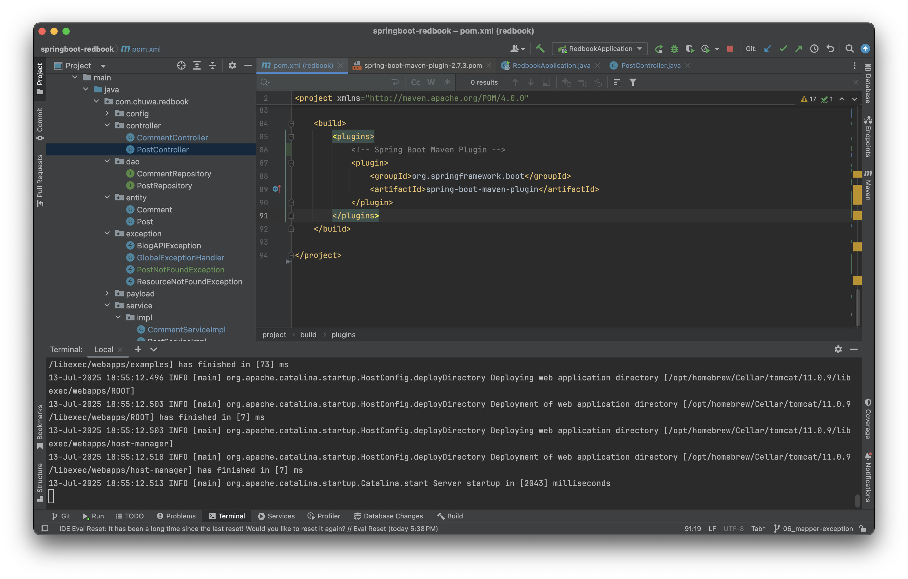

# 📖 Spring Assignment: Additional Tasks
---

### 1. Add proper logging statements for this project, please use SLF4J as your logger.
- In Spring Boot, SLF4J can be used with **Lombok’s @Slf4j** or manually via LoggerFactory.

---

### 2. Set up proper logging level.
```properties
# Global logging level
logging.level.root=INFO

# Set INFO for Spring framework logs
logging.level.org.springframework=INFO

# Set DEBUG for your application package (more detailed logs)
logging.level.com.chuwa.redbook=DEBUG

# Log output pattern (optional)
logging.pattern.console=%d{yyyy-MM-dd HH:mm:ss} - %logger{36} - %msg%n
```
---

### 3. Take screenshots.
- 
---

### 4. Instead of using embedded Tomcat, set up an external Tomcat server to bring up the above application. Take screenshots.
- 