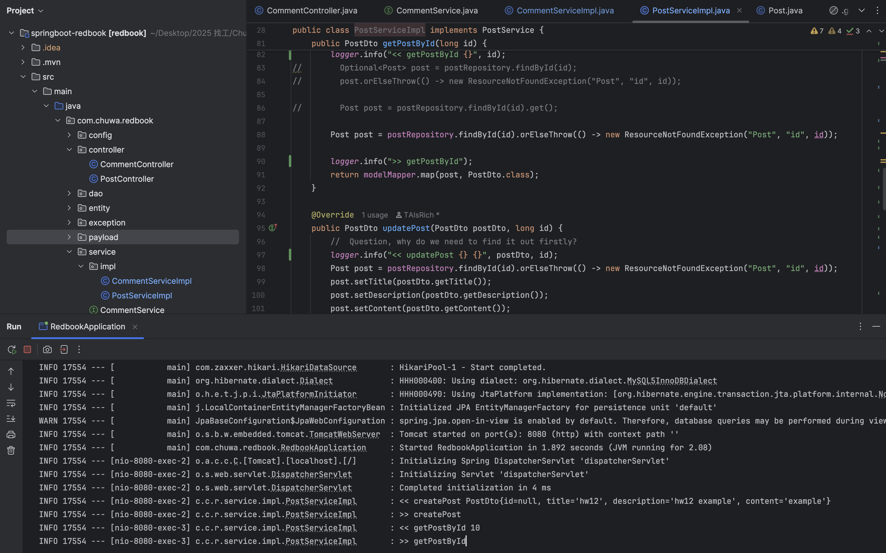
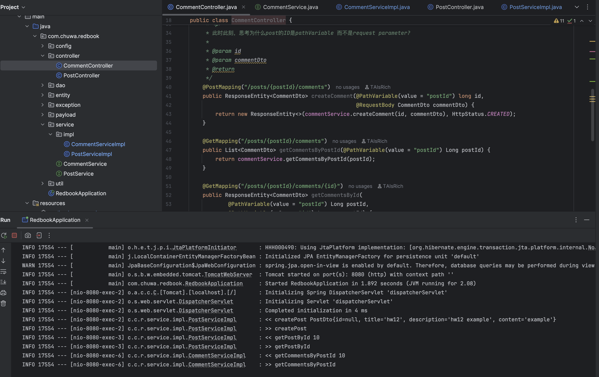

```
1. Add proper logging statements for this project, please use slf4j as your logger
2. Set up proper logging level.
3. Take screenshots
```




<p> 4. Instead of using embedded tomcat, set up an external tomcat server to bring up above application. Take
   screenshots. </p>

