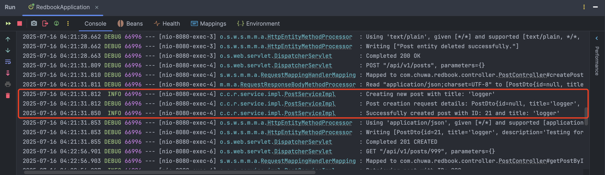
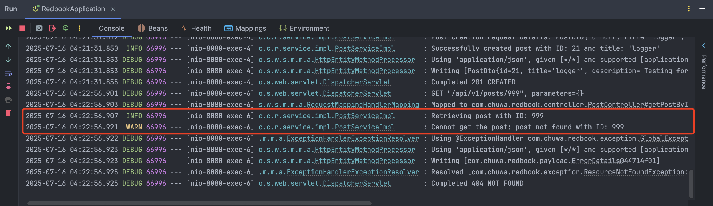
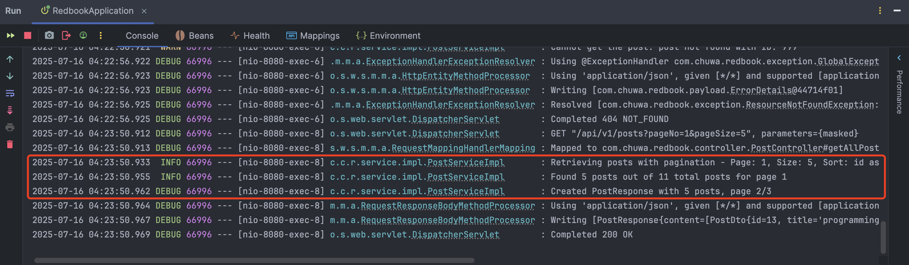
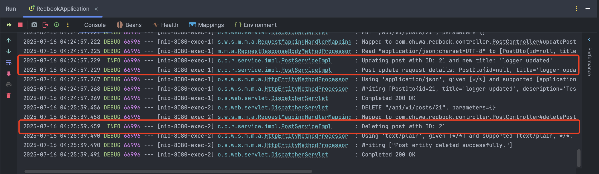
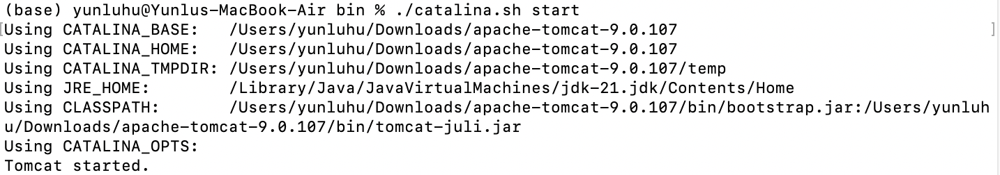
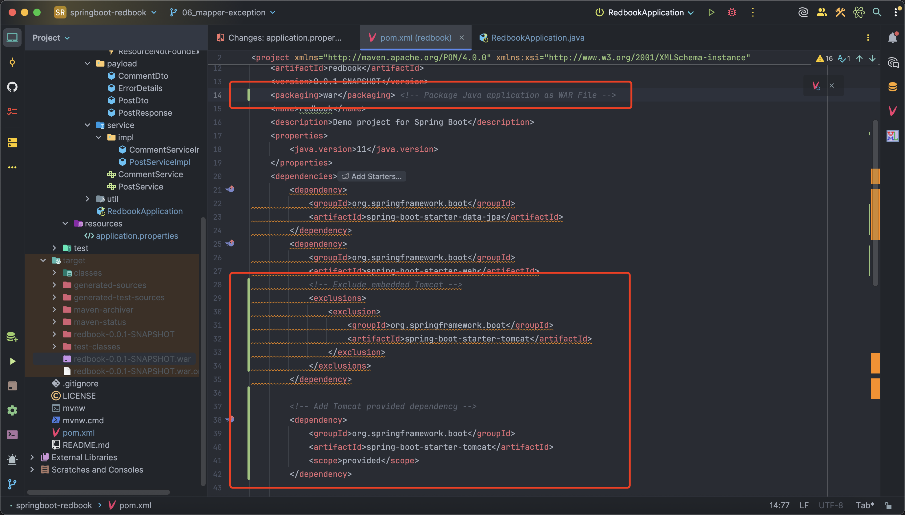
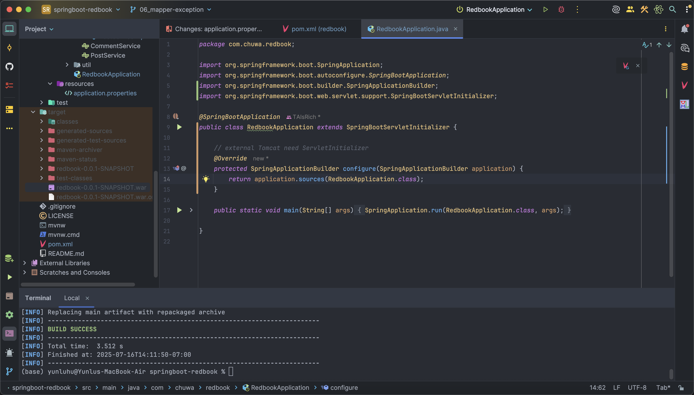
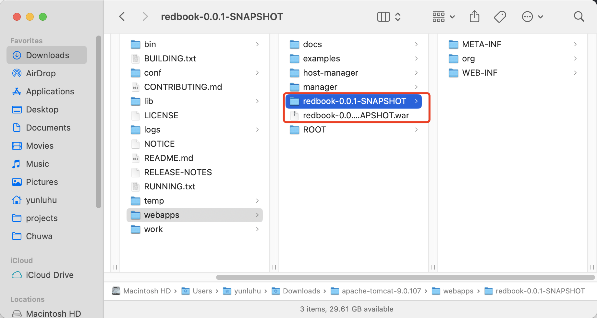
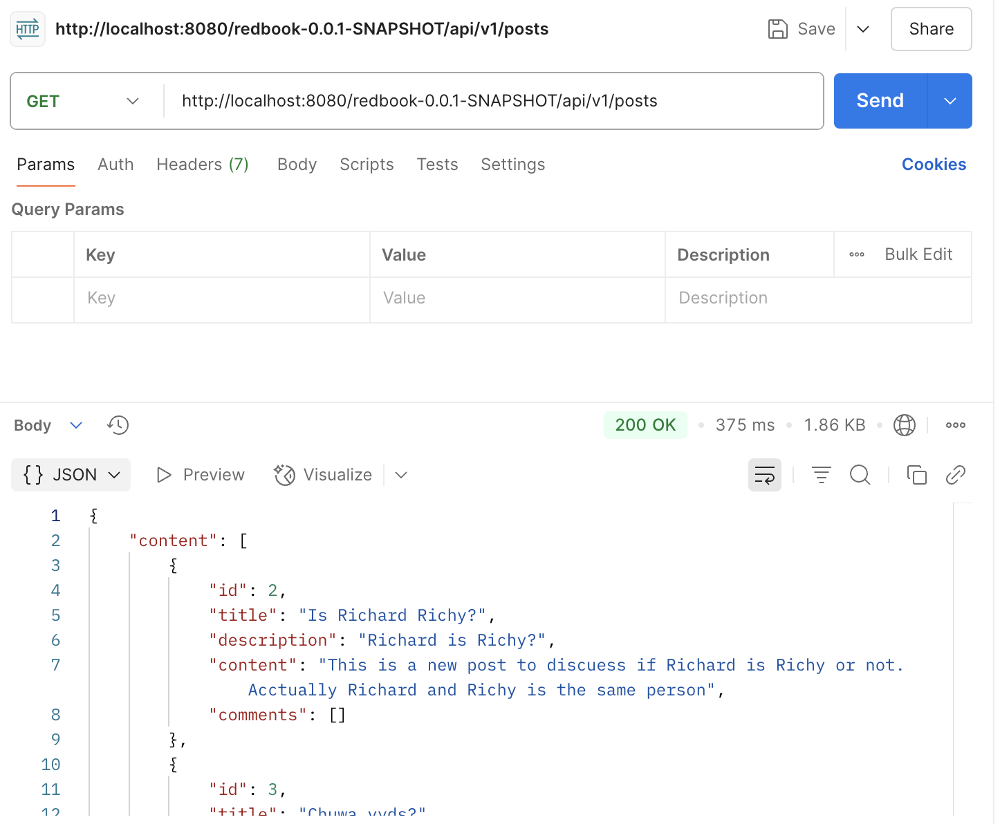

# HW12 - Hands-on Logger & Tomcat

In your last assignment, you have worked on https://github.com/CTYue/springboot-redbook/commits/06_mapper-exception

On top of that, please

1. Add proper logging statements for this project, please use slf4j as your logger. Set up proper logging level and take screenshots.

   

   

   

   

   

2. Instead of using embeded tomcat, setup an external tomcat server to bring up above application. Take screenshots.

   **Tomcat installed and started**

   

   **Package Java application as WAR File and necessary configuration**

   

   

   **Deploy WAR file in tomcat server**

   

   **Test succeeded in Postman:**

   