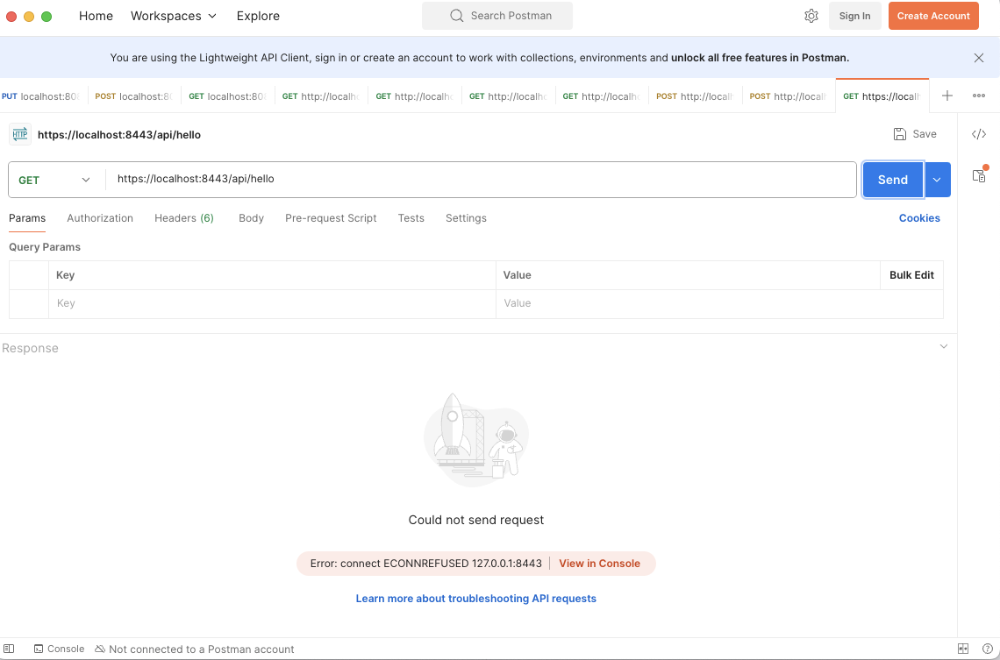
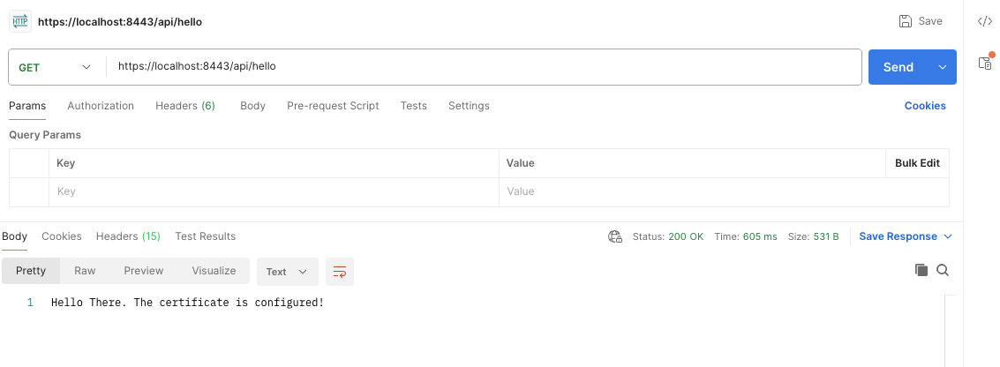
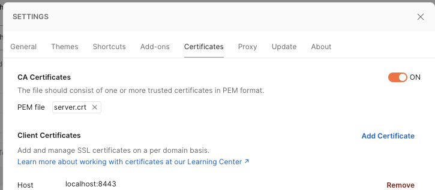
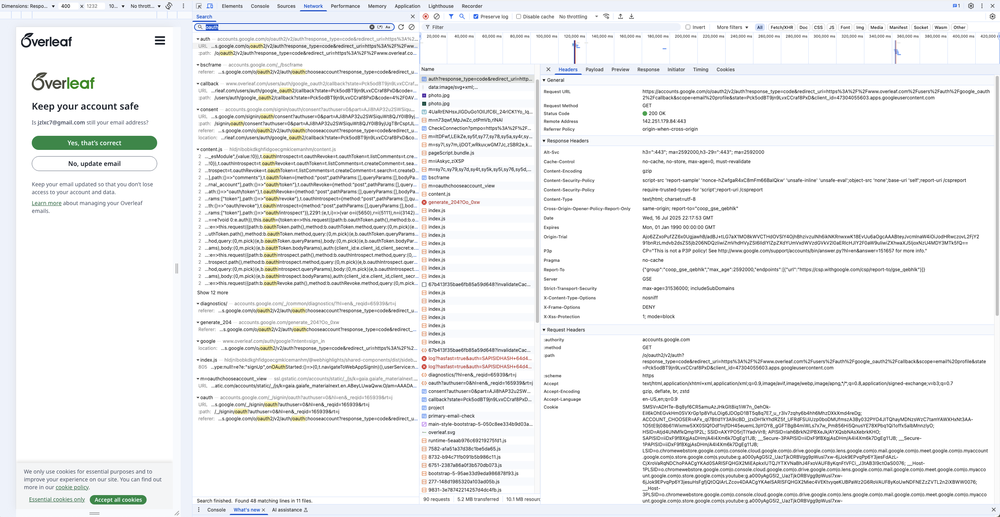
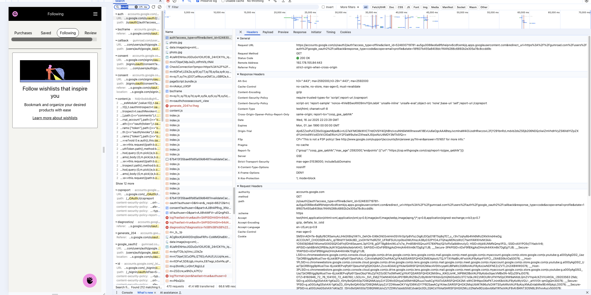

## hw13 - Spring Security

### 1. List all of the annotations you learned from class and homework to `annotaitons.md`

### 2. Explain TLS, PKI, certificate, public key, private key, and signature.  

- TLS (Transport Layer Security) is a cryptographic protocol operating at the transport layer (current mainstream version: TLS 1.3). Its core goals and features include:  
1. ensuring confidentiality, integrity, and authentication in network communication to protect data in transit
2. performance optimization
3. support for multiple cipher suites and smooth migration to more secure algorithms when existing ones are compromised, ensuring long‑term use
4. continuous introduction and deployment of newer, stronger cryptographic methods

- TLS handshake: During the TLS handshake, asymmetric encryption is used to securely exchange the “pre‑master secret”: the client can either encrypt a randomly generated pre‑master secret with the server’s public key (RSA) from its certificate, or both parties can compute the same pre‑master secret using ephemeral Diffie‑Hellman key exchange protocols (DHE/ECDHE), which also provide forward secrecy. After the handshake, both sides feed the pre‑master secret along with the Client Random and Server Random into a pseudorandom function (PRF) to derive the symmetric session key, then switch to symmetric encryption mode via Change Cipher Spec and use this efficient session key to encrypt and integrity‑protect all subsequent application data.

- PKI(Public Key Infrastructure): It is a collection of hardware, software, personnel, policies, and procedures designed to carry out the generation, management, storage, distribution, and revocation of keys and certificates based on the public‑key cryptosystem.

  - Core Components: Certificate Authority (CA), Registration Authority (RA), Digital Certificate, Public Key Encryption  
  - Basic Workflow  
    - 1. Certificate Request: The user (or server) generates a key pair and **submits the public key along with identity proof to the CA**.  
    - 2. Identity Validation: The **RA/CA** verifies the requester’s identity according to security policies (e.g., domain control, organizational credentials).    
    - 3. Certificate Issuance: The **CA** signs the requester’s public key and identity information with its **private key**, producing an X.509 certificate that includes the signature.  
    - 4. Distribution & Use: Certificates can be distributed via HTTPS, LDAP, file download, etc., and **clients verify** their authenticity(Certificates) **using the CA’s public key**.  
    - 5. Revocation & Renewal: If a private key is compromised or information changes, the CA adds the certificate to a CRL or notifies clients via OCSP that the certificate is no longer trusted.  
  - **CIA** - The three fundamental elements of information security: Confidentiality, Integrity, Availability    
  - The three fundamental elements of information security:   
    - Confidentiality: not stolen by others; no information leakage
    - Integrity: not destroyed, tampered with, or lost by others
    - Availability: always ensured to be functional; not unavailable
    - Non‑repudiation: requires authentication; prevents identity forgery


- Certificate: a digitally signed document (often in X.509 format) that binds an **entity’s identity** (such as a domain name or organization) to **its public key**, issued and verified by a trusted Certificate Authority.
  - Root Certificate: the certificate at the top of the hierarchy; all certificate chains terminate at the root certificate.  
  - Subordinate Certificate: a certificate issued by an immediately higher‑level CA.
  - Self‑Signed Certificate: a certificate whose public key and the key used to verify the certificate are the same; all self‑signed certificates are root certificates.  
  
  Certificate Authority (CA): an organization that issues digital certificates.  
  CA/Certificate Hierarchy: in PKI, starting from the Root CA, CAs form a top‑down hierarchy—each lower‑level CA trusts and is certified by the CA above it.  
  - Root CA: a special CA that is unconditionally trusted and sits at the very top of the certificate hierarchy. A Root CA must sign its own certificate because there is no higher CA. Common Root CAs include VeriSign, GlobalSign, Thawte, and GeoTrust.
  - Subordinate CA: a CA whose certificate is issued by a higher‑level CA. In a Subordinate CA’s certificate, the public key and the key used to verify the certificate are different.

- public key: in an asymmetric encryption system, the key that can be **shared with others**; typically **included in a certificate**.

- private key: in an asymmetric encryption system, the key kept secret and **used only by its owner**, **never shared**.  


- signature: a digital signature in an asymmetric encryption system where the sender first computes a hash (digest) of the original data, then encrypts that digest with their private key to produce the signature. The receiver uses the sender’s public key to decrypt the signature, recovers the digest, and compares it to its own computed digest to verify data integrity and the sender’s identity.


### 3. Write a Spring security based application, which provides HTTPS APIs (one simple GET controller with empty response is good enough) instead of HTTP. Please generate a self-signed certificate to make your HTTPS TLS verification work.


    1. Pack your self-signed certificate in the form of `.jks` file, as part of your application, name it properly.

    2. Test if you can verify your HTTPS API without importing the self-signed certificate to your local certificate chain. If not, explain why.

    3. Explain what you did to make HTTPS call work. **Do NOT bypass TLS/SSL verification in Postman (this is cheating)!**

    - Tutorial: [https://www.baeldung.com/spring-channel-security-https](https://www.baeldung.com/spring-channel-security-https)

###### Answer:
2. No.  
   The HTTPS API verification FAILS without importing the certificate because:  
No Trusted Authority: Self-signed certificates have no trusted CA in the certificate chain  
Security by Design: HTTPS clients are designed to reject untrusted certificates  
Cannot Verify Authenticity: No way to distinguish between legitimate and malicious self-signed certificates  
Missing Root CA: The system's trusted certificate store doesn't contain our certificate    




3. The HTTPS call worked.  

    

I basically followed the [tutorial](https://www.baeldung.com/openssl-self-signed-cert) to create my self-signed certificate with OpenSSL.   
To generate certifciate:  
```java
#!/bin/bash

# Step 1: Generate private key
        openssl genrsa -out server.key 2048

        # Step 2: Generate certificate signing request (CSR)
        openssl req -new -key server.key -out server.csr -subj "/C=US/ST=CA/L=San Francisco/O=MyOrg/OU=IT/CN=localhost"

        # Step 3: Generate self-signed certificate
        openssl x509 -req -days 365 -in server.csr -signkey server.key -out server.crt

        # Step 4: Create PKCS12 keystore (intermediate format)
        openssl pkcs12 -export -in server.crt -inkey server.key -out server.p12 -name "server" -password pass:changeit

        # Step 5: Convert PKCS12 to JKS format
        keytool -importkeystore -srckeystore server.p12 -srcstoretype PKCS12 -srcstorepass changeit -destkeystore server.jks -deststoretype JKS -deststorepass changeit -destkeypass changeit

        # Clean up intermediate files
        rm server.csr server.p12

        echo "Certificate generation complete!"
        echo "Files created:"
        echo "- server.key (private key)"
        echo "- server.crt (certificate)"
        echo "- server.jks (keystore for Spring Boot)"
```

Then I go to Postman Settings → Certificates.  
Add server.crt as a CA certificate for localhost.  
  


### 4. List all HTTP status codes that relate to authentication and authorization failures.  
401 Unauthorized: The request requires user authentication. The client MUST authenticate itself to get the requested response.

403 Forbidden: The server understood the request but refuses to authorize it. Authentication won’t help; the request is permanently forbidden.

407 Proxy Authentication Required: The client must first authenticate itself with the proxy. Similar to 401, but for proxy servers.

511 Network Authentication Required: The client needs to authenticate to gain network access (e.g., captive portal login).


### 5. Compare authentication and authorization. Name and explain important components in Spring Security that undertake authentication and authorization.

| Aspect            | Authentication                                                             | Authorization                                                                    |
| ----------------- | -------------------------------------------------------------------------- | -------------------------------------------------------------------------------- |
| Question Answered | “Who are you?”                                                             | “What are you allowed to do?”                                                    |
| Goal              | Verify identity (login)                                                    | Grant or deny access to resources or actions                                     |
| When in Flow      | Happens first—establishes who the principal is                             | Happens after authentication—checks permissions                                  |
| Failure Result    | Typically HTTP 401 (Unauthorized)                                          | Typically HTTP 403 (Forbidden)                                                   |
| Spring Security   | Populating a fully authenticated `Authentication` in the `SecurityContext` | Making access decisions (URL, method, expression) based on that `Authentication` |

- Components in Spring Security that undertake authentication and authorization  

Authentication Components:
- SecurityContextHolder: holds the SecurityContext (which contains the current Authentication) for each request/thread
- AuthenticationManager: orchestrates the authentication process by delegating to one or more AuthenticationProvider components
- AuthenticationProvider: performs a specific authentication mechanism (for example, DaoAuthenticationProvider or LdapAuthenticationProvider)
- UserDetailsService: loads user data (username, password hash, roles) from a persistent store such as a database or LDAP
- PasswordEncoder: encodes and verifies passwords (for example, BCryptPasswordEncoder or Pbkdf2PasswordEncoder)
- UsernamePasswordAuthenticationFilter: intercepts login requests, extracts credentials, creates an AuthenticationToken, and invokes the AuthenticationManager

Authorization Components:
- FilterSecurityInterceptor: the final servlet filter that enforces URL or method security rules after authentication
- SecurityMetadataSource: maps secured objects (such as URL patterns or methods) to required attributes like roles or permissions
- AccessDecisionManager: makes the allow/deny decision by consulting one or more AccessDecisionVoter components
- AccessDecisionVoter: votes on access based on criteria (for example, RoleVoter, AuthenticatedVoter, or ExpressionVoter)
- MethodSecurityInterceptor: applies security rules at the service or method level in combination with annotations like PreAuthorize or Secured
- Expression-based authorization: uses Spring EL expressions (for example, hasRole('ADMIN') or #id == principal.id) for fine-grained access control via DefaultMethodSecurityExpressionHandler


### 6. Explain HTTP Session.  
HTTP session provides a way to maintain state across multiple HTTP requests between a client and a server in the otherwise stateless HTTP protocol.
The session is implemented **using cookies**: the session data is stored on the **server** side, and the **sessionId is stored in a cookie on the client side**.  

###### How it works:  
- a session identifier is generated by the server when a client first establishes a session
- the server stores a session object (keyed by that identifier) in memory or a backing store
- the client holds the session identifier, usually in a cookie (or via URL rewriting when cookies are disabled)
- on each subsequent request the client sends its session identifier, allowing the server to look up the corresponding session object

###### Session lifecycle
- creation: on first access, the server creates a new session and returns its identifier
- access: each request referencing the identifier refreshes the session’s last‑access time
- timeout: after a period of inactivity the server automatically invalidates and removes the session
- invalidation: the server or application code can explicitly invalidate a session (for example on logout)

### 7. Explain Cookie.  
###### Definition: 
A cookie is a small piece of data that a web server asks a browser to store and send back with subsequent requests to the same server or domain.

###### How cookies work:  
When a server responds to a request, it can include a Set-Cookie header containing name=value and optional attributes.  
The browser stores the cookie and automatically includes a Cookie header with name=value pairs on every request to matching domains and paths.  
The server uses that data to maintain state or track user identity.  


### 8. Compare Session and Cookie.

| Aspect       | Cookie                                                   | Session                                                      |
|--------------|----------------------------------------------------------|--------------------------------------------------------------|
| Security     | Stored on the client; vulnerable to tampering or theft   | Stored on the server; client only holds sessionId, more secure |
| Data Types   | Only supports string values; others must be converted     | Supports any data type directly                              |
| Lifetime     | Can be set for long durations via expires/max‑age        | Usually short‑lived; expires on browser close or timeout     |
| Storage Size | Limited to about 4KB per cookie                          | Can store much more data, but excessive use consumes server resources |


### 9. Find at least **two** websites that allow login using your Google Account. Explain in detail how Google SSO works with screenshots like below. Find SSO-related REST calls in Chrome developer tool.

    - [https://www.baeldung.com/spring-channel-security-https](https://www.baeldung.com/spring-channel-security-https)


Google SSO uses the OAuth 2.0 Authorization Code Grant with OpenID Connect:    
when a user clicks “Sign in with Google,” their browser is redirected to Google’s OAuth2 authorization endpoint, where they authenticate and consent;   
Google then redirects back to your app’s callback URL with a one‑time authorization code, which your backend exchanges for an ID Token (a signed JWT containing the user’s identity) and an access token;   
after verifying the ID Token’s signature and claims, your server extracts the user’s info, creates a local session or issues its own token, and finally redirects the user into the application as an authenticated session.

   
    


### 10. How do we use session and cookie to keep user information across the application?  
When a user logs in, the **server creates a session** containing the user’s information and **sends a Set‑Cookie header** to store the session’s unique identifier (SessionId) in the client’s cookie.  
From then on, the **browser** automatically **includes that cookie with each request**, allowing the server to **look up the corresponding session and restore the user’s information**, thus maintaining state across requests and pages.  
When the **user logs out or the session expires**, the **server invalidates the session** and **clears the cookie on the client**, ending the stateful interaction.


### 11. What is the Spring Security filter?
Spring Security filter is a **servlet filter implementation** that integrates security checks into every HTTP request and response. at startup, Spring Security registers a single FilterChainProxy that delegates each request to an ordered list of security filters. key filters in that chain include:

- SecurityContextPersistenceFilter  
  loads or initializes the security context for the request and stores it at the end
- UsernamePasswordAuthenticationFilter  
  processes form‑login credentials and populates the security context upon successful authentication
- CsrfFilter  
  enforces CSRF token validation on state‑changing requests
- ExceptionTranslationFilter  
  catches security exceptions (authentication or access denied) and starts the appropriate error flow or login redirect
- FilterSecurityInterceptor  
  performs URL‑based access control by comparing the current authentication against required roles or permissions

each filter **inspects or modifies the request/response** and either **passes** control to the next filter or **terminates** the chain (for example by sending a redirect or error).  
The filter chain order is critical and can be **customized** via the **http security configuration**.


### 12. Explain bearer token and how JWT works.
A bearer token is a security credential in the form of an opaque string that grants its holder access to a protected resource. In HTTP, the client sends it in the “Authorization” request header like this:
Authorization: Bearer <token>
The resource server extracts the token, validates it, and if it is valid, processes the request.

JSON Web Token (JWT) is a specific token format often used as a bearer token.  
JWT is essentially a self‑contained token used for authentication in stateless scenarios and can carry authorization information. The server confirms the requester’s identity by verifying the JWT’s signature and its internal claims (such as user ID, expiration time, roles, etc.), and it determines which resources the requester may access based on those permission claims. Unlike session‑based approaches, JWT does not require the server to store session state, making it well suited for distributed or stateless application architectures.

A JWT is made of **3** parts **separated by dots**:  
- A header, which is a JSON object declaring the signing algorithm (for example HS256 or RS256) and token type,
- A payload, which is a JSON object containing claims about the subject (for example issuer, subject, expiration timestamp, audience, plus any custom data),
- A signature, which is a cryptographic signature computed over the encoded header and payload using either a shared secret (HMAC) or a private key (RSA/ECDSA).

When a client authenticates (for example via username/password or an OAuth2 flow), the authorization server creates the header and payload, signs them to produce the signature, and returns the complete JWT to the client.  
The client stores the JWT (in memory, local storage, or a secure cookie) and **sends it with each request** in the Authorization **header**.  
The resource server then splits the token into its three parts, recomputes the signature from the header and payload using the known secret or public key, and verifies that it matches the signature in the token. It also checks standard claims such as **expiration time and intended audience**. If all checks pass, the server accepts the token’s payload as proof of authentication and authorization **without needing to look up session state**.


### 13. Explain how we store sensitive user information such as password and credit card number in DB.
Passwords and other credentials should never be stored in plaintext or with reversible encryption;   instead you use a per‑user salt and a slow, one‑way hashing algorithm (e.g. bcrypt, Argon2 or PBKDF2 with a pepper) so that even if your database leaks, attackers can’t recover the original passwords.

For credit‐card data (and other PCI‑scope information), the best practice is to tokenize it via a PCI‑compliant vault or, if you must store it yourself, encrypt the full PAN with a strong algorithm like AES‑256‑GCM using keys managed in an HSM or secure vault, keep only the last four digits in cleartext, enforce TLS in transit and encryption at rest, and apply strict access controls, key rotation, and audit logging. 


### 14. Compare `UserDetailService`, `AuthenticationProvider`, `AuthenticationManager`, `AuthenticationFilter`?  
    (把这几个名字看熟悉也行)  
| Component                  | Description                                                                                                              |
|----------------------------|---------------------------------------------------------------------------------------------------------------------------------|
| UserDetailsService         | **Loads user-specific data** (username, password hash, roles) from a persistent store (database, LDAP)                          |
| AuthenticationProvider     | Performs **authentication logic** for a specific mechanism (e.g. username/password, OAuth2, LDAP)                               | 
| AuthenticationManager      | Orchestrates the overall **authentication process by delegating** to one or more **AuthenticationProviders**                    | 
| AuthenticationFilter       | **Intercepts HTTP requests**, **extracts credentials**, **creates** an Authentication token, and triggers authentication process |


### 15. What is the disadvantage of Session? How to overcome the disadvantage?
Disadvantages of server‑side sessions:
•Statefulness and scalability. Because each user’s data is kept in memory (or in a backing store) on the server, as your user count grows you either run out of memory or incur high overhead replicating sessions across a cluster.
•Single‑point bottleneck. If your session store goes down or becomes overloaded, all users lose access.

How to overcome these issues:  
1.Use a distributed, in‑memory session store (Redis, Memcached) or a database cache so all app servers share session data without heavy replication traffic.  
2.Enable sticky‑sessions (session affinity) at your load balancer so each user is routed to the same server, reducing cross‑node lookups (though this can limit elasticity).  
3.Move to a stateless model using signed tokens (JWT or similar) carried by the client—no server‑side session store at all, which simplifies scaling in microservices or serverless environments.  
4.If you must keep server state, set short timeouts and offload large session payloads to external caches or dedicated session databases to limit per‑session memory use.  


### 16. How to get value from `application.properties` in Spring Security?

In the Spring Security configuration (e.g. a @Configuration class), simply annotate a field or constructor parameter with @Value("${some.property.name}").  
Under the hood, Spring uses a BeanPostProcessor (specifically ValueAnnotationBeanPostProcessor) to scan your beans for @Value annotations. It resolves the ${…} placeholder via the Environment (and optionally SpEL), then uses Java **reflection** if you’re using setter injection, simply **calls the setter** to inject the value into the field.  
The final write to the field is done via reflection, but it’s all managed by Spring’s DI container and the SpEL/placeholder resolution machinery.  

Or inject the Environment and call env.getProperty("your.property.name"), to read any value defined in application.properties.


### 17. What is the role of `configure(HttpSecurity http)` and `configure(AuthenticationManagerBuilder auth)`?
`configure(AuthenticationManagerBuilder auth)`is called when the **application starts**;  
Is used to **specify where user details come from(authentication sources)** and **how passwords are encoded**.  

`configure(HttpSecurity http)` is called when **building the security filter chain**;
Is used to **define URL access rules**, **login/logout behavior, CSRF protection, and related policies**.

```java
import org.springframework.context.annotation.Bean;
import org.springframework.context.annotation.Configuration;
import org.springframework.security.config.annotation.authentication.builders.AuthenticationManagerBuilder;
import org.springframework.security.config.annotation.web.builders.HttpSecurity;
import org.springframework.security.config.annotation.web.configuration.EnableWebSecurity;
import org.springframework.security.config.annotation.web.configuration.WebSecurityConfigurerAdapter;
import org.springframework.security.crypto.bcrypt.BCryptPasswordEncoder;
import org.springframework.security.crypto.password.PasswordEncoder;

@Configuration
@EnableWebSecurity
public class SecurityConfig extends WebSecurityConfigurerAdapter {

    // configure(AuthenticationManagerBuilder auth) configures authentication sources: here we demonstrate in-memory users,
    // but can also wire in a custom UserDetailsService, LDAP, JDBC, etc.
    @Override
    protected void configure(AuthenticationManagerBuilder auth) throws Exception {
        auth
            .inMemoryAuthentication()
            .withUser("alice")
                .password(passwordEncoder().encode("alice123"))
                .roles("USER")
            .and()
            .withUser("bob")
                .password(passwordEncoder().encode("bob123"))
                .roles("ADMIN");
    }

    // configure(HttpSecurity http) configures authorization rules: which paths allow anonymous access,
    // and which require login or specific roles
    @Override
    protected void configure(HttpSecurity http) throws Exception {
        http
            .authorizeRequests()
                .antMatchers("/public/**").permitAll()
                .antMatchers("/admin/**").hasRole("ADMIN")
                .anyRequest().authenticated()
            .and()
            .formLogin()
                .loginPage("/login")    // custom login page
                .permitAll()
            .and()
            .logout()
                .permitAll();
    }

    // Password encoder bean: used to hash and verify user passwords during authentication
    @Bean
    public PasswordEncoder passwordEncoder() {
        return new BCryptPasswordEncoder();
    }
}
```


### 18. Reading: 泛读一下即可，自己觉得是重点的，可以多看两眼。  
    [https://www.interviewbit.com/spring-security-interview-questions/#is-security-a-cross-cutting-concern](https://www.interviewbit.com/spring-security-interview-questions/#is-security-a-cross-cutting-concern)

    1. 1–12
    2. 17–30

### 19. Explain best practices to securely store secrets in applications.  

(1) Runtime Injection / Environment Variables  
Inject secrets at application startup via environment variables or platform features to avoid hardcoding.
 
(2) Managed Secrets Services  
Use centralized secret stores like AWS Secrets Manager, HashiCorp Vault, or Azure Key Vault for secure storage and access.

(3) Exclude from Version Control  
Add credential and configuration files to .gitignore to prevent plaintext secrets in your code repository.

(4) Encrypt at Rest  
Encrypt secrets stored on disk or in databases to ensure they remain protected when not in use.

(5) Rotation & Auditing  
Automate secret rotation and log all access to support auditing and detect anomalies.
