# 1. List Annotations
List all of the annotations you learned from class and homework to annotaitons.md
# 2. Explain TLS, PKI, etc
Explain **TLS** , **PKI** , **certificate** , **public key** , **private key** , and **signature**.
A:

- **Transport Layer Security (TLS):** TLS is a cryptographic protocol designed to provide secure communication over a computer network. It ensures privacy and data integrity between two communicating applications, such as a web browser and a web server. TLS uses a combination of symmetric and asymmetric encryption to establish a secure channel, authenticate the server (and optionally the client), and encrypt the data exchanged.
传输层安全协议（TLS）： TLS 是一种加密协议，旨在提供计算机网络上的安全通信。 它确保两个通信应用程序（例如 Web 浏览器和 Web 服务器）之间的隐私和数据完整性。TLS 结合使用对称加密和非对称加密来建立安全通道、验证服务器（以及可选的客户端）身份，并对交换的数据进行加密。
- **Public Key Infrastructure (PKI):** PKI is a system that enables the creation, management, distribution, use, storage, and revocation of digital certificates. It provides the framework necessary to establish and maintain trust in digital identities and secure electronic communications. Key components of a PKI include Certificate Authorities (CAs), Registration Authorities (RAs), a certificate database, and certificate revocation lists (CRLs) or Online Certificate Status Protocol (OCSP) responders.
公钥基础设施（PKI）： 公钥基础设施 ( PKI) 是一个能够创建、管理、分发、使用、存储和吊销数字证书的系统。 它为建立和维护数字身份信任以及保障电子通信安全提供了必要的框架。PKI 的关键组成部分包括证书颁发机构 (CA)、注册机构 (RA)、证书数据库以及证书吊销列表 (CRL) 或在线证书状态协议 (OCSP) 响应器。
- **Certificate (Digital Certificate):** A digital certificate is an electronic document used to prove the ownership of a public key. It binds an identity (such as a person, organization, or server) to a public key and is digitally signed by a trusted Certificate Authority (CA). Certificates contain information like the subject's identity, the public key, the issuer's identity, the validity period, and the CA's digital signature.
证书（数字证书）： 数字证书是一种用于证明公钥所有权的电子文档。 它将身份（例如个人、组织或服务器）与公钥绑定，并由受信任的证书颁发机构 (CA) 进行数字签名。 证书包含诸如主体身份、公钥、颁发者身份、有效期以及 CA 的数字签名等信息。
- **Public Key and Private Key:** These are a pair of mathematically linked keys used in asymmetric cryptography.
  公钥和私钥： 这是一对在非对称加密中使用的数学关联的密钥。
    - **Public Key:** This key is freely shared and can be used by anyone to encrypt data intended for the owner of the key pair or to verify a digital signature created by the owner.
      公钥： 此密钥可自由共享，任何人都可以使用它来加密原本要发送给密钥对所有者的数据，或者验证所有者创建的数字签名。
    - **Private Key:** This key is kept secret by its owner. It is used to decrypt data that was encrypted with the corresponding public key or to create digital signatures.
      私钥： 此密钥由其所有者保密。 它用于解密使用相应公钥加密的数据或创建数字签名。


- **Signature (Digital Signature):** A digital signature is a cryptographic mechanism used to verify the authenticity and integrity of digital messages or documents. It is created by using a private key to encrypt a hash of the data. Anyone with the corresponding public key can then decrypt the signature and re-calculate the hash of the data. If the two hashes match, it confirms that the data has not been tampered with and originated from the owner of the private key.
签名（数字签名）： 数字签名是一种用于验证数字消息或文档真实性和完整性的加密机制。 它通过使用私钥对数据的哈希值进行加密来创建。 任何拥有相应公钥的人都可以解密签名并重新计算数据的哈希值。 如果两个哈希值匹配，则可以确认数据未被篡改，并且确实来自私钥的所有者。

# 3. Self-signed certificate hands-on
Write a Spring security based application, which provides **https** APIs (one simple get controller with empty response is good enough) instead of http, please generate a **self-signed** certificate to make your **https** TLS verfication work.
       1. Pack your self-signed certificate in the form of **jks** file, as part of your application, name it properly
       2. Test if you can verify your HTTPs api without importing the self-signed certificate to your local
          certificate chain, if not, explain why.
       3. Explain what did you do to make **https** call work, do NOT bypass TLS/SSL verfication in Postman (this is cheating)!
          Tutorial: https://www.baeldung.com/spring-channel-security-https

A:
The code is in Projects folder.
## 1. Create a Spring project with Web and Spring Security dependencies.

Here's my controller, it simply returns a 'Hello World':

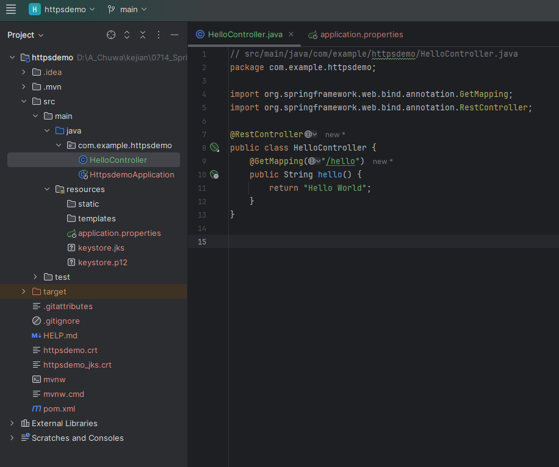

## 2. Generate a self-signed certificate (PowerShell)

From the project root, run PowerShell:

PKCS12:
```powershell
# 2.1 Generate a PKCS12 keystore with a self-signed cert
keytool -genkeypair `
  -alias httpsdemo `
  -keyalg RSA -keysize 2048 `
  -storetype PKCS12 `
  -keystore keystore.p12 `
  -validity 365 `
  -storepass changeit -keypass changeit `
  -dname "CN=localhost, OU=Dev, O=Demo, L=LA, S=CA, C=US" `
  -ext SAN=dns:localhost,ip:127.0.0.1

# 2.2 Generate a JKS keystore with a self-signed cert
keytool -genkeypair `
    -alias httpsdemo `
    -keyalg RSA -keysize 2048 `
    -storetype JKS `
    -keystore keystore.jks `
    -validity 365 `
    -storepass changeit -keypass changeit `
    -dname "CN=localhost" `
    -ext SAN=dns:localhost,ip:127.0.0.1
```
That creates `keystore.p12` in the current folder.

> Why SAN? Modern TLS clients require a Subject Alternative Name for hostname validation; setting `dns:localhost, ip:127.0.0.1` prevents “No subject alternative names” errors.

## 3. Add the keystore to your app resources

```powershell
Move-Item .\keystore.p12 .\src\main\resources\
```

## 4. Configure Spring Boot to serve HTTPS only

Add the following to `src/main/resources/application.properties`:

```java
spring.application.name=httpsdemo
spring.security.user.name=admin
spring.security.user.password=admin123

# Run only on HTTPS (no HTTP connector)
server.port=8443

## SSL keystore settings (PKCS12)
#server.ssl.enabled=true
#server.ssl.key-store-type=PKCS12
#server.ssl.key-store=classpath:keystore.p12
#server.ssl.key-store-password=changeit
#server.ssl.key-alias=httpsdemo


# SSL keystore settings (JKS)
server.ssl.enabled=true
server.ssl.key-store-type=JKS
server.ssl.key-store=classpath:keystore.jks
server.ssl.key-store-password=changeit
server.ssl.key-alias=httpsdemo


# (Optional) tighten protocols/ciphers if needed
# server.ssl.enabled-protocols=TLSv1.2,TLSv1.3
```
## 5. Run and sanity-check

Because it’s self-signed, the browser will warn that the connection isn’t trusted:

- **Chrome:**
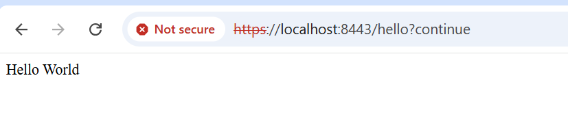
- **Postman:**
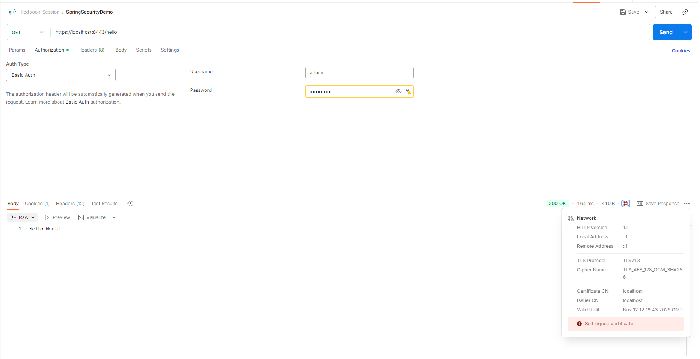

## 6. Export the server certificate (PEM)

From the project root, run PowerShell:

```powershell
keytool -exportcert -alias httpsdemo `
  -keystore src\main\resources\keystore.p12 `
  -storetype PKCS12 `
  -storepass changeit `
  -rfc -file httpsdemo.crt
```

Now you have `httpsdemo.crt` (PEM).

### Option A — Trust it at the OS level (Windows)

1. Press Win+R, type certmgr.msc, Enter.
2. Go to Trusted Root Certification Authorities → Certificates.
3. Right-click Certificates → All Tasks → Import….
4. Import `httpsdemo.crt` (choose “All Files (.)” if needed).
5. Restart Postman/terminal if open.

Now a browser/Postman/curl that uses the Windows trust store should accept `https://localhost:8443/…` without disabling verification.

> You may prefer to import into **Trusted People** instead of **Root** if you don’t want to mark it as a CA; for localhost dev, Root is common, but be mindful and remove it later.

### Option B — Trust it per-tool (no global changes)

- **Curl:**

```powershell
curl.exe --cacert .\httpsdemo_jks.crt -u  admin:admin123 https://localhost:8443/hello
```
That uses your exported cert as the trusted root—verification stays on.

- **Postman (don’t disable SSL verification):**

Settings → **Certificates** → Add a **CA Certificate**.

Choose `httpsdemo.crt` as your CA (this makes Postman trust it for verification).

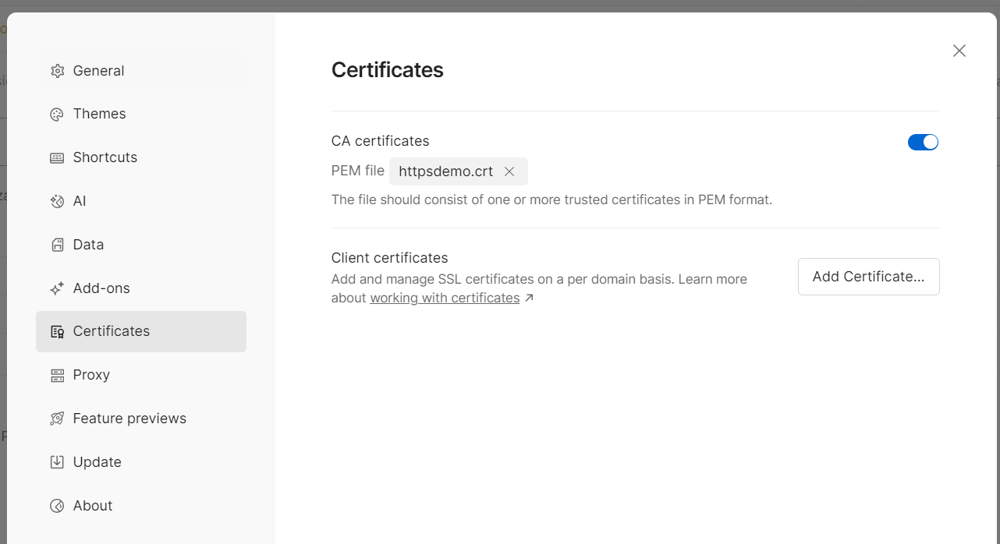

Restart Postman and call `https://localhost:8443/hello` normally (no SSL bypass).
- **Chrome:**
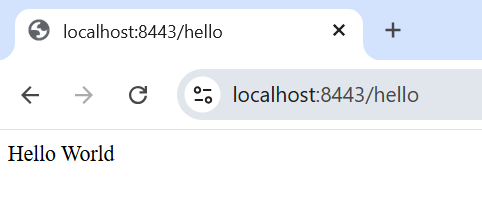
- **Curl:**
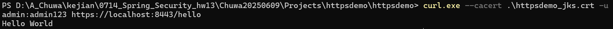
- **Postman:**
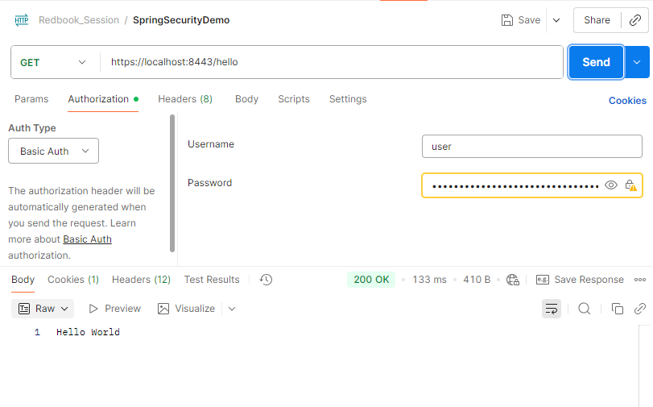

# 4. list all http status codes that related to authentication and authorization failures.

The HTTP status codes related to authentication and authorization failures are:
- **401 Unauthorized**: This code indicates that the request requires user authentication information. The client may repeat the request with a suitable Authorization header field. Despite its name, this code primarily relates to authentication failures, meaning the client has not provided valid credentials or has not authenticated at all.
- **403 Forbidden**: This code signifies that the server understood the request but refuses to authorize it. Unlike 401, the client's identity is typically known to the server (i.e., they are authenticated), but they lack the necessary authorization or permissions to access the requested resource or perform the requested action.
- **407 Proxy Authentication Required**: This status code is similar to 401 Unauthorized, but it indicates that the client must first authenticate itself with a proxy. 
- **400 Bad Request**: While not exclusively for authentication/authorization, this code can be returned if the authentication or authorization credentials provided in the request are malformed or invalid in a way that the server cannot process, even before attempting to validate them.
- **404 Not Found**: In some scenarios, a server might return a 404 instead of a 403 to obscure the existence of a resource from an unauthorized user, preventing them from knowing whether the resource exists or if they simply lack permissions. This is a security measure to avoid information leakage.

# 5. Compare **authentication** and **authorization**? Name and explain important components in Spring security that undertake **authentication** and **authorization**

Authentication verifies the identity of a user, answering the question "Who are you?". This typically involves validating credentials like a username and password. Authorization, on the other hand, determines what an authenticated user is permitted to do, answering "What are you allowed to do?". It defines access rights to resources and actions based on the user's permissions. Authentication is a prerequisite for authorization.
身份验证用于验证用户身份，回答“你是谁？”这个问题。 这通常涉及验证用户名和密码等凭据。 另一方面，授权则确定已验证用户可以执行哪些操作，回答“你被允许做什么？”这个问题。 它根据用户的权限定义对资源和操作的访问权限。 身份验证是授权的前提条件。
**Important Components in Spring Security for Authentication and Authorization:**
## Authentication Components:
- `UserDetailsService`: This interface is responsible for retrieving user-specific data during authentication. It has a single method, `loadUserByUsername(String username)`, which is used to locate a user by their username and return a `UserDetails` object.
此接口负责在身份验证期间检索用户特定数据。 它只有一个方法，loadUserByUsername(String username)用于通过用户名查找用户并返回一个UserDetails对象。
- `AuthenticationManager`: This interface manages the authentication process. It delegates the actual authentication logic to one or more `AuthenticationProvider` instances.
AuthenticationManager： 此接口管理身份验证过程， 并将实际的身份验证逻辑委托给一个或多个AuthenticationProvider实例。
- `AuthenticationProvider`: This interface performs the core authentication logic by verifying user credentials against stored information (e.g., in-memory, database, LDAP). Examples include `DaoAuthenticationProvider` for database-backed authentication and `LdapAuthenticationProvider` for LDAP.
此接口通过验证用户凭据与存储信息（例如，内存、数据库、LDAP）是否匹配来执行核心身份验证逻辑。 示例包括DaoAuthenticationProvider基于数据库的身份验证和LdapAuthenticationProviderLDAP 身份验证。
- `PasswordEncoder`: This interface is used to securely encode and decode passwords, typically using one-way hashing algorithms like BCrypt, to prevent plain-text storage of credentials. `BCryptPasswordEncoder` is a common implementation.
该接口用于安全地编码和解码密码，通常使用诸如 BCrypt 之类的单向哈希算法，以防止以明文形式存储凭据。 BCryptPasswordEncoder这是一种常见的实现方式。
## Authorization Components:
- `SecurityContextHolder`: This class stores the details of the currently authenticated user, including their `Authentication` object, which contains the user's principal (identity) and granted authorities (permissions).
此类存储当前已验证用户的详细信息，包括其`Authentication`对象，其中包含用户的主体（身份）和授予的权限。
- `Authentication`: This interface represents the currently authenticated user. It holds information about the principal, credentials, and granted authorities.
此接口代表当前已通过身份验证的用户。 它包含有关主体、凭据和已授予权限的信息。
- `GrantedAuthority`: This interface represents a permission or role granted to an authenticated user. These authorities are used by authorization mechanisms to determine access rights.
此接口表示授予已认证用户的权限或角色。 授权机制使用这些权限来确定访问权限。
- `FilterSecurityInterceptor`: This filter is a key component for authorization in web applications. It intercepts requests and, based on configured security rules and the user's `GrantedAuthority` objects, determines whether the user is authorized to access the requested resource.
该过滤器是 Web 应用程序授权的关键组件。 它会拦截请求，并根据配置的安全规则和用户GrantedAuthority对象，确定用户是否有权访问所请求的资源。
- **Method Security Annotations (`@PreAuthorize`, `@PostAuthorize`, `@Secured`, `@RolesAllowed`)**: These annotations can be used directly on methods to enforce authorization rules at the method level, providing fine-grained control over access to specific functionalities.
这些注解可以直接用于方法上，以在方法级别强制执行授权规则，从而对特定功能的访问进行细粒度控制。


# 6. Explain HTTP Session?

An HTTP session provides a mechanism to maintain stateful interactions between a web client (typically a browser) and a web server over the inherently stateless HTTP protocol. Since HTTP treats each request as independent, sessions are necessary to track user-specific data and actions across multiple requests.
HTTP 会话提供了一种机制，用于在本质上无状态的 HTTP 协议之上，维护 Web 客户端（通常是浏览器）和 Web 服务器之间的有状态交互。 由于 HTTP 将每个请求视为独立的，因此需要会话来跟踪跨多个请求的用户特定数据和操作。
**How it works:**
- **Session Creation**: When a client first interacts with a web application, the server creates a unique session for that client and generates a unique session ID.
创建会话： 当客户端首次与 Web 应用程序交互时，服务器会为该客户端创建一个唯一的会话，并生成一个唯一的会话 ID。
- **Session ID Transmission**: The server sends this session ID back to the client, typically embedded in a cookie (the most common method) or by rewriting URLs.
会话 ID 传输： 服务器将此会话 ID 发送回客户端，通常嵌入在 cookie 中（最常见的方法）或通过重写 URL 来实现。
- **Subsequent Requests**: On subsequent requests, the client sends the session ID back to the server (e.g., in the cookie header).
后续请求： 在后续请求中，客户端会将会话 ID 发送回服务器（例如，在 cookie 标头中）。
- **Session Identification**: The server uses the received session ID to identify the specific session and retrieve any associated data stored on the server side.
会话标识： 服务器使用接收到的会话 ID 来识别特定会话，并检索存储在服务器端的任何相关数据。

**Key aspects of HTTP sessions:**
- **State Management**: Sessions allow servers to store and retrieve user-specific data (e.g., login status, shopping cart contents, user preferences) across multiple page requests, providing a continuous user experience.
状态管理： 会话允许服务器跨多个页面请求存储和检索用户特定数据（例如，登录状态、购物车内容、用户偏好），从而提供连续的用户体验。
- **Session ID**: A unique identifier generated by the server to distinguish one user's session from another.
会话 ID： 服务器生成的唯一标识符，用于区分不同用户的会话。
- **Session Data Storage**: Session data is typically stored on the server, associated with the session ID. This can involve in-memory storage, databases, or distributed caching systems.
会话数据存储： 会话数据通常存储在服务器上，并与会话 ID 相关联。 这可能涉及内存存储、数据库或分布式缓存系统。
- **Session Timeout**: Sessions have a defined lifespan and will expire after a period of inactivity, automatically clearing associated data to prevent resource exhaustion and enhance security.
会话超时： 会话具有确定的生命周期，在一段时间不活动后将过期，并自动清除相关数据，以防止资源耗尽并增强安全性。
- **Security Considerations**: Session management requires careful implementation to prevent vulnerabilities such as session hijacking or fixation. Secure transmission of session IDs (e.g., using HTTPS) and proper session invalidation are crucial.
安全考量： 会话管理需要谨慎实施，以防止会话劫持或固定等漏洞。 安全传输会话 ID（例如，使用 HTTPS）和正确的会话失效机制至关重要。

# 7. Explain Cookie?
A cookie is a small text file that websites store on a user's device to remember information about them, such as login details, shopping cart items, or language preferences. This helps websites function correctly and provides a more personalized and convenient online experience. For example, a cookie can keep you logged in to a website or remember the items in your online shopping cart. 
饼干是网站存储在用户设备上的小型文本文件，用于记住用户的相关信息，例如登录信息、购物车商品或语言偏好设置。 这有助于网站正常运行，并提供更个性化、更便捷的在线体验。例如 ，Cookie 可以让您保持登录状态，或记住您在线购物车中的商品。

**What cookies are used for**
- **Session management**: Cookies help websites remember who you are, which is why you don't have to log in every time you visit a site. 
会话管理： Cookie 可以帮助网站记住你的身份，这就是为什么你每次访问网站时不必登录的原因。
- **Personalization**: They store user preferences like language or the type of content you prefer to see, allowing websites to tailor their content to you. 
个性化： 它们会存储用户偏好，例如语言或您喜欢查看的内容类型，从而使网站能够为您量身定制内容。 
- **Shopping carts**: Cookies remember what you've added to your cart, so the items are still there when you return to the site later. 
购物车： Cookie 会记住您添加到购物车中的商品，因此当您稍后返回网站时，这些商品仍然存在。
- **Tracking**: Some cookies track your browsing behavior for analytics or to show you targeted advertisements based on your interests. 
追踪： 有些 Cookie 会追踪您的浏览行为，用于分析或根据您的兴趣向您展示定向广告。
- **Authentication**: They are used to verify your identity when you log in to a website, allowing you to access different pages without re-entering your credentials. 
验证： 它们用于在您登录网站时验证您的身份，使您无需重新输入凭据即可访问不同的页面。

**Types of cookies**
- **Session cookies**: These are temporary and are automatically deleted when you close your browser. They are used to remember your activities during a single browsing session. 
会话 cookie： 这些数据是临时的，会在您关闭浏览器时自动删除。 它们用于记住您在单次浏览会话期间的活动。
- **Persistent cookies**: These are stored on your hard drive until they expire or you delete them. They are used to remember your preferences or browsing behavior over multiple visits. 
持久性 Cookie： 这些数据会存储在您的硬盘上，直到过期或您将其删除。 它们用于记住您多次访问时的偏好设置或浏览行为。
- **First-party cookies**: These are created by the website you are visiting to manage its core functions and your experience on that specific site. 
第一方 Cookie： 这些是由您正在访问的网站创建的，用于管理其核心功能以及您在该特定网站上的体验。
- **Third-party cookies**: These are placed on your device by a domain other than the one you are on, often by advertisers or analytics services. Due to privacy concerns, many browsers are phasing out support for them. 
第三方 Cookie： 这些插件由您当前访问域名以外的其他域名放置在您的设备上，通常是由广告商或分析服务提供商放置的。 出于隐私方面的考虑，许多浏览器正在逐步停止对它们的支持

# 8. Compare Session and Cookie?

Cookies store data in the user's browser, while sessions store data on the server. Cookies can be persistent and have a small storage limit (about 4KB), while sessions have a shorter lifespan (ending when the browser closes) and can store much more data. Because session data is server-side, it is generally more secure, though a server-side session typically uses a session ID stored in a cookie to function.
 Cookie 将数据存储在用户的浏览器中，而会话则将数据存储在服务器上。Cookie 具有持久性，但存储空间有限（约 4KB），而会话的生命周期较短（浏览器关闭时即结束），但可以存储更多数据。由于会话数据位于服务器端，因此通常更安全，但服务器端会话通常使用存储在 Cookie 中的会话 ID 来实现其功能。

|Feature |	Cookies	|Sessions|
|------|------|------|
|Storage Location	|Client-side (user's browser)	|Server-side|
|Data Storage	|Small text files on the user's device用户设备上的小型文本文件	|On the web server; a unique session ID is stored in a cookie在网络服务器上，唯一的会话 ID 存储在 cookie 中。|
|Capacity	|Limited (around 4KB)	|Larger (up to 128MB)|
|Lifespan	|Can be long-lasting (based on expiration date) or temporary (until browser is closed)可以是长期有效的（基于到期日期），也可以是暂时有效的（直到浏览器关闭为止）。	|Typically lasts only for the duration of the user's browser session通常仅在用户浏览器会话期间有效|
|Security	|Less secure because data is accessible on the client side	|More secure because data is stored on the server|
|Data Accessibility	|Accessible by both the client and the server	|Accessible only by the server|


# 9. Find **at least TWO** websites who can be logged in using your **Google Account** , explain in detail on how
    Google SSO works with screenshots like below, find SSO-related Rest calls in Chrome developer tool:

## Medium
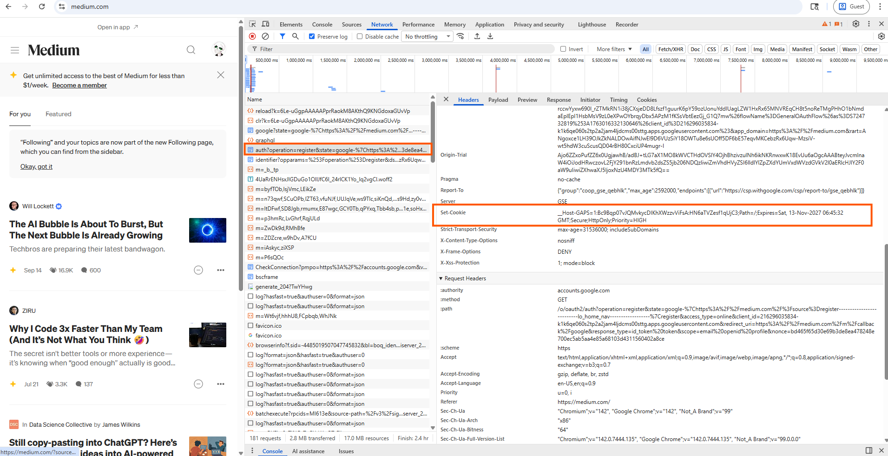

response_type
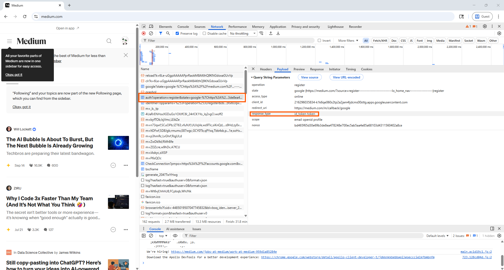

This screenshot shows the request of the login form of google after I clocked 'Login with Google'. 


-   This is an OIDC **implicit flow**
    
-   The client (Medium web app) wants tokens **directly in the browser**, not via backend exchange
    

OIDC supports multiple flows:

| Flow | response\_type | Typical Use |
| --- | --- | --- |
| Authorization Code Flow | `code` | Server-side web apps (recommended, modern) |
| Implicit Flow | `id_token` or `id_token token` | Single-page apps (older) |
| Hybrid Flow | `code id_token` | Complex apps |

Medium appears to be using an OIDC **implicit or hybrid** flow.


**Where does this request belong in the whole flow?**

Here is the full flow with your request highlighted:

```vbnet
Step 1: Browser → Google Authorization Endpoint  
   GET /o/oauth2/v2/auth?client_id=...&response_type=id_token token&...

       ▼
   Google returns login page (your PowerShell HTML)

Step 2: User logs in manually (in browser only)
Step 3: Google redirects to Medium with id_token, access_token
Step 4: Medium validates tokens
Step 5: Medium logs you in
```

Your request = **Step 1**

### Curl
```powershell
$session = New-Object Microsoft.PowerShell.Commands.WebRequestSession
$session.UserAgent = "Mozilla/5.0 (Windows NT 10.0; Win64; x64) AppleWebKit/537.36 (KHTML, like Gecko) Chrome/142.0.0.0 Safari/537.36"
Invoke-WebRequest -UseBasicParsing -Uri "https://accounts.google.com/o/oauth2/auth?operation=register&state=google-%7Chttps%3A%2F%2Fmedium.com%2F%3Fsource%3Dregister--------------------------lo_home_nav------------------%7Cregister&access_type=online&client_id=216296035834-k1k6qe060s2tp2a2jam4ljdcms00sttg.apps.googleusercontent.com&redirect_uri=https%3A%2F%2Fmedium.com%2Fm%2Fcallback%2Fgoogle&response_type=id_token%20token&scope=email%20openid%20profile&nonce=bd465f65d30e69b3de8ea478248e700ec5ab5aa4e85a68103d4311560402a8ce" `
-WebSession $session `
-Headers @{
"authority"="accounts.google.com"
  "method"="GET"
  "path"="/o/oauth2/auth?operation=register&state=google-%7Chttps%3A%2F%2Fmedium.com%2F%3Fsource%3Dregister--------------------------lo_home_nav------------------%7Cregister&access_type=online&client_id=216296035834-k1k6qe060s2tp2a2jam4ljdcms00sttg.apps.googleusercontent.com&redirect_uri=https%3A%2F%2Fmedium.com%2Fm%2Fcallback%2Fgoogle&response_type=id_token%20token&scope=email%20openid%20profile&nonce=bd465f65d30e69b3de8ea478248e700ec5ab5aa4e85a68103d4311560402a8ce"
  "scheme"="https"
  "accept"="text/html,application/xhtml+xml,application/xml;q=0.9,image/avif,image/webp,image/apng,*/*;q=0.8,application/signed-exchange;v=b3;q=0.7"
  "accept-encoding"="gzip, deflate, br, zstd"
  "accept-language"="en-US,en;q=0.9"
  "priority"="u=0, i"
  "referer"="https://medium.com/"
  "sec-ch-ua"="`"Chromium`";v=`"142`", `"Google Chrome`";v=`"142`", `"Not_A Brand`";v=`"99`""
  "sec-ch-ua-arch"="`"x86`""
  "sec-ch-ua-bitness"="`"64`""
  "sec-ch-ua-full-version-list"="`"Chromium`";v=`"142.0.7444.135`", `"Google Chrome`";v=`"142.0.7444.135`", `"Not_A Brand`";v=`"99.0.0.0`""
  "sec-ch-ua-mobile"="?0"
  "sec-ch-ua-model"="`"`""
  "sec-ch-ua-platform"="`"Windows`""
  "sec-ch-ua-platform-version"="`"19.0.0`""
  "sec-ch-ua-wow64"="?0"
  "sec-fetch-dest"="document"
  "sec-fetch-mode"="navigate"
  "sec-fetch-site"="cross-site"
  "sec-fetch-user"="?1"
  "upgrade-insecure-requests"="1"
  "x-browser-channel"="stable"
  "x-browser-copyright"="Copyright 2025 Google LLC. All rights reserved."
  "x-browser-validation"="Aj9fzfu+SaGLBY9Oqr3S7RokOtM="
  "x-browser-year"="2025"
}
```

## Kaggle

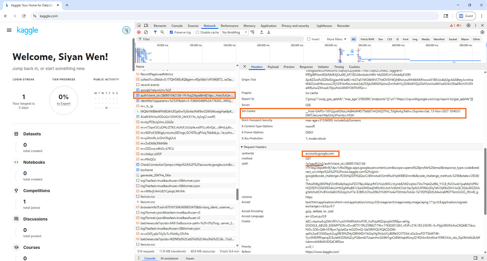

response_type
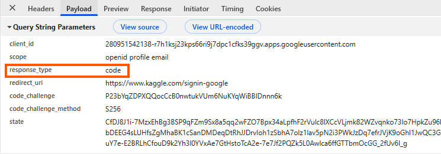

### Curl:

```powershell
$session = New-Object Microsoft.PowerShell.Commands.WebRequestSession
$session.UserAgent = "Mozilla/5.0 (Windows NT 10.0; Win64; x64) AppleWebKit/537.36 (KHTML, like Gecko) Chrome/142.0.0.0 Safari/537.36"
$session.Cookies.Add((New-Object System.Net.Cookie("AEC", "AaJma5ujDtfvV97x1uxUVFAtRfvbFmFOR_VuPUpIKQUpwjAVDR6px-ekVg", "/", ".google.com")))
$session.Cookies.Add((New-Object System.Net.Cookie("GOOGLE_ABUSE_EXEMPTION", "ID=d87517ffc25f8627:TM=1763030128:C=R:IP=216.165.230.95-:S=fYpjU8IGNLIhoCKQABC7dco", "/", ".google.com")))
$session.Cookies.Add((New-Object System.Net.Cookie("NID", "526=Q4h147Bym7gUetDa-kiO2DmQ-iVaOfMYQVXQACDiDW-qdhL2xs61XXtDpytr2ug0fE3PhZMyQ90iMDrl1bOqJVg5hUxUCyB09kGCXT5Xd-zGo3xwP2YT5bW74K-Yyv3NRiPRFqevq3CEuleMJGXfzfxZcyFQIbmIb7UsamHw3G4M1gxCkBWrtqtdNiwyQ1fQVtvnEmtKne1FEfKJVcIz_nks_DplJMrdAL8vfdfIubmnrkIA8sMJiDGdC4flGsw", "/", ".google.com")))
Invoke-WebRequest -UseBasicParsing -Uri "https://accounts.google.com/o/oauth2/v2/auth?client_id=280951542138-r7h1ksj23kps66ri9j7dpc1cfks39ggv.apps.googleusercontent.com&scope=openid%20profile%20email&response_type=code&redirect_uri=https%3A%2F%2Fwww.kaggle.com%2Fsignin-google&code_challenge=P23bYqZDPXQQocCcB0nwtukVUm6NuKYqWiBBIDnnn6k&code_challenge_method=S256&state=CfDJ8J1i-7MzxEhBg3BSP9qFZm9Sx8a5qq2wFZO7Bpx34aLpfhF2rVulc8lXCcVLjmk82WZvqnko73Io7HpkZu96k_Y1C8_RUChuIe1ljxaMqYzPRUHQ35E5Y2ZbDEEG4sLUHfsZgMhaBK1cSanDMDeqDtRhJJDrvIoh1zSbhA7olz1lav5pN2i3PWkJzDq7efrJVjK9oGhl1JwQC3GduW2ZXiAgYeIUhx0CHvB5miEa6Ul5GUpyVuY7e-E2BRLhCfouD9k2Yh3l0YVxAe7GtHstoTcA2e-7e7Jf2PQZk5L0Awlca6ffGTTbmOcGG_2fUv6I_g" `
-WebSession $session `
-Headers @{
"authority"="accounts.google.com"
  "method"="GET"
  "path"="/o/oauth2/v2/auth?client_id=280951542138-r7h1ksj23kps66ri9j7dpc1cfks39ggv.apps.googleusercontent.com&scope=openid%20profile%20email&response_type=code&redirect_uri=https%3A%2F%2Fwww.kaggle.com%2Fsignin-google&code_challenge=P23bYqZDPXQQocCcB0nwtukVUm6NuKYqWiBBIDnnn6k&code_challenge_method=S256&state=CfDJ8J1i-7MzxEhBg3BSP9qFZm9Sx8a5qq2wFZO7Bpx34aLpfhF2rVulc8lXCcVLjmk82WZvqnko73Io7HpkZu96k_Y1C8_RUChuIe1ljxaMqYzPRUHQ35E5Y2ZbDEEG4sLUHfsZgMhaBK1cSanDMDeqDtRhJJDrvIoh1zSbhA7olz1lav5pN2i3PWkJzDq7efrJVjK9oGhl1JwQC3GduW2ZXiAgYeIUhx0CHvB5miEa6Ul5GUpyVuY7e-E2BRLhCfouD9k2Yh3l0YVxAe7GtHstoTcA2e-7e7Jf2PQZk5L0Awlca6ffGTTbmOcGG_2fUv6I_g"
  "scheme"="https"
  "accept"="text/html,application/xhtml+xml,application/xml;q=0.9,image/avif,image/webp,image/apng,*/*;q=0.8,application/signed-exchange;v=b3;q=0.7"
  "accept-encoding"="gzip, deflate, br, zstd"
  "accept-language"="en-US,en;q=0.9"
  "priority"="u=0, i"
  "referer"="https://www.kaggle.com/"
  "sec-ch-ua"="`"Chromium`";v=`"142`", `"Google Chrome`";v=`"142`", `"Not_A Brand`";v=`"99`""
  "sec-ch-ua-arch"="`"x86`""
  "sec-ch-ua-bitness"="`"64`""
  "sec-ch-ua-full-version-list"="`"Chromium`";v=`"142.0.7444.135`", `"Google Chrome`";v=`"142.0.7444.135`", `"Not_A Brand`";v=`"99.0.0.0`""
  "sec-ch-ua-mobile"="?0"
  "sec-ch-ua-model"="`"`""
  "sec-ch-ua-platform"="`"Windows`""
  "sec-ch-ua-platform-version"="`"19.0.0`""
  "sec-ch-ua-wow64"="?0"
  "sec-fetch-dest"="document"
  "sec-fetch-mode"="navigate"
  "sec-fetch-site"="cross-site"
  "sec-fetch-user"="?1"
  "upgrade-insecure-requests"="1"
  "x-browser-channel"="stable"
  "x-browser-copyright"="Copyright 2025 Google LLC. All rights reserved."
  "x-browser-validation"="Aj9fzfu+SaGLBY9Oqr3S7RokOtM="
  "x-browser-year"="2025"
}
```


# 10. How do we use session and cookie to keep user information across the the application?

A:
You use a cookie to store a session ID on the user's browser, and the server uses this ID to look up the user's session data stored on the server. When a user first visits, the server creates a unique session ID and sends it to the browser as a session cookie, and subsequent requests from that browser include the cookie, allowing the server to identify and retrieve the correct user's information, such as items in a shopping cart or login status. 

# 11. What is the **spring security filter**?

A:
The Spring Security Filter Chain is a core component of Spring Security's web infrastructure, responsible for handling security-related concerns for HTTP requests. It is a series of standard servlet filters that intercept incoming requests and process them before they reach the application's controllers.
Spring Security 过滤器链是 Spring Security Web 基础架构的核心组件，负责处理 HTTP 请求的安全相关问题。 它由一系列标准的 Servlet 过滤器组成，用于拦截传入的请求并在其到达应用程序控制器之前进行处理。
**Here's how it works:**
- **Interception**: When an HTTP request arrives at a Spring-based application, it is first intercepted by the `DelegatingFilterProxy`(registered as a standard servlet filter), which then forwards it to the `FilterChainProxy`.
拦截： 当一个基于 Spring 的应用程序收到 HTTP 请求时，它首先会被DelegatingFilterProxy(registered as a standard servlet filter)拦截，然后被转发给FilterChainProxy
- **Filter Chain Proxy**: The `FilterChainProxy` determines which specific `SecurityFilterChain` should handle the request based on URL patterns. This allows for different security configurations to be applied to different parts of the application (e.g., a stateless RESTful API versus a traditional web application with form login).
过滤链代理： FilterChainProxy根据 URL 模式确定应​​该由哪个特定SecurityFilterChain处理请求。 这样就可以对应用程序的不同部分应用不同的安全配置（例如，无状态的 RESTful API 与带有表单登录的传统 Web 应用程序）。
- **Security Filter Chain**: Once the appropriate `SecurityFilterChain` is identified, the request passes through a series of individual `Security Filters`. Each filter has a specific responsibility in the security process, and their order in the chain is crucial due to dependencies.
安全过滤链： 一旦确定了合适的过滤器SecurityFilterChain，请求就会经过一系列单独的过滤器Security Filters。 每个过滤器在安全流程中都承担着特定的职责，并且由于彼此间的依赖关系，它们在流程中的顺序至关重要。
- **Filter Responsibilities**: These filters perform various tasks, including:
  筛选职责： 这些过滤器执行各种任务，包括
  - **Authentication**: Handling user authentication (e.g., `UsernamePasswordAuthenticationFilter`, `BasicAuthenticationFilter`).
  身份验证： 处理用户身份验证（例如，，UsernamePasswordAuthenticationFilter）BasicAuthenticationFilter。
  - **Authorization**: Enforcing access control policies and checking if a user has the necessary permissions to access a resource (e.g., `FilterSecurityInterceptor`).
  授权： 强制执行访问控制策略，并检查用户是否具有访问资源的必要权限（例如，FilterSecurityInterceptor）。
  - **Session Management**: Managing user sessions and their associated security contexts (e.g., ConcurrentSessionFilter).
  会话管理： 管理用户会话及其相关的安全上下文（例如，`ConcurrentSessionFilter`）。
  - **CSRF Protection**: Protecting against Cross-Site Request Forgery attacks.
  CSRF 防护： 防止跨站请求伪造攻击。
  - **Exception Handling**: Managing security-related exceptions (e.g., `ExceptionTranslationFilter`).
  异常处理： 管理与安全相关的异常（例如，ExceptionTranslationFilter）。
- **Request Processing**: After passing through all the configured filters in the `SecurityFilterChain`, the request, if allowed, proceeds to the application's controllers for business logic processing.
请求处理： 请求经过所有SecurityFilterChain中配置过的过滤器后，如果允许，则会继续发送到应用程序的控制器进行业务逻辑处理。
- **Response Handling**: The response then travels back through the filters, allowing for any necessary post-processing or security enhancements before being sent back to the client.
响应处理： 然后，响应会返回到过滤器，进行任何必要的后处理或安全增强，然后再发送回客户端。
In essence, the Spring Security Filter Chain provides a flexible and powerful mechanism to integrate security into Spring web applications by allowing developers to define and customize a chain of filters that handle various aspects of authentication, authorization, and other security-related concerns.
从本质上讲，Spring Security Filter Chain 提供了一种灵活而强大的机制，通过允许开发人员定义和自定义一系列过滤器来处理身份验证、授权和其他安全相关问题的各个方面，从而将安全性集成到 Spring Web 应用程序中。
# 12. Explain **bearer token** and how **JWT** works.

A:
A bearer token is an access token used in security protocols like OAuth 2.0. It grants the bearer access to a protected resource. The name "bearer" implies that whoever possesses the token is granted access, without further proof of identity. Bearer tokens are typically sent in the `Authorization` header of an HTTP request, prefixed with "Bearer".
一个授权令牌是在 OAuth 2.0 等安全协议中使用的访问令牌。它授予持有者访问受保护资源的能力。"持有者"这个名字意味着只要持有令牌，任何人都可以获得访问权限，无需进一步的身份证明。授权令牌通常在 HTTP 请求的 `Authorization` 头中发送，并以"Bearer"为前缀。
For example:  例如：
```
Authorization: Bearer <your_token_here>
```
**How JWT (JSON Web Token) Works**
**JWT（JSON Web Token）的工作原理**
JWTs are a common format for implementing bearer tokens. They are self-contained tokens that securely transmit information between parties as a JSON object. A JWT consists of three parts, separated by dots:
JWT 是实施持有者令牌的常见格式。它们是作为 JSON 对象在各方之间安全传输信息的自包含令牌。JWT 由三个用点分隔的部分组成：
- **Header**: This part typically contains information about the token type (JWT) and the signing algorithm used (e.g., HMAC SHA256 or RSA). This JSON is then Base64Url encoded.
  标题：这部分通常包含有关令牌类型（JWT）和所使用的签名算法（例如，HMAC SHA256 或 RSA）的信息。然后对这段 JSON 进行 Base64Url 编码。
    ```
    {
      "alg": "HS256",
      "typ": "JWT"
    }
    ```
- **Payload (Claims)**: This section contains statements about an entity (usually the user) and additional data. These "claims" can include registered claims (like `iss` for issuer, `exp` for expiration time, `sub` for subject), public claims, and private claims. This JSON is also Base64Url encoded.
  有效载荷（声明）：这一部分包含关于实体（通常是用户）的声明和附加数据。这些"声明"可以包括注册声明（如 `iss` 表示发行者， `exp` 表示过期时间， `sub` 表示主题）、公共声明和私有声明。这个 JSON 也是 Base64Url 编码的。

    ```
    {
      "sub": "1234567890",
      "name": "John Doe",
      "admin": true,
      "exp": 1731619200 // Example expiration timestamp
    }
    ```
- **Signature**: This part is created by taking the Base64Url encoded header, the Base64Url encoded payload, a secret (or a private key in asymmetric encryption), and the algorithm specified in the header, and then signing them. This signature ensures the token's integrity and authenticity; if the header or payload is tampered with, the signature will no longer be valid.
签名：这一部分是通过取 Base64Url 编码的头部、Base64Url 编码的有效载荷、一个密钥（或非对称加密中的私钥），以及头部中指定的算法，然后将它们签名生成的。这个签名确保了令牌的完整性和真实性；如果头部或有效载荷被篡改，签名将不再有效。

**JWT Authentication Flow:**
**JWT 认证流程：**

- **Authentication**: A user provides credentials (e.g., username and password) to an authentication server.
认证：用户向认证服务器提供凭证（例如用户名和密码）。
- **JWT Issuance**: If the credentials are valid, the server generates a JWT, signs it, and returns it to the client.
JWT 签发：如果凭证有效，服务器生成一个 JWT，对其签名，并将其返回给客户端。
- **Token Storage**: The client stores the JWT (e.g., in `HttpOnly` cookies or secure local storage).
令牌存储：客户端存储 JWT（例如，在 `HttpOnly` cookie 或安全本地存储中）。
- **Authenticated Requests**: For subsequent requests to protected resources, the client includes the JWT in the `Authorization: Bearer` header.
认证请求：对于后续对受保护资源的请求，客户端在 `Authorization: Bearer` 头中包含 JWT。
- **Token Verification**: The resource server receives the request, extracts the JWT, and verifies its signature using the shared secret or public key. It also checks for token expiration and other claims.
令牌验证：资源服务器接收请求，提取 JWT，并使用共享密钥或公钥验证其签名。它还检查令牌过期和其他声明。
- **Authorization**: If the token is valid, the server grants access to the requested resource based on the claims within the JWT.
授权：如果令牌有效，服务器根据 JWT 中的声明授予对请求资源的访问权限。

# 13. Explain how do we store sensitive user information such as password and credit card number in DB?
A:
Sensitive data like passwords and credit card numbers are stored using a combination of encryption, hashing, and tokenization to protect them from unauthorized access. Passwords are not stored directly but as a salted hash, while credit card numbers are often replaced with a token or encrypted using strong algorithms, with encryption keys managed separately and securely.
使用加密、哈希和令牌化相结合的方式保护它们免受未经授权的访问。密码不是直接存储，而是以加盐哈希的形式存储，而信用卡号通常被替换为令牌或使用强算法加密，加密密钥单独且安全地管理。 
## For passwords  对于密码
- **Salting**: A unique, random string of data, called a salt, is combined with the user's password.
加盐：一个独特的、随机的字符串数据，称为盐，与用户的密码组合。
- **Hashing**: A one-way cryptographic hash function is applied to the combined salt and password to create a hash. This process is irreversible, meaning the original password cannot be retrieved from the hash.
哈希：对一个-way 加密哈希函数应用于加盐和密码的组合，以创建一个哈希。这个过程是不可逆的，这意味着原始密码不能从哈希中恢复。
- **Storage**: The salt and the resulting hash are stored in the database. The salt is not a secret and can be stored in plain text, but it's crucial for creating a unique hash for each password.
存储：盐和生成的哈希值存储在数据库中。盐不是秘密，可以明文存储，但它对于为每个密码创建唯一的哈希值至关重要。
- **Verification**: When a user logs in, the system repeats the process, combining the entered password with the stored salt and comparing the resulting hash with the stored hash.
验证：当用户登录时，系统会重复该过程，将输入的密码与存储的盐结合，并将生成的哈希值与存储的哈希值进行比较。 
## For credit card numbers
对于信用卡号
- **Tokenization**: The most common and secure method is tokenization, where the sensitive card number is replaced with a unique, non-sensitive identifier (a token). The actual card number is stored securely by a third-party payment processor, and the token is used for transactions.
令牌化：最常见且最安全的方法是令牌化，即将敏感的卡号替换为唯一的、非敏感的标识符（令牌）。实际的卡号由第三方支付处理商安全存储，而令牌用于交易。
- **Encryption**: If you must store the card number, use strong, industry-standard encryption algorithms like AES-256.
加密：如果你必须存储卡号，请使用强大的行业标准加密算法，如 AES-256。
- **Key management**: The encryption keys must be stored securely and separately from the database. They should never be embedded in the application code.
密钥管理：加密密钥必须安全地存储，并与数据库分开。它们绝不能嵌入在应用程序代码中。
- **Other measures**:  其他措施：
  - **Transparent Data Encryption (TDE)**: Encrypts the entire database, protecting it even if the database files themselves are compromised.
  透明数据加密（TDE）：加密整个数据库，即使数据库文件本身遭到破坏也能保护数据。
- **Data masking**: Obscures parts of sensitive data for specific users who do not require full access (e.g., displaying only the last four digits of a card).
数据遮蔽：对不需要完全访问权限的特定用户隐藏敏感数据的一部分（例如，仅显示卡号的最后四位）。
- **Secure connections**: Use Transport Layer Security (TLS) to encrypt data as it travels between the user's browser and the server.
安全连接：使用传输层安全协议（TLS）在用户浏览器和服务器之间传输时加密数据。 
## General security practices  一般安全实践
- **Access control**: Restrict access to the database to only necessary applications and users.
访问控制：将数据库访问权限限制在必要的应用程序和用户范围内。
- **Monitoring**: Implement intrusion detection systems to monitor for and alert on any unauthorized access attempts.
监控：实施入侵检测系统，监控并警报任何未经授权的访问尝试。
- **Regular updates**: Keep all security measures and software up-to-date.
定期更新：确保所有安全措施和软件保持最新状态。

# 14. Compare UserDetailService, AuthenticationProvider, AuthenticationManager, AuthenticationFilter?(把这几个名字看熟悉也行)

A:
 and `AuthenticationFilter` intercepts a request, creates an authentication token, and sends it to the AuthenticationManager.`AuthenticationManager` delegates authentication requests to the appropriate provider, `UserDetailsService` loads user information from a data source, `AuthenticationProvider` uses this information to perform the actual authentication, The filter initiates the process, the manager coordinates the providers, and the provider/service handles the credential checking.
`AuthenticationFilter` 中间拦截请求，创建身份验证令牌，并将其发送给 `AuthenticationManager`，`AuthenticationManager` 将身份验证请求委托给适当的提供者， `UserDetailsService` 从数据源加载用户信息， `AuthenticationProvider` 使用这些信息执行实际的身份验证 。filter启动流程，manager协调provider，而provider/service处理凭证检查。 
## UserDetailsService  用户详情服务
- **Purpose**: A data access object (DAO) that is responsible only for loading user information (like username, password, and authorities) from a data source (like a database).
用途：一个仅负责从数据源（如数据库）加载用户信息（如用户名、密码和权限）的数据访问对象（DAO）。
- **Function**: It takes a username and returns a `UserDetails` object, which is the actual representation of the user, including the stored password. It does not perform the authentication itself.
功能：它接受一个用户名并返回一个 `UserDetails` 对象，这是用户的实际表示，包括存储的密码。它本身不执行身份验证。
- **Example**: An implementation of this service would be `JdbcDaoImpl` for database-backed users.
示例：该服务的一个实现可以为 `JdbcDaoImpl` ，用于数据库用户。 

## AuthenticationProvider
- **Purpose**: The component that actually performs the authentication by comparing user-provided credentials against the user details loaded by the `UserDetailsService`.
用途：通过将用户提供的凭证与 `UserDetailsService` 加载的用户详细信息进行比较来实际执行身份验证。
- **Function**: It has a `supports()` method to determine if it can handle a given authentication token (e.g., a `UsernamePasswordAuthenticationToken`) and an `authenticate()` method that performs the logic of validating credentials (like a password comparison using a `PasswordEncoder`).
功能：它有一个 `supports()` 方法来确定是否可以处理给定的身份验证令牌（例如， `UsernamePasswordAuthenticationToken` ），以及一个 `authenticate()` 方法来执行验证凭证的逻辑（例如，使用 `PasswordEncoder` 进行密码比较）。
- **Example**: A common implementation is the DaoAuthenticationProvider, which uses a UserDetailsService and a PasswordEncoder to authenticate a username and password.
示例：常见的实现是 `DaoAuthenticationProvider` ，它使用 `UserDetailsService` 和 `PasswordEncoder` 来验证用户名和密码。 

## AuthenticationManager
- **Purpose**: A service that acts as a delegator, holding a list of AuthenticationProvider instances.
用途：一个作为委托者的服务，持有 `AuthenticationProvider` 实例的列表。
- **Function**: When an authentication request comes in, the AuthenticationManager (or its implementation, ProviderManager) iterates through its AuthenticationProviders and delegates the authentication to the one that supports() the request.
功能：当收到一个身份验证请求时， `AuthenticationManager` （或其实现， `ProviderManager` ）遍历其 `AuthenticationProvider` ，并将身份验证委托给能够 `supports()` 该请求的那个实例。
- **Example**: It is typically configured in your Spring Security setup and is the central point for authentication requests originating from filters.
示例：它通常在您的 Spring Security 配置中设置，是源自过滤器的身份验证请求的中心点。 

## AuthenticationFilter
- **Purpose**: An interceptor that acts as the entry point for authentication requests from the client.
用途：作为客户端身份验证请求的入口点的拦截器。
- **Function**: It is responsible for creating an Authentication object (like a UsernamePasswordAuthenticationToken) from the incoming request (e.g., from a form or HTTP header) and passing it to the AuthenticationManager's authenticate() method to verify the user.
功能：它负责从传入的请求（例如来自表单或 HTTP 头）创建一个 `Authentication` 对象（如 `UsernamePasswordAuthenticationToken` ），并将其传递给 `AuthenticationManager` 的 `authenticate()` 方法以验证用户。
- **Example**: The `UsernamePasswordAuthenticationFilter` is a common example that extracts username and password from request parameters. After successful authentication, the filter is also responsible for setting the authenticated token in the `SecurityContextHolder`.
示例： `UsernamePasswordAuthenticationFilter` 是一个常见的例子，它从请求参数中提取用户名和密码。在成功认证后，该过滤器还负责在 `SecurityContextHolder` 中设置认证令牌。

# 15. What is the disadvantage of Session? how to overcome the disadvantage?

A:
The main disadvantages of sessions relate to scalability, performance, and infrastructure complexity in multi-server environments. They also introduce security vulnerabilities if not managed properly.
可扩展性、性能和多服务器环境中的基础设施复杂性。如果管理不当，它们还会引入安全漏洞。 
## Disadvantages of Sessions  会话的缺点
- **Scalability Issues**: In a load-balanced web farm with multiple servers, a user's requests might go to different servers. If session data is stored in a single server's memory (the default "InProc" mode), the subsequent requests to a different server will result in data loss, which breaks the user experience.
可扩展性问题：在一个负载均衡的 Web 农场中，多个服务器可能会处理用户的请求。如果会话数据存储在单个服务器的内存中（默认的"InProc"模式），后续请求到不同服务器时会导致数据丢失，从而破坏用户体验。
You would need:您需要：
  - sticky sessions (always route to same server)粘性会话（始终路由到同一服务器）
  - or session replication (memory-heavy)或会话复制（内存密集型）
Both options have drawbacks.这两种选项都有缺点。
- **Performance Overhead**: Storing large amounts of data in session state consumes significant server memory. This can impact overall server performance, especially with a high number of concurrent users.
性能开销：将大量数据存储在会话状态中会消耗大量服务器内存。这会影响整体服务器性能，尤其是在并发用户数量高的情况下。
- **Server Restarts & Data Loss**: If the web server or application pool is restarted, sessions stored in memory are destroyed, potentially causing users to lose progress or be logged out.
服务器重启与数据丢失：如果 Web 服务器或应用程序池被重启，存储在内存中的会话将被销毁，可能导致用户丢失进度或被登出。
- **Concurrency Issues**: Most session implementations (e.g., ASP.NET) apply a lock on the session for a user's request to prevent race conditions. This means multiple simultaneous (e.g., AJAX) requests from the same user are queued and processed sequentially, which can slow down the application.
并发问题：大多数会话实现（例如 ASP.NET）在用户的请求上对会话应用锁定，以防止竞态条件。这意味着来自同一用户的多个同时（例如 AJAX）请求会被排队并顺序处理，这可能会减慢应用程序的速度。
- **Security Vulnerabilities**: Sessions can be vulnerable to attacks such as session hijacking (stealing the session ID), session fixation (tricking a user into using a specific session ID), and Cross-Site Request Forgery (CSRF) if proper security measures (like HTTPS, HttpOnly cookies, and CSRF tokens) are not implemented.
安全漏洞：如果未实施适当的安全措施（如 HTTPS、HttpOnly cookie 和 CSRF 令牌），会话可能容易受到诸如会话劫持（窃取会话 ID）、会话固定（诱骗用户使用特定的会话 ID）和跨站请求伪造（CSRF）等攻击。
- **Architecture Constraints**: Using sessions can make an application "stateful," which goes against the principles of a stateless architecture (like REST), making it more difficult to design flexible APIs.
架构限制：使用会话会使应用程序“状态化”，这与无状态架构（如 REST）的原则相悖，使得设计灵活的 API 更加困难。 
## How to Overcome the Disadvantages
如何克服缺点
|Disadvantage  缺点 	|Solution  解决方案|
|------|------|
|Scalability/Load Balancing  可扩展性/负载均衡	|Use a centralized, shared session store such as **Redis** or a **database (SQL Server)** to store session data. This allows any server in the farm to access the same session data. Spring Boot: Use `spring-session-data-redis`.使用集中式共享会话存储，例如 **Redis** 或**数据库（SQL Server）**来存储会话数据。这允许农场中的任何服务器访问相同的会话数据。|
|Performance Overhead  性能开销	|**Store minimal data** in the session (e.g., just a user ID) and fetch other necessary information from a database or a faster caching system when needed.在会话中**存储最少的数据（例如，仅用户 ID）**，并在需要时从数据库或更快的缓存系统中获取其他必要信息。|
|Server Restarts/Data Loss  服务器重启/数据丢失	|Persisting session data in an external, durable storage solution (like a database) ensures that data is not lost if a single web server goes down or is restarted.将会话数据持久化到外部、持久的存储解决方案（如数据库）中，可以确保当单个 Web 服务器宕机或重启时数据不会丢失。|
|Concurrency Issues  并发问题	|Mark specific pages or actions as **read-only** session state if they don't modify session data, allowing concurrent requests to run in parallel.如果某些页面或操作不会修改会话数据，将它们标记为**只读**会话状态，允许并发请求并行运行。|
|Security Vulnerabilities  安全漏洞	|Implement **secure coding practices**, including using HTTPS, setting HttpOnly and Secure flags on session cookies, regenerating session IDs upon login, and employing CSRF tokens to prevent common attacks.实施**安全编码实践**，包括使用 HTTPS、在会话 cookie 上设置 HttpOnly 和 Secure 标志、在登录时重新生成会话 ID，以及使用 CSRF 令牌来防止常见攻击。|
|Architecture Constraints  架构约束	|Consider using **stateless authentication mechanisms** like JSON Web Tokens (JWTs), where session data is stored within a signed token on the client side, eliminating the need for server-side session storage.考虑使用**无状态认证机制**，如 JSON Web Tokens（JWTs），其中会话数据存储在客户端的签名 token 中，从而无需服务器端会话存储。|

# 16. how to get value from application.properties in Spring security?

A:
To retrieve values from `application.properties` within Spring Security configurations or any other Spring-managed component, you can use the `@Value` annotation.
## 1. Define the property in `application.properties`:

```java
my.security.property=mySecretValue
```
## 2. Access the property in a Spring-managed component (e.g., a Spring Security configuration class):

```java
import org.springframework.beans.factory.annotation.Value;
import org.springframework.context.annotation.Configuration;
import org.springframework.security.config.annotation.web.builders.HttpSecurity;
import org.springframework.security.config.annotation.web.configuration.EnableWebSecurity;
import org.springframework.security.config.annotation.web.configuration.WebSecurityConfigurerAdapter;

@Configuration
@EnableWebSecurity
public class SecurityConfig extends WebSecurityConfigurerAdapter {

    @Value("${my.security.property}")
    private String secretValue;

    @Override
    protected void configure(HttpSecurity http) throws Exception {
        // You can now use 'secretValue' in your security configuration
        http
            .authorizeRequests()
            .antMatchers("/admin/**").hasRole(secretValue) // Example usage
            .anyRequest().authenticated()
            .and()
            .formLogin();
    }
}
```

**Explanation:**
- `@Value("${my.security.property}")`: This annotation instructs Spring to inject the value associated with the `my.security.property` key from your `application.properties` file into the `secretValue` field.
- `${...}`: This is the SpEL (Spring Expression Language) syntax used to reference properties.

**Alternatively, for more complex configurations or grouping related properties, you can use `@ConfigurationProperties`:**
## 1. Define properties in `application.properties`:

```java
app.security.secret=anotherSecret
app.security.role=ADMIN
```
## 2. Create a configuration properties class:

```java
import org.springframework.boot.context.properties.ConfigurationProperties;
import org.springframework.stereotype.Component;

@Component
@ConfigurationProperties(prefix = "app.security")
public class SecurityProperties {
    private String secret;
    private String role;

    // Getters and setters for secret and role
    public String getSecret() {
        return secret;
    }

    public void setSecret(String secret) {
        this.secret = secret;
    }

    public String getRole() {
        return role;
    }

    public void setRole(String role) {
        this.role = role;
    }
}
```

## 3. Inject and use the properties in your Security configuration:

```java
import org.springframework.beans.factory.annotation.Autowired;
import org.springframework.context.annotation.Configuration;
import org.springframework.security.config.annotation.web.builders.HttpSecurity;
import org.springframework.security.config.annotation.web.configuration.EnableWebSecurity;
import org.springframework.security.config.annotation.web.configuration.WebSecurityConfigurerAdapter;

@Configuration
@EnableWebSecurity
public class SecurityConfig extends WebSecurityConfigurerAdapter {

    @Autowired
    private SecurityProperties securityProperties;

    @Override
    protected void configure(HttpSecurity http) throws Exception {
        http
            .authorizeRequests()
            .antMatchers("/secure/**").hasRole(securityProperties.getRole()) // Example usage
            .anyRequest().authenticated()
            .and()
            .formLogin();
    }
}
```

This approach provides a more structured way to manage and access configuration properties, especially when dealing with multiple related values.

# 17. What is the role of configure(HttpSecurity http) and configure(AuthenticationManagerBuilder auth)?

A:
In Spring Security, the `configure(HttpSecurity http)` and `configure(AuthenticationManagerBuilder auth)` methods, typically found within a class extending `WebSecurityConfigurerAdapter` (though this adapter is deprecated in newer Spring Security versions, the concepts remain), serve distinct but complementary roles in defining an application's security.
在 Spring Security 中， `configure(HttpSecurity http)` 和 `configure(AuthenticationManagerBuilder auth)` 方法，通常在扩展 `WebSecurityConfigurerAdapter` 的类中找到（尽管这个适配器在新版本的 Spring Security 中已过时，但概念仍然存在），在定义应用程序安全方面扮演着不同但互补的角色。


## 1. `configure(AuthenticationManagerBuilder auth)`: Authentication Configuration身份验证配置
This method is responsible for configuring authentication, which involves determining how users are identified and verified. It allows you to define the sources from which user details are retrieved and how passwords are handled.
此方法负责配置身份验证，涉及确定用户如何被识别和验证。它允许你定义用户详细信息从哪些来源获取以及如何处理密码。

### Key functionalities include:
主要功能包括：
- **Defining authentication providers**: Setting up in-memory authentication, JDBC-based authentication, LDAP-based authentication, or custom `UserDetailsService` implementations.
定义身份验证提供者：设置内存身份验证、基于 JDBC 的身份验证、基于 LDAP 的身份验证或自定义 `UserDetailsService` 实现。

    ```java
    auth
        .inMemoryAuthentication()
        .withUser("user").password("{noop}password").roles("USER")
        .and()
        .withUser("admin").password("{noop}password").roles("ADMIN");
    ```

- **Specifying UserDetailsService**: If you're using a custom UserDetailsService to load user information from a database or other source, you'll configure it here.
  指定 UserDetailsService ：如果你使用自定义 UserDetailsService 从数据库或其他源加载用户信息，你将在这里进行配置。

    ```java
    auth.userDetailsService(myUserDetailsService).passwordEncoder(myPasswordEncoder);
    ```
- **Configuring PasswordEncoder**: Defining the algorithm used to encode and verify user passwords.
配置 PasswordEncoder ：定义用于编码和验证用户密码的算法。    


## 2. `configure(HttpSecurity http)`: Authorization and Web-based Security Configuration授权和基于 Web 的安全配置
This method is responsible for configuring authorization and other web-based security features. It allows you to define rules about which HTTP requests are permitted or denied based on user roles, authentication status, and other criteria.
这个方法负责配置授权和其他基于 Web 的安全功能。它允许你根据用户角色、认证状态和其他标准来定义哪些 HTTP 请求是被允许或被拒绝的规则。
### Key functionalities include:
主要功能包括：
- **URL-based authorization**: Specifying which URLs require specific roles or authentication.
  基于 URL 的授权：指定哪些 URL 需要特定的角色或认证。

    ```java
    http
        .authorizeRequests()
        .antMatchers("/admin/**").hasRole("ADMIN")
        .anyRequest().authenticated();
    ```
- **Enabling/disabling security features**: Such as form-based login, HTTP Basic authentication, logout functionality, CSRF protection, session management, etc.
  启用/禁用安全功能：例如基于表单的登录、HTTP 基本认证、登出功能、CSRF 保护、会话管理等。
    ```java
    http
        .formLogin()
        .and()
        .logout()
        .and()
        .csrf().disable();
    ```
- **Configuring security headers**: Adding headers like X-Frame-Options or HSTS.
配置安全头：添加如 X-Frame-Options 或 HSTS 等头信息。
- **Integrating with other security mechanisms**: Like Remember Me authentication or X.509 client certificate authentication.
与其他安全机制集成：如 Remember Me 身份验证或 X.509 客户端证书身份验证。


In essence, `configure(AuthenticationManagerBuilder auth)` focuses on who the user is and how their identity is verified, while `configure(HttpSecurity http)` focuses on what an authenticated user is allowed to do and how web requests are secured.
本质上， `configure(AuthenticationManagerBuilder auth)` 关注的是用户是谁以及如何验证其身份，而 `configure(HttpSecurity http)` 关注的是经过身份验证的用户被允许做什么以及如何保护 Web 请求。

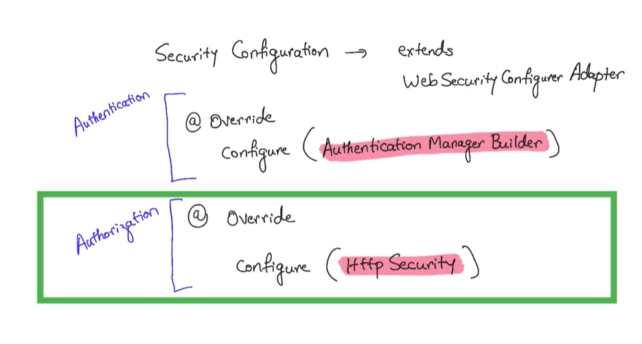

## Example

SecurityConfiguration.java
```java
@EnableWebSecurity
public class SecurityConfiguration extends WebSecurityConfigurerAdapter {

  // JDBC version
  QAutiwired
  DataSource dataSource;
  //JPA version
  @Autowired
  UserDetailsService userDetailsService;

  @Override
  protected void configure(AuthenticationManagerBuilder auth) throws Exception {
    // Set your configuration on the auth object
    auth.inMemoryAuthentication()
      .withUser("blah")
      .password("blah")
      .roles("USER")
      .and()
      .withUser("foo")
      .password("foo")
      .roles("ADMIN")

    // JDBC version
    auth.jdbcAuthentication()
    .dataSource(dataSource);
    // JPA version
    auth.userDetailsService(userDetailsService);
  }
  @Bean
  public PasswordEncoder getPasswordEncoder(){return NoOpPasswordEncoder.getInstance();}

  @Override
  protected void configure(HttpSecurity http) throws Exception {
    http.authorizeRequests()
      .antMatchers("/admin").hasRole("ADMIN")
      .antMatchers("/user").hasAnyRole("ADMIN", "USER")
      .antMatchers("/").permitAll()
      .and().formLogin();
  }
}
```

### JDBC version
application.properties
```java
spring.datasource.url=jdbc:mysql://localhost:3306/springsecurity
spring.datasource.username=root
spring.datasource.password=password
```

### JPA version
application.properties
```java
spring.datasource.url=jdbc:mysql://localhost:3306/springsecurity
spring.datasource.username=root
spring.datasource.password=password
spring.jpa.hibernate.ddl-auto=update
spring.jpa.hibernate.naming-strategy=org.hibernate.cfg.ImprovedNamingStrategy
spring.jpa.hibernate.dialect=org.hibernate.dialect.MySQL5Dialect
```
SpringSecurityApplication.java
```java
@SpringApplication
@EnableJpaRepositories(basePackageClasses = UserRepository.class)
public class SpringSecurityJpaApplication {
  public static void main(String[] args) {SpringApplication.run(SpringSecurityJpaApplication.class)}
}
```
MyUserDetailsService.java
```java
import org.springframework.security.core.userdetails.UserDetails;
import org.springframework.security.core.userdetails.UserDetailsService;
import org.springframework.security.core.userdetails.UsernameNotFoundException;
import org.springframework.stereotype.Service;

@Service
public class MyUserDetailsService implements UserDetailsService {
  @Autowired
  UserRepository userRepository;

  @Override
  public UserDetails loadUserByUsername(String userName) throws UsernameNotFoundException {
    Optional<User user = userRepository.findByUserName(userName);
    user.orElseThrow(() -> new UsernameNotFoundException("Not Found: " + userName));
    return user.map(MyUserDetails::new).get();
  }
}
```
UserRepository.java
```java
public interface UsserRepository extends JpaRepository<User, Integer> {
  Option<User> findByUserName(String userName);
}
```
model.User.java
```java
import javax.persistence.*;

@Entity
@Table(name = "User")
public class User {
  @Id
  @GeneratedValue(strategy = GenerationType.AUTO)
  private int id;
  private String userName;
  private String password;
  private boolean active;
  private String roles;

  public int getId(){
    return id;
  }
  public void setId(int id){
    this.id = id;
  }
  // other getters and setters
}
```
MyUserDetails.java
```java
public class MyUserDetails implements UserDetails {
  private String userName;
  private String password;
  private boolean active;
  private List<GrantedAuthority> authorities;

  public MyUserDetails(User user){
    this.userName = user.getUserName();
    this.password = user.getPassword();
    this.active = user.isActive();
    this.authorities = Arrays.stream(user.getRoles().split(","))
      .map(SimpleGrantedAuthority::new)
      .collect(Collectors.toList());
  }

  @Overrode
  public Collection<? extends GrantedAuthority> getAuthorities(){
    return authorities;
  }

  @Override
  public String getPassword(){
    return password;
  }

  @Override
  public String getUsername(){
    return userName;
  }

  @Override
  public boolean isAccountNonExpired(){
    return true;
  }

  @Override
  public boolean isAccountNonLocked(){
    return true;
  }

  @Override
  public boolean isAccountCredentialsNonExpired(){
    return true;
  }

  @Override
  public boolean isEnabled(){
    return active;
  }
}
```

# 18. Reading, 泛读一下即可，自己觉得是重点的，可以多看两眼。https://www.interviewbit.com/spring-security-i
    nterview-questions/#is-security-a-cross-cutting-concern
       1. 1 - 12
       2. 17 - 30
# 19. Explain best practices to securely store secrets in applications.
A:
Securely storing secrets in applications requires a multi-faceted approach to prevent unauthorized access and potential breaches. The following best practices are essential:
在应用程序中安全地存储密钥需要一个多方面的方法来防止未经授权的访问和潜在的安全漏洞。以下是一些最佳实践：
## 1. Avoid Hardcoding Secrets:避免硬编码密钥：
Never embed secrets directly into your application's source code, configuration files, or version control systems (e.g., Git repositories). This is a significant security risk, as secrets can be easily exposed if the code is accessed or accidentally committed.
切勿将密钥直接嵌入到应用程序的源代码、配置文件或版本控制系统（例如 Git 仓库）中。这是一种重大的安全风险，因为如果代码被访问或意外提交，密钥很容易被泄露。
## 2. Utilize Secure Secret Management Systems:使用安全的密钥管理系统：
Employ dedicated secret management solutions like HashiCorp Vault, AWS Secrets Manager, Azure Key Vault, or Google Secret Manager. These systems offer:
使用专门的密钥管理解决方案，如 HashiCorp Vault、AWS Secrets Manager、Azure Key Vault 或 Google Secret Manager。这些系统提供：
- **Centralized Storage**: A secure, encrypted location for all application secrets.
集中存储：所有应用密钥的安全、加密存储位置。
- **Access Control**: Granular, role-based access control (RBAC) to ensure only authorized entities can retrieve specific secrets.
访问控制：基于角色的细粒度访问控制（RBAC），确保只有授权实体才能获取特定密钥。
- **Encryption**: Secrets are encrypted both at rest and in transit using strong cryptographic algorithms (e.g., AES-256).
加密：密钥在静止状态和传输过程中都使用强加密算法（例如 AES-256）进行加密。
- **Auditing and Monitoring**: Comprehensive logging of secret access and usage to detect suspicious activity.
审计和监控：全面记录密钥的访问和使用情况，以检测可疑活动。
- **Secret Rotation**: Automated or manual rotation of secrets to minimize the impact of potential compromises.
密钥轮换：自动或手动轮换密钥，以减少潜在泄露的影响。
## 3. Implement the Principle of Least Privilege:实施最小权限原则：
Grant applications and users only the minimum necessary permissions to access secrets. Avoid providing broad access to entire secret stores when only a subset of secrets is required.
仅授予应用程序和用户访问密钥所需的最小必要权限。避免在只需要部分密钥的情况下，向整个密钥库提供广泛访问权限。
## 4. Leverage Managed Identities (Cloud Environments):利用托管身份（云环境）：
In cloud platforms like Azure or AWS, utilize managed identities to allow applications to authenticate to cloud services (including secret management systems) without needing to store credentials within the application itself.
在 Azure 或 AWS 等云平台上，利用托管身份允许应用程序无需在应用程序本身中存储凭证即可对云服务（包括密钥管理系统）进行身份验证。
## 5. Encrypt Secrets at Rest and in Transit:对静态和传输中的密钥进行加密：
Ensure secrets are encrypted when stored in the secret management system and when transmitted between the application and the secret management system. Use secure protocols like TLS 1.2 or higher for communication.
确保密钥在存储在密钥管理系统中时以及在应用程序和密钥管理系统之间传输时都经过加密。使用 TLS 1.2 或更高版本等安全协议进行通信。
## 6. Rotate Secrets Regularly:定期轮换密钥：
Implement a policy for frequent secret rotation (e.g., every 60-90 days) to limit the window of exposure if a secret is compromised. Automate this process where possible.
制定频繁轮换密钥的策略（例如，每 60-90 天），以限制密钥被泄露后的暴露窗口。尽可能自动化此过程。
## 7. Implement Secret Scanning Tools:实施密钥扫描工具：
Regularly scan your codebase and repositories for accidentally committed secrets to identify and remediate potential exposures.
定期扫描您的代码库和存储库，以识别和修复意外提交的密钥，从而发现潜在的暴露风险。
## 8. Isolate Secrets:隔离密钥：
Consider using separate secret stores or implementing isolation boundaries for different application components or environments to limit the blast radius in case of a compromise.
考虑使用独立的密钥存储或为不同的应用组件或环境实现隔离边界，以限制在发生安全漏洞时的影响范围。
## 9. Monitor and Log Access:监控和记录访问：
Enable comprehensive logging and monitoring of access to your secret management system to detect and respond to unauthorized or unusual activity.
启用对密钥管理系统访问的全面日志记录和监控，以检测和响应未授权或异常活动。

