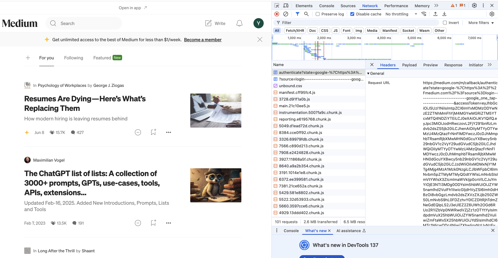
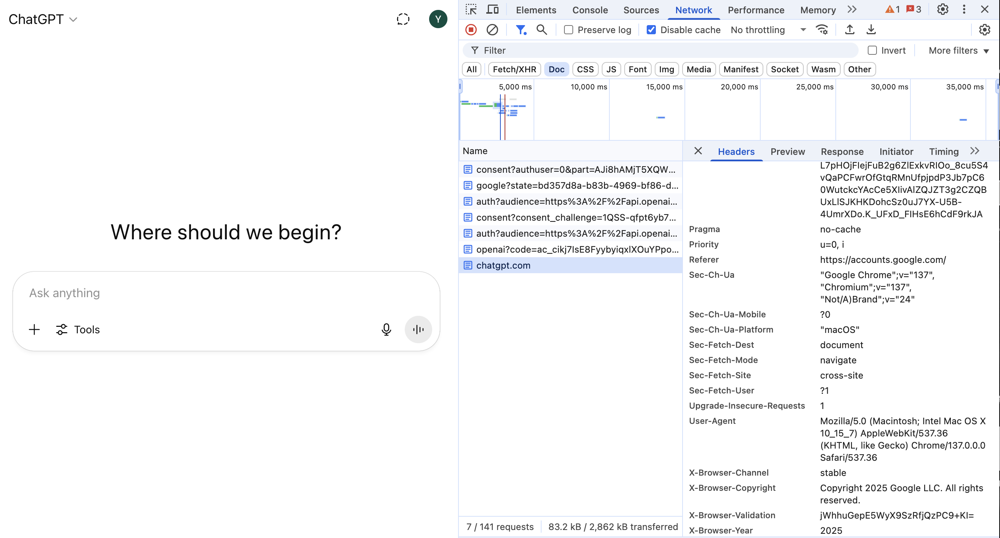

<p> 1. List all the annotations you learned from class and homework to annotations.md </p>

<p> 2. Explain TLS, PKI, certificate, public key, private key, and signature. </p>

<p> TLS(Transport Layer security): cryptographic protocols that secure communication over the Internet, primarily used for 
encrypting data transmitted between a web browser and a server. </p>
<p> PKI(Public Key Infrastructure): create, manage, distribute, use, store and revoke certificates and manage 
public-key encryption </p>
<p> Certificate: A digital certificate that authenticates a website's identity and enables an encrypted connection. </p>
<p> Public key: Encrypt data and verify signature</p>
<p> Private key: Decrypt data and generate signature</p>

<p> Signature: Based on public-key cryptography. It uses a pair of keys: a private key and a public key. 
It's a one-way hashed value, which means it cannot be decrypted</p>

<p> 3. Write a Spring security based application, which provides https APIs (one simple get controller with empty
   response is good enough )instead of http, please generate a self-signed certificate to make your https
   TLS verification work. </p>

<p> a. Pack your self-signed certificate in the form of jks file, as part of your application, name it properly </p>

<p> b. Test if you can verify your HTTPs api without importing the self-signed certificate to your local
   certificate chain, if not, explain why. </p>

<p> c. Explain what did you do to make https call work, do NOT bypass TLS/SSL verification in Postman (this
   is cheating)! Tutorial: https://www.baeldung.com/spring-channel-security-https </p>

<p> 4. list all http status codes that related to authentication and authorization failures. </p>
401 Unauthorized
500 Internal sever error(Access Denied)

<p> 5. Compare authentication and authorization? Name and explain important components in Spring
   security that undertake authentication and authorization </p>

<p> Authentication: the users' identity are verified </p>

<p> Authorization: check whether user has the access to the resources </p>

<p> @PreAuthorize: specifying which users or roles are permitted to execute that method </p>

<p> 6. Explain HTTP Session? </p>

<p> A session is a server-side storage mechanism used to maintain state across multiple requests from
the same user. When a user logs into a web application or performs an action that requires state
management, a session is created on the server. </p>

<p> 7. Explain Cookie? </p>

<p> A cookie is a small piece of data sent from a web server to a user's browser. The browser stores the
cookie and sends it back with each subsequent request to the same server. For example, when the client sends
a login request, a set-cookie is returned by the server. The following HTTP requests are sent with this cookie. </p>

<p> 8. Compare Session and Cookie? </p>

```
                                     Cookie	                        Session
Storage location	Stored on the client (browser)	            Stored on the server
Security	       Less secure (data is stored in browser)	 More secure (data stays on server)
Lifetime	        Can be set to expire (e.g., 7 days)	     Lives until browser closes or session timeout
Data visibility	      Visible and editable by user	                Hidden from user
Storage mechanism	Sent with every request to the server	Only session ID is sent (typically via cookie)
Server resources	No server-side storage	                    Consumes server memory
Tampering risk	            High (can be manipulated)	    Low (if session ID is secure)
```

<p> 9. Find at least TWO websites who can be logged in using your Google Account, explain in detail on how
   Google SSO works with screenshots like below, find SSO-related Rest calls in Chrome developer tool



```
Flow:
1. Visit the website and click “Continue with Google”.

2. Redirected to Google’s OAuth consent screen.

3. Login the google account. After approval, Google responds with an ID token and access token.

4. The site verifies the ID token and creates a user account.

5. Redirected back to the website, now authenticated.
```

<p> 10. How do we use session and cookie to keep user information across the application? </p>
```
1. User logs in
2. Server authenticates and creates a session (session_id)
3. Server stores user data in session: session_store[session_id] = user_data
4. Server sends cookie: Set-Cookie: session_id=abc123
5. On next request, browser sends cookie: Cookie: session_id=abc123
6. Server uses session_id to retrieve user data
```

<p> 11. What is the spring security filter? </p>
The Spring Security Filter Chain is a central component of Spring Security. It contains a sequence of filters that apply 
security-related logic to incoming HTTP requests before they reach your application controllers.


<p> 12. Explain bearer token and how JWT works. </p>
<p> Bearer token: whoever holds the token verifies itself</p>
The user logs in with username and password. The server processes the login request and send back JWT token.
The token is saved on the client side and in the following requests, the token is included in the HTTP header.

<p> 13. Explain how do we store sensitive user information such as password and credit card number in DB? </p>
Passwords should never be stored in plaintext or even encrypted. Instead, use a one-way hashing algorithm to store password.
Credit card number is encrypted by AES-256 encryption or a trusted encryption service. Also, tokenization is used: replace the card number with a token, 
and store the real card info securely elsewhere.

<p> 14. Compare UserDetailService, AuthenticationProvider, AuthenticationManager, AuthenticationFilter?(把这⼏
    个名字看熟悉也⾏) </p>

<p> AuthenticationFilter: Extracts credentials from the request and creates an Authentication object </p>

<p> AuthenticationManager: Accepts the token; Delegates it to a list of registered AuthenticationProviders </p>

<p> AuthenticationProvider: Verifies credentials. Uses UserDetailsService to retrieve user info from database or other sources </p>

<p> UserDetailsService: Returns a UserDetails object that Spring Security uses to validate the password </p>

<p> 15. What is the disadvantage of Session? how to overcome the disadvantage? </p>

<p> Hard to manage in REST APIs; Server memory usage; Not scalable (in-memory sessions) </p>

<p> How to overcome: Use JWT </p>

<p> 16. how to get value from application.properties in Spring security? </p>
Add jwtproperties in application.properties file

```
## App Properties
app.jwt-secret=temp
app.jwt-expiration-milliseconds=604800000
```

<p> 17. What is the role of configure(HttpSecurity http) and configure(AuthenticationManagerBuilder auth)? </p>

<p> configure(HttpSecurity http): Secures HTTP endpoints (routes, roles, etc.) </p>

<p> configure(AuthenticationManagerBuilder auth): Defines how to load & verify users </p>

<p> 18. Reading, 泛读⼀下即可，⾃⼰觉得是重点的，可以多看两眼。https://www.interviewbit.com/spring-security-i
    nterview-questions/#is-security-a-cross-cutting-concern </p>

<p> a. 1-12 </p>

<p> b. 17 - 30 </p>

<p> 19. Explain best practices to securely store secrets in applications. </p>
Use a Secret Management System: tools designed for secure storage and access of secrets 
(HashiCorp Vault, AWS Secrets Manager, Azure Key Vault, Google Secret Manager)
