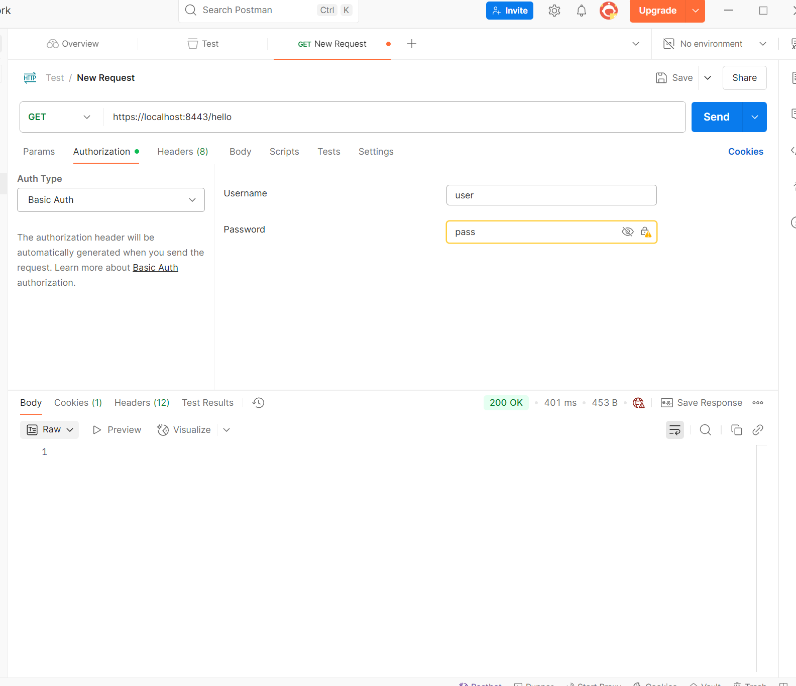
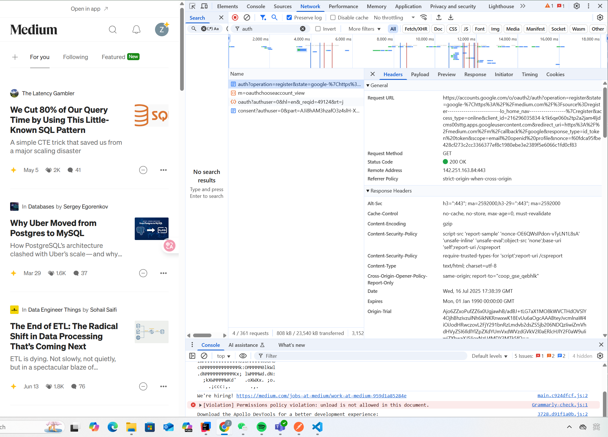
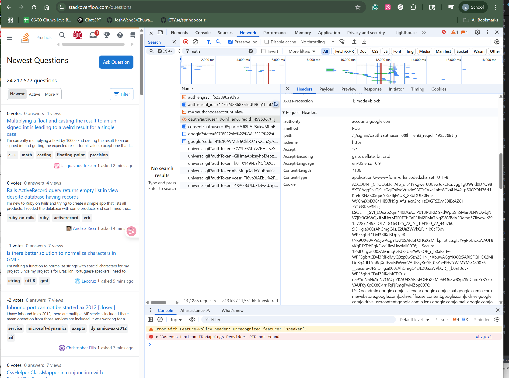

## 2. Explain TLS, PKI, certificate, public key, private key, and signature.
* TLS (Transport Layer Security)
TLS is the successor of SSL, with support of advanced encryption algorithms such as AES.
    * Where it's used: HTTPS, email, messaging apps, VPNs, etc.
* PKI (Public Key Infrastructure) 
create, manage, distribute, use, store and revoke certificates and manage public-key encryption.
* Certificate (e.g. SSL/TLS Certificate)
A digital document issued by a CA (Certificate Authority) that binds a public key to an identity (domain, person, organization).
* Public Key
1. Encrypt data
2. Verify signature
* Private Key
1. Decrypt data
2. Generate signature
* Signature: to validate data integrity and sender authentity.

## 3. 
* keytool -genkey -alias tomcat 
-keyalg RSA 
-storepass changeit 
-keypass changeit 
-keystore keystore.jks 
-dname "CN=localhost"
* No, I cannot access the HTTPS endpoint from a browser or Postman without accepting the self-signed certificate.

* 

## 4. list all http status codes that related to authentication and authorization failures.
* 401 Unauthorized
Meaning: The request lacks valid authentication credentials (like missing or invalid tokens).
* 407 Proxy Authentication Required
Meaning: The client must first authenticate with a proxy server.
* 403 Forbidden
Meaning: The server understood the request, but refuses to authorize it.

## 5. Compare authentication and authorization? Name and explain important components in Spring security that undertake authentication and authorization

* Authentication: Verifying who the user is
1. `AuthenticationManager`
Core interface for handling authentication requests.

2. `AuthenticationProvider`
    * Validates credentials (e.g., username and password).

    * Can support different auth mechanisms (LDAP, DB, JWT).

3. `UserDetailsService`

    * Loads user-specific data from the database or other sources.

    * Returns a UserDetails object (contains username, password, roles, etc.).

4. `SecurityContextHolder`

    * Holds the Authentication object for the current user/thread.

5. `UsernamePasswordAuthenticationFilter`

    * Intercepts login requests.

    * Extracts credentials and passes them to AuthenticationManager.

* Authorization: Verifying what the user is allowed to do

1. `AccessDecisionManager`
Makes final decision to grant/deny access based on authentication and permissions.

2. `SecurityMetadataSource`
Provides required access attributes for a given request (e.g., what roles are needed for /admin).

3. `@PreAuthorize, @Secured, @RolesAllowed`
Method-level annotations to control access based on roles or conditions.

4. `HttpSecurity.authorizeRequests()`
Fluent API to configure which endpoints require what roles or permissions.

## 6. Explain HTTP Session?

An HTTP Session is a way to maintain stateful information across multiple HTTP requests from the same client.

## 7. Explain Cookie?

A cookie is a small piece of data that a server sends to a user's web browser, which the browser stores and sends back to the server with subsequent requests.
Cookies allow websites to:

* Remember users between requests (e.g., login sessions)

* Store user preferences

* Track user activity (e.g., analytics or ads)

## 8. Compare Session and Cookie?

* Session: For confidential, server-controlled data like login state.

* Cookie: For non-sensitive, client-accessible data like UI settings or tokens (carefully).

## 9. Find at least TWO websites who can be logged in using your Google Account, explain in detail on how Google SSO works with screenshots like below, find SSO-related Rest calls in Chrome developer tool:

* Google SSO: is a login system that lets users sign in to third-party websites and apps using their Google account credentials — without needing to create a separate username and password for each site.

* accounts.google.com: Confirms Google is handling authentication
* /o/oauth2/auth path: This is the OAuth 2.0 login endpoint
* client_id, redirect_uri, response_type in URL: Confirms it’s an OAuth 2.0 SSO request
* Status: 200 OK: Means Google served the consent/login page successfully
* redirect_uri=medium.com in the request: Confirms it’s for logging in to Medium via Google

## 10. How do we use session and cookie to keep user information across the the application?

* Cookie: Stored on the client (browser). Can hold small pieces of data like a session ID or preferences.

* Session: Stored on the server. Can hold larger or sensitive data (e.g. logged-in user info).

## 11. What is the spring security filter?

In Spring Security, a filter is a part of the filter chain that intercepts HTTP requests and responses to apply security logic, such as:

* Authentication (e.g., checking login tokens)

* Authorization (e.g., checking access permissions)

* CSRF protection

* Session management

* CORS policies

## 12. Explain bearer token and how JWT works.

* JWT: JWT: Json Web Token
    * A JWT is a compact, URL-safe token format often used as a bearer token. It's commonly used in stateless authentication systems like REST APIs
    * JWT is made of 3 parts:`<Header> <Payload> <Signature>`

* Bearer Token: A Bearer Token is a type of access token sent in an HTTP header to authorize API requests.
    * It's called "bearer" because the client simply needs to bear (carry) the token to access protected resources — no need for username/password again.

## 13. Explain how do we store sensitive user information such as password and credit card number in DB?

Sensitive user data like passwords and credit card numbers should never be stored in plain text. Instead, it should use encryption or hashing, depending on the data type and use case.

## 14. Compare UserDetailService, AuthenticationProvider, AuthenticationManager, AuthenticationFilter?

* UserDetailsService: Loads user-specific data (e.g. by username) from the database

* AuthenticationProvider: Validates the credentials and returns a fully authenticated Authentication object

* AuthenticationManager: Coordinates authentication by delegating to AuthenticationProviders

* AuthenticationFilter: Captures incoming login requests (e.g., from a form or token) and triggers the process

## 15. What is the disadvantage of Session? how to overcome the disadvantage?

Performance overhead in case of large volume of user, because of session data stored in server memory.
1. Vulnerabilities to Attacks
* Session Hijacking
What happens: Attackers steal a valid session ID (via MITM, XSS, etc.).
Fixes:

    * Use HTTPS for all communications.

    * Set session cookies with HttpOnly, Secure, and SameSite=Strict.

    * Regenerate session ID after login (sessionFixationProtection in Spring Security).

*  Session Fixation
What happens: Attacker sets a known session ID before user logs in.
Fixes:

    * Regenerate a new session ID on login.

    * Reject sessions with invalid or reused tokens.

 2. Scalability Issues
*  Server-Side Storage Bottleneck
What happens: Server holds session data → high memory use.
Fixes:

    * Use distributed caches like Redis or Hazelcast.

    * Clean up expired sessions with TTLs.

*  Increased Latency in Distributed Systems
What happens: Syncing session data across servers causes delay.
Fixes:

    * Use stateless authentication (e.g., JWT).

    * Or replicate session store using fast in-memory solutions.

3. Security Risks
* Insecure Session Cookies
What happens: Cookies can be hijacked or abused (e.g., via CSRF).

* Storing Tokens in Local Storage
What happens: Vulnerable to XSS — attackers can steal tokens.
Fixes:

    * Prefer HttpOnly cookies over localStorage.

    * Sanitize all user input and use Content Security Policy (CSP).

4. Limitations of Session-Based Auth
* Not Ideal for APIs
Why: Sessions rely on cookies and server memory — not RESTful.
Fixes:

    * Use JWT (JSON Web Token) or OAuth 2.0 Bearer Tokens for APIs.

    * Stateless and mobile-friendly.

* Concurrency Issues
What happens: Race conditions if session is modified from multiple threads.
Fixes:

    * Use thread-safe session access or stateless tokens.

## 16. how to get value from application.properties in Spring security?
* Using @Value Annotation
* Using @ConfigurationProperties
*  Use in Spring Security Config (SecurityFilterChain)

## 17. What is the role of configure(HttpSecurity http) and configure(AuthenticationManagerBuilder auth)?

`configure(HttpSecurity http)`
This method is used to configure web-level security — i.e., what resources are protected, what authentication method is used, and what happens during login/logout.
`configure(AuthenticationManagerBuilder auth)`
This method is used to configure authentication mechanisms — i.e., how user credentials are validated.

## 19. Explain best practices to securely store secrets in applications.
* Avoid Hardcoding Secrets in Source Code
* Use Environment Variables
* Use a Secret Management Tool / Vault
* Secure Access to Secrets
* Use Strong Encryption