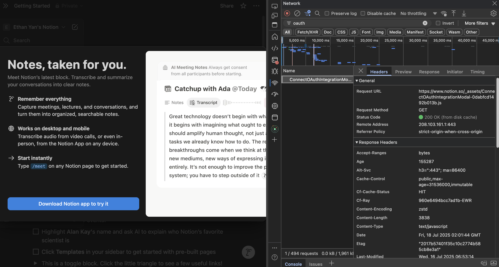
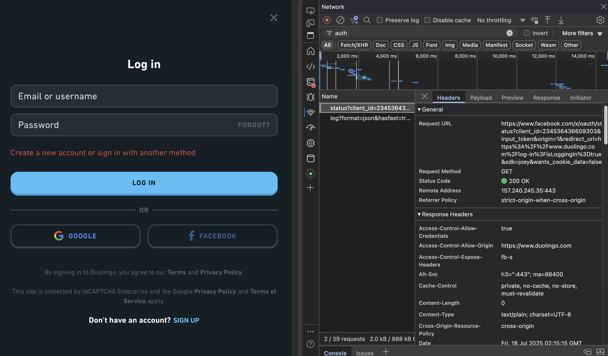

#### 1. List all of the annotations you learned from class and homework to annotations.md   
see annotations.md 

#### 2. Explain TLS, PKI, certificate, public key, private key, and signature.  

**TLS (Transport Layer Security)** is a cryptographic protocol that ensures secure communication over a network. It provides confidentiality, integrity, and authentication between client and server, typically used in HTTPS.

**PKI (Public Key Infrastructure)** is the framework that supports the distribution and management of digital certificates and public-key encryption. It ensures trusted identity verification by using Certificate Authorities (CAs).

A **certificate** is a digital document issued by a CA that binds a public key to an entity (like a server or user). It includes metadata like issuer, subject, validity period, and the public key.

The **public key** is used to encrypt data or verify a digital signature. It’s shared openly and included in certificates.

The **private key** is kept secret by the owner and is used to decrypt data encrypted with the public key or to create a digital signature.

A **signature** is a hash of the data encrypted with the sender’s private key. It’s used to verify integrity and authenticity; the recipient uses the sender’s public key to validate it.


#### 3. Write a Spring security based application, which provides https APIs (one simple get controller with empty  response is good enough )instead of http, please generate a self-signed certificate to make your https  TLS verification work.    
1. Pack your self-signed certificate in the form of jks file, as part of your application, name it properly  
2. Test if you can verify your HTTPs api without importing the self-signed certificate to your local  certificate chain, if not, explain why.  
3. Explain what did you do to make https call work, do NOT bypass TLS/SSL verfication in Postman (this  is cheating)!  
(Tutorial: https://www.baeldung.com/spring-channel-security-https) 

see `Coding/httpsdemo`

#### 4. list all http status codes that related to authentication and authorization failures.  


- Authentication Failures: **401 Unauthorized**
  - The request lacks valid authentication credentials
  - Client needs to authenticate itself to get the requested response
  - Often used with WWW-Authenticate header to indicate how to authenticate


- Authorization Failures: **403 Forbidden**
  - The client has valid credentials but lacks permission to access the resource
  - Server understood the request but refuses to authorize it
  - Re-authenticating won't help; the client simply doesn't have access rights

Related Status Codes

**407 Proxy Authentication Required**
- Similar to 401, but authentication must be done by a proxy
- Client must first authenticate with the proxy server

**511 Network Authentication Required**
- Client needs to authenticate to gain network access
- Often used by captive portals (like WiFi login pages)

**419 Authentication Timeout** (non-standard)
- Session has expired or authentication has timed out
- Not part of official HTTP standard but used by some frameworks


#### 5. Compare authentication and authorization? Name and explain important components in Spring  security that undertake authentication and authorization  


Authentication is the process of verifying the identity of a user—confirming *who* they are. 

Authorization, on the other hand, determines *what* the authenticated user is allowed to do—such as access specific resources or perform certain operations.

In short:

* **Authentication** answers: *"Who are you?"*
* **Authorization** answers: *"Are you allowed to do this?"*


**Key Spring Security Components:**

1. **`AuthenticationManager`**

   * Core interface responsible for authenticating `Authentication` objects. Typically implemented by `ProviderManager`.

2. **`AuthenticationProvider`**

   * Performs actual authentication logic. Spring provides built-in providers like `DaoAuthenticationProvider` for username/password verification.

3. **`UserDetailsService`**

   * Loads user-specific data during authentication. Returns a `UserDetails` object that contains credentials and authorities.

4. **`UserDetails`**

   * Represents the authenticated user, including username, password, and granted roles/authorities.

5. **`SecurityContext` & `SecurityContextHolder`**

   * Stores the current security context (i.e., authenticated user) during a session or request.

6. **`GrantedAuthority`**

   * Represents permissions (e.g., `ROLE_ADMIN`). Used for authorization decisions.

7. **`AccessDecisionManager`**

   * Makes final access control decisions based on `Authentication` and configured access policies.

8. **`SecurityFilterChain`**

   * A chain of filters, including `UsernamePasswordAuthenticationFilter`, that handle authentication and authorization for incoming HTTP requests.


#### 6. Explain HTTP Session?  
An HTTP session is a server-side mechanism used to maintain state between multiple client requests in the inherently stateless HTTP protocol. When a user interacts with a web application, the server creates a session object tied to a unique session ID—typically stored in a cookie or URL parameter. This session object allows the server to store user-specific data (like login status, shopping cart contents, etc.) across multiple requests.

In Java, HTTP sessions are managed via the `HttpSession` interface, which can be accessed through `HttpServletRequest.getSession()`. The session persists until it times out or is explicitly invalidated using `session.invalidate()`. Proper session management is crucial for scalability, security, and performance in web applications.


#### 7. Explain Cookie?  
A cookie is a small piece of data stored on the client side by the browser, typically used to maintain stateful information between HTTP requests, which are inherently stateless. In Java web applications, cookies are managed via the `javax.servlet.http.Cookie` class.

On the server side, we create a cookie using:

```java
Cookie cookie = new Cookie("sessionId", "abc123");
cookie.setMaxAge(3600); // 1 hour
response.addCookie(cookie);
```

This instructs the client to store the cookie, which is then sent back to the server in subsequent requests using the `Cookie` header. On the server side, we retrieve cookies via `request.getCookies()` and process them accordingly.

Cookies are commonly used for session tracking, personalization, and authentication. It's also important to handle security attributes such as `HttpOnly`, `Secure`, and `SameSite` to prevent common attacks like XSS (Cross-Site Scripting) and CSRF (Cross-Site Request Forgery) .


#### 8. Compare Session and Cookie?  


1. **Storage Location:**

   * **Cookie:** Stored on the client-side, within the user's browser.
   * **Session:** Stored on the server-side, typically in memory or a persistent store.

2. **Data Capacity:**

   * **Cookie:** Limited to around 4KB per cookie.
   * **Session:** Can hold significantly more data since it's on the server, limited mainly by server memory.

3. **Security:**

   * **Cookie:** Less secure — stored on the client and vulnerable to tampering and theft if not properly secured (use `HttpOnly`, `Secure`, `SameSite`).
   * **Session:** More secure — data stays on the server; client only holds a session ID (usually in a cookie).

4. **Lifecycle:**

   * **Cookie:** Can be persistent or expire based on `maxAge` value.
   * **Session:** Lives until invalidated or times out (default is 30 minutes of inactivity in Java EE).

5. **Use Case:**

   * **Cookie:** Best for storing lightweight, non-sensitive data (e.g., remember username).
   * **Session:** Suitable for sensitive or complex user data (e.g., user profile, cart contents).

6. **Implementation in Java:**

   * **Cookie:** `javax.servlet.http.Cookie` – created and added via `response.addCookie()`.
   * **Session:** `HttpSession` – managed via `request.getSession()`.


In practice, sessions often use cookies internally to store the session ID (`JSESSIONID`), effectively combining both mechanisms.


#### 9. Find at least TWO websites who can be logged in using your Google Account
- explain in detail on how  Google SSO works 
- with screenshots like below, find SSO-related Rest calls in Chrome developer tool: 

##### Websites who can be logged in using Google SSO
1. Notion
2. Duolingo


##### How Google SSO works:

Google SSO (Single Sign-On) allows users to authenticate into third-party applications using their Google credentials, eliminating the need to create separate usernames and passwords.

Technically, it’s based on OAuth 2.0 and OpenID Connect protocols. Here's the flow:

1. **User clicks “Sign in with Google”** – The client app redirects the user to Google’s OAuth 2.0 authorization endpoint.
2. **User authenticates with Google** – If not already logged in, the user provides their credentials to Google.
3. **Authorization Grant** – Upon successful authentication, Google asks the user to consent to requested scopes (like email, profile).
4. **Authorization Code Returned** – Google redirects the user back to the application with an authorization code.
5. **Access Token Exchange** – The application sends the code to Google’s token endpoint along with its client credentials to receive an ID token and access token.
6. **ID Token Validation** – The app verifies the ID token (JWT format) which includes the user's identity information (like email, sub, name).
7. **Session Established** – The application creates a session for the user based on the validated identity.

This enables secure, centralized authentication while reducing friction and improving user experience.

##### Screenshots




#### 10. How do we use session and cookie to keep user information across the the application?  

In a Java web application, we typically use **HTTP sessions** and **cookies** together to maintain user state across multiple requests.

When a user logs in, the server creates an **`HttpSession`** object and stores user-related information (like user ID or roles) in it:

```java
HttpSession session = request.getSession();
session.setAttribute("userId", user.getId());
```

To track this session across requests, the server sends a **session ID** to the client in the form of a **cookie**, typically named `JSESSIONID`. The browser automatically includes this cookie in subsequent requests, allowing the server to retrieve the associated session and its stored attributes.

You can also create and manage custom cookies using the `javax.servlet.http.Cookie` class:

```java
Cookie cookie = new Cookie("username", user.getUsername());
cookie.setMaxAge(60 * 60); // 1 hour
response.addCookie(cookie);
```

**Sessions** are better suited for sensitive or server-side data, while **cookies** are useful for lightweight, non-sensitive data stored on the client side. Combining both allows efficient and secure user state management across the application lifecycle.


#### 11. What is the spring security filter?  
In Spring Security, a filter is a part of the security infrastructure that intercepts HTTP requests and responses, applying security logic before they reach the application or the client. The core component is the FilterChainProxy, which delegates to a chain of SecurityFilters like UsernamePasswordAuthenticationFilter, BasicAuthenticationFilter, and ExceptionTranslationFilter.

These filters are arranged in a specific order and are responsible for tasks such as authentication, authorization, session management, CSRF protection, and more. They integrate seamlessly with the servlet filter chain and are configured automatically when you enable Spring Security.


**1. `UsernamePasswordAuthenticationFilter`**
This filter processes login requests containing a username and password, typically from a form. It intercepts requests matching the login URL (default: `/login`), extracts credentials, and delegates authentication to the `AuthenticationManager`. On success, it creates an authenticated `SecurityContext`; on failure, it triggers the `AuthenticationFailureHandler`.


**2. `BasicAuthenticationFilter`**
Handles HTTP Basic Authentication. It inspects the `Authorization` header for a base64-encoded username and password, decodes them, and authenticates the request via the `AuthenticationManager`. It's commonly used for APIs or stateless authentication.


**3. `ExceptionTranslationFilter`**
This filter catches `AuthenticationException` and `AccessDeniedException` thrown by downstream filters or controllers. It handles unauthenticated access by redirecting to a login page or returning a 401, and handles unauthorized access (authenticated but forbidden) by returning a 403 response. It's key to consistent error handling in Spring Security.


#### 12. Explain bearer token and how JWT works.  
A **Bearer Token** is an access token that allows the bearer—i.e., whoever holds the token—to access protected resources. In HTTP authentication, the client includes this token in the `Authorization` header as:

```
Authorization: Bearer <token>
```

There's no further verification of the token holder beyond possession, so it's crucial to transmit it over HTTPS.

**JWT (JSON Web Token)** is a specific implementation of bearer tokens. It’s a compact, URL-safe token that consists of three parts:

1. **Header** – typically contains the type (`JWT`) and signing algorithm (e.g., HS256).
2. **Payload** – includes claims like user ID, roles, expiration (`exp`), and custom metadata.
3. **Signature** – ensures token integrity and authenticity. It’s generated using the header and payload, signed with a secret or private key.

Workflow:

* On authentication, the server generates a JWT, signs it, and returns it to the client.
* The client stores and sends this token in subsequent requests.
* The server validates the signature and expiration before granting access—no need for database lookup unless token revocation or blacklist is implemented.

JWTs are stateless, efficient for distributed systems, but must be carefully managed to avoid security pitfalls like token leakage or abuse after expiration.


#### 13. Explain how do we store sensitive user information such as password and credit card number in DB?  
We never store sensitive user information like passwords or credit card numbers in plain text. For passwords, we use strong one-way hashing algorithms such as bcrypt, scrypt, or Argon2, often combined with a unique salt per user to prevent rainbow table attacks. This ensures that even if the database is compromised, the original password cannot be easily retrieved.

For credit card numbers or other sensitive PII (Personally Identifiable Information), we follow PCI-DSS compliance. Typically, we encrypt the data using strong symmetric encryption algorithms like AES-256, and securely manage encryption keys using a key management service (KMS). We also store only what's necessary—ideally, tokenizing the card number using a payment gateway to offload storage and reduce compliance scope. Access to such data is strictly controlled and audited.


#### 14. Compare UserDetailService, AuthenticationProvider, AuthenticationManager, AuthenticationFilter?(把这几 个名字看熟悉也行)  


**UserDetailsService** is a core interface used to retrieve user-related data. It has a single method `loadUserByUsername(String username)` and is typically implemented to fetch user credentials and authorities from a database or another persistent store.

**AuthenticationProvider** is responsible for validating the authentication request. It implements the `authenticate(Authentication authentication)` method. You can configure multiple providers for different authentication mechanisms (e.g., username/password, JWT, LDAP). It internally uses `UserDetailsService` to load user data.

**AuthenticationManager** is a central interface that delegates authentication requests to one or more `AuthenticationProvider` instances. In Spring Security, the `ProviderManager` is the most common implementation. It's used internally by filters to authenticate credentials.

**AuthenticationFilter** (e.g., `UsernamePasswordAuthenticationFilter`, `JwtAuthenticationFilter`) intercepts HTTP requests and extracts authentication information (e.g., credentials, tokens). It then delegates the request to the `AuthenticationManager` for validation.


In short:

* `UserDetailsService`: loads user details.
* `AuthenticationProvider`: validates credentials.
* `AuthenticationManager`: coordinates authentication via providers.
* `AuthenticationFilter`: entry point that intercepts requests and triggers authentication.


#### 15. What is the disadvantage of Session? how to overcome the disadvantage?  
**Disadvantage of Session:**

One key disadvantage of using sessions is that they consume server memory since session data is stored on the server side. This can lead to scalability issues, especially under high user load, as more active sessions mean higher memory consumption.

**How to overcome:**

To mitigate this, session data can be stored in an external distributed cache like Redis or Memcached. This offloads memory from the application server and enables session replication and failover support, which is essential for scalable and fault-tolerant systems. Additionally, configuring appropriate session timeout values and implementing session cleanup policies help manage resources efficiently.


#### 16. how to get value from application.properties in Spring security?  
To get a value from `application.properties` in Spring Security, you typically use the `@Value` annotation or bind a configuration class using `@ConfigurationProperties`.

For example, using `@Value`:

```java
@Value("${custom.security.key}")
private String securityKey;
```

Alternatively, for cleaner configuration management:

```java
@Configuration
@ConfigurationProperties(prefix = "custom.security")
public class SecurityProperties {
    private String key;
    
    // getter and setter
}
```

Then inject `SecurityProperties` where needed:

```java
@Autowired
private SecurityProperties securityProperties;
```

Both methods integrate seamlessly with Spring Security configurations.


#### 17. What is the role of configure(HttpSecurity http) and configure(AuthenticationManagerBuilder auth)?  


* `configure(HttpSecurity http)`: This method is used to configure **authorization** rules, **form login**, **CSRF**, **CORS**, **session management**, and other HTTP security aspects. It defines **how requests are secured**, what endpoints are accessible to which roles, and configures filters in the security filter chain.

* `configure(AuthenticationManagerBuilder auth)`: This method is used to configure **authentication mechanisms**, such as **in-memory**, **JDBC**, **LDAP**, or **custom UserDetailsService**. It sets up how user credentials are validated and how user details are retrieved.

Both methods are part of extending `WebSecurityConfigurerAdapter` (deprecated in Spring Security 5.7+), and they decouple the responsibilities of securing HTTP requests (`HttpSecurity`) and setting up authentication (`AuthenticationManagerBuilder`).


#### 18. Reading, 泛读一下即可,自己觉得是重点的,可以多看两眼。
https://www.interviewbit.com/spring-security-interview-questions/#is-security-a-cross-cutting-concern  (1-12,  17-30)  


#### 19. Explain best practices to securely store secrets in applications.


1. **Never hardcode secrets**: Avoid placing API keys, passwords, or tokens directly in source code or version control. Use environment variables or secret management tools instead.

2. **Use a secrets management solution**: Integrate with tools like HashiCorp Vault, AWS Secrets Manager, Azure Key Vault, or Google Secret Manager. These provide access control, auditing, and automatic rotation.

3. **Encrypt secrets at rest and in transit**: Always store secrets in encrypted form using strong encryption algorithms (e.g., AES-256). Use TLS for all communications involving secrets.

4. **Implement principle of least privilege**: Limit access to secrets only to components or services that absolutely need them. Use IAM roles and policies to enforce access control.

5. **Rotate secrets regularly**: Set up automated rotation to limit the risk of compromised credentials. Ensure your application can seamlessly handle key rotation.

6. **Audit access**: Enable logging and monitoring of secret access. Review logs for suspicious behavior or unauthorized access attempts.

7. **Secure the deployment pipeline**: Ensure CI/CD systems do not expose secrets. Use secure storage plugins and avoid printing secrets in build logs.

8. **Use short-lived credentials where possible**: Prefer temporary tokens or dynamically generated credentials over long-lived static secrets.

