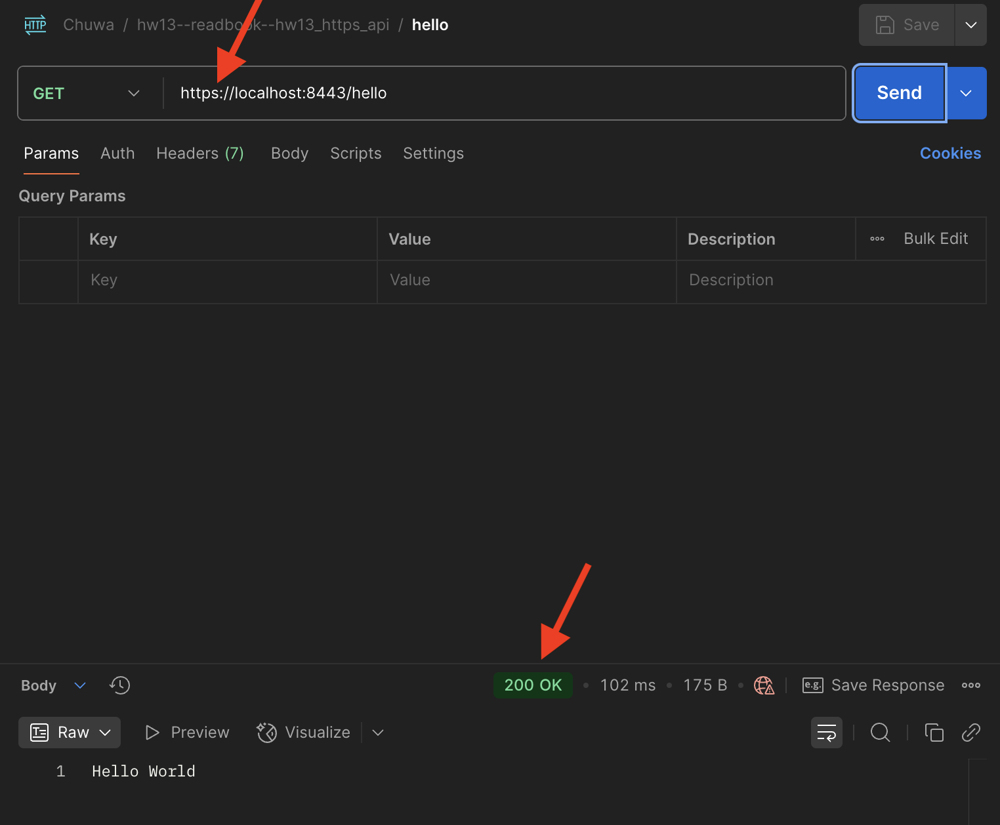
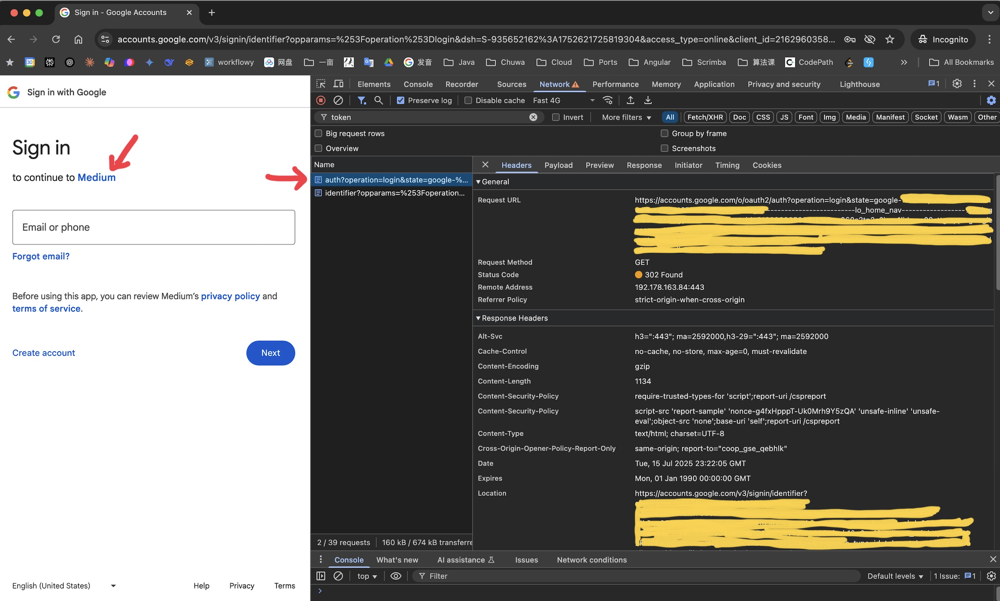
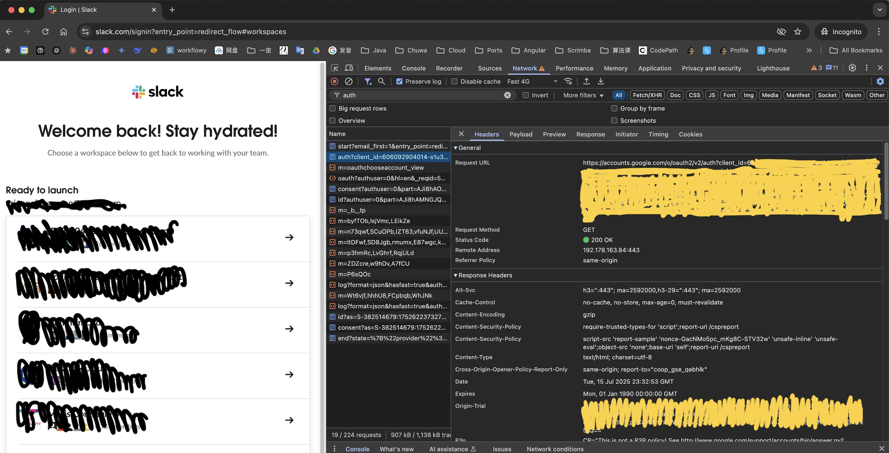

### hw13

---
#### 1. Annotation Cheatsheet
See file in path: `Short Questions/annotations.md`


---
#### 2. Explain `TLS`, `PKI`, `certificate`, `Certificate Authority` (CA), `public key`, `private key`, and `signature`.

---

TLS (Transport Layer Security):
- Protocol that provides secure communication over a network (e.g., HTTPS).
- Ensures **authentication** between client and server.


PKI (Public Key Infrastructure):
- A system that manages **digital certificates** and **public-private key pairs**.
 

Certificate:
- A file that binds a **public key** to an identity (e.g., domain name).
- Issued by a trusted Certificate Authority (CA).
- Contains:
    - Subject (owner identity)
    - Public key
    - Issuer
    - Validity period
    - Digital signature (from CA)


Certificate Authority (CA):
- A Certificate Authority (CA) is a trusted company or organization that gives out digital certificates.
- Think of a CA like a passport office — it checks who you are and gives you a passport (a digital certificate) that proves your identity online.


Public Key:
- Used to **encrypt** data or **verify** digital signatures.
- Can be shared with anyone.


Private Key:
- Used to **decrypt** data encrypted with the public key or to **create** digital signatures.
- Must be kept **secret**.


Signature:
- A **hash** of the message encrypted with the **signer’s private key**.
- Used to prove:
    - The message was sent by the holder of the private key.
    - The message has not been tampered with. (integrity)


_A Real-life example:_  
When you visit a website online:
1. The website gives you its **digital certificate**.
2. Your browser checks if it's signed by a trusted CA.
3. If it’s valid, your browser uses the public key to start encrypted-communication.

All of this is made possible by PKI.

 

---
#### 3. Write a Spring security based application, which provides `https` APIs.
One simple `get` controller with a "Hello World" response is good enough.  

Instead of `http`, please generate a `self-signed certificate` to make your `https` TLS verification work.

1. Pack your `self-signed certificate` in the form of `jks` file as part of your application. Name the `jks` file properly.


2. Test if you can verify your `https` api without importing the `self-signed certificate` to your local certificate chain. If not, explain why.


3. Explain what you did to make `https` call work, do NOT bypass `TLS/SSL verification` in Postman (That is cheating)!  

Tutorial: https://www.baeldung.com/spring-boot-https-self-signed-certificate

---

###### Q1:
See `Q3, step 1` below.

---
###### Q2:  

No, I cannot verify my Spring Boot `HTTPS` API using a `self-signed certificate` without importing the `self-signed certificate` to my local certificate chain.

Because `Self-Signed Certificates` are not trusted.  
- A self-signed certificate signs itself, instead of being signed by a trusted Certificate Authority (CA) like `Let's Encrypt`, `DigiCert`, etc.


- Operating systems and browsers only trust certificates signed by known CAs.


- Thus, clients cannot validate the certificate chain, and TLS handshake fails or shows warnings.

To make the client trust my certificate, I have to manually import the self-signed certificate into my local trust store (such as browser, Postman, or OS certificate chain).

---
###### Q3: 
**Step by Step:**

1. Generate Self-Signed Certificate (`.jks` file):
```bash
keytool -genkeypair \
  -alias redbookcert \
  -keyalg RSA \
  -keysize 2048 \
  -validity 365 \
  -keystore redbook-dev-keystore.jks \
  -storepass xxxxx \
  -keypass xxxxx \
  -dname "CN=localhost, OU=Dev, O=Chuwa, L=Seattle, ST=WA, C=US"

```

2. Move the Certificate (`.jks` file) into my application: `src/main/resources`


3. Configure `application.properties`
```properties
# Run app on HTTPS port
server.port=8443

# Enable SSL
server.ssl.enabled=true
server.ssl.key-store=classpath:redbook-dev-keystore.jks
server.ssl.key-store-password=xxxxx
server.ssl.key-password=xxxxx
server.ssl.key-store-type=JKS
```


4. Export the Public Certificate from the Keystore:  
```bash
keytool -exportcert \
  -alias redbookcert \
  -keystore src/main/resources/redbook-dev-keystore.jks \
  -storepass xxxxx \
  -rfc \
  -file redbook-cert.crt
```

5. Add `redbook-cert.crt` (already in PEM format) to Postman's Custom Certificate Section:    
   
    Settings → Certificates → CA Certificates → upload `redbook-cert.crt`


6. Make sure to enable `TLS/SSL verification` in Postman:  
   
    Settings → General → enable `SSL certificate verification`


7. Restart Spring Boot App  
    ```bash
    Tomcat started on port(s): 8443 (https)
    ```
   

8. Test via Postman the `HTTPS` endpoint:

   


---
#### 4. List all `http status codes` that related to authentication and authorization failures.

---

401 Unauthorized:
- Meaning: Authentication is required but missing or invalid.
- Example: Missing/invalid JWT token or credentials.

403 Forbidden:
- Meaning: Authentication is provided, but user does not have permission.
- Example: Authenticated user tries to access a restricted resource.

407 Proxy Authentication Required:
- Meaning: Client must authenticate with a proxy server before the request can proceed.
- Example: Used in enterprise networks with proxy servers.

419 Authentication Timeout *(non-standard, used by some frameworks)*:
- Meaning: Session expired or CSRF token missing/expired.
- Example: Laravel returns 419 for expired sessions.

440 Login Timeout *(Microsoft-specific)*:
- Meaning: Session expired; user needs to log in again.
- Example: Seen in Microsoft IIS web apps.


---
#### 5. Compare `authentication` and `authorization`. 
Name and explain important components in `Spring security` that undertake `authentication` and `authorization`.

---

|            | Authentication                            | Authorization                             |
|------------|-------------------------------------------|--------------------------------------------|
| Definition | Verifying **who** the user is             | Determining **what** the user can access   |
| Goal       | Identity verification                     | Access control                             |
| Happens when? | Before authorization                      | After successful authentication            |
| Example    | Login with username & password            | Check if user can access `/admin` route    |
| HTTP Status Code | `401 Unauthorized`                        | `403 Forbidden`                            |


>Key Spring Security Components:

**Authentication Components:**
- **UsernamePasswordAuthenticationToken**  
  Holds user credentials for login attempt.


- **AuthenticationManager**  
  Interface to perform authentication. Delegates to one or more **AuthenticationProviders**.


- **AuthenticationProvider**  
  Validates credentials (e.g., compares password). Returns an authenticated token.


- **UserDetailsService**  
  Loads user-specific data (e.g., from database) by username.


- **UserDetails**  
  Interface representing user information (username, password, roles, etc.).


- **PasswordEncoder**  
  Hashes and verifies passwords securely (e.g., BCryptPasswordEncoder).
 

**Authorization Components:**
- **AccessDecisionManager**  
  Makes the final decision: allow or deny access based on user roles/permissions.


- **GrantedAuthority**  
  Represents a user’s role or permission (e.g., `"ROLE_ADMIN"`).


- **SecurityContextHolder**  
  Stores the current authenticated user's details across the session/thread.


- **@PreAuthorize / @Secured / @RolesAllowed**  
  Annotations for method-level access control.


- **HttpSecurity**  
  Fluent API to define URL-level access rules in configuration (e.g., `antMatchers`, `authorizeRequests()`).


---
#### 6. Explain `HTTP Session`.

---

A **server-side storage** mechanism to maintain **user state** across multiple HTTP requests.

Why It's Needed:
- HTTP is **stateless**, meaning each request is independent.
- Sessions allow the server to **remember users** between requests (e.g., after login).

How It Works:
1. **Client logs in** → server creates a new session (e.g., `HttpSession` in Java).


2. Server assigns a **session ID**.


3. Session ID is sent to the client via a **cookie** (usually named `JSESSIONID`).


4. On each subsequent request, the browser sends this cookie back.


5. Server uses the session ID to retrieve user state (e.g., user info, authentication status).

Where It's Stored:
- **Client**: Only the session ID (in a cookie).
- **Server**: Actual session data (in memory, database, or distributed cache).

Expiration:
- Sessions **expire** after a timeout period of inactivity.
- Can be configured using `setMaxInactiveInterval(int seconds)`.

In Spring Boot:
- `@SessionAttributes` and `HttpSession` are used to manage session data.
- Default session storage is **in-memory** (can be customized).


---
#### 7. Explain `Cookie`.

---

A **small piece of data** stored on the **client-side (browser)** and sent with every HTTP request to the server.

Purpose:
- Maintains **state** and **session information** across HTTP requests.
- Commonly used for:
    - Session tracking (e.g., `JSESSIONID`)
    - Authentication token

  
Each cookie has:
- `Name`: Identifier (e.g., `sessionId`)


- `Value`: Data (e.g., `abc123`)


- Optional attributes:

- `Expires` / `Max-Age`: Expiration time
  

- `Path`: URL path where cookie is valid


- `Domain`: Domain where cookie is sent


- `Secure`: Sent only over HTTPS


- `HttpOnly`: Inaccessible to JavaScript


- `SameSite`: Controls cross-site sending


Security Notes:
- Use `Secure` and `HttpOnly` for sensitive data.
- Consider `SameSite=Strict` or `Lax` to prevent CSRF.


Lifecycle:
- **Set** via HTTP response header:  
  `Set-Cookie: name=value; attributes`


- **Sent** automatically by browser with matching requests:  
  `Cookie: name=value`


In Java (Servlet):
- Use `HttpServletResponse.addCookie()` to set.
- Use `HttpServletRequest.getCookies()` to read.


---
#### 8. Compare `Session` and `Cookie`.

---

- Use **session** for complex user state (e.g., shopping cart).


- Use **cookie** for lightweight, client-stored data or session identifiers.


|             | Session                                         | Cookie                        |
|-------------|-------------------------------------------------|-------------------------------|
| Storage Location | **Server-side**                                 | **Client-side (browser)**     |
| Data Storage | Store user data (objects, states)               | Store small key-value pairs   |
| Size Limit  | Large (limited by server memory or storage)     | Small (usually up to 4KB)     |
| Security    | More secure (data not exposed to client)        | Less secure (can be viewed/modified by client) |
| Access      | Requires `session ID` (usually in cookie)       | Directly accessible via JavaScript (unless HttpOnly) |
| Lifetime    | Ends after timeout or logout                    | Can persist after browser closes if not expired |
| Use Case    | Store user state after login                    | Store session ID, or tokens   |


---
#### 9. Find at least TWO websites which can be logged in using your Google Account.
Explain in detail on how Google SSO works. 

Find SSO-related Rest calls in Chrome developer tool with screenshots.

---

Google SSO (Single Sign-On) allows users to log into non-Google third-party apps using their Google account.

**How Google SSO Works:**
1. User Clicks "Sign in with Google" on the third-party app.


2. Redirect to Google Authorization Server:
   - Endpoint: `https://accounts.google.com/o/oauth2/v2/auth`
   - Request includes:
       - `client_id`: From Google Developer Console
       - `redirect_uri`: Where Google will send user after auth.
       - `response_type=code`
       - `scope`: Permissions (e.g., `profile`, `email`)
       - `state`: (Optional) CSRF protection

    
3. User Grants Permission:
   - User sees a Google consent screen.
   - If approved, Google redirects back to the third-party app with:
       - `code`: Auth code
       - `state`: For CSRF validation

    
4. Exchange Code for Token:
   - Third-party app backend sends a POST request to:
       - `https://oauth2.googleapis.com/token`
   - Include:
       - `client_id`, `client_secret`, `code`, `redirect_uri`, `grant_type=authorization_code`
   - Receives:
       - `access_token`: Short-lived
       - `id_token`: JWT containing user info
       - `refresh_token` (if `access_type=offline`)

    
5. Verify and Decode ID Token:
   - `id_token` is a JWT containing user details like: `sub` (user ID), `email`, `name`, `picture`
   - Third-party app validates it using Google’s public keys or a library.

    
6. Authenticate User in third-party App:
   - Use info from `id_token` to:
       - Create session or JWT
       - Register/log in the user in the third-party system.

---
Find SSO-related Rest calls in Chrome developer tool with screenshots:






---
#### 10. How do we use `session` and `cookie` to keep user information across the application?

---

Typical Flow:
1. User Logs In.
    - Validate credentials.
    - Create a session: `HttpSession session = request.getSession();`
    - Store user info: `session.setAttribute("user", userObject);`


2. Send Session ID to Client.
    - Spring Boot automatically sends `Set-Cookie: JSESSIONID=...` in response.
    - Browser stores this cookie.


3. Subsequent Requests.
    - Browser automatically sends `Cookie: JSESSIONID=...`
    - Spring retrieves the session using this ID.
    - Access user info: `session.getAttribute("user")`


Notes:
- Spring Boot sessions rely on a **cookie named `JSESSIONID`** to track user sessions.


- When using session-based auth, the **session ID is stored in the cookie** and automatically sent with each request.


- Sessions are **stateful** and are stored on the  **server-side**, which can create scalability issues in distributed environments.


- REST APIs are ideally stateless, so token-based authentication (e.g., JWT) is more suitable for large-scale microservices.
 
 


---
#### 11. What is the `spring security filter`?

---

A **chain of servlet filters** that intercepts HTTP requests to handle authentication, authorization, and security-related concerns.

Core Purpose:
- Checks if the request should be allowed based on:
    - User identity (authentication)
    - User permissions (authorization)
    - Security rules (e.g., CSRF, CORS)


Key Filter: `FilterChainProxy`
- Delegates to multiple internal filters.
- Automatically registered by Spring Security.


Common Filters in the Chain (Ordered):

| Filter Class           | Responsibility                                   |
|------------------------|--------------------------------------------------|
| SecurityContextPersistenceFilter | Loads/saves security context (authentication info) |
| UsernamePasswordAuthenticationFilter | Handles form login (username/password)        |
| BasicAuthenticationFilter | Handles HTTP Basic auth                         |
| BearerTokenAuthenticationFilter | Handles JWT token authentication                |
| ExceptionTranslationFilter | Translates auth exceptions to HTTP responses    |
| FilterSecurityInterceptor | Performs authorization decision                 |
| CsrfFilter             | Enforces CSRF protection                        |
| CorsFilter             | Handles CORS headers                            |


How It Works:
1. Request enters Spring Security Filter Chain.
2. Filters execute **in order**.
3. If access is granted, request proceeds to controller.
4. If access is denied, error (401 / 403) is returned.


Custom Filters:
- You can define custom filters by extending `OncePerRequestFilter` or `GenericFilterBean` and adding to the chain.


---
#### 12. Explain `bearer token` and how `JWT` works.

---

###### Bearer Token:  
A bearer token is a security token that grants access to resources.   


Whoever "bears" (possesses) the token can use it to access protected resources - no additional proof of identity is required.


Characteristics:
- **Stateless**: No session stored on the server.
- **Self-contained**: Often includes user info and expiration (e.g., in JWT format).
- **Short-lived**: Usually has an expiration time for security.

Usage in REST APIs:
1. Client logs in and receives a bearer token.


2. Client includes the token in each request’s `Authorization` header.


3. Server verifies the token before granting access.


###### JSON Web Token (JWT):  
JWT is a **self-contained**, **signed token** used for authentication and authorization.


JWT Structure:  `<Header>.<Payload>.<Signature>` 

1. Header:
   - Type (JWT)  
   - signing algorithm (e.g., HS256)


2. Payload:
   - user ID 
   - roles 
   - expiration 
   - etc.


3. Signature:
   - `HMACSHA256(base64url(header) + "." + base64url(payload), secret)`


How JWT Works:
1. Login
    - User submits credentials (e.g., username / password).
    - Server verifies the credentials.
    - If valid, server generates a JWT and returns it to the client.


2. Store
    - Client stores the JWT (e.g., in localStorage or a secure cookie).


3. Send with Request
    - For each subsequent request, client includes the JWT in the `request header`:
      ```
      Authorization: Bearer <token>
      ```

4. Server Validates
    - Server extracts the token from the request header.
    - It verifies:
        - The **signature** (to ensure the token hasn't been tampered with).
        - The **expiration time** (`exp` claim).
    - If valid, server grants access based on the token’s payload.


5. Access Granted
    - Server processes the request as an authenticated user.
 

    

    
---
#### 13. Explain how we store sensitive user information such as password and credit card number in database.

---

1. Passwords:
- Never store plaintext passwords.


- Use **one-way hashing** with salt:
    - Algorithm: `bcrypt`, `argon2`, or `PBKDF2`.
    - Example: `hashed = bcrypt(password + salt)`


- Store only the **hashed password** and **salt** (if not using built-in salting).


2. Credit Card Numbers:
- Use **encryption**, not hashing (as decryption is needed for transactions).


- Use strong **symmetric encryption** (e.g., `AES-256`).


- Securely manage encryption **keys** (e.g., in AWS KMS, HashiCorp Vault).


General Best Practices:
- Use **TLS / HTTPS** during transmission.


- Apply **access controls** (DB-level, app-level).


- Use **parameterized queries** to prevent SQL injection.


- Regularly audit and rotate encryption keys.


---
#### 14. Compare `UserDetailService`, `AuthenticationProvider`, `AuthenticationManager`, `AuthenticationFilter`.

---

| Component               | Responsibility                                                                 | Key Role                                                                |
|------------------------|----------------------------------------------------------------------------------|-------------------------------------------------------------------------|
| `AuthenticationFilter` | Intercepts HTTP requests, extracts credentials (e.g., from headers or body)     | Initiates authentication by passing request to `AuthenticationManager`  |
| `AuthenticationManager`| Delegates authentication to one or more `AuthenticationProvider`s              | Central authentication orchestrator                                     |
| `AuthenticationProvider`| Validates user credentials (e.g., password) using data from `UserDetailsService`| Performs actual authentication logic                                    |
| `UserDetailsService`   | Loads user-specific data (username, password, roles) from DB or memory          | Provides user info to `AuthenticationProvider`                          |

Flow Order:  
`AuthenticationFilter` → `AuthenticationManager` → `AuthenticationProvider` → `UserDetailsService`

 

 

---
#### 15. What is the disadvantage of `Session`? How to overcome the disadvantage?

---

Disadvantages:
1. Scalability Issue: Session data is stored on the server, causing memory load as user count grows.


2. Difficult in Distributed Systems: Sharing session state across multiple servers is complex.


How to overcome the disadvantage:
1. **Use Stateless Authentication**:
    - Replace `sessions` with `JWT (JSON Web Token)`.
    - Store user state on the client side (token-based auth).


2. **Centralized Session Store**:
    - Use **Redis** or **Memcached** to store session data externally.
    - Enables horizontal scaling and shared access across instances.

 

    
 

---
#### 16. How to get value from `application.properties` in Spring security?

---

Step 1. Define property in `application.properties`
```properties
security.jwt.secret=mySecretKey
```

Step 2. Use `@Value` to inject property
```java
@Component
public class JwtTokenProvider {

    @Value("${security.jwt.secret}")
    private String jwtSecret;

    public String getSecret() {
        return jwtSecret;
    }
}
```


---
#### 17. What is the role of `configure(HttpSecurity http)` and `configure(AuthenticationManagerBuilder auth)`?

---

 `HttpSecurity`: for web security (routes, access).


 `AuthenticationManagerBuilder`: how users are authenticated.


1. `configure(HttpSecurity http)`:
- Configures HTTP security for incoming requests.


- Responsibilities:
    - Define which endpoints require authentication.
    - Set login/logout behavior.
    - Apply filters (e.g., JWT filter, CSRF, CORS).
    - Enable/disable session management.

```java
@Override
protected void configure(HttpSecurity http) throws Exception {
    http.csrf().disable()
        .authorizeRequests()
        .antMatchers("/api/public/**").permitAll()
        .anyRequest().authenticated()
        .and()
        .httpBasic();
}
```


2. `configure(AuthenticationManagerBuilder auth)`:
- Configures authentication mechanism.


- Responsibilities:
    - Set up in-memory, JDBC, or custom `UserDetailsService`.
    - Apply `password encoder`.

```java
@Override
protected void configure(AuthenticationManagerBuilder auth) throws Exception {
    auth.userDetailsService(customUserDetailsService)
        .passwordEncoder(passwordEncoder());
}
```


---
#### 18. Reading:
https://www.interviewbit.com/spring-security-interview-questions/#is-security-a-cross-cutting-concern
1. questions 1 - 12  
2. questions 17 - 30  

泛读⼀下即可，⾃⼰觉得是重点的，可以多看两眼。


---
#### 19. Best practices to securely store `secrets` in applications.

---

Use External Secret Management Tools:
- Use AWS Secrets Manager, Azure Key Vault, GCP Secret Manager, etc.
- Avoid hardcoding secrets in code or `application.properties`.


Use Environment Variables:
- Load secrets from env vars in deployment environment.
- Use `.env` files only for local dev and never commit to Git.


Encrypt Secrets at Rest:
- **At Rest** means stored on disk, not being used or moved.
- Use strong encryption (e.g., AES-256).
- Store secrets in encrypted-files or databases with restricted access.


Limit Access:
- Principle of Least Privilege (PoLP): restrict secret access to only necessary services/users.
- Use **RBAC** or **IAM policies** for cloud-managed secrets.


Rotate Secrets Regularly:
- Automate secret rotation with your secret manager.
 

Use Configuration Servers:
- In Spring: use **Spring Cloud Config Server** with encrypted values.
- Store sensitive config securely and centrally.


Don’t Log Secrets
- Never log secrets or expose them in error messages, stack traces, or debug info.


---
#### 20. Compare `symmetric encryption` and `asymmetric encryption`.

---

**Symmetric**: Efficient but less secure for communication.


**Asymmetric**: Secure key exchange but slower; used in combination with symmetric in protocols like HTTPS.


|                   | Symmetric Encryption                   | Asymmetric Encryption                    |
|-------------------|----------------------------------------|------------------------------------------|
| 🔑 Keys Used      | One secret key (same for encrypt/decrypt) | Public key (encrypt), Private key (decrypt) |
| 🔒 Speed          | Faster                                  | Slower                                   |
| 🔁 Use Case       | Data-at-rest, large data encryption     | Key exchange, digital signatures, SSL/TLS |
| 🔐 Key Management | Hard to share securely                  | Easier to share public key               |
| 📦 Examples       | AES, DES, RC4                           | RSA, ECC                                 |
| 🔄 Encryption Direction | Same key both ways                      | One-way pairing (public ↔ private)       |


---
#### 21. Compare `Encode`, `Encrypt` and `Hash`.

---

**Encoding**: Make data format-friendly (not for security).


**Encryption**: Hides data using a key (for security).


**Hashing**: Creates a fixed output; can’t reverse.
 

| Feature       | **Encode**                          | **Encrypt**                            | **Hash**                               |
|---------------|-------------------------------------|----------------------------------------|----------------------------------------|
| **Purpose**   | Make data readable for systems      | Protect data from unauthorized access (confidentiality)     | Verify data integrity (e.g., passwords)|
| **Reversible**| ✅ Yes (no key needed)              | ✅ Yes (requires secret key)           | ❌ No (one-way)                         |
| **Security**  | ❌ Not secure                       | ✅ Secure (with strong algorithm/key)  | ✅ Secure (if salted & strong algo)    |
| **Example**   | Base64, URL encoding                | AES, RSA                               | SHA-256, bcrypt                        |
| **Use Case**  | Data transport/formatting           | Protect sensitive info (e.g., messages)| Store passwords, verify file integrity |


---
#### 22. Compare `KeyStore` and `TrustStore`.

---

**KeyStore** = "I prove who I am"


**TrustStore** = "I trust who you are"


|                 | **KeyStore**                                 | **TrustStore**                  |
|-----------------|----------------------------------------------|---------------------------------|
| **Purpose**     | Stores **own private keys and certificates** | Stores **trusted public certificates** of others |
| **Used To**     | to **prove its own identity**                | to **verify others' identity**  |
| **Contains**    | Private key, public cert, cert chain         | Only public certificates (usually CA certs) |
| **Example Use** | HTTPS server presenting its certificate      | Client verifying the server’s certificate |
| **File Type**   | `.jks`, `.p12`                               | `.jks`, `.pem`, `.crt`          |
