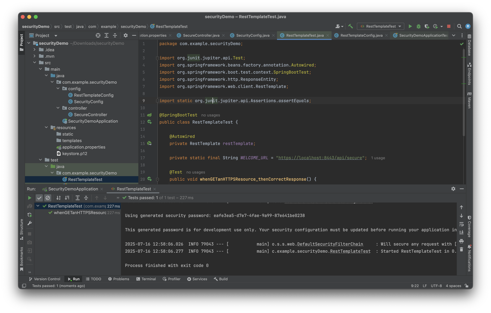

# Spring Security Homework

## 1. List all of the annotations you learned from class and homework to annotations.md
- [annotations.md](annotations.md)

---

## 2. Explain TLS, PKI, certificate, public key, private key, and signature
- **TLS**: Protocol to secure communication between client and server.
- **PKI**: Public Key Infrastructure; framework to manage keys and certificates.
- **Certificate**: Contains public key and identity information, signed by CA.
- **Public/Private key**: Asymmetric key pair for encryption/decryption.
- **Signature**: Validates data integrity and authenticity.

---

## 3. Write a Spring security-based application, which provides https APIs
- Create a self-signed certificate (e.g., `keytool -genkeypair`)
- Configure `application.properties` for HTTPS (`server.ssl.*` settings)
- Enable HTTPS in Spring Boot
- 
---

## 4. List all HTTP status codes related to authentication and authorization failures
- `401 Unauthorized`
- `403 Forbidden`
- `400 Bad Request` (invalid token)
- `419 Authentication Timeout`

---

## 5. Compare authentication and authorization
| Feature          | Authentication                    | Authorization                  |
|------------------|------------------------------------|----------------------------------|
| What             | Verifying identity                 | Checking access permissions     |
| When             | Before authorization               | After authentication            |
| Example          | Login with username/password       | Accessing `/admin` endpoint     |

---

## 6. Explain HTTP Session
- Server-side storage of user data during a session.
- Tied to a Session ID (usually via cookie).
- Used to track logged-in users.

---

## 7. Explain Cookie
- Client-side data storage sent with every HTTP request.
- Stores session IDs or user preferences.
- Supports expiration and domain scoping.

---

## 8. Compare Session and Cookie
| Feature         | Session                      | Cookie                     |
|-----------------|-------------------------------|----------------------------|
| Storage         | Server-side                   | Client-side (browser)      |
| Size Limit      | Large (depends on server)     | Small (~4KB)               |
| Lifetime        | Ends on logout/session expiry | Controlled by `Max-Age`    |

---

## 9. Google SSO (find at least two websites)
- Websites:
    - GitHub
    - Medium
- SSO Flow:
    - User redirected to Google OAuth endpoint
    - Auth code exchanged for token
    - Token used to fetch user info

---

## 10. How do we use session and cookie to keep user information across the application?
- Session stores user info on the server (mapped by session ID).
- Cookie stores session ID on client and sends with each request.

---

## 11. What is the spring security filter?
- A chain of filters like `UsernamePasswordAuthenticationFilter` that process authentication, authorization, and exceptions.

---

## 12. Explain bearer token and how JWT works
- **Bearer Token**: Sent in HTTP Authorization header (`Bearer <token>`).
- **JWT**: JSON Web Token with header, payload, signature. Used for stateless authentication.

---

## 13. How to store sensitive info (e.g., passwords, credit cards) in DB?
- Use bcrypt or Argon2 for password hashing.
- Never store plaintext.
- Use encryption (AES) for sensitive fields.

---

## 14. Compare UserDetailsService, AuthenticationProvider, AuthenticationManager, AuthenticationFilter
| Component                | Role                                           |
|--------------------------|-------------------------------------------------|
| UserDetailsService       | Load user-specific data                        |
| AuthenticationProvider   | Validate user credentials                      |
| AuthenticationManager    | Orchestrates authentication                    |
| AuthenticationFilter     | Intercepts requests, triggers authentication   |

---

## 15. What is the disadvantage of Session? How to overcome?
- Disadvantage: Not scalable for distributed systems (server stores state).
- Solution: Use stateless JWT tokens or sticky sessions/load balancers.

---

## 16. How to get value from application.properties in Spring Security?
- `@Value("${property.name}")`
- Or use `Environment.getProperty("property.name")`

---

## 17. What is the role of configure(HttpSecurity) and configure(AuthenticationManagerBuilder)?
- **HttpSecurity**: Configures authorization rules (e.g., endpoints, CSRF, CORS).
- **AuthenticationManagerBuilder**: Configures authentication (e.g., in-memory, JDBC, LDAP).

---

## 18. Reading Summary
- [Spring Security Interview Questions](https://www.interviewbit.com/spring-security-interview-questions/#is-security-a-cross-cutting-concern)
- Key Points (1-12, 17-30): Covers filters, OAuth, CSRF, CORS, method security.

---

## 19. Best practices to securely store secrets
- Use environment variables or vaults (e.g., HashiCorp Vault, AWS Secrets Manager).
- Avoid hardcoding secrets.
- Use Spring Cloud Config with encryption for distributed secrets management.

---