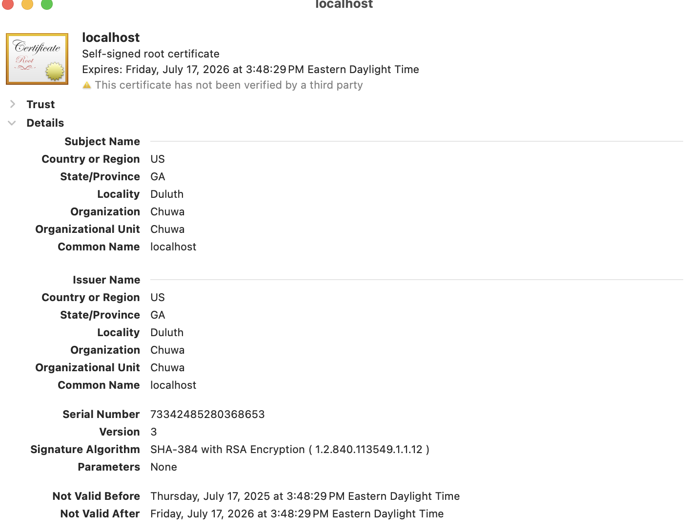
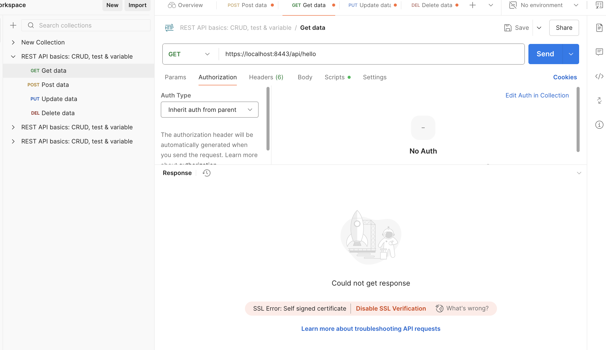
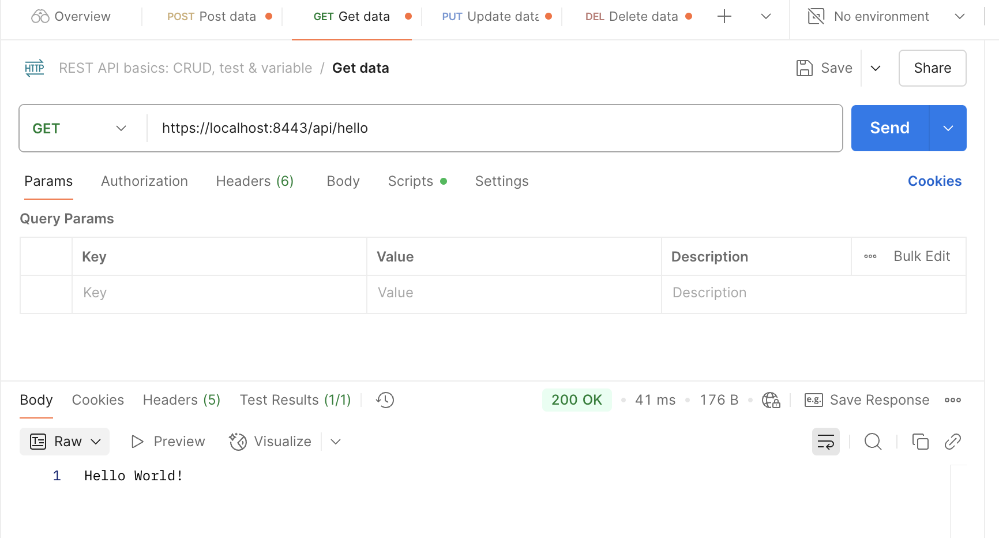

cmd to generate jks file:

```
keytool -genkeypair \            
  -alias springboot \
  -keyalg RSA \
  -keysize 2048 \
  -storetype JKS \
  -keystore mykeystore.jks \
  -validity 365 \ 
  -storepass password \
  -keypass password \
  -dname "CN=localhost, OU=Chuwa, O=Chuwa, L=Duluth, S=GA, C=US"
```

Certificate:


Test without import - failed due to self-signed certificate:

Test with import: