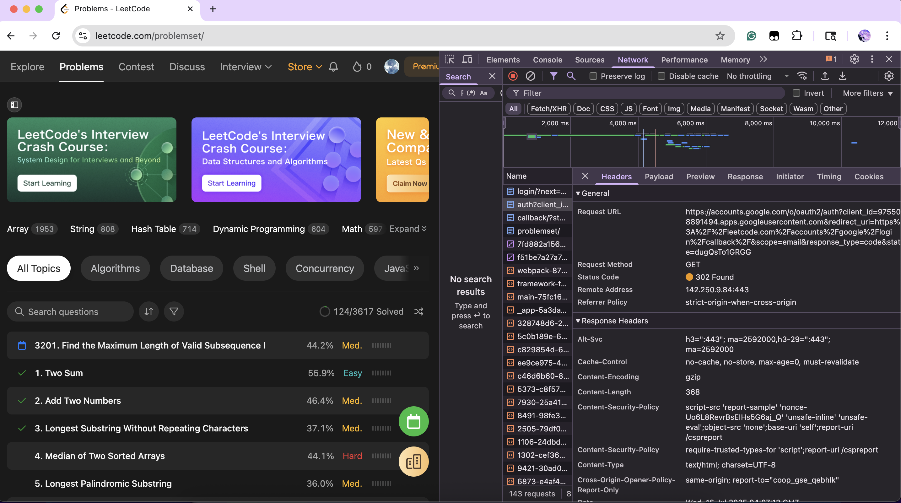
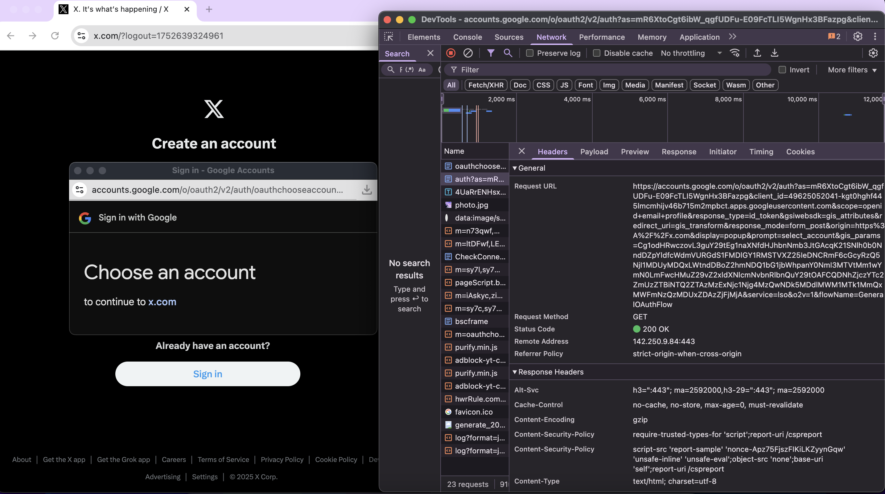

1. TLS: TLS is a cryptographic protocol that provides secure communication over a network, commonly used for securing web traffic (HTTPS) that ensures Confidentiality (encrypted data), Integrity, and Authentication.
2. PKI: PKI is the framework used to manage public-key encryption and digital certificates that enables trusted identity verification using certificates and cryptographic keys. It includes: Certificate Authorities (CAs), Registration Authorities (RAs), and methods for certificate issuance, revocation, and validation.
3. Certificate: A digital certificate is Used in TLS to prove the server (or client's) identity. It: Binds an identity to a public key, is issued and signed by a Certificate Authority (CA), and contains the subject name, public key, issuer info, validity period, and signature.
4. Public Key: A public key is: part of an asymmetric encryption key pair, used to encrypt data or verify signatures, and is shared with everyone.
5. Private Key: The server uses its private key to decrypt session information or to prove its identity. It: must be kept secret, is paired with the public key, and is used to decrypt data encrypted with the public key, or to sign messages.
6. Signature: A digital signature is like a cryptographic fingerprint where in certificates, a CA uses its private key to sign the certificate, which others can verify using the CA's public key. It is created by hashing a message and encrypting the hash with a private key and is used to prove that a message came from a specific entity and was not altered.

HTTP status code:
1. 401 Unauthorized
2. 403 Forbidden
3. 407 Proxy Authentication Required

Authentication:
1. Verifying who the user is
2. Confirms identity
3. First step before allowing access
4. e.g. login with username/password
5. output identity of user (e.g. user details, token)
6. status code: HTTP 401 Unauthorized

Authorization:
1. Determining what (content) the user can access
2. To grant/restrict access to resources
3. Happens after authentication
4. e.g. granting access to admin dashboard
5. output access decision (e.g., allow/deny permission)
6. status code: HTTP 403 Forbidden

Components:
1. AuthenticationManager: Core interface for performing authentication.
2. UserDetailsService: Loads user-specific data during authentication.
3. UserDetails: Represents an authenticated user.
4. Authentication (interface): Represents the current authentication request or result.
5. SecurityContext & SecurityContextHolder: Stores security-related information during the request lifecycle. 
6. GrantedAuthority: Represents a permission or role assigned to the user.
7. AccessDecisionManager: Makes authorization decisions.
8. @PreAuthorize / @Secured / @RolesAllowed: Annotations used for method-level authorization.

HTTP Session:
An HTTP session is a way to maintain state across multiple HTTP requests from the same client (HTTP is stateless).

Cookie:
A cookie is a small piece of data that a server sends to a client (browser), which the client stores and sends back with each subsequent request to the same server. Cookies allow web applications to persist information across multiple requests.

Session:
1. Stored on the server
2. Usually large data
3. More secure
4. Invisible to the client
5. Expires after browser closes or a timeout period
6. Stores server-side session data (e.g. shopping cart, browse history)

Cookie:
1. Stored on the client (browser)
2. Usually small data (session id)
3. Less secure
4. Visible and accessible to client
5. Can persist across browser sessions if expiration set or persist one session (session cookie)
6. Stores small client-side data (e.g. username)

Google SSO:
1. Leetcode: 

2. x.com:


Workflow:
1. User clicks "Continue with Google". 
2. Client site redirects to Google’s authorization endpoint. 
3. Logs in to Google. 
4. Google redirects back to the client with an authorization code. 
5. Grant an access token for the status code. 
6. Client uses token to fetch user info or start a session.

Keep user info:
1. User Logs In:
   1. The user submits their login credentials (e.g. username and password). 
   2. The server verifies the credentials.
2. Server Creates a Session:
   1. A session with a session ID (token) is created server-side. 
   2. The server stores user info (e.g. username, role, ID) inside this session object.
3. Server Sends Cookie:
   1. The server sends the session ID to the client using ```Set-Cookie``` header.
4. Browser Stores the Cookie with session ID
5. User Makes Another Request:
   1. The browser sends the session ID back to the server via a Cookie header.
6. Server Looks Up the Session with session ID stored in the cookie.

Spring security filter:
A Spring Security Filter is a Java class that intercepts HTTP requests and responses in a Spring application to apply security logic—such as authentication, authorization, session management, and CSRF protection—before the request reaches your controllers (usually organized in SecurityFilterChain).

Bearer Token:
A Bearer Token is a type of access token used in HTTP authorization headers to access protected resources where whoever holds the token is trusted.

JWT:
1. Contains 3 parts:
   1. Header
   2. Payload
   3. Signature
2. Workflow:
   1. User logs in. 
   2. Server verifies credentials and creates a JWT. 
   3. Server sends the JWT back to the client. 
   4. Client stores the token (e.g. localStorage). 
   5. On each request to a protected route the client sends the token in the Authorization header
   6. Server verifies the JWT (signature and expiration). 
   7. If valid, server grants access.

Sensitive data:
1. Password: Use hashing (e.g. bcrypt, scrypt, Argon2)
2. Credit card: Use encryption (e.g. AES-256, RSA)

| Component                | Purpose                                                | Key Method                                | Who Uses It                      |
| ------------------------ | ------------------------------------------------------ | ----------------------------------------- | -------------------------------- |
| `UserDetailsService`     | Loads user-specific data from a DB or external source  | `loadUserByUsername()`                    | Used by `AuthenticationProvider` |
| `AuthenticationProvider` | Performs authentication logic, verifies credentials    | `authenticate()`                          | Used by `AuthenticationManager`  |
| `AuthenticationManager`  | Coordinates the authentication process via one or more providers | `authenticate()`                          | Used by `AuthenticationFilter`   |
| `AuthenticationFilter`   | Intercepts HTTP requests, extracts credentials, triggers auth | `doFilter()` or `attemptAuthentication()` | Entry point for auth logic       |

Session disadvantage:
1. Server-Side Scalability Issues:
   1. Sessions are stored in memory or in a server-side database. On high-traffic applications, this increases memory and storage demands.
      1. Use a session store like Redis or a database.
      2. Switch to stateless authentication using JWT tokens.
2. Session Management:
   1. Need to handle: Session expiration, Invalidation on logout, Session Security, etc.
      1. Set session timeout. 
      2. Invalidate sessions on operations (session.invalidate()). 
      3. Use HttpOnly (not accessible by JavaScript), SameSite (mitigates CSRF) and Secure (HTTPS-only) cookie flags.
3. Stateful:
   1. Sessions break the stateless principle of RESTful APIs.
      1. For REST APIs, use token-based authentication (e.g. JWT).

Get a value from application.properties:
1. Use @Value to Inject Property for a single value
2. Use @ConfigurationProperties for multiple values

configure(HttpSecurity http):
1. Defines the authorization rules, login/logout behavior, CSRF, CORS, session management, and other HTTP-related security configurations.
2. Used inside a class that extends WebSecurityConfigurerAdapter (Spring Boot < 2.7) or via a SecurityFilterChain bean (Spring Boot 2.7+).
3. Configures:
   1. URL access rules (who can access what)
   2. Login form or HTTP Basic auth 
   3. CSRF and CORS settings 
   4. Session management 
   5. Exception handling

configure(AuthenticationManagerBuilder auth):
1. Sets up how authentication is performed, i.e., where and how user credentials are validated.
2. Used inside a WebSecurityConfigurerAdapter class (Spring Boot < 2.7) or via a AuthenticationManager bean (Spring Boot 2.7+).
3. Configures:
   1. Custom UserDetailsService 
   2. Password encoder (PasswordEncoder)
   3. In-memory or JDBC-based authentication 
   4. Custom AuthenticationProvider

Secrets:
1. Avoid hardcoding and public access (local storage)
2. Use a Secret Management System
3. Encrypt Configuration Files
4. Use the Principle of Least Privilege - maintain only minimum required permissions
5. Audit and Monitor Access to Secrets (Logging)
6. Secret Rotation