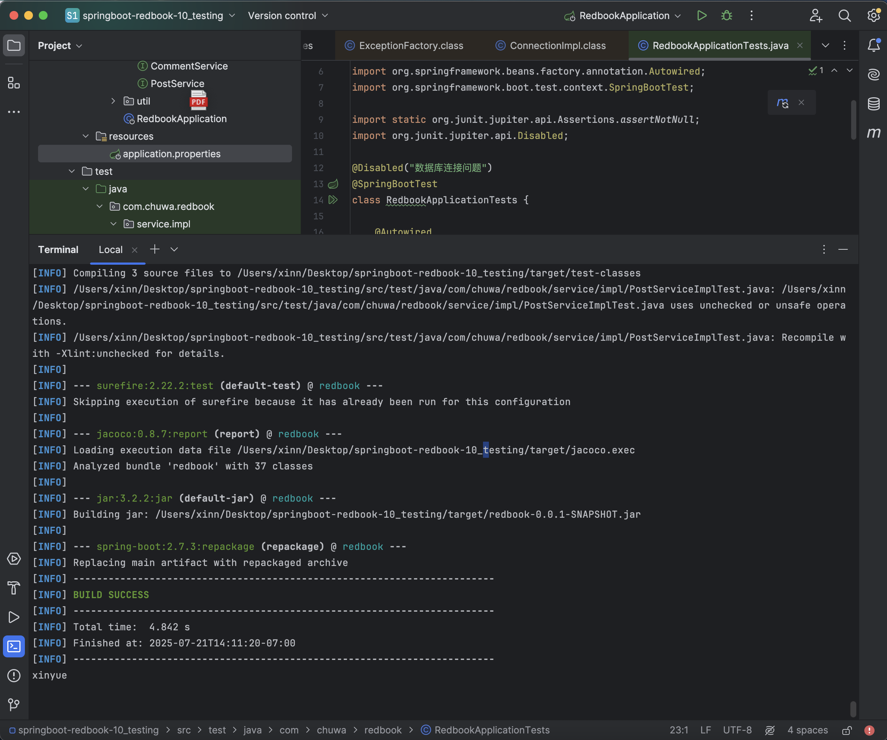
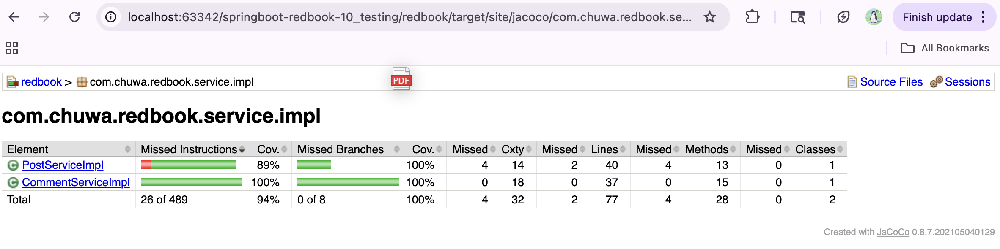

## Explain and compare following concepts, provide specific examples when doing comparison:
### Testing related:
1. Unit Testing
- Tests individual functions (small units) in isolation to verify they work correctly (w/0 loading the whole application).
- Example: Imagine a simple add(a, b) function that returns the sum of two numbers. A unit test would call add(2, 3) and verify it returns 5 (happy path); call divide(1, 0) and assert it throws `ArithmeticException` (sad path).
- Tool: Use Mockito’s mock() and spy() to isolate and stub dependencies, ensuring you only test the single unit’s logic.

2. Functional Testing
- Tests application behavior from consumer perspective, exercising full feature flows (no mocking of the system under test).
- Example: Use postman to send GET https://localhost:8444/api/posts against a running server with test data, then assert you receive a 200 OK and the expected JSON array of posts. Or use Selenium WebDriver to launch a browser, navigate to /login, enter credentials, click “Submit,” and verify you land on the dashboard page.
- Tool: Postman, REST‑Assured, Selenium/Selenide, Cucumber for behavior‑driven scenarios.

3. Integration Testing
- Tests how multiple layers (e.g. controllers → services → repositories) work together starting up your application context with a real or in‑memory database (not production db).
- Example: Annotate a test with @SpringBootTest (or @WebMvcTest + real @Repository), point it at an H2 in‑memory database, then use MockMvc or TestRestTemplate to call GET /api/posts and assert that you get the posts you preloaded via a SQL script or JPA.
- Tool: Spring Boot’s testing support (@SpringBootTest, @AutoConfigureMockMvc), embedded databases like H2 or Derby, and Testcontainers for Dockerized databases.

4. Regression Testing
- Re‑executes existing test suites after each code change to ensure previously working features haven’t broken.
- Example: In your CI pipeline, every pull request triggers your full suite (unit, integration, and functional tests). You assert that GET /api/posts still returns the expected posts and that all UI flows (login → dashboard) pass.
- Tool: CI/CD platforms (Jenkins, GitHub Actions, GitLab CI), automated test runners (JUnit, Selenium), and build tools (Maven/Gradle) to orchestrate and report on each run.

5. Smoke Testing
- Sanity checks after deployed to production.
- Example: After deploying to a QA or staging environment, run a simple script (GET /health or /api/v1/ping) and confirm a 200 OK response.
- Tool: Lightweight scripts with curl or Postman Newman in your CI/CD pipeline.

6. Performance Testing
- Measures system behavior under expected load to verify response times, throughput.
- Example: Using JMeter, simulate 1,000 concurrent users calling GET /api/posts over a 5‑minute ramp‑up period, then assert that average response time stays below 200ms and error rate stays under 1%.
- Tool: Jmeter, Gatling, Locust for load/throughput tests.

7. Stress Testing
- Pushes the system beyond its expected load limits to identify breaking points and observe recovery behavior.
- Example: Gradually increase load on GET /api/posts—start at 1,000 concurrent users and bump up by 500 every minute—until you start seeing HTTP 5xx errors or response times exceed 1 second. Record the highest concurrency the system handled without failures (before breaking point).
- Tool: JMeter, Gatling, or Locust to generate spike and collect metrics.

8. A/B Testing
- Presents 2 versions of a feature/UI to different user cohorts and measures which one performs better on key metrics.
- Example: Show “Sign Up” button in blue to group A and in green to group B, then compare click‑through or conversion rates.
- Tool: Google Optimize, Optimizely, or analytics platforms.

9. End-to-End Testing
- Exercises full user workflows in a production‑like environment, from UI through backend and database, to validate end‑to‑end functionality.
- Example: Use Cypress to automate a browser: visit /signup, enter credentials, submit, create a new post at /create-post, then verify it appears on /posts and that you can log out successfully.
- Tool: Cypress, Selenium WebDriver, Playwright 

10. User Acceptance Testing
- Validates that the system meets real‑world requirements by having end‑users(Test Users) follow a predefined checklist.
- Example: A Test User logs in, creates a new article via the UI, publishes it, and confirms it appears correctly on the public feed according to the acceptance criteria.
- Manual test case management (Zephyr, TestRail), Jira for UAT tracking.

### Environment related:
1. Development （基础功能验证）
Enginner can write and test code locally or on development servers. Testing includes unit tests, integration tests, and initial functional testing using both automated tools and manual testing.

2. QA (Quality Assurance) （全面功能测试）
QA tests like functional testing, integration testing, regression testing, and various other test across the entire application (front-end, back-end, APIs, databases) to make sure each functionalities works.

3. Pre-prod/Staging （发布前最终验证）
It mirrors production as closely as possible. It's used for final testing including performance testing, user acceptance testing. Happens before production, simulates the production environment exactly during a needed test phase.

4. Production I（发布，实时监控和优化）
Live application runs and real users access it. Testing here is limited to monitoring, smoke testing after deployments, and A/B testing with real users.

### Write unit test for CommentServiceImpl.java: https://github.com/CTYue/springboot-redbook/blob/10_testing/src/main/java/com/chuwa/redbook/service/impl/CommentServiceImpl.java
Try to cover as many lines/branches as possible. Prove your code coverage using Jacoco Report.

