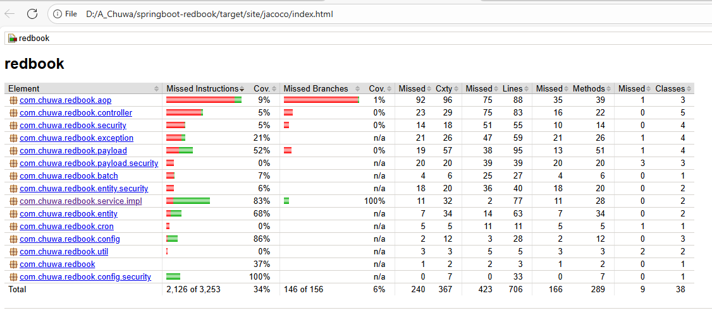
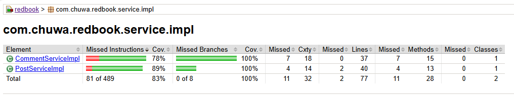
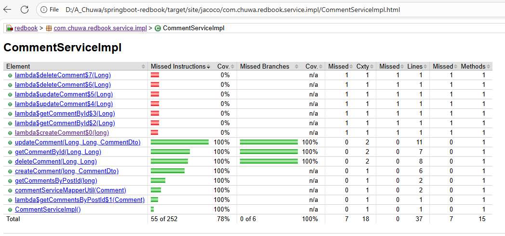

# 1. Concept Explaination

Explain and compare following concepts, provide specific examples when doing comparison:

## Testing Related Concepts测试相关概念

### 1\. Unit Testing1\. 单元测试

**Definition:** Testing individual units or components of code in isolation.定义：在隔离状态下测试代码的单独单元或组件。  
**Example:** Testing a single method in `CommentServiceImpl` to ensure it returns the correct comment by ID.示例：在 `CommentServiceImpl` 中测试单个方法，确保它能根据 ID 返回正确的评论。  
**Comparison:** Focuses on smallest testable parts, unlike Integration Testing which tests multiple modules.比较：关注最小的可测试部分，与集成测试（测试多个模块）不同。

### 2\. Functional Testing2\. 功能测试

**Definition:** Testing specific business functionalities end-to-end against requirements.定义：针对需求端到端测试特定的业务功能。  
**Example:** Testing the complete comment creation flow, ensuring it saves correctly to the database.示例：测试完整的评论创建流程，确保其正确保存到数据库。  
**Comparison:** Higher level than Unit Testing—tests what the system does rather than how it does it.比较：比单元测试更高级——测试系统做什么而不是它如何做。

### 3\. Integration Testing3\. 集成测试

**Definition:** Testing interaction between multiple modules or services.定义：测试多个模块或服务之间的交互。  
**Example:** Testing `CommentServiceImpl` together with the `CommentRepository` and database.示例：与 `CommentRepository` 和数据库一起测试 `CommentServiceImpl` 。  
**Comparison:** Unit testing mocks dependencies; integration testing uses real or in-memory dependencies.比较：单元测试模拟依赖项；集成测试使用真实或内存中的依赖项。

### 4\. Regression Testing4\. 回归测试

**Definition:** Re-running tests to ensure recent changes haven’t broken existing features.定义：重新运行测试以确保最近的更改没有破坏现有功能。  
**Example:** After modifying `CommentServiceImpl`, you re-run previous test cases.示例：修改 `CommentServiceImpl` 后，重新运行之前的测试用例。  
**Comparison:** It can include Unit, Integration, or Functional tests; purpose is to catch unintended bugs.比较：可以包括单元测试、集成测试或功能测试；目的是捕获未预期的错误。

### 5\. Smoke Testing5\. 烟雾测试

**Definition:** Quick, initial testing to ensure critical functionality works before deeper testing.定义：快速、初步的测试，确保关键功能在深入测试之前正常工作。  
**Example:** Testing whether the application starts and main API endpoints respond after deployment.示例：测试应用程序部署后是否启动以及主 API 端点是否响应。  
**Comparison:** Shallow but wide; doesn’t go into detail like Functional Testing.比较：浅但广；不像功能测试那样深入细节。

### 6\. Performance Testing6\. 性能测试

**Definition:** Measures system responsiveness and stability under expected load.定义：衡量系统在预期负载下的响应能力和稳定性。  
**Example:** Testing `GET /comments` API with 5000 concurrent requests.示例：使用 5000 个并发请求测试 `GET /comments` API。  
**Comparison:** Focuses on speed and responsiveness unlike Functional Testing which focuses on correctness.比较：侧重于速度和响应能力，与功能测试不同，功能测试侧重于正确性。

### 7\. Stress Testing7\. 压力测试

**Definition:** Tests system behavior under extreme load to determine breaking points.定义：在极端负载下测试系统行为，以确定其极限点。  
**Example:** Sending 10x normal traffic to `POST /comments` and monitoring for failure.示例：向 `POST /comments` 发送 10 倍正常流量并监控故障情况。  
**Comparison:** Subset of performance testing, but targets system breaking point.比较：性能测试的子集，但目标是系统极限点。

### 8\. A/B Testing8\. A/B 测试

**Definition:** Comparing two versions (A and B) of a feature or product to see which performs better.定义：比较一个特性或产品的两个版本（A 和 B），以查看哪个表现更好。  
**Example:** Testing two UI designs for the comment section with live users.示例：使用真实用户测试评论区的两种 UI 设计。  
**Comparison:** Focuses on user experience and behavior, unlike other tests that focus on technical correctness.比较：侧重于用户体验和行为，与其他侧重于技术正确性的测试不同。

### 9\. End-to-End Testing9\. 端到端测试

**Definition:** Tests the entire application workflow, from UI to backend.定义：测试整个应用程序工作流程，从用户界面到后端。  
**Example:** Simulating a user posting a comment via UI and verifying database persistence.示例：通过用户界面模拟用户发布评论，并验证数据库持久性。  
**Comparison:** Covers the broadest scope; more fragile but ensures overall system correctness.比较：涵盖最广泛的范围；更脆弱但确保整体系统正确性。

### 10\. User Acceptance Testing (UAT)10\. 用户验收测试 (UAT)

**Definition:** Testing by end users to verify system meets business needs before go-live.定义：用户在系统上线前进行测试，以验证系统是否满足业务需求。  
**Example:** Business stakeholders test the comment system to verify it meets their expectations.示例：业务利益相关者测试评论系统，以验证其是否符合他们的期望。  
**Comparison:** Focused on business validation rather than technical correctness.比较：侧重于业务验证，而非技术正确性。

---

## Environment Related Concepts与环境相关的概念

### 1\. Development1\. 开发

**Definition:** Developer machines or isolated environments for writing and running code.定义：用于编写和运行代码的开发机或隔离环境。  
**Example:** Localhost environment where `CommentServiceImpl` is built and tested.示例：本地环境，其中 `CommentServiceImpl` 被构建和测试。

### 2\. QA (Quality Assurance)2\. QA（质量保证）

**Definition:** Controlled environment for testers to validate application functionality.定义：供测试人员验证应用程序功能的受控环境。  
**Example:** Dedicated server where QA engineers run tests on `CommentServiceImpl`.示例：专门的服务器，其中 QA 工程师在 `CommentServiceImpl` 上运行测试。

### 3\. Pre-prod/Staging3\. 预生产/测试环境

**Definition:** Environment mirroring production, used for final testing before release.定义：与生产环境相似的测试环境，用于发布前的最终测试。  
**Example:** Fully configured RedBook application deployed in staging with production-like data.示例：在测试环境中部署了完全配置的 RedBook 应用程序，并使用类似生产环境的数据。

### 4\. Production4\. 生产环境

**Definition:** Live environment where actual users interact with the system.定义：实际用户与系统交互的运行环境。  
**Example:** Public deployment of RedBook where users post comments.示例：RedBook 的公开部署，用户发布评论。  
**Comparison:** Pre-prod is for final validation, production is for real-world use.对比：预生产环境用于最终验证，生产环境用于实际使用。

---

## Summary Table总结表格

| Type类型 | Focus重点 | Example示例 | Scope Level范围级别 |
| --- | --- | --- | --- |
| **Unit Testing单元测试** | Single function/method单一函数/方法 | Test getCommentById() in isolation单独测试 getCommentById() | Low低 |
| **Functional Testing功能测试** | Feature behavior功能行为 | Test entire comment creation flow测试整个评论创建流程 | Medium中等 |
| **Integration Testing集成测试** | Module interactions模块交互 | Test CommentService with DB使用 DB 测试 CommentService | Medium中等 |
| **Regression Testing回归测试** | Prevent old bugs returning防止旧错误再次出现 | Rerun old tests after new feature新功能后重新运行旧测试 | Variable变量 |
| **Smoke Testing冒烟测试** | Basic health check基础健康检查 | Check API responds before deeper testing在深入测试前检查 API 响应 | High level高级 |
| **Performance Testing性能测试** | Speed and responsiveness速度和响应性 | Measure API latency with 1000 requests/sec使用每秒 1000 个请求测量 API 延迟 | Non-functional非功能性 |
| **Stress Testing压力测试** | Stability under load负载下的稳定性 | API under 10,000 requests/sec每秒 10,000 次请求下的 API | Non-functional非功能性 |
| **A/B TestingA/B 测试** | User behavior comparison用户行为比较 | Two comment UI versions两个评论界面版本 | Business-oriented面向商业 |
| **End-to-End Testing端到端测试** | Full flow test全流程测试 | Test UI to DB flow测试 UI 到 DB 流程 | Full system全系统 |
| **UAT** | Business validation业务验证 | Stakeholder approval test干系人批准测试 | Pre-release发布前 |

| Environment环境 | Purpose用途 | Example Use示例用途 |
| --- | --- | --- |
| Development开发 | Feature development, debugging功能开发，调试 | Local Spring Boot testing本地 Spring Boot 测试 |
| QA | Testing functionality测试功能 | QA runs automated and manual testsQA 运行自动化和手动测试 |
| Pre-prod预生产 | Final validation before production生产前的最终验证 | Final UAT and load tests最终的用户验收测试和负载测试 |
| Production生产 | Live application for end users面向最终用户的实时应用 | Real user comments and feedback真实用户评论和反馈 |

# 2. Write unit test for CommentServiceImpl.java
Write unit test for CommentServiceImpl.java: https://github.com/CTYue/springboot-redbook/
blob/10_testing/src/main/java/com/chuwa/redbook/service/impl/CommentServiceImpl.java

Try to cover as many lines/branches as possible.

Prove your code coverage using Jacoco Report.

A:
Code is in my forked redbook repo: https://github.com/SiyanWen/springboot-redbook/tree/test

Screenshots:

- **Redbook Application:**

- **ServiceImpl:**

- **Comment:**

