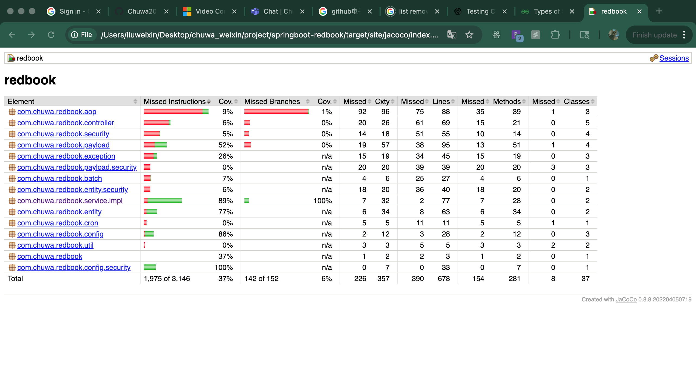
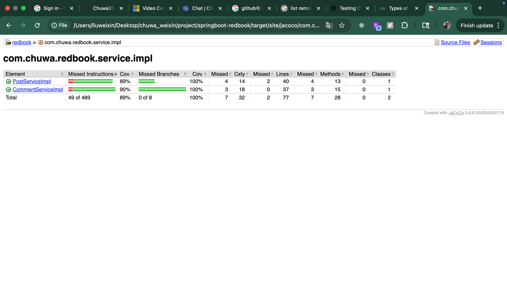
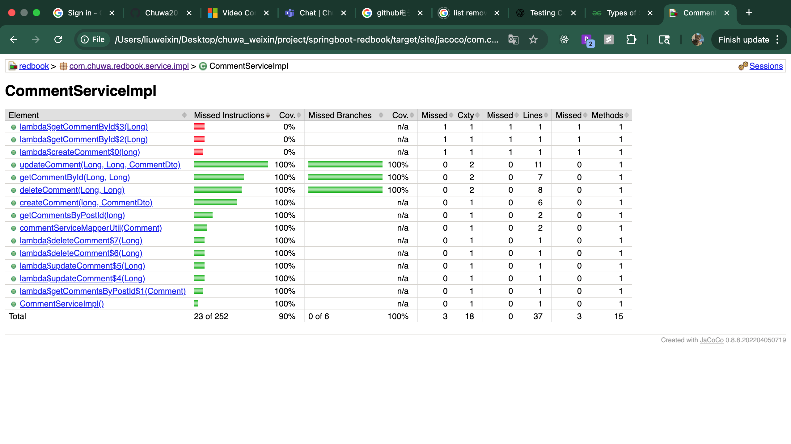

# HW14: Testing

---

## Explain and compare following concepts, provide specific examples when doing comparison

### Testing related:

#### 1\. **Unit Testing**

**What it is:** Testing individual units/components (like functions or classes) in isolation.

**Goal:** Ensure a specific piece of code works as expected.

**Example:**

```java

@Test
void testAddTwoNumbers() {
    assertEquals(5, Calculator.add(2, 3));
}
```

**Comparison:** Unlike integration testing, unit testing does **not** involve other components or systems.

---

#### 2\. **Functional Testing**

**What it is:** Testing the system against business requirements; verifies features from the end user's perspective.

**Goal:** Confirm that specific functionality produces the expected output.

**Example:** Test a login feature by entering valid and invalid credentials.

**Comparison:** Broader than unit testing; functional testing usually interacts with the UI or API level.

---

#### 3\. **Integration Testing**

**What it is:** Testing interactions between integrated modules or services.

**Goal:** Ensure that multiple components work together correctly.

**Example:** Test a service layer that calls a database to fetch a user and apply business logic.

**Comparison:** Bridges the gap between unit tests and full system (end-to-end) testing.

---

#### 4\. **Regression Testing**

**What it is:** Re-running previous test cases after changes to ensure existing features still work.

**Goal:** Catch bugs introduced by new changes.

**Example:** After adding a new "discount" feature, rerun tests on the checkout process to ensure total calculation
isn't broken.

**Comparison:** Regression testing **reuses** existing tests, unlike smoke or stress testing which often have new test
objectives.

---

#### 5\. **Smoke Testing**

**What it is:** A shallow and wide approach to test whether the major functions of an application work.

**Goal:** Quick validation before deeper testing.

**Example:** After deployment, verify that the app loads, login works, and major pages open.

**Comparison:** Smoke testing is like a **basic health check**, while regression is more detailed and comprehensive.

---

#### 6\. **Performance Testing**

**What it is:** Testing how the system behaves under expected workload.

**Goal:** Measure response time, throughput, and resource usage.

**Example:** Simulate 1000 users browsing a product catalog to see if response time stays < 2 seconds.

**Comparison:** Performance testing is **normal-load**, while stress testing goes **beyond** the limits.

---

#### 7\. **Stress Testing**

**What it is:** Testing system behavior under extreme or breaking point conditions.

**Goal:** Determine system stability and failover handling under stress.

**Example:** Simulate 10,000 users uploading files simultaneously.

**Comparison:** Performance = “Can it handle X?”  
Stress = “What happens if we **exceed** X?”

---

#### 8\. **A/B Testing**

**What it is:** Comparing two versions (A and B) of a feature/product to evaluate which performs better.

**Goal:** Optimize user experience through data.

**Example:** Show two versions of a checkout button ("Buy Now" vs "Proceed") and measure conversion rates.

**Comparison:** A/B testing is a **live user experiment**, while other tests are pre-release validations.

---

#### 9\. **End-to-End Testing**

**What it is:** Testing the complete flow of an application from start to finish.

**Goal:** Simulate real user scenarios.

**Example:** A test script that signs up a new user, logs in, adds items to cart, and completes checkout.

**Comparison:** Covers multiple layers and components—**UI, API, DB, etc.**—unlike unit or integration tests.

---

#### 10\. **User Acceptance Testing (UAT)**

**What it is:** Final phase of testing where **end users** validate the system meets business requirements.

**Goal:** Gain approval for release.

**Example:** A client runs tests on a newly developed timesheet system to ensure it supports all their workflow.

**Comparison:** UAT is done by users, not testers; it's about **acceptability**, not just correctness.

---

#### Summary Comparison Table:

| Type                 | Scope                 | Who Performs       | Example Scenario                              |
|----------------------|-----------------------|--------------------|-----------------------------------------------|
| Unit Testing         | Code (function/class) | Developers         | `add()` returns correct value                 |
| Functional Testing   | Feature               | QA/Tester          | Login accepts valid credentials               |
| Integration Testing  | Module interactions   | Developers/QA      | Service and DB interaction                    |
| Regression Testing   | Whole system (again)  | QA/Test Automation | Checkout flow after cart update               |
| Smoke Testing        | Major functions       | QA/Build pipeline  | App loads, main buttons work                  |
| Performance Testing  | Normal load           | QA/DevOps          | 1000 users browsing                           |
| Stress Testing       | Extreme load          | QA/DevOps          | 10k uploads at once                           |
| A/B Testing          | User interaction      | Product/Marketing  | Button A vs B conversion                      |
| End-to-End Testing   | Full app workflow     | QA/Test Automation | Sign up → login → checkout                    |
| User Acceptance Test | Business validation   | Client/Stakeholder | Client uses new dashboard to verify needs met |

---

### Environment related:

#### 🔧 1. **Development Environment**

**What it is:**  
Where developers write, test, and debug code. It’s **local or internal**, often with mocked data or isolated services.

**Key traits:**

- Fast feedback loop.

- Frequent code changes.

- Lower security or stability concerns.

- Feature flags or partial features.

**Example:**

- A Java Spring Boot backend running on `localhost:8080`.

- Frontend (React) consuming `localhost:8080/api`.

**Comparison:**  
This environment is **only visible to developers**, unlike QA or staging which are shared.

---

#### 🧪 2. **QA (Quality Assurance) Environment**

**What it is:**  
Used by testers to validate application features. It runs a **stable version** of the app, often integrated with CI/CD.

**Key traits:**

- Runs automated test suites.

- Shared by QA engineers, sometimes developers.

- Often connected to test databases.

- May simulate real user data or scenarios.

**Example:**

- Jenkins deploys every merge into `develop` branch to a QA server.

- QA testers manually test login, checkout, etc.

**Comparison:**  
Unlike dev, QA is more **controlled and consistent**, and not meant for ongoing development.

---

#### 🚧 3. **Pre-production (Staging) Environment**

**What it is:**  
A mirror of the **production** environment. It’s the final checkpoint before release.

**Key traits:**

- Same infrastructure/configs as production.

- Used for **UAT**, performance, and smoke tests.

- Sometimes contains **anonymized production data**.

- Feature toggles or flags are often enabled for validation.

**Example:**

- Your staging domain is `staging.myapp.com`, which mirrors `myapp.com`.

- Before a new feature is released, PM and QA validate the entire flow in staging.

**Comparison:**  
Staging simulates the **real-world environment** — unlike QA, which may run with test configurations.

---

#### 🚀 4. **Production Environment**

**What it is:**  
The live environment accessed by **real users**. It must be highly stable, secure, and monitored.

**Key traits:**

- Strict access controls.

- Logging, metrics, and alerting in place.

- Downtime is unacceptable or minimal.

- Any change must go through full testing and approvals.

**Example:**

- A user visits `myapp.com` and places an order.

- Data is persisted to the real database, and money is charged.

**Comparison:**  
This is the **real-world** system. Failures here mean real consequences (e.g., lost revenue).

---

#### ✅ Summary Table

| Environment     | Purpose                    | Who Uses It           | Data Source         | Risk Level | Example             |
|-----------------|----------------------------|-----------------------|---------------------|------------|---------------------|
| **Development** | Build and debug features   | Developers            | Mock/Test Data      | Low        | `localhost:3000`    |
| **QA**          | Manual + automated testing | QA/Test Engineers     | Test Data           | Medium     | `qa.myapp.internal` |
| **Staging**     | Pre-release validation     | QA, PMs, Stakeholders | Staging/Cloned Data | High       | `staging.myapp.com` |
| **Production**  | Real user usage            | End Users             | Real Data           | Critical   | `www.myapp.com`     |

---

#### 🔄 Deployment Flow (CI/CD)

```text
Developer → Development → QA → Staging → Production
```

Each stage ensures higher stability and risk mitigation before impacting real users.

---

### 2. Write unit test for CommentServiceImpl.java: https://github.com/CTYue/springboot-redbook/blob/10_testing/src/main/java/com/chuwa/redbook/service/impl/CommentServiceImpl.java
Try to cover as many lines/branches as possible.
Prove your code coverage using Jacoco Report.

```bash
open target/site/jacoco/index.html
```
file:///Users/liuweixin/Desktop/chuwa_weixin/project/springboot-redbook/target/site/jacoco/index.html


