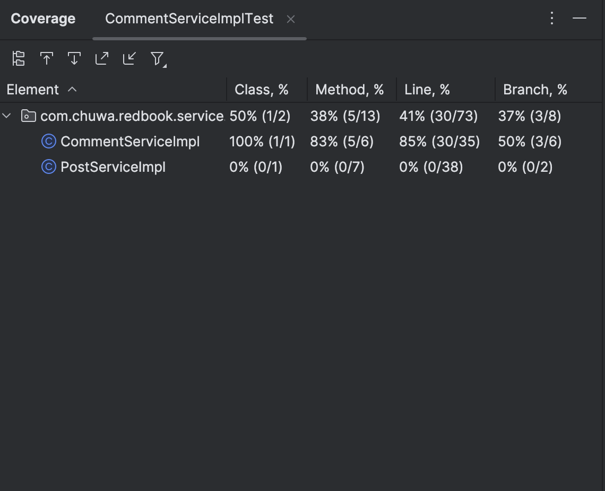

 Explain and compare following concepts, provide specific examples when doing comparison:
Testing related: 

 1. Unit Testing: Testing the smallest testable units of a program, such as functions
   or methods 

 2. Functional Testing: Testing functions of a single component/module, or a compelete
   application, from user's perspective.

 3. Integration Testing: Testing the interactions between multiple components or modules 

 4. Regression Testing: After modifying the program or environment, re-run previously run
   tests to confirm that no new errors have been introduced 

 5. Smoke Testing: Build verification test, it is part of the CICD pipeline, it verifies
   if the newly deployed executable performs basic functions, if yes,
   then continue with futher tests and stages, if not, it stops the
   pipeline. 

 6. Performance Testing: Testing the performance and response time of a system under a
   specific workload 

 7. Stress Testing: Testing the stability and reliability of a system by simulating an
   environment with workloads or data volumes beyond normal levels 

 8. A/B Testing: a method of comparing two versions of a webpage or app to determine 
which one performs better based on a specific goal 

 9. End-to-End Testing: Mainly performed by QA 

 10. User Acceptance Testing: The end user tests the software to confirm that it can perform the
    required tasks under actual conditions 

 Environment related: 

 1. Development: local development environment 

 2. QA (Quality Assurance): allows QA engineers to test new and changed code whether via automated or non-automated techniques. 

 3. Pre-prod/Staging: a nearly exact replica of the production environment so it seeks to mirror an actual production environment as closely as possible to ensure the software works correctly. 

 4. Production: It's live to real users. 

Write unit test for CommentServiceImpl.java: https://github.com/CTYue/springboot-redbook/
blob/10_testing/src/main/java/com/chuwa/redbook/service/impl/CommentServiceImpl.java
Try to cover as many lines/branches as possible.
Prove your code coverage using Jacoco Report.

