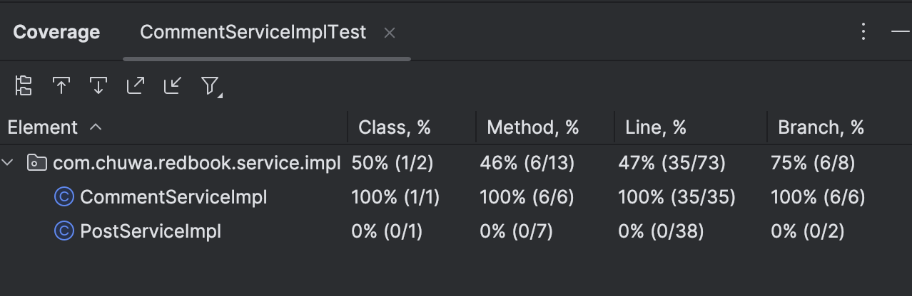

#### 1. Explain and compare following concepts, provide specific examples when doing comparison, how they are used done in industry  :  

##### Testing related:  1. Unit Testing  2. Functional Testing  3. Integration Testing  4. Regression Testing  5. Smoke Testing  6. Performance Testing  7. Stress Testing  8. A/B Testing  9. End-to-End Testing  10. User Acceptance Testing

In a typical software development lifecycle, we employ multiple testing strategies to ensure quality at different levels. Let me walk you through each type and how they relate to one another.

**Unit Testing** forms the foundation of our testing pyramid. These are isolated tests for individual methods or classes, typically written by developers using frameworks like JUnit or TestNG. For instance, if you have a `calculateDiscount()` method, you'd test various inputs and edge cases. In industry, we aim for 80%+ code coverage and run these with every commit through CI/CD pipelines.

**Integration Testing** comes next, where we test how different modules work together. Unlike unit tests that mock dependencies, integration tests use real implementations. For example, testing if your REST controller correctly calls the service layer and persists data to the database. We often use Spring Boot's @SpringBootTest annotation for this purpose.

**Functional Testing** validates business requirements from the user's perspective. While unit tests might verify a sorting algorithm works correctly, functional tests ensure the "Sort Products by Price" feature works as specified in the requirements. These are often automated using Selenium or Cypress.

**End-to-End Testing** takes functional testing further by testing complete user workflows across the entire system. For an e-commerce application, this would mean testing from user login, browsing products, adding to cart, through checkout and order confirmation. These tests are expensive to maintain but catch integration issues between systems.

**Smoke Testing** is a subset of functional tests - the critical path scenarios we run after each deployment to ensure basic functionality works. Think of it as a health check: can users log in, view the homepage, and perform core actions? These typically take 5-10 minutes to run.

**Regression Testing** ensures new changes don't break existing functionality. This is your accumulated test suite that grows over time. When fixing a bug, we add a test case to prevent regression. In practice, we automate these and run them in CI/CD pipelines.

**Performance Testing** measures system behavior under expected load. Using tools like JMeter or Gatling, we simulate 1000 concurrent users accessing our API to ensure response times stay under 200ms. This differs from functional testing which only cares if the feature works, not how fast.

**Stress Testing** pushes the system beyond normal capacity to find breaking points. While performance testing might simulate 1000 users, stress te

sting increases to 10,000 to identify bottlenecks, memory leaks, or database connection pool exhaustion. This helps us understand system limits and plan capacity.

**User Acceptance Testing (UAT)** is performed by actual end users or business stakeholders before production release. Unlike our automated tests, UAT validates that the system meets business needs and is usable. For example, having the finance team test a new invoicing feature in a staging environment.

**A/B Testing** is unique - it's not about correctness but about comparing variations in production. We might show 50% of users a blue "Buy Now" button and 50% a green one, then measure conversion rates. This requires feature flags and analytics infrastructure like Google Optimize or Optimizely.

In practice, these layer together: developers write unit and integration tests during development, QA engineers create functional and end-to-end test suites, performance engineers run load tests before major releases, and product teams coordinate UAT and A/B tests. The key is balancing test coverage with maintenance cost - we invest heavily in unit tests (fast, stable) and carefully select which scenarios need expensive end-to-end tests.

##### Environment related:  1. Development  2. QA (Quality Assurance)  3. Pre-prod/Staging  4. Production

**Development Environment**

This is where developers write and test code locally or on shared development servers. It's highly unstable by design - developers frequently push experimental code, break things, and test new features. Database might contain dummy data, and third-party integrations often use sandbox/mock services.

**QA Environment**

QA is the first formal testing ground where our QA engineers validate functionality against requirements. This environment mirrors production more closely than dev, with realistic data sets and actual service integrations. Code here comes from specific builds that passed initial developer testing.

**Pre-prod/Staging Environment**

Staging is essentially a production clone - same infrastructure, same data volume characteristics, same configurations. We use it for final validation, performance testing, and deployment rehearsals. Any code here is release-candidate quality.

**Production Environment**

This is the live environment serving actual users. It has the most restrictive access controls, comprehensive monitoring, and highest stability requirements.

#### 2. Write unit test for CommentServiceImpl.java: https://github.com/CTYue/springboot-redbook/blob/10_testing/src/main/java/com/chuwa/redbook/service/impl/CommentServiceImpl.java  Try to cover as many lines/branches as possible.  Prove your code coverage using Jacoco Report.

submitted repo: [https://github.com/ethannchen/springboot-redbook/pull/new/10_testing_hw](https://github.com/ethannchen/springboot-redbook/pull/new/10_testing_hw)