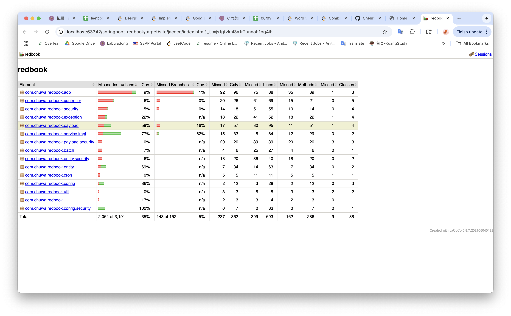

# Software Testing Concepts and Environments

## Testing Related Concepts

### 1. Unit Testing
**Definition:**  
Unit testing involves testing individual components or functions in isolation to ensure they perform as expected.

---

### 2. Functional Testing
**Definition:**  
Functional testing validates that the software performs according to specified requirements.

---

### 3. Integration Testing
**Definition:**  
Integration testing checks how different modules or services work together.

---

### 4. Regression Testing
**Definition:**  
Regression testing ensures that recent changes haven’t introduced new bugs into existing functionality.

---

### 5. Smoke Testing
**Definition:**  
Smoke testing is a quick check to see if the basic functionality of the application works.

---

### 6. Performance Testing
**Definition:**  
Performance testing measures how the system behaves under certain load conditions.

---

### 7. Stress Testing
**Definition:**  
Stress testing checks how the system performs under extreme conditions beyond its normal capacity.

---

### 8. A/B Testing
**Definition:**  
A/B testing compares two versions of a feature to see which performs better with users.

---

### 9. End-to-End Testing
**Definition:**  
End-to-end testing verifies the complete flow of an application from start to finish.

---

### 10. User Acceptance Testing (UAT)
**Definition:**  
UAT ensures the system meets user requirements and is ready for production.

---

## Environment Related Concepts

### 1. Development
**Definition:**  
An environment where developers build and test their code locally or in isolated environments.

---

### 2. QA (Quality Assurance)
**Definition:**  
A staging area for testers to validate features and ensure quality before release.

---

### 3. Pre-prod/Staging
**Definition:**  
An environment that mimics production, used for final testing and validation.

---

### 4. Production
**Definition:**  
The live environment where the application is available to end users.

---

## Unit Test for `CommentServiceImpl.java`

**TODO:**  
Write unit tests for `CommentServiceImpl.java`
- Link: [CommentServiceImpl.java](https://github.com/CTYue/springboot-redbook/blob/10_testing/src/main/java/com/chuwa/redbook/service/impl/CommentServiceImpl.java)
- Cover as many lines/branches as possible
- Prove coverage using Jacoco report
```java
package com.chuwa.redbook.service.impl;

import com.chuwa.redbook.dao.CommentRepository;
import com.chuwa.redbook.dao.PostRepository;
import com.chuwa.redbook.entity.Comment;
import com.chuwa.redbook.entity.Post;
import com.chuwa.redbook.exception.BlogAPIException;
import com.chuwa.redbook.exception.PostNotFoundException;
import com.chuwa.redbook.exception.ResourceNotFoundException;
import com.chuwa.redbook.payload.CommentDto;
import org.junit.jupiter.api.Test;
import org.junit.jupiter.api.extension.ExtendWith;
import org.modelmapper.ModelMapper;
import org.slf4j.Logger;
import org.slf4j.LoggerFactory;
import org.springframework.http.HttpStatus;
import org.mockito.InjectMocks;
import org.mockito.Mock;
import org.mockito.junit.jupiter.MockitoExtension;

import java.util.Arrays;
import java.util.List;
import java.util.Optional;

import static org.junit.jupiter.api.Assertions.*;
import static org.mockito.ArgumentMatchers.any;
import static org.mockito.Mockito.*;

@ExtendWith(MockitoExtension.class)
class CommentServiceImplTest {

    private static final Logger logger = LoggerFactory.getLogger(CommentServiceImplTest.class);

    @Mock
    private CommentRepository commentRepository;

    @Mock
    private PostRepository postRepository;

    @Mock
    private ModelMapper modelMapper;

    @InjectMocks
    private CommentServiceImpl commentService;

    @Test
    void createComment_success() {
        long postId = 1L;
        Post post = new Post();
        post.setId(postId);

        CommentDto dto = new CommentDto("Test User", "test@example.com", "This is a comment");
        Comment commentEntity = new Comment();
        commentEntity.setPost(post);

        when(postRepository.findById(postId)).thenReturn(Optional.of(post));
        when(modelMapper.map(dto, Comment.class)).thenReturn(commentEntity);
        when(commentRepository.save(any(Comment.class))).thenReturn(commentEntity);
        when(modelMapper.map(commentEntity, CommentDto.class)).thenReturn(dto);

        CommentDto result = commentService.createComment(postId, dto);

        assertNotNull(result);
        assertEquals(dto.getName(), result.getName());
        assertEquals(dto.getEmail(), result.getEmail());
        assertEquals(dto.getBody(), result.getBody());

        verify(postRepository, times(1)).findById(postId);
        verify(commentRepository, times(1)).save(any(Comment.class));
    }

    @Test
    void getCommentsByPostId_success() {
        long postId = 1L;
        Post post = new Post();
        post.setId(postId);

        Comment comment1 = new Comment();
        comment1.setId(1L);
        Comment comment2 = new Comment();
        comment2.setId(2L);

        when(postRepository.findById(postId)).thenReturn(Optional.of(post));
        when(commentRepository.findByPostId(postId)).thenReturn(Arrays.asList(comment1, comment2));
        when(modelMapper.map(any(Comment.class), eq(CommentDto.class)))
                .thenReturn(new CommentDto(), new CommentDto());

        List<CommentDto> result = commentService.getCommentsByPostId(postId);

        assertNotNull(result);
        assertEquals(2, result.size());
        verify(postRepository, times(1)).findById(postId);
        verify(commentRepository, times(1)).findByPostId(postId);
    }

    @Test
    void getCommentById_wrongPost_shouldThrowBlogAPIException() {
        long postId = 1L;
        long commentId = 2L;

        Post correctPost = new Post();
        correctPost.setId(postId);

        Post wrongPost = new Post();
        wrongPost.setId(999L);

        Comment comment = new Comment();
        comment.setId(commentId);
        comment.setPost(wrongPost);

        when(postRepository.findById(postId)).thenReturn(Optional.of(correctPost));
        when(commentRepository.findById(commentId)).thenReturn(Optional.of(comment));

        BlogAPIException ex = assertThrows(BlogAPIException.class,
                () -> commentService.getCommentById(postId, commentId));

        assertEquals("Comment does not belong to post", ex.getMessage());
    }

    @Test
    void updateComment_success() {
        long postId = 1L;
        long commentId = 2L;

        Post post = new Post();
        post.setId(postId);

        Comment comment = new Comment();
        comment.setId(commentId);
        comment.setPost(post);

        CommentDto updatedDto = new CommentDto("Updated Name", "updated@example.com", "Updated Body");

        when(postRepository.findById(postId)).thenReturn(Optional.of(post));
        when(commentRepository.findById(commentId)).thenReturn(Optional.of(comment));
        when(commentRepository.save(any(Comment.class))).thenReturn(comment);
        when(modelMapper.map(comment, CommentDto.class)).thenReturn(updatedDto);

        CommentDto result = commentService.updateComment(postId, commentId, updatedDto);

        assertNotNull(result);
        assertEquals("Updated Name", result.getName());
        assertEquals("updated@example.com", result.getEmail());
        assertEquals("Updated Body", result.getBody());
    }

    @Test
    void deleteComment_success() {
        long postId = 1L;
        long commentId = 2L;

        Post post = new Post();
        post.setId(postId);

        Comment comment = new Comment();
        comment.setId(commentId);
        comment.setPost(post);

        when(postRepository.findById(postId)).thenReturn(Optional.of(post));
        when(commentRepository.findById(commentId)).thenReturn(Optional.of(comment));

        assertDoesNotThrow(() -> commentService.deleteComment(postId, commentId));
        verify(commentRepository, times(1)).delete(comment);
    }
}


```
- 

---
