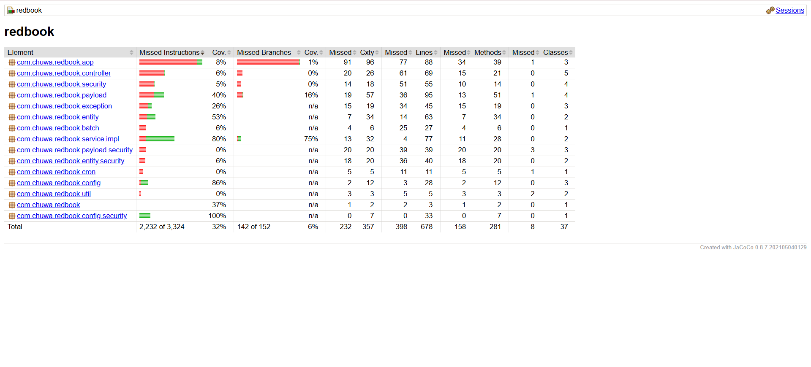

## Testing related:
### 1. Unit Testing
Definition:
Tests individual units/components *(e.g., a function, method, or class)* in isolation.

The purpose is to validate that each unit of the software code performs as expected.

Example:
```
JUnit
assertEquals()
assertThrows()

mockito
```
Comparison Tip:
Unit tests are the lowest level of testing—fast, isolated, and run frequently by developers.

### 2. Functional Testing

Functional testing verifies that the software behaves according to the specified business requirements. It focuses on what the system does, not how it does it.

No mocking, only call real external dependencies (e.g. DB server, another service...) and data.

Testing functions of a single component/module, or a compelete application, from user's prespective.

*A feature from user's view*

```
    @Autowired
    private MockMvc mockMvc; // <- Used to simulate HTTP requests

    @Autowired
    private ObjectMapper objectMapper; // <- Converts Java object to JSON

    //  This is the actual test method
    @Test
    void testLoginSuccess() throws Exception {
        LoginRequest request = new LoginRequest();
        request.setUsername("admin");
        request.setPassword("password");

        // Send POST /auth/login with JSON and check 200 OK + message
        mockMvc.perform(post("/auth/login")
                .contentType("application/json")
                .content(objectMapper.writeValueAsString(request)))
                .andExpect(status().isOk())
                .andExpect(content().string("Login successful"));
    }
```

### 3. Integration Testing

Testing the interactions between multiple components or modules

It answers:

"Can this service talk to the database and return the right result?"

*Multiple layers working together*

Example: Service + Repository + Database

```
@SpringBootTest // Loads full Spring context
@AutoConfigureMockMvc
public class UserIntegrationTest {

    @Autowired
    private MockMvc mockMvc;

    @Autowired
    private UserRepository userRepository;

    @BeforeEach
    void setUp() {
        userRepository.deleteAll(); // Clean before each test
        userRepository.save(new User(null, "Alice")); // Setup data
    }

    @Test
    void testGetUserByName() throws Exception {
        mockMvc.perform(get("/users/Alice"))
                .andExpect(status().isOk())
                .andExpect(jsonPath("$.name").value("Alice"));
    }

    @Test
    void testUserNotFound() throws Exception {
        mockMvc.perform(get("/users/Bob"))
                .andExpect(status().isNotFound());
    }
}

```

### 4. Regression Testing

After modifying the program or environment, re-run previously run
tests to confirm that no new errors have been introduced

When to Use:
* After bug fixes

* After code refactoring

* Before a new release


### 5. Smoke Testing
A.K.A Build verification test, it is part of the CICD pipeline, it verifies
if the newly deployed executable performs basic functions, if yes,
then continue with futher tests and stages, if not, it stops the pipeline.

 Example Use Case
You just deployed a new build of your Spring Boot app. You want to quickly test:

* Can it start?

* Can the homepage load?

* Can login return a 200 OK?

### 6. Performance Testing

Testing the performance and response time of a system under a
*specific workload*
* Fast response times

* Scalable behavior

* Efficient resource usage (CPU, memory, DB, etc.)


### 7. Stress Testing

Testing the stability and reliability of a system by simulating an
environment with workloads or data volumes beyond normal levels


It’s not about expected usage — it’s about breaking the system on purpose to test stability and recovery.

### 8. A/B Testing

A/B Testing (also called split testing) is a method where you compare two versions (A and B) of a web page, feature, or design to determine which one performs better based on a specific user behavior or metric.

Real Example: Button Color Change

Scenario:
You’re building an e-commerce site. You want to see which Buy Now button performs better.

* Version A: Blue button

* Version B: Red button

Metric to measure:
* Click-through rate (CTR) on the button

* Conversion rate (how many users completed checkout)


### 9. End-to-End Testing

End-to-End Testing tests the entire application flow from the user's perspective — from the front end, through the backend, all the way to the database (and sometimes external systems).

Mainly performed by QA (Quality Assurance Engineers)

Real Example: E-Commerce Checkout Flow
Test scenario:

1. User opens website

1. Logs in

1. Searches for a product

1. Adds it to the cart

1. Proceeds to checkout

1. Completes payment

You validate that:

* Pages load correctly

* Data is saved correctly

* APIs and services all respond properly


### 10. User Acceptance Testing

The end user tests the software to confirm that it can perform the required tasks under actual conditions

## Environment related:
### 1. Development

Used by developers for active coding, debugging, and early unit/integration testing.

Key Features:
* May contain test/stubbed services

* Data is often mock or local

* Fast feedback loop

* Frequently rebuilt or restarted

Example:

You run a Spring Boot app locally (localhost:8080) with mock user data while developing a new login feature.


### 2. QA (Quality Assurance)

Used by QA/test engineers to perform manual and automated testing, including:

* Functional

* Regression

* Smoke

* Integration
  
Key Features:
* Reflects production-like setup (real services, realistic test data)

* Controlled data to support test cases

* May run automated test suites after every build
  
Example:

Testers verify that adding items to the cart works as expected and that a previously fixed bug does not reoccur.
### 3. Pre-prod/Staging

Purpose:
Used to simulate production as closely as possible for *final checks* before going live.

Key Features:
* Same configuration as production (infrastructure, DB, services)

* May use anonymized or replicated production data

* UAT (User Acceptance Testing) usually happens here

* Last place for validation: performance, smoke, E2E, legal compliance, etc.

Example:
A product owner tests the full checkout flow with staging credentials and confirms it's ready for release.


### 4. Production

Purpose:
The live system where *real users* interact with the application.

Key Features:
* Must be stable, secure, and highly available

* Uses real data

* Monitored with logging, alerts, and metrics

* Any changes here are usually deployed through CI/CD pipelines and version-controlled

Example:
Users buy products, submit forms, and generate reports — everything in real time with real consequences.


## Testing


