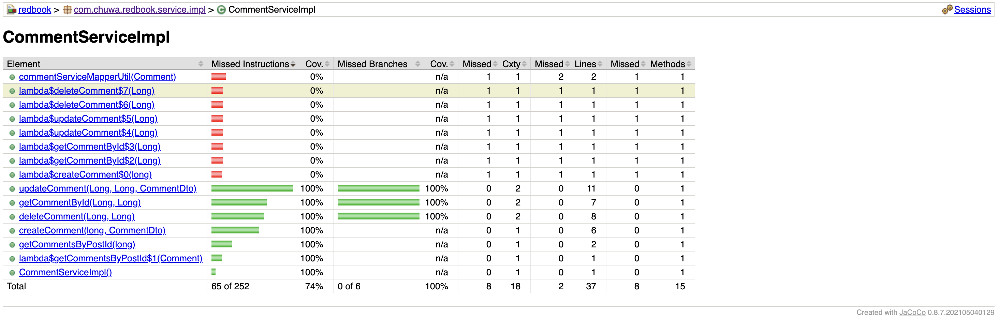

# HW14 - Testing

Explain and compare following concepts, provide specific examples when doing comparison:

**Testing related:**

1. Unit Testing

   - Testing the smallest individual units (methods/functions) of code in the application to verify if the coede performs as expected (logic)

   - **Using mocked dependencies to perform the test**

   - Test is during the development by **developers**

   - Examples: A `calculateTax()` method in a billing system is tested for different inputs.

   - Tools: JUnit (Java), pytest (Python), Jest (JS)

     

2. Functional Testing

   - Testing a specific functionality of the application to verify if business requirements/features are fullfilled. It assess the entire application from a user's perspective

   - By QA or automation tools

   - Example: Test login flow to ensure user can enter credentials and access dashboard

   - Tools: Selenium, Cypress, Postman

     

3. Integration Testing

   - Testing interaction between components/modules (collaboration)

   - **Using real dependencies to perform the test**

   - Test is during the development by **developers**

   - Example: Test if the authentication service correctly calls user DB and session manager

   - Tools: TestNG, Spring Test (Java), SuperTest (Node.js)

     

4. Regression Testing

   - Testing if the recent code changes broken any existing features

   - Example: After refactoring the checkout logic, run tests to confirm other cart features still work

   - Tools: Test suites with CI/CD, Selenium Grid

     

5. Smoke Testing

   - **Build verification test**: part of the CICD pipeline, it verifies if the newly deployed executable performs basic functions. If yes, continue to futher tests; if not, stops the pipeline

   - Example: Check if the app boots, login screen loads, and DB connections are active

     

6. Performance Testing

   - Testing the performance and response time of a system under a specific workload (how fast)

   - Example: Check if an API returns a response within 500ms under 1000 users

   - Tools: JMeter, Gatling, k6

     

7. Stress Testing

   - Testing the stability and reliability of a system by simulating an extreme or breaking load

   - Example: Simulate 10,000 users logging in simultaneously to see if the system crashes gracefully

   - Tools: Same as performance tools + custom scripts

     

8. A/B Testing

   - Compares two versions of a feature with different users to measure business impact

   - Example: Show Version A of a landing page to 50% users and Version B to the rest, track which converts better

   - Tools: Optimizely, Google Optimize

     

9. End-to-End Testing

   - Simulates real user scenarios across the **full** system

   - Mainly performed by QA Engineers

   - Example: Simulate a user logging in, browsing products, adding to cart, and checking out

   - Tools: Cypress, Playwright, Selenium

     

10. User Acceptance Testing

    - **Final** testing phase to validate system meets business requirements

    - Test by End users or business stakeholders

    - **Example**: A finance team tests if the payroll report generated from the new system matches what they expect

      

**Environment related:**

1. Development

   - Write and test individual features in local machines, mocked services by **Developers**

   - Example: A dev runs Spring Boot service locally and writes unit tests

     

2. QA (Quality Assurance)

   - Dedicated testing environment for manual/automated testing by QA Engineers

   - Example: Automated test suites and functional testers validate the login flow on QA servers.	

     

3. Pre-prod/Staging

   - Mirror of production used for final validations by DevOps, QA, Business

   - Example: Run regression and performance tests on staging before deploying to production

     

4. Production

   - Live environment used by real End-users, monitored by support/DevOps
   - Example: A customer visits an e-commerce website, browses, and purchases.

Write unit test for CommentServiceImpl.java: https://github.com/CTYue/springboot-redbook/blob/10_testing/src/main/java/com/chuwa/redbook/service/impl/CommentServiceImpl.java

Try to cover as many lines/branches as possible.

Prove your code coverage using Jacoco Report.

My code is in https://github.com/hululu9/springboot-redbook/tree/10_testing

| Column                  | Meaning                                           |
| ----------------------- | ------------------------------------------------- |
| **Missed Instructions** | Number of code instructions not executed by tests |
| **Cov.**                | Coverage percentage for instructions              |
| **Missed Branches**     | Number of if/else branches not tested             |
| **Cxty**                | Cyclomatic complexity (code complexity measure)   |
| **Lines/Methods**       | Number of code lines and methods                  |

**Red Methods (0% Coverage - Need Tests):**

These are **exception handling lambdas** that haven't been tested:

- `lambda$deleteComment$7(Long)`
- `lambda$deleteComment$6(Long)`
- `lambda$createComment$0(long)`
- Various other lambda functions for update, get operations

**Green Methods (100% Coverage - Well Tested):**

- `updateComment()` - Update functionality 
- `getCommentById()` - Retrieve comment 
- `deleteComment()` - Delete functionality 
- `createComment()` - Create functionality 
- `getCommentsByPostId()` - Get comments for a post 

**Overall Stats:**

- **74% total coverage** (187 of 252 instructions covered)
- **100% branch coverage** (all if/else paths tested)
- **8 methods still need tests** (mostly error handling)