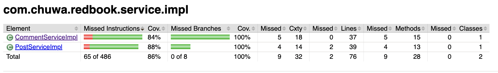
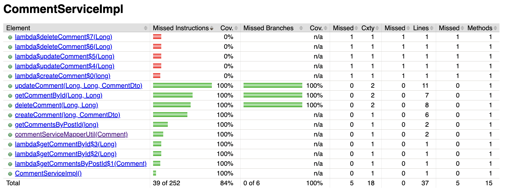

### hw14

---
#### 1. Compare the following concepts. Provide specific examples when doing comparison.

---

**Testing Types:**

| **Test Type**    | **What It Tests**                                        | **Scope**           | **Example**                                                                 |
|------------------|-----------------------------------------------------------|----------------------|------------------------------------------------------------------------------|
| **Unit Testing** | Individual methods or functions                          | Narrow (one class)   | Test `calculateTax()` in `InvoiceService` using JUnit + Mockito              |
| **Functional Testing** | Validates business logic against requirements            | Medium               | Test REST API returns correct JSON when valid input is posted                |
| **Integration Testing** | Interactions between modules or services                | Medium to Broad      | Test `OrderService` + `PaymentService` work together via REST call           |
| **Regression Testing** | Old features still work after changes                   | Broad                | Rerun all test suites after updating `UserService` logic                     |
| **Smoke Testing** | Basic app functionality is working (sanity check)         | Shallow and Wide     | Launch Spring Boot app, login user, fetch dashboard                         |
| **Performance Testing** | App speed, latency, throughput                          | Non-functional       | Test `/api/products` handles 2000 req/s with avg < 300ms latency             |
| **Stress Testing** | App behavior under extreme load                          | Non-functional       | Test app under 10,000 concurrent users until it crashes                     |
| **A/B Testing**  | Compare user behavior across two versions                | Real-world users     | Show version A with blue button, B with green; measure click-through rate    |
| **End-to-End Testing** | Entire flow mimicking user journey                      | Full System          | User logs in → adds item to cart → pays → gets confirmation email           |
| **User Acceptance Testing (UAT)** | End-user validation before release                       | Final approval       | Business users test new reporting dashboard before production launch        |

**Environment Types:**

| **Environment**      | **Purpose**                                   | **Who Uses It**           | **Example**                                                                 |
|----------------------|-----------------------------------------------|----------------------------|------------------------------------------------------------------------------|
| **Development**      | Build and test code locally or in dev env     | Developers                 | Run Spring Boot app locally, test `UserService` with mocked DB              |
| **QA (Quality Assurance)** | Run manual/automated tests after dev          | QA Engineers               | Run Postman/Newman scripts and Selenium UI tests on deployed test server    |
| **Staging / Pre-prod** | Mirror production closely, simulate real use | QA + Stakeholders + DevOps | Test user flows with production-like DB + configs before release            |
| **Production**       | Live system used by real users                | End users + Monitoring     | Deployed app on AWS, handling real HTTP traffic and persisting data         |

---
#### 2. Write unit tests for `CommentServiceImpl.java`: 
Code at: https://github.com/CTYue/springboot-redbook/blob/10_testing/src/main/java/com/chuwa/redbook/service/impl/CommentServiceImpl.java

Try to cover as many lines/branches as possible.  
Prove your code coverage using Jacoco Report.  

---

My test code is in: https://github.com/ariannalangwang/springboot-redbook/blob/hw14_10_testing/src/test/java/com/chuwa/redbook/service/impl/CommentServiceImplTest.java

Jacoco Report:  

 
