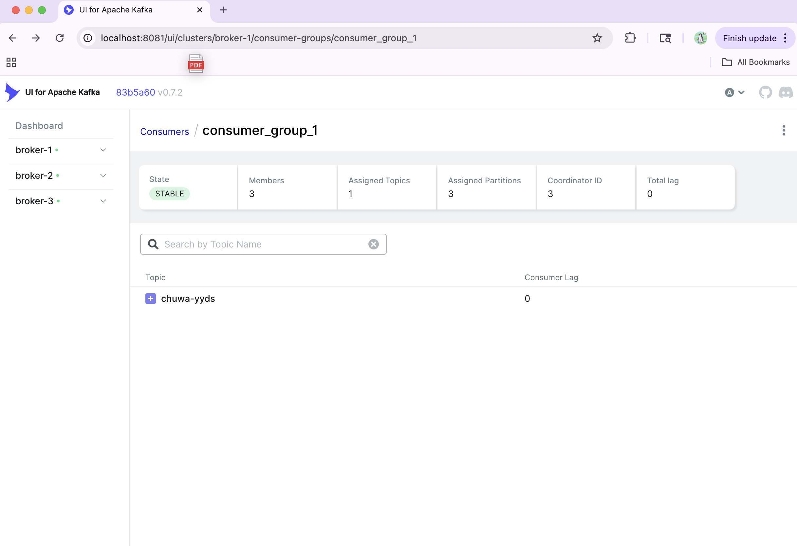
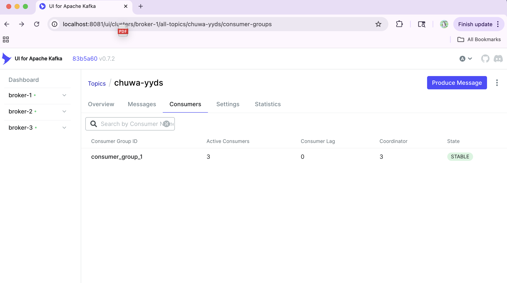
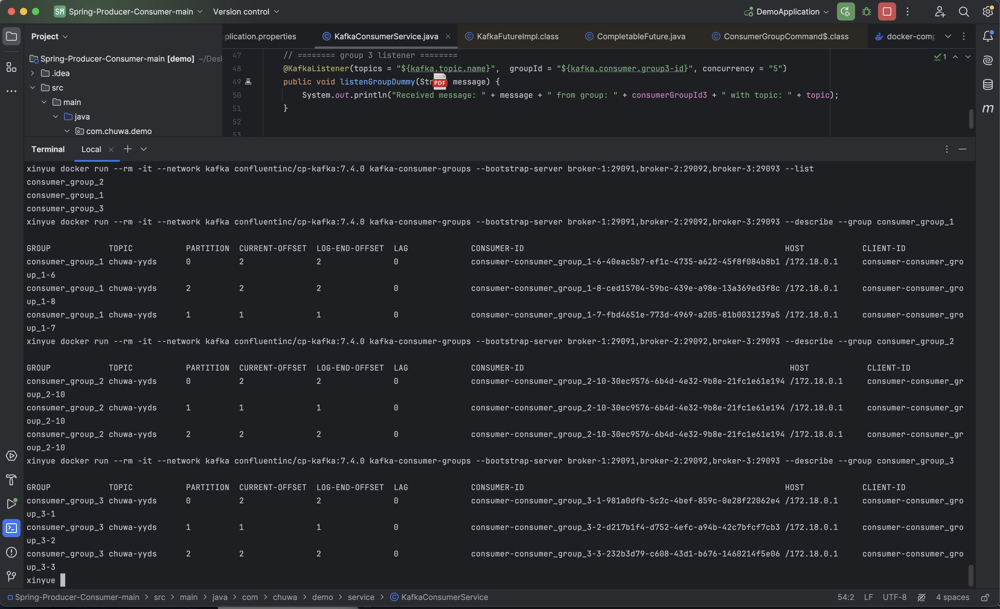
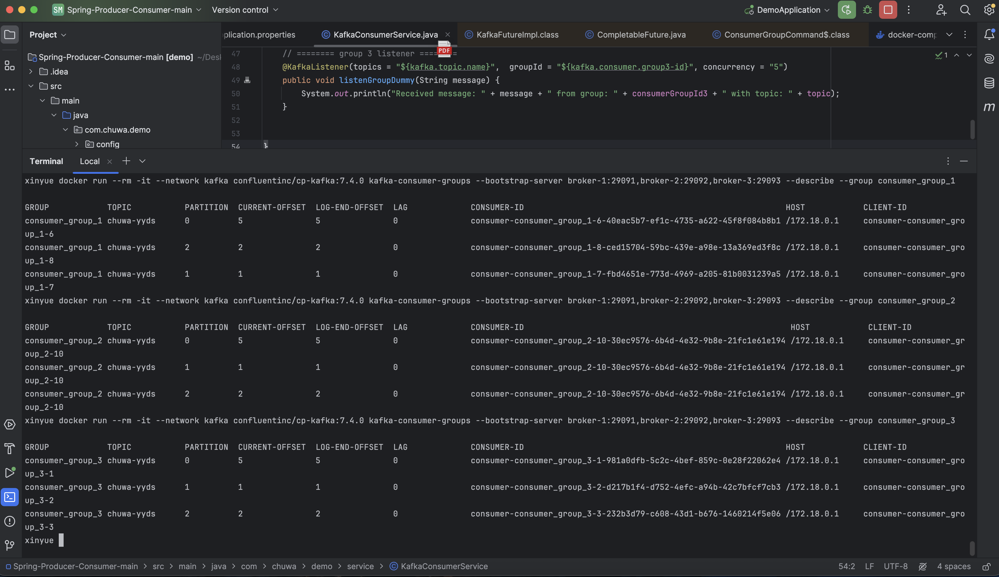
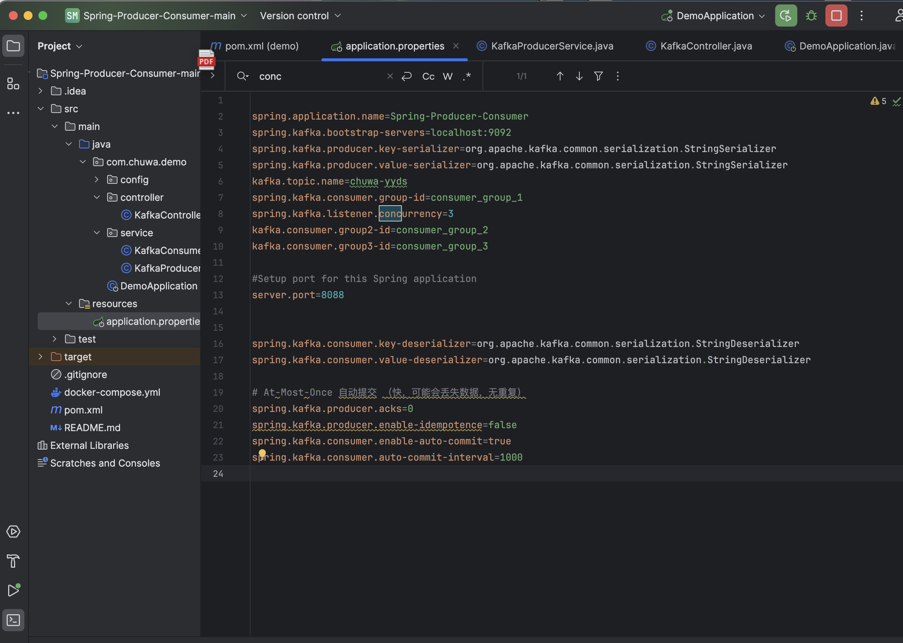
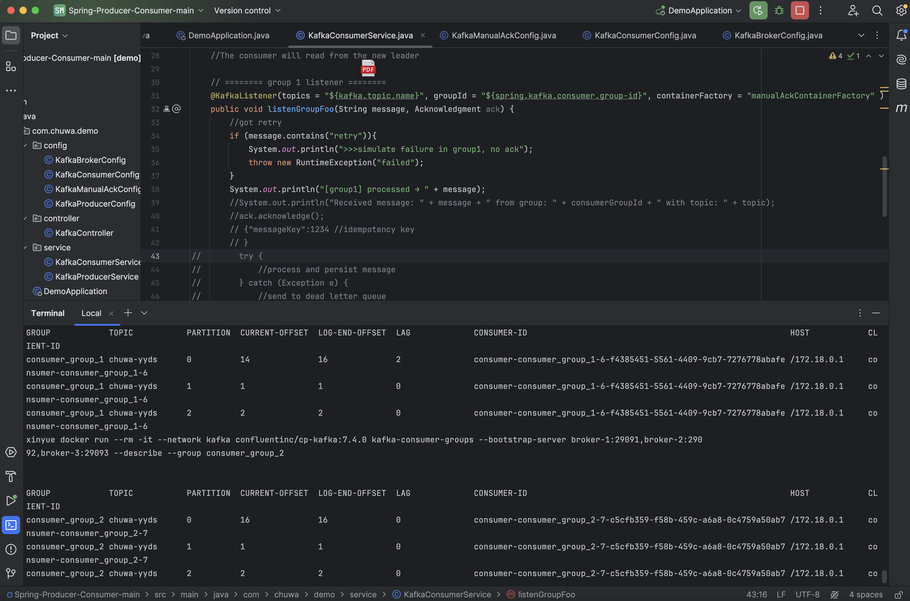
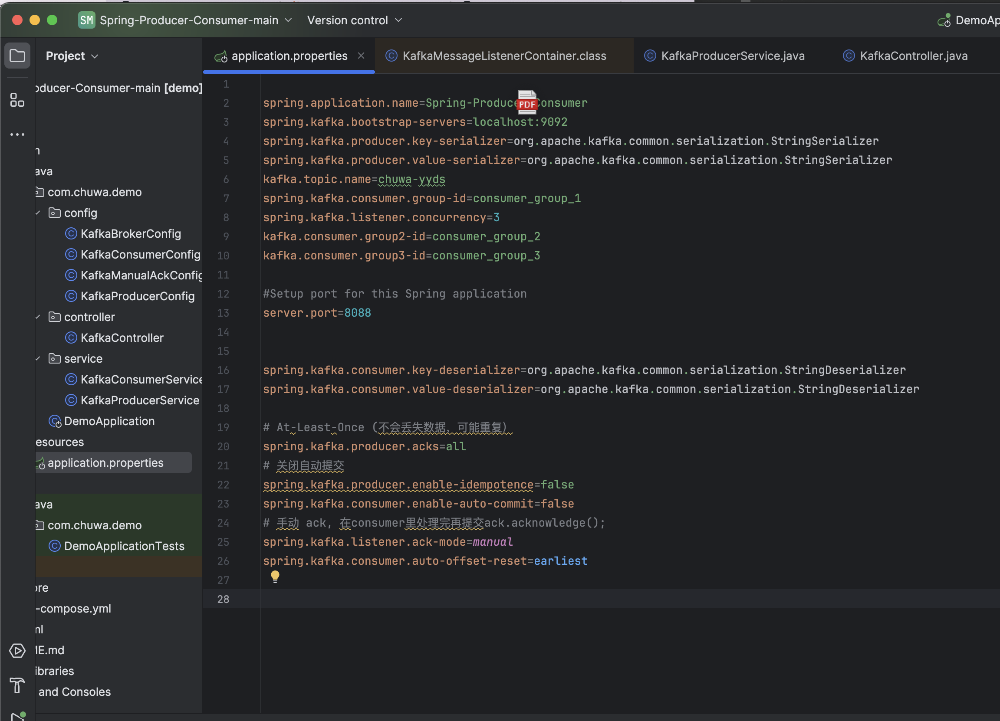
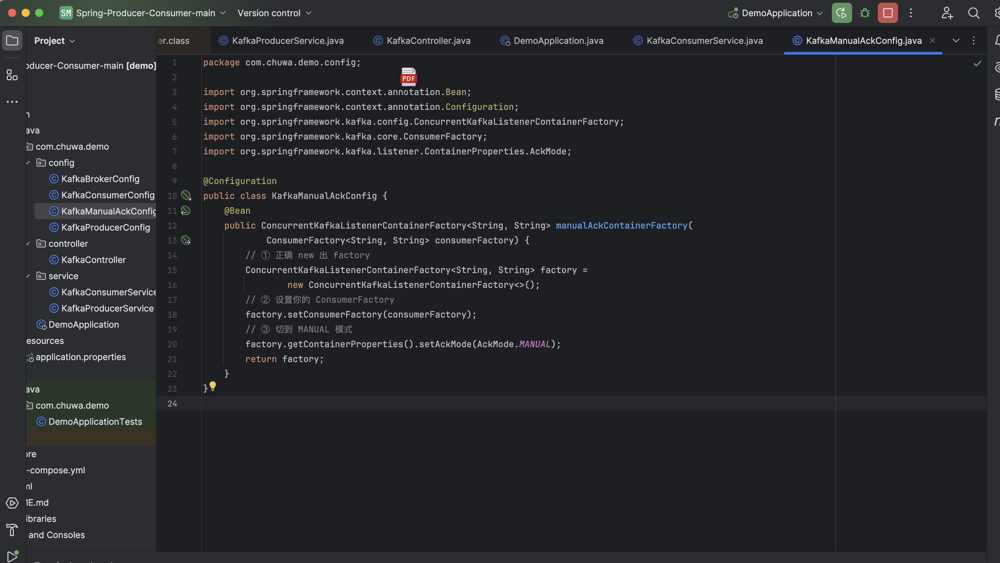
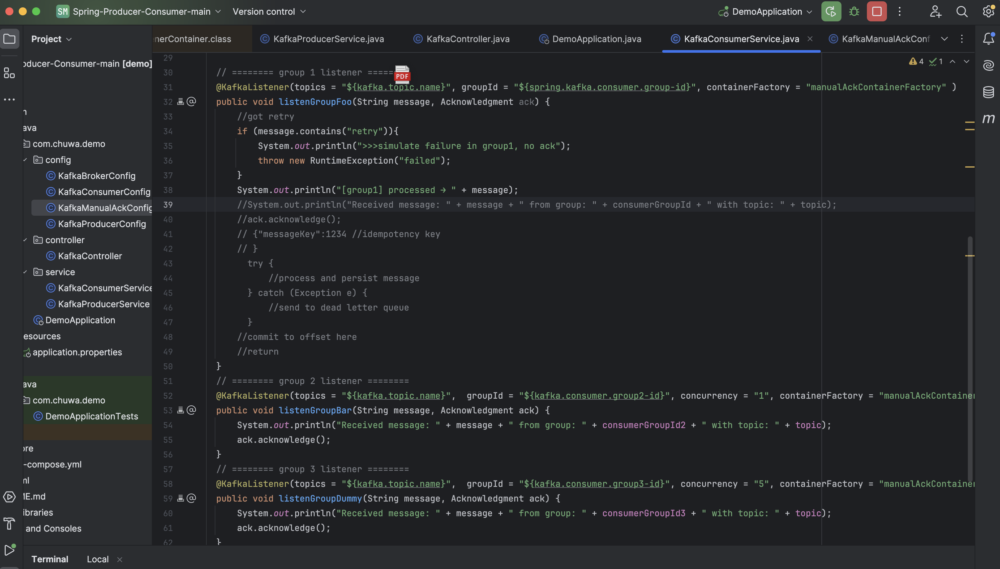
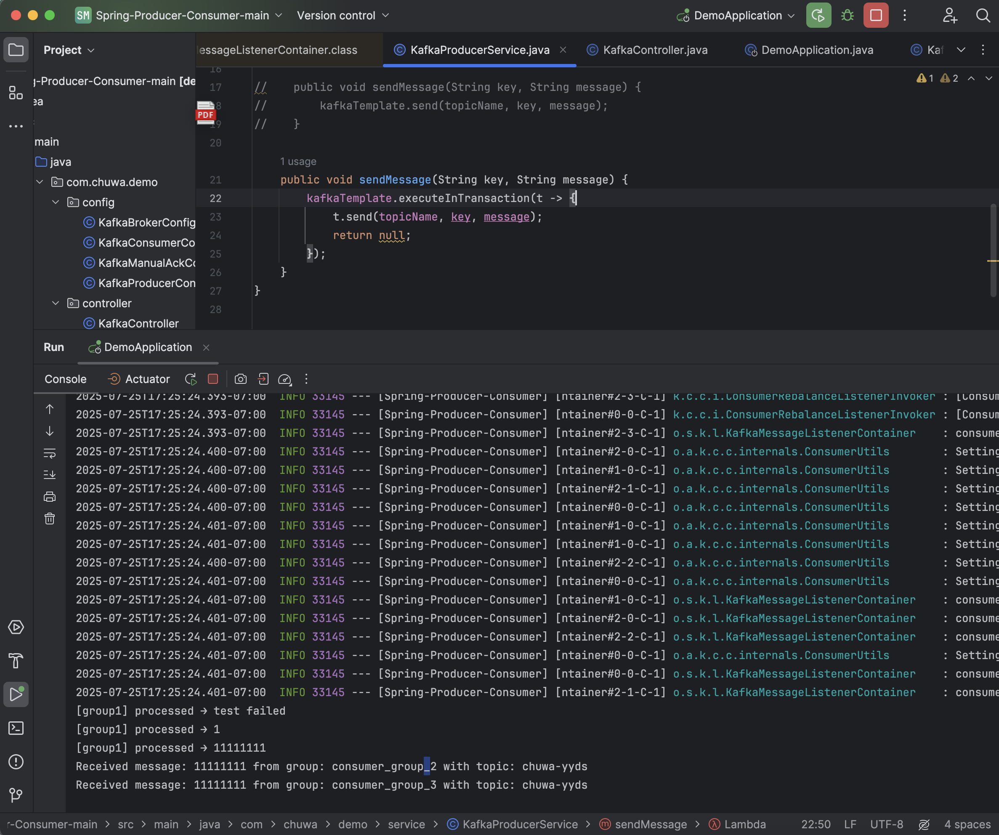

## Explain following concepts, and how they coordinate with each other:
### Topic
A named category or channel where messages are organized and stored, divided into partitions across brokers.

### Partition
Partition is divided topic several small units into different partition for better streaming.

### Broker
One broker can contain several partitions which is a collecton of partitioins.

### Consumer group
A group of consumers working together; one partition can only be consumed by one consumer within the same group at a time, but multiple consumer groups can consume the same partition simultaneously.
1. 一个partition可以被多个不同的consumer group同时消费
2. 但在同一个consumer group内，一个partition只能被一个consumer消费

### Producer
An application that sends messages to Kafka topics.

### Offset
A unique sequential number identifying each message position in a partition.

### Zookeeper
A coordination service that manages Kafka, like broker, topics config.

`Zookeeper` coordinates: 
`Producer` sends messages to `topic` → Kafka routes to specific `partitions` on `brokers` based on message keys/Round Robin → `Consumer group` members consume different partitions and track position via `offset` → `Zookeeper` manages consumer group membership and rebalancing.


## Answer following questions:

### 1. Given N (number of partitions) and M (number of consumers,) what will happen when N>=M and N\<M respectively?
N>=M: Each consumer handles exactly one partition (perfect balance) if N=M, or some consumers handle multiple partitions (distributed evenly) if N>M.
// 完美平衡，每个消费者负责一个分区, 某些消费者负责多个分区

N\<M: Each partition is assigned to one consumer. Extra consumers remain idle (no partitions assigned).
// 多出来的消费者处于空闲状态


### 2. Explain how brokers work with topics?
Topics are logical concepts. Each topic is divided into partitions, 
and these partitions are distributed across multiple brokers.


### 3. Are messages pushed to consumers or consumers pull messages from topics?
Consumers pull messages


### 4. How to avoid duplicate consumption of messages?
we use idempotency (with idempotency key) to ensure messages are processed only once, even if consumed multiple times.


### 5. What will happen if some consumers are down in a consumer group? Will data loss occur? Why?
Zookeeper detects the failure and triggers partition rebalancing to reassign partitions to remaining consumers. 
Data won't be lost because messages are persisted in Kafka brokers and remaining consumers resume processing from the last committed offset. (Offset tracking ensures no messages are skipped)


### 6. What will happen if an entire consumer group is down? Will data loss occur? Why?
No rebalancing process since no consumers are available to assign partitions.
Data still won't be lost because messages are persisted in Kafka brokers and consumer group offsets are preserved. When consumers restart, they resume 
from last committed offsets. However, consumer lag will accumulate during downtime.

(Data loss only occurs if the downtime exceeds Kafka's retention period.)


### 7. Explain consumer lag and how to resolve it?
Consumer lag occurs when the consumer's current offset falls behind 
the topic's end offset, indicating unprocessed messages.

`Consumer lag = end offset - current consumer offset`

Solutions:
Scale consumers (increase instances/concurrency)
Batch Processing 
Increase partitions -提高并行度上限
Optimize consumer config -优化性能参数
Async processing -避免阻塞


### 8. Explain how Kafka tracks message delivery?
Kafka tracks message delivery through `offsets` and `acknowledgments`. Each message gets a unique offset in its partition. Producers receive acks when messages are written to brokers. Consumers commit offsets after processing to track progress. Kafka monitors consumer lag to ensure healthy delivery.

Producer 发送消息
    ↓
Kafka Broker，分配Offset (追踪消息位置)
    ↓
Consumer 拉取消息
    ↓
Consumer 处理业务逻辑
    ↓
Consumer, commit offset (确认投递)
    ↓
Kafka 更新 Consumer Group Offset (记录进度)
    ↓
监控系统检查 Consumer Lag (投递健康度)


### 9. Compare Kafka vs RabbitMQ, comp are messageing frameworks vs MySql (Why Kafka)?
| Feature          | Kafka                    | RabbitMQ             | MySQL                |
|------------------|--------------------------|----------------------|----------------------|
| **Primary Use**  | Event streaming          | Message queuing      | Data storage         |
| **Throughput**   | Millions/sec             | Thousands/sec        | Thousands/sec        |
| **Architecture** | Distributed log          | Message broker       | Relational database  |
| **Message Model**| Pull-based               | Push-based           | Pull-based(queries)  |
| **Scalability**  | Horizontal (add brokers) | Vertical + clustering| Complex sharding     |
| **Realtime process**    | Excellent         | Good                | Poor (polling)       |
| **Persistence**  | Disk-based log           | Memory + optional    | ACID transactions    |
| **Coupling**     | Loose (event-driven)     | Loose (async)        | Tight (direct access)|
| **Latency**      | medium                   | fast                 | high latency|


MySQL Problems:
- **Inefficient polling** - Applications must repeatedly query for new data
- **Single DB bottleneck** - All services compete for same database resources  
- **Schema couplingg** - Services directly depend on database schema

Kafka Advantages:
- **Optimized pull** - Instant message delivery to subscribers
- **Distributed** - Multiple brokers handle events across partitions and clusters
- **Event-driven** - Publishers emit events, subscribers react automatically (vs polling database)

Kafka provides **high-throughput, scalable, decoupled** messaging that MySQL cannot match.


## 10. On top of https://github.com/CTYue/Spring-Producer-Consumer
- Write your consumer application with Spring Kafka dependency, set up 3 consumers in a single consumer group.
Prove message consumption with screenshots.


- Increase number of consumers in a single consumer group, observe what happens, explain your observation.
`Maximum active consumers = Number of partitions`
Since we have 3 partitions, only 3 consumers can be active simultaneously
Additional consumers remain idle as backup/standby instances

Adding more consumers beyond the partition count doesn't improve parallel processing. To achieve higher parallelism, you need to increase the number of partitions, not just consumers. 


- Create multiple consumer groups using Spring Kafka, set up different numbers of consumers within each group, observe consumer offset,
I set 3 consumers in consumer_group_1; 1 consumer in consumer_group_2; 5 consumers in consumer_group_3.
Initially there was no lag, which means current offset and log-end offset both reached the last message. Then I produced 3 more messages into partition 0, and found:
1. All 3 consumer groups will consume these new 3 messages independently;
2. Only the consumer dealing with partition 0 had its offset increased;
3. Other partitions remained unchanged.



- Prove that each consumer group is consuming messages on topics as expected, take screenshots of offset records,

same screenshoots as previous one.
It proves: 
1. All LAG = 0, meaning each consumer group is consuming up-to-date messages
2. CURRENT-OFFSET = LOG-END-OFFSET, indicating real-time consumption
3. Detailed offset information shows successful message processing across all partitions
```
✅ Consumer Group 1 (consumer_group_1):
  - Partition 0: CURRENT-OFFSET=5, LOG-END-OFFSET=5, LAG=0
  - Partition 1: CURRENT-OFFSET=1, LOG-END-OFFSET=1, LAG=0  
  - Partition 2: CURRENT-OFFSET=2, LOG-END-OFFSET=2, LAG=0

✅ Consumer Group 2 (consumer_group_2):
  - Partition 0: CURRENT-OFFSET=5, LOG-END-OFFSET=5, LAG=0
  - Partition 1: CURRENT-OFFSET=1, LOG-END-OFFSET=1, LAG=0
  - Partition 2: CURRENT-OFFSET=2, LOG-END-OFFSET=2, LAG=0

✅ Consumer Group 3 (consumer_group_3):
  - Partition 0: CURRENT-OFFSET=5, LOG-END-OFFSET=5, LAG=0
  - Partition 1: CURRENT-OFFSET=1, LOG-END-OFFSET=1, LAG=0
  - Partition 2: CURRENT-OFFSET=2, LOG-END-OFFSET=2, LAG=0
```


- Demo different message delivery guarantees in Kafka, with necessary code or configuration
changes.
1: At most once (just adjust config as below)


2: At least once: disabled auto‑commit and set manual ack mode in application.properties, added a KafkaManualAckConfig under config and with the listener container with AckMode.MANUAL, modified the listener for consumer_group_1 to throw an exception and skip ack.acknowledge() while allowing the other two groups to acknowledge normally, then produced two messages and run command on terminal, we can see consumer_group_1 did not commit the last two messages and thus achieved at‑least‑once delivery.

```java
// 1.修改配置（application.properties 里关闭自动提交：
spring.kafka.consumer.enable-auto-commit=false
spring.kafka.listener.ack-mode=manual
```
//2.手动ack配置，KafkaManualAckConfig under Config，AckMode 切到 MANUAL
//3.模拟失败逻辑 在consumer service里
//4.验证 Offset 提交行为 
（先发几条消息让所有 group 都消费并提交（此时 CURRENT‑OFFSET = LOG‑END‑OFFSET）
（再发两条触发失败逻辑的消息给 consumer_group_1，它不 ack，所以它的 committed offset 不动；而 group_2、group_3 依然正常提交）
```
//5.command
docker run --rm -it --network kafka confluentinc/cp-kafka:7.4.0 kafka-consumer-groups --bootstrap-server broker-1:29091,broker-2:290
92,broker-3:29093 --describe --group consumer_group_1
```
//6.result
PARTITION  CURRENT-OFFSET  LOG-END-OFFSET  LAG
0          14              16              2





3: Exactly once: enable transactions and idempotence on the producer, keep manual commits on the consumer and read only committed records. Every message is processed exactly one time end‑to‑end—no duplicates and no losses—even if failures/restarts occur.
```java
//1.改配置
spring.kafka.producer.enable-idempotence=true
spring.kafka.producer.acks=all
spring.kafka.producer.transaction-id-prefix=${spring.application.name}-tx-

spring.kafka.consumer.enable-auto-commit=false
spring.kafka.listener.ack-mode=manual
spring.kafka.consumer.isolation-level=read_committed
```
```java
//2. 改producer
public void sendMessage(String key, String message) {
    kafkaTemplate.executeInTransaction(tx -> {
        tx.send(topicName, key, message);
        return null;
    });
}
```
// 3. Leave three @KafkaListener methods with Acknowledgment ack and call ack.acknowledge() on success (including group1).

//4. result （screenshoot)



- Write your own partitioning logic, to demo your messages will be assigned to different brokers, or you can also demo kafka's default round-robin paritioning logic, with code changes.
Note: There's already a docker compose file in above git repo, you can start the 3 brokers (with zookeep) using docker-compose up command.

I observed messages being distributed in a fixed round-robin pattern: partition1→partition0→partition2→partition1..., achieving load-balanced round-robin partitioning logic.

I implemented Kafka's default round-robin partitioning logic with the following code changes:
```java
//Kafka Producer Configuration
@Configuration
public class KafkaProducerConfig {
    @Bean
    public ProducerFactory<String, String> producerFactory() {
        Map<String, Object> configProps = new HashMap<>();
        configProps.put(ProducerConfig.BOOTSTRAP_SERVERS_CONFIG, "localhost:9092");
        configProps.put(ProducerConfig.KEY_SERIALIZER_CLASS_CONFIG, StringSerializer.class);
        configProps.put(ProducerConfig.VALUE_SERIALIZER_CLASS_CONFIG, StringSerializer.class);
        configProps.put(ProducerConfig.PARTITIONER_CLASS_CONFIG, RoundRobinPartitioner.class);
        return new DefaultKafkaProducerFactory<>(configProps);
    }
}
```
```java
// Producer Service with null key for round-robin
public void sendMessage(String key, String message) {
    kafkaTemplate.executeInTransaction(t -> {
        t.send(topicName, key, message); // null key triggers round-robin
        return null;
    });
}
```
```java
// Controller with optional key parameter
@PostMapping("/publish")
public String publishMessage(
    @RequestParam(value = "key", required = false) String key,
    @RequestParam("message") String message) {
    kafkaProducerService.sendMessage(key, message);
    return "Message published successfully";
}
```
