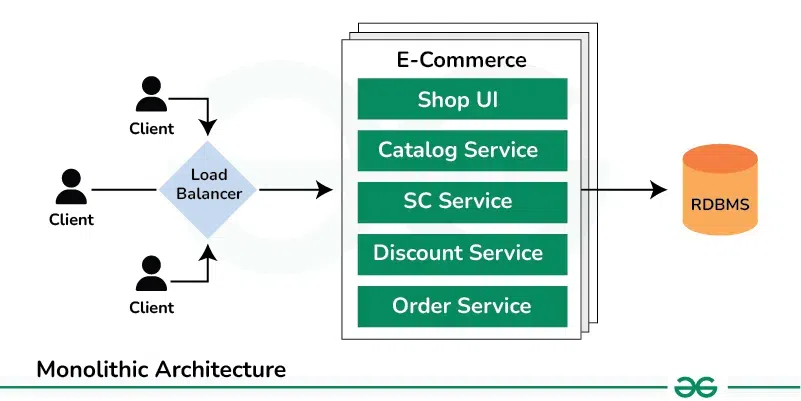
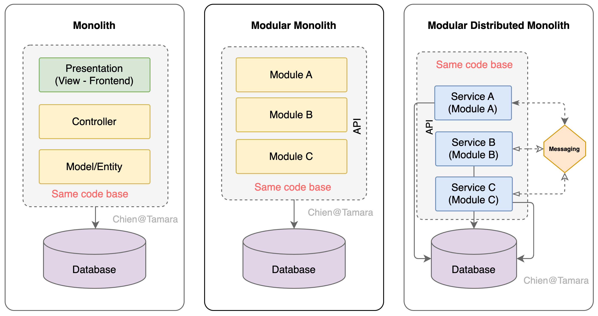
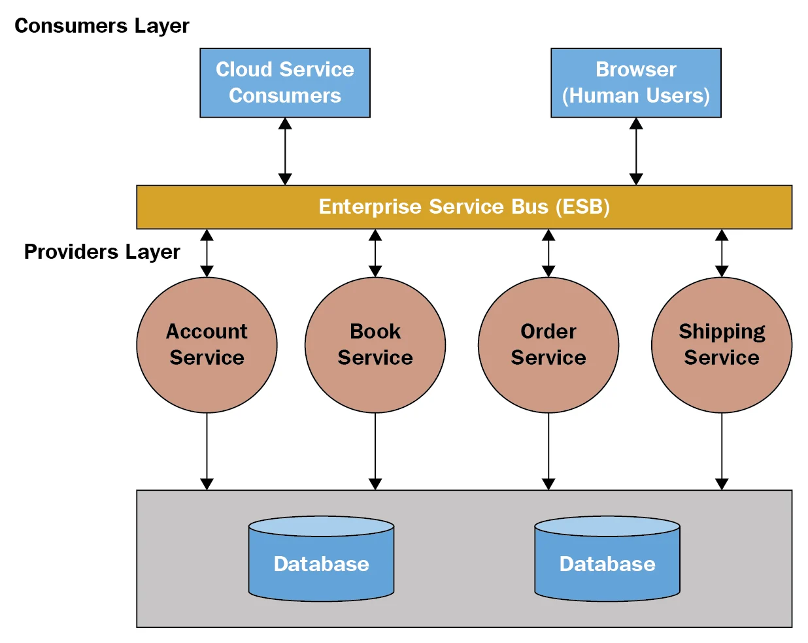
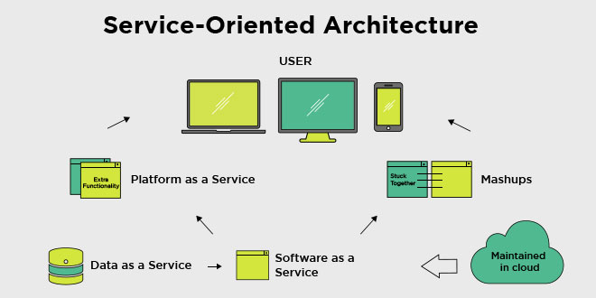
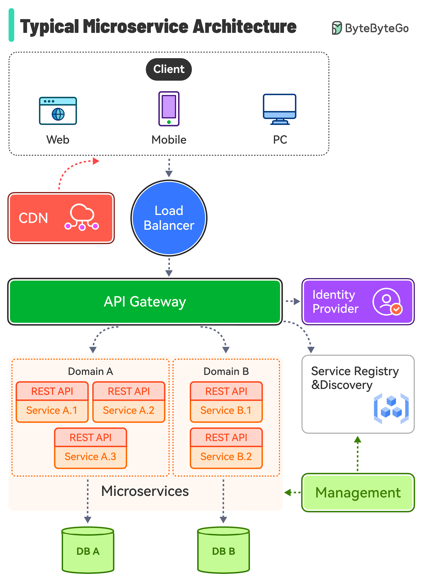
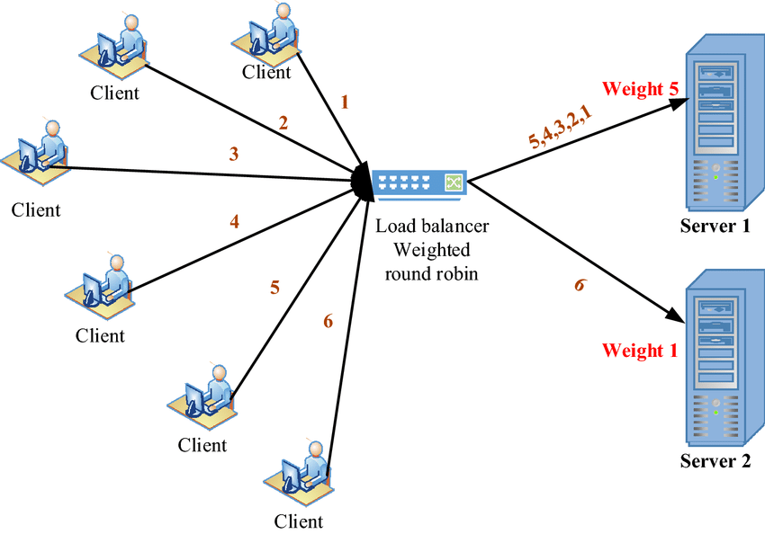
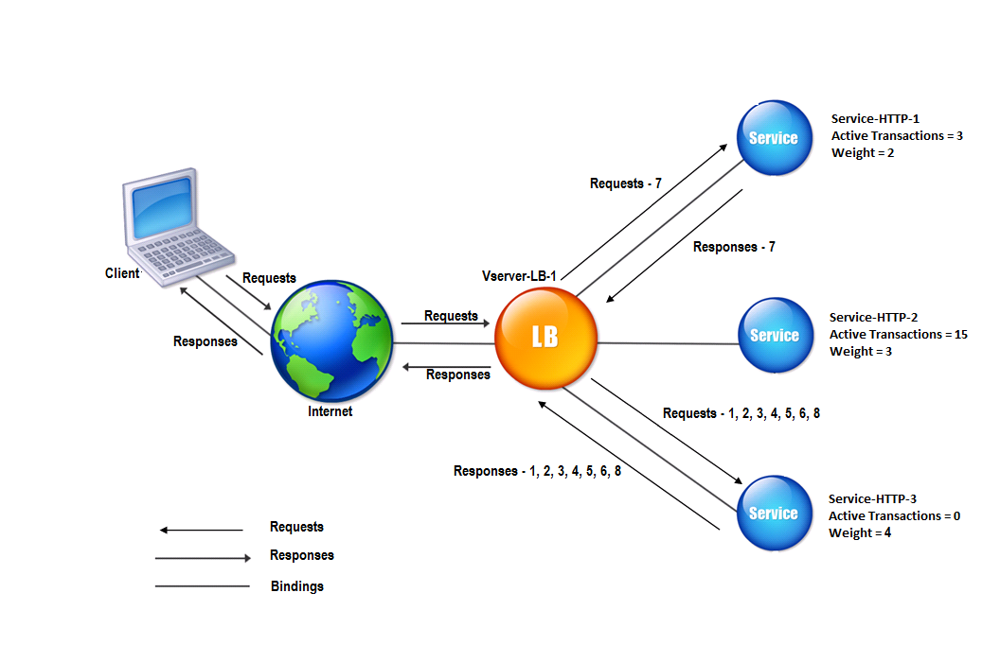
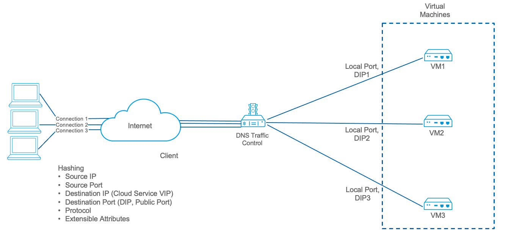

# 1. Explain monolithic architecture, service oriented architecture and Micro service architecture.
## **A. Monolithic Architecture**





### **Definition**

A **monolithic architecture** is a single, unified application where all components — UI, business logic, and database access — are packaged and deployed together as **one executable / WAR / JAR**.

### **Characteristics**

-   One codebase, one deployment.
    
-   All modules are tightly coupled.
    
-   A change in one part typically requires **rebuilding and redeploying the entire application**.
    

### **Advantages**

-   **Simple development** for small applications.
    
-   **Easy to test** — everything runs in one process.
    
-   **Straightforward deployment** — only one artifact is deployed.
    
-   **Good performance** due to local function calls (no network latency).
    

### **Disadvantages**

-   **Scalability limitations** — must scale the entire application even if only one module needs more resources.
    
-   **Low flexibility** — technology stack is fixed; difficult to rewrite only a small part.
    
-   **Slow deployments** — whole system must be redeployed.
    
-   **Hard to maintain in large teams** — coupling grows and codebase becomes complex.
    
-   **Partial failures affect the whole system** — one module crashing may bring down entire app.
    

---

## **B. Service-Oriented Architecture (SOA)**





### **Definition**

SOA organizes software into **larger, reusable services** that communicate through an **Enterprise Service Bus (ESB)** or messaging middleware.

These services are typically **business-level services** like "User Management", "Payment Service", "Notification Service".

### **Characteristics**

-   Services can be reused across multiple enterprise systems.
    
-   ESB acts as the central communication backbone.
    
-   SOA focuses on **enterprise-wide integration**, not just a single application's structure.
    

### **Advantages**

-   **Reusability** — shared enterprise services reduce redundant implementations.
    
-   **Interoperability** — often supports SOAP, XML, WSDL across different platforms.
    
-   **Scalability & modularity** better than monolithic systems.
    

### **Disadvantages**

-   **ESB is a single point of failure** (bottleneck).
    
-   SOA services tend to grow large → still not fully independent.
    
-   Heavy standards (SOAP, WS-Security) make SOA **complex**.
    
-   Slower communication due to enterprise middleware.
    

---

## **C. Microservice Architecture**




### **Definition**

Microservice architecture breaks an application into **small, autonomous, independently deployable services**, each owning **one business capability** (e.g., User Service, Catalog Service, Order Service).

### **Characteristics**

-   Each service has its **own database** (database per service pattern).
    
-   Communicate via **lightweight protocols** (REST, gRPC, messaging).
    
-   Independently deployable by different teams.
    
-   Decentralized governance & DevOps culture.
    

### **Advantages**

-   **Independent deployment** — faster releases.
    
-   **Independent scaling** — scale only the services that need more resources.
    
-   **Fault isolation** — failure in one microservice does not bring down whole system.
    
-   **Polyglot freedom** — each service may use its own language and technology.
    

### **Disadvantages**

-   **Operational complexity** — requires DevOps, CI/CD, observability, logging.
    
-   **Distributed system challenges** — latency, retries, network failures.
    
-   **Data consistency is harder** — no shared database.
    
-   Requires **API Gateway**, **Service Discovery**, **Load Balancer**, **Config Server**, etc.
    

---

# 🔍 Comparison Summary Table

| Feature | Monolithic | SOA | Microservices |
| --- | --- | --- | --- |
| Deployment | One unit | Multiple services but often coupled through ESB | Fully independent services |
| Database | One shared DB | Often shared in enterprise | One DB per service |
| Coupling | Very high | Medium (ESB) | Low (loose coupling) |
| Scalability | Scale entire app | Scale services but ESB bottleneck | Fine-grained independent scaling |
| Technology Stack | Single stack | Mixed but heavy standards | Polyglot freedom |
| Architecture Focus | One application | Enterprise-wide integration | Application decomposed into small independent services |
| Ideal Use Case | Small/medium apps | Large enterprises | Large scalable distributed systems |

---

# 🧠 In Short

-   **Monolithic** → One giant application, simple but hard to scale/maintain for large systems.
    
-   **SOA** → Enterprise-level reusable services connected via ESB, but still heavy and centralized.
    
-   **Microservices** → Small independent services with decentralized data, high scalability, but operationally complex.

# 2. Document the microservice architeture and core components

## 2.1 Overall Microservice Architecture
In our microservice architecture, the application is decomposed into multiple small, independent services such as User Service, Catalog Service, and Order Service. Each service is a separate Spring Boot application, owns its own database, and exposes REST APIs. All external clients communicate through an API Gateway, which handles routing, authentication, rate limiting, and cross-cutting concerns.
在我们的微服务架构中，应用被分解为多个小型独立服务，如用户服务、目录服务和订单服务。每个服务都是一个独立的 Spring Boot 应用，拥有自己的数据库，并暴露 REST API。所有外部客户端通过 API 网关进行通信，该网关处理路由、认证、速率限制和横切关注点。

Services register themselves with a Service Registry (Eureka), and other services use service discovery and client-side load balancing to call them without hard-coded URLs. Configuration is centralized using Spring Cloud Config Server, while fault tolerance is provided via circuit breakers and resilience patterns (Hystrix/Resilience4j). Centralized logging, distributed tracing, and monitoring (Sleuth, Zipkin, Actuator, etc.) provide visibility into the system. The services are typically containerized (e.g., Docker) and orchestrated using a platform such as Kubernetes for scaling and high availability.
服务在服务注册中心（Eureka）中注册自己，其他服务通过服务发现和客户端负载均衡来调用它们，而无需硬编码 URL。配置通过 Spring Cloud Config Server 进行集中管理，而容错性则通过断路器和高可用性模式（Hystrix/Resilience4j）提供。集中式日志记录、分布式跟踪和监控（Sleuth、Zipkin、Actuator 等）为系统提供了可见性。服务通常被容器化（例如 Docker），并使用 Kubernetes 等平台进行编排，以实现扩展和高可用性。


---

## 2.2 Core Components in a Spring Cloud Microservice System:

### 1\. API Gateway

`spring-cloud-gateway` (or older `zuul`).

### 2\. Service Registry & Discovery

-   **Eureka Server** – runs as a separate Spring Boot app.
    
-   **Eureka Clients** – each microservice registers with Eureka.

### 3\. Configuration Server (Centralized Configuration)3\. 配置服务器（集中式配置）

-   **Spring Cloud Config Server** (+ Config Client in each service).
        


### 4\. Client-Side Load Balancing4\. 客户端负载均衡

-   When multiple instances of a service exist (e.g., 3 replicas of Order Service), we need to distribute requests.当存在多个服务实例（例如，Order Service 的 3 个副本）时，我们需要分发请求。
    
-   **Client-side load balancing**:客户端负载均衡：
    
    -   The client (or gateway) chooses which instance to send the request to.客户端（或网关）选择将请求发送到哪个实例。
        
    -   Uses **service registry data** (like Eureka) to know which instances are available.使用服务注册数据（如 Eureka）来知道哪些实例是可用的。
-   **Spring Cloud:**
    -   Previously **Ribbon**, now **Spring Cloud LoadBalancer**.之前是 Ribbon，现在是 Spring Cloud LoadBalancer。

### 5\. Resilience & Fault Tolerance5\. 弹性 & 容错

-   Common patterns:常见模式：
    
    -   **Circuit Breaker** – open the circuit if downstream service fails too often.断路器——如果下游服务频繁失败，则断开电路。
        
    -   **Retry** – automatically retry failed requests.重试——自动重试失败的请求。
        
    -   **Bulkhead** – isolate resources so one failure doesn’t cascade.舱壁隔离——资源，以防一个故障级联。
        
    -   **Rate Limiting** – avoid overloading services.速率限制——避免服务过载。
    
-   **Spring Cloud**:
    
    -   **Hystrix** (Netflix) – legacy circuit breaker.Hystrix（Netflix）——传统断路器。
        
    -   Now often **Resilience4j** with Spring Boot.现在经常使用 Resilience4j 与 Spring Boot。
        

(Problem 3 in your homework is specifically about these.)（你的作业中的第 3 个问题是专门关于这些的。）

### 6\. Distributed Tracing, Logging & Monitoring6\. 分布式追踪、日志记录与监控

-   In microservices, a single user request may flow across multiple services.在微服务中，单个用户请求可能会跨越多个服务。
    
-   Need tools to trace and debug:需要工具进行跟踪和调试：
    
    -   **Correlation IDs / Trace IDs** in logs.日志中的关联 ID/跟踪 ID。
        
    -   **Centralized log aggregation** (ELK Stack, etc.).集中式日志聚合（ELK 堆栈等）。
        
    -   **Distributed tracing** (Zipkin, Jaeger).分布式跟踪（Zipkin，Jaeger）。
        
    -   Metrics and health checks (Prometheus, Actuator).指标和健康检查（Prometheus，Actuator）。
    
-   **Spring Cloud**:
    
    -   **Spring Cloud Sleuth** for tracing + Zipkin integration.Spring Cloud Sleuth 用于追踪 + Zipkin 集成。
        
    -   **Spring Boot Actuator** for metrics, health endpoints.Spring Boot Actuator 用于指标，健康端点。


### 7\. Security7\. 安全

-   Centralized **authentication/authorization**, usually at the **API Gateway**.集中式认证/授权，通常在 API 网关进行。
    
-   Common approaches:常见方法：
    
    -   OAuth2 / OpenID Connect (e.g., Keycloak, Okta, Auth0).OAuth2 / OpenID Connect（例如，Keycloak，Okta，Auth0）。
        
    -   JWT tokens passed between gateway and services.JWT 令牌在网关和服务之间传递。
    
-   Microservices validate tokens or rely on gateway’s auth decisions.微服务验证令牌或依赖网关的认证决策。


### 8\. Messaging / Event Bus (Optional but Common)8\. 消息传递/事件总线（可选但常见）
**Synchronous: **
REST over HTTP using Feign clients or WebClient.
**Asynchronous:**
-   For loose coupling and eventual consistency:为了实现松散耦合和最终一致性：
    
    -   Services publish **events** when something happens (e.g., order created).当发生某事时（例如订单创建），服务会发布事件。
        
    -   Other services **subscribe** to those events.其他服务订阅这些事件。
    
-   Implemented via:实现方式：
    
    -   Kafka, RabbitMQ, ActiveMQ, etc.Kafka、RabbitMQ、ActiveMQ 等
    
-   Helps decouple services and avoid direct synchronous dependencies.有助于解耦服务并避免直接的同步依赖。


### 9\. Containerization & Orchestration (Deployment Layer)9\. 容器化与编排（部署层）

-   Microservices are often packaged as **Docker containers**.微服务通常被打包成 Docker 容器。
    
-   Deployed & managed using:使用部署与管理：
    
    -   **Kubernetes**, Docker Swarm, ECS, etc.Kubernetes、Docker Swarm、ECS 等。
    
-   Responsibilities:职责：
    
    -   Auto-scaling, self-healing, rolling updates.自动扩展、自我修复、滚动更新。
        
    -   Service networking (in addition to application-level discovery).服务网络（除应用层发现外）。
        


# 3. Explain Resilience patterns? Explain circuit breaker with Spring Cloud Hystrix code example.

### 3.1 What are Resilience Patterns?3.1 弹性模式是什么？

In a **distributed microservice system**, calls happen over the network, which is **unreliable**: services can be slow, down, or overloaded.在一个分布式微服务系统中，调用通过网络进行，而网络是不可靠的：服务可能会变慢、宕机或过载。  
**Resilience patterns** are design patterns that help the system remain **responsive and stable** even when some parts fail.弹性模式是设计模式，它们帮助系统在部分组件失效时仍然保持响应和稳定。

Common resilience patterns:常见的弹性模式：

1.  **Timeout超时**
    
    -   Do **not** wait forever for a remote call.不要永远等待远程调用。
        
    -   If a service doesn’t respond within X ms, **abort** the call.如果服务在 X 毫秒内没有响应，则中止调用。
        
    -   Prevents threads from being blocked indefinitely.防止线程无限期阻塞。
    
2.  **Retry重试**
    
    -   If a call fails (e.g., network glitch), **automatically try again** a limited number of times.如果调用失败（例如网络故障），会自动尝试有限次数。
        
    -   Often combined with **exponential backoff** (wait longer between retries).常与指数退避（重试之间等待更长时间）结合使用。
    
3.  **Circuit Breaker断路器**
    
    -   Monitors calls to a remote service.监控对远程服务的调用。
        
    -   If too many failures occur, the circuit **opens** and **short-circuits** further calls (fail fast) instead of continuously hitting the failing service.如果发生过多失败，电路将打开并短路进一步的调用（快速失败），而不是持续地击打故障服务。
        
    -   After some time, it moves to **half-open** to test if the service has recovered.一段时间后，它将切换到半开状态以测试服务是否已恢复。
    
4.  **Fallback降级**
    
    -   Provide an **alternative response** when a service fails.当服务失败时，提供另一种响应方式。
        
    -   Example: return cached data, default value, or a meaningful error message instead of crashing.示例：返回缓存数据、默认值或一个有意义的错误消息，而不是崩溃。
    
5.  **Bulkhead舱壁模式**
    
    -   Isolate resources (thread pools / connection pools) per function or service.按功能或服务隔离资源（线程池/连接池）。
        
    -   A failure in one part doesn’t consume all resources and bring down the whole system.一个部分的故障不会消耗所有资源并使整个系统崩溃。
    
6.  **Rate Limiting / Throttling速率限制 / 节流**
    
    -   Limit the number of requests in a period.限制一定时间内的请求次数。
        
    -   Protects services from being overloaded by too many client calls.防止服务因过多的客户端调用而被过载。
    
7.  **Load Shedding负载卸载**
    
    -   When under heavy load, the system **rejects some requests early** to keep overall system healthy.在重负载情况下，系统会提前拒绝部分请求以保持整体系统健康。
        

Together, these patterns keep microservices **responsive, stable, and prevent cascading failures**.这些模式共同作用，使微服务保持响应迅速、稳定，并防止级联故障。

---

### 3.2 Circuit Breaker Pattern – Concept3.2 断路器模式——概念

The **Circuit Breaker** is one of the most important resilience patterns in microservices.断路器是微服务中最重要的弹性模式之一。

States:状态：

-   **Closed关闭**
    
    -   All calls go through normally.所有调用正常进行。
        
    -   Failures are counted.失败计数。
    
-   **Open开启**
    
    -   The failure threshold is exceeded (e.g., 50% of last N requests failed).失败阈值被超过（例如，最后 N 次请求中有 50%失败）。
        
    -   **No calls are made to the remote service** – they fail fast immediately.没有调用远程服务——它们立即快速失败。
        
    -   Protects the failing service and saves resources.保护了故障服务并节省了资源。
    
-   **Half-Open半开**
    
    -   After a **sleep window** (cool-down time), a few test requests are allowed.在睡眠窗口（冷却时间）后，允许少量测试请求。
        
    -   If they succeed → the circuit **closes** again.如果它们成功 → 电路再次关闭。
        
    -   If they fail → the circuit goes back to **open**.如果它们失败 → 电路回到开放状态。
        

In Spring Cloud, **Hystrix** (Netflix library) was commonly used to implement Circuit Breaker (now replaced by Resilience4j in modern projects, but Hystrix is still widely used in examples and exams).在 Spring Cloud 中，Hystrix（Netflix 库）常用于实现断路器（在现代项目中已被 Resilience4j 取代，但 Hystrix 仍广泛用于示例和考试）。

---

### 3.3 Circuit Breaker Using Spring Cloud Hystrix — Code Example3.3 使用 Spring Cloud Hystrix 实现断路器——代码示例

#### 1) Add Hystrix and enable Circuit Breaker1) 添加 Hystrix 并启用断路器

**Main Application class:主应用程序类：**

```java
import org.springframework.boot.SpringApplication;
import org.springframework.boot.autoconfigure.SpringBootApplication;
import org.springframework.cloud.client.circuitbreaker.EnableCircuitBreaker;

@SpringBootApplication
@EnableCircuitBreaker   // Enables Hystrix circuit breaker
public class OrderServiceApplication {

    public static void main(String[] args) {
        SpringApplication.run(OrderServiceApplication.class, args);
    }
}
```

---

#### 2) Service class with `@HystrixCommand`2) 服务类带有 `@HystrixCommand`

Suppose **Order Service** calls **Product/Catalog Service** to get product details.假设订单服务调用产品/目录服务获取产品详情。

```java
import com.netflix.hystrix.contrib.javanica.annotation.HystrixCommand;
import com.netflix.hystrix.contrib.javanica.annotation.HystrixProperty;
import org.springframework.stereotype.Service;
import org.springframework.web.client.RestTemplate;

import java.util.Collections;
import java.util.List;

@Service
public class CatalogClientService {

    private final RestTemplate restTemplate;

    public CatalogClientService(RestTemplate restTemplate) {
        this.restTemplate = restTemplate;
    }

    @HystrixCommand(
        fallbackMethod = "getProductsFallback",
        commandProperties = {
            @HystrixProperty(
                name = "execution.isolation.thread.timeoutInMilliseconds",
                value = "2000" // timeout for remote call
            ),
            @HystrixProperty(
                name = "circuitBreaker.requestVolumeThreshold",
                value = "5"    // minimum number of requests to calculate error %
            ),
            @HystrixProperty(
                name = "circuitBreaker.errorThresholdPercentage",
                value = "50"   // if 50% of last 5 requests failed, open circuit
            ),
            @HystrixProperty(
                name = "circuitBreaker.sleepWindowInMilliseconds",
                value = "5000" // after 5s, go half-open and test the service
            )
        }
    )
    public List<Product> getProducts() {
        // Remote call to another microservice
        String url = "http://catalog-service/api/products";
        Product[] response = restTemplate.getForObject(url, Product[].class);
        return List.of(response);
    }

    // Fallback method must have same signature as main method
    public List<Product> getProductsFallback() {
        // Return default or cached data when circuit is open or call fails
        return Collections.emptyList(); // or some pre-defined list
    }
}
```

**Explanation:解释：**

-   `@HystrixCommand` wraps `getProducts()` with a circuit breaker. `@HystrixCommand` 使用断路器包装 `getProducts()` 。
    
-   If the remote call is slow (> 2000 ms) or fails often:如果远程调用缓慢（>2000 毫秒）或经常失败：
    
    -   Hystrix **opens the circuit** and stops calling `catalog-service`.Hystrix 打开断路器并停止调用 `catalog-service` 。
        
    -   Instead, it **immediately invokes** `getProductsFallback()`.相反，它立即调用 `getProductsFallback()` 。
    
-   After the `sleepWindowInMilliseconds` passes (5 seconds here), Hystrix:在 `sleepWindowInMilliseconds` 通过后（这里为 5 秒），Hystrix：
    
    -   Moves to **half-open** and tries a few real calls again.切换到半开状态并再次尝试几次真实调用。
        
    -   If they succeed → circuit closes.如果它们成功 → 电路关闭。
        
    -   If they fail → circuit opens again.如果它们失败 → 电路再次断开。
        

---

#### 3) RestTemplate Bean (often needed in config)3) RestTemplate Bean（通常需要在配置中使用）

```java
import org.springframework.context.annotation.Bean;
import org.springframework.context.annotation.Configuration;
import org.springframework.web.client.RestTemplate;

@Configuration
public class AppConfig {

    @Bean
    public RestTemplate restTemplate() {
        return new RestTemplate();
    }
}
```

---

### 3.4 How This Improves Resilience3.4 这如何提高弹性

-   If **Catalog Service** is down or very slow:如果目录服务宕机或非常缓慢：
    
    -   Without Circuit Breaker: Order Service threads block, time out, and may crash under load.没有断路器：订单服务线程会阻塞、超时，并在负载下可能崩溃。
        
    -   With Circuit Breaker:带熔断器：
        
        -   After repeated failures, circuit opens.经过多次失败，电路断开。
            
        -   Order Service **fails fast** and returns fallback responses.订单服务快速失败并返回降级响应。
            
        -   System remains responsive and other features continue to work.系统保持响应状态，其他功能继续正常运行。
            

In summary:总而言之：

-   **Resilience patterns** (timeouts, retries, circuit breaker, bulkhead, fallback, etc.) keep a microservice system **stable under failure**.弹性模式（如超时、重试、断路器、舱壁、降级等）使微服务系统在故障情况下保持稳定。
    
-   **Circuit Breaker with Hystrix** is a key pattern: it prevents continuous calls to a failing service, provides **fallback behavior**, and allows the system to **recover gracefully**.使用 Hystrix 的断路器模式是一个关键模式：它防止对故障服务进行连续调用，提供降级行为，并允许系统优雅地恢复。

# 4. Explain load balancing algorithms.
**Load balancing** distributes incoming requests across multiple instances of a service to achieve:负载均衡将传入请求分配到服务的多个实例上，以实现：

-   High availability高可用性
    
-   Better performance更好的性能
    
-   Efficient resource utilization高效的资源利用
    
-   Fault tolerance容错性
    

In microservices, load balancing can occur:在微服务中，可以发生负载均衡：

1.  **Client-side load balancing**  
    (Spring Cloud LoadBalancer, Ribbon—deprecated but still used in exams)（Spring Cloud LoadBalancer, Ribbon—已弃用但考试中仍会使用）
    
2.  **Server-side load balancing**  
    (NGINX, HAProxy)（NGINX, HAProxy）
    
3.  **Gateway-level load balancing**  
    (Spring Cloud Gateway, Envoy, API Gateway)（Spring Cloud Gateway、Envoy、API 网关）

Below are the **most important load balancing algorithms**, especially those used in Spring Cloud and service discovery systems like Eureka.以下是最重要的负载均衡算法，尤其是在 Spring Cloud 和服务发现系统（如 Eureka）中使用。

---

# ✅ **1\. Round Robin**

.webp)


### **How it works如何工作**

Requests are distributed **in sequential order** among service instances:请求按顺序分配到服务实例中：

```css
Request 1 → Instance A  
Request 2 → Instance B  
Request 3 → Instance C  
Request 4 → Instance A  
...
```

### **Pros优点**

-   Simple and widely used.简单且广泛使用。
    
-   Works well when instances have **similar capacity**.当实例具有相似容量时效果良好。
    

### **Cons一致**

-   Not optimal if nodes have different workloads or performance levels.如果节点具有不同的工作负载或性能水平，则不是最优的。
    

### **Where used使用场景**

-   Spring Cloud LoadBalancer default strategy.Spring Cloud LoadBalancer 默认策略。
    
-   API Gateways.API 网关。
    
-   Kubernetes Services.Kubernetes 服务。
    

---

# ✅ **2\. Weighted Round Robin**




### **How it works如何工作**

Each instance is assigned a **weight**, representing its capacity.每个实例被分配一个权重，代表其容量。

Example weights:示例权重：

-   A: 5
    
-   B: 3
    
-   C: 1
    

Distribution:分布：

```css
A receives 5 requests per cycle  
B receives 3  
C receives 1
```

### **Pros优点**

-   Good when servers have **different CPU/memory capabilities**.当服务器具有不同的 CPU/内存能力时表现良好。
    

### **Cons一致**

-   Requires configuring and tuning weights manually.需要手动配置和调整权重。
    

### **Where used使用场景**

-   NGINX, HAProxy.NGINX、HAProxy。
    
-   Some API Gateways.一些 API 网关。
    

---

# ✅ **3\. Random (Simple Random Selection)**


### **How it works如何工作**

Each request is sent to a **random instance**.每个请求都会发送到一个随机实例。

### **Pros优点**

-   Very easy to implement.实现非常容易。
    
-   Works well with a large number of instances.能很好地处理大量实例。
    

### **Cons一致**

-   Possible uneven distribution due to randomness.可能因随机性导致分布不均。
    

### **Where used使用场景**

-   Ribbon (old Spring Cloud)Ribbon（旧版 Spring Cloud）
    
-   Some HTTP proxies and gateways.某些 HTTP 代理和网关。
    

---

# ✅ **4\. Least Connections**




### **How it works如何工作**

Send the request to the instance with the **fewest active connections**.将请求发送到活跃连接最少的实例。

### **Pros优点**

-   Works extremely well with **long-running requests** such as:非常适合长时间运行的请求，例如：
    
    -   File downloads文件下载
        
    -   Streaming流式传输
        
    -   Database-heavy operations数据库密集型操作
        

### **Cons一致**

-   Requires real-time tracking of active connections.需要实时跟踪活动连接。
    

### **Where used使用场景**

-   NGINX
    
-   HAProxy
    
-   Cloud load balancers (AWS ALB, GCP LB)云负载均衡器（AWS ALB, GCP LB）
    

---

# ✅ **5\. Weighted Least Connections**

Same as Least Connections but each server has a **weight**.与最少连接相同，但每台服务器都有权重。

### **Example示例**

-   Slow machine: weight = 1慢速机器：权重 = 1
    
-   Fast machine: weight = 5快速机器：权重 = 5
    

Requests go proportionally to higher-capacity servers.请求按更高容量的服务器成比例分配。

### **Pros优点**

-   Best for heterogeneous clusters.最适合异构集群。
    

---

# ✅ **6\. IP Hash (Consistent Hashing)**




### **How it works如何工作**

Load balancer computes a hash based on client’s IP:负载均衡器根据客户端 IP 计算哈希值：

```scss
hash(client_ip) → specific server
```

This ensures:这确保了：

-   The **same client** always reaches the **same server**, unless the server goes down.同一个客户端总是连接到同一个服务器，除非服务器宕机。
    

### **Pros优点**

-   Useful for **session persistence** (sticky sessions).适用于会话持久化（粘性会话）。
    
-   Good for caching workloads.适合缓存工作负载。
    

### **Cons一致**

-   Not evenly distributed if clients are not evenly distributed.如果客户端分布不均，负载也不会均匀分布。
    

### **Where used使用场景**

-   NGINX `ip_hash` directive.NGINX `ip_hash` 指令。
    
-   Some CDN providers.一些 CDN 提供商。
    

---

# ✅ **7\. Consistent Hashing (Advanced Version of IP Hash)**

Used in distributed systems like:用于分布式系统，如：

-   Cassandra
    
-   Redis Cluster
    
-   Envoy ProxyEnvoy 代理
    

### **Pros优点**

-   When a node is added or removed, **minimal remapping** occurs.当节点被添加或移除时，重映射操作最小。
    
-   Highly stable distribution.高度稳定的分布。
    

### **Cons一致**

-   More complex implementation.更复杂的实现。
    

---

# ✅ **8\. Least Response Time**

### **How it works如何工作**

Choose instance with:选择具有：

-   **Lowest average response time**, AND最低平均响应时间，并且
    
-   **Fewest active connections最少活动连接**
    

### **Pros优点**

-   Sends traffic to the **fastest** and **least busy** servers.将流量发送到最快且最不繁忙的服务器。
    

### **Cons一致**

-   Requires collecting real-time metrics.需要收集实时指标。
    

### **Where used使用场景**

-   AWS ALB
    
-   Commercial load balancers商业负载均衡器
    

---

# ✅ **9\. (Microservices-specific) Locality-Aware Load Balancing**

Modern service meshes (Istio, Linkerd, Envoy) use:现代服务网格（Istio、Linkerd、Envoy）使用：

-   Latency-based routing基于延迟的路由
    
-   Region-aware routing基于区域的路由
    
-   Zone-aware routing基于区域的路由
    

Example:示例：

> If a client is in us-west-1, route it to services in us-west-1 first.如果一个客户端位于 us-west-1，首先将其路由到 us-west-1 的服务。

---

# 📌 Summary Table (Use in Homework/Exam)

| Algorithm算法 | How It Works工作原理 | Strength优势 | Weakness劣势 |
| --- | --- | --- | --- |
| Round Robin轮询 | Sequential assignment顺序分配 | Simple简单 | Doesn’t consider server load不考虑服务器负载 |
| Weighted Round Robin加权轮询 | Based on server capacity基于服务器容量 | Good for unequal servers适合不均等服务器 | Manual weight setup手动权重设置 |
| Random随机 | Random instance随机实例 | Simple简单 | Uneven distribution不均匀分布 |
| Least Connections最少连接 | Fewest active connections最少活动连接 | Best for long requests最适合长请求 | Needs live stats需要实时统计 |
| Weighted Least Connections加权最少连接 | Least conn. + weight最小连接+权重 | Good for heterogeneous servers适合异构服务器 | Complex复杂 |
| IP HashIP 哈希 | Based on client IP基于客户端 IP | Sticky sessions粘性会话 | Uneven distribution不均匀分布 |
| Consistent Hashing一致性哈希 | Hash ring哈希环 | Minimal rebalancing最小化再平衡 | Complex复杂 |
| Least Response Time最短响应时间 | Lowest latency server最低延迟服务器 | Best performance最佳性能 | Requires metrics需要指标 |
| Locality Aware位置感知 | Route to nearest zone路由到最近区域 | Faster responses更快的响应 | Requires mesh support需要网格支持 |

---

# 📌 Microservices Context Hint (What Examiner Expects)

In Spring Cloud:在 Spring Cloud 中：

-   **Old method (Ribbon)** supported:旧方法（Ribbon）支持：
    
    -   Round Robin (default)轮询（默认）
        
    -   Random随机
    
-   **New method (Spring Cloud LoadBalancer)** also defaults to **Round Robin**, but plug-in strategies can be added.新方法（Spring Cloud LoadBalancer）也默认为轮询，但可以添加插件策略。

# 5. Explain API Gateway.

API Gateway is the single entry point for all clients. It performs routing, load balancing, authentication/authorization, rate limiting, logging, and request transformations. It hides internal microservices and centralizes cross-cutting concerns, making the system more secure, scalable, and maintainable.

# 6. Explain service discovery and service registry
## Service Registry
A **Service Registry** is a central directory that maintains the real-time list of all microservice instances and their network locations (IP, port, health status).

In Spring Cloud: **Eureka Server** is the most common Service Registry.
**Responsibilities:**
- Store service instance information
- Track health of each instance
- Allow clients/Gateway to discover services dynamically

## Service Discovery
Service Discovery is the mechanism by which microservices and API Gateway find other services without hardcoding IP addresses or ports.
Instead of:

```arduino
http://localhost:8081
```

You call:

```cpp
lb://USER-SERVICE
```

and a load balancer (Gateway or microservice) picks a healthy instance.

**Why Service Discovery is Important**

### **1\. Microservices are dynamic**

Instances may:

-   Scale up/down
    
-   Move to different hosts
    
-   Restart and change ports
    
-   Crash and restart automatically via Kubernetes
    

### **2\. Hardcoding IP addresses is impossible**

Service Discovery solves this by giving each service a **logical name**:

```sql
USER-SERVICE
CATALOG-SERVICE
ORDER-SERVICE
```

and mapping it to actual runtime instances:

```sql
USER-SERVICE → 10.0.1.23:8081, 10.0.1.24:8081
```

# 7. List Spring Cloud Modules that serve as Microservice components (e.g. Euerka for Service Discovery)

| Function                         | Spring Cloud Module                                     |
| -------------------------------- | ------------------------------------------------------- |
| **Gateway / Routing**            | Spring Cloud Gateway, Zuul(legacy)                      |
| **Service Discovery**            | Netflix Eureka, Spring Cloud Kubernetes, Zookeeper      |
| **Load Balancing**               | Spring Cloud LoadBalancer, Ribbon (legacy)              |
| **Configuration**                | Spring Cloud Config (Server + Client), Spring Cloud Bus |
| **Resilience / Fault Tolerance** | Resilience4j,Hystrix (legacy)                           |
| **Declarative HTTP Client**      | OpenFeign                                               |
| **Mesaging (synchronous)**		 | REST over HTTP using Feign clients or WebClient.		|
| **Messaging / Event-driven**     | Spring Cloud Stream, Kafka, RabbitMQ, ActiveMQ  |
| **Distributed Tracing**          | Spring Cloud Sleuth + Zipkin,Spring Boot Actuator       |
| **Security**                     | Spring Cloud Security                                   |
| **Kubernetes Integration**       | Spring Cloud Kubernetes                                 |

# 8. Walk through https://microservices.io/patterns/index.html