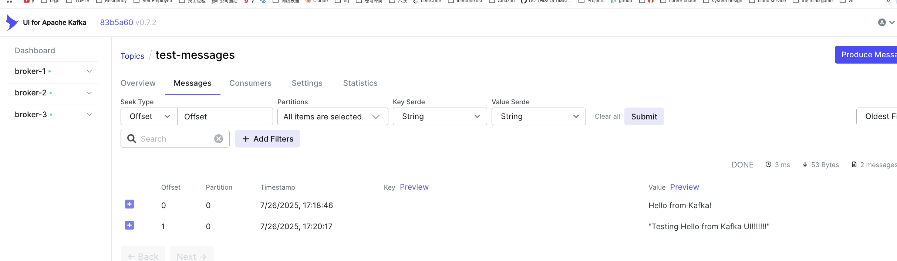
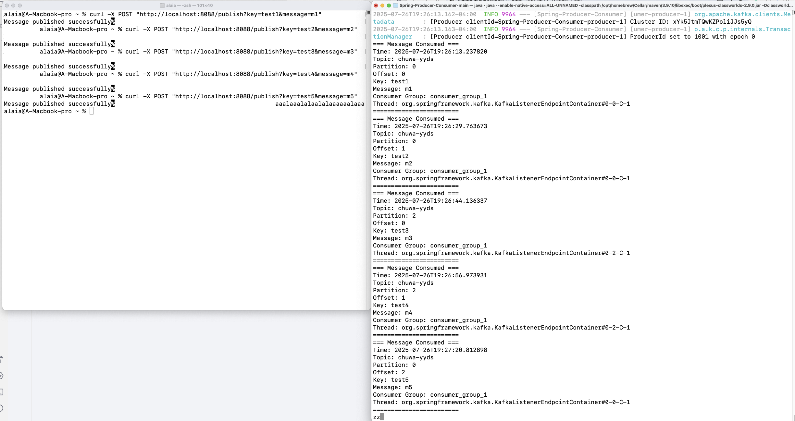
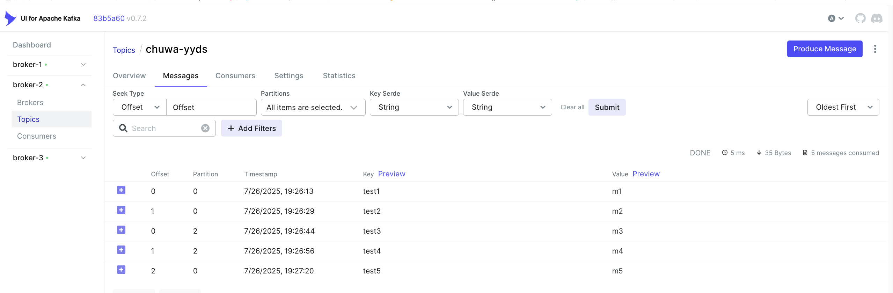
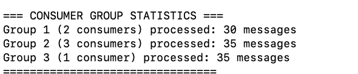
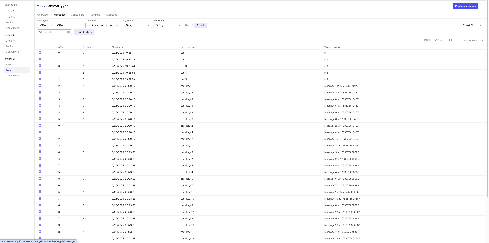

### HW16 Kafka


#### Q0: Explain following concepts, and how they coordinate with each other:  
Topic Partition Broker Consumer group Producer Offset Zookeeper  
##### A:  
Topic is the logical categorization of messages: producers write messages to a specified topic, while consumers subscribe to and read messages from that topic. Each topic can be divided into multiple partitions; a partition guarantees strict ordering of messages within itself and serves as the basic unit for parallel processing and storage.

A Kafka cluster consists of multiple brokers, each of which hosts several partitions, handles writes from producers and reads from consumers, and replicates data across the cluster.

A producer is a client application responsible for publishing messages to a topic; when sending, it selects a target partition based on the message key or a round‑robin algorithm. A consumer group is a set of consumer instances that jointly consume the same topic—each partition is assigned to exactly one consumer within the group, enabling load‑balanced parallel consumption. Consumers track their progress by recording offsets (the sequential IDs within a partition) and, upon restart, resume from the last committed offset.

Zookeeper (in earlier versions of Kafka) stores cluster metadata—broker lists, topic configurations, and partition leadership information—and handles partition leader election. Producers and consumers retrieve the cluster topology and metadata from Zookeeper at startup; brokers also use Zookeeper to coordinate data replication and failover. Through the collaboration of these components, Kafka provides a highly available, high‑throughput, and scalable distributed messaging system.

#### 1. Given N (number of partitions) and M (number of consumers,) what will happen when N>=M and N<M respectively?  
###### Partition Assignment Strategy — Assigning Partitions to a Consumer Group  
Example 1: N ≥ M (Partitions ≥ Consumers)
Suppose a topic has 5 partitions (p0–p4) and the consumer group has 3 instances (c1, c2, c3):

Partition list: p0, p1, p2, p3, p4

Consumer instances: c1, c2, c3

Assignment result (using a RoundRobin algorithm):

c1 → p0, p3

c2 → p1, p4

c3 → p2

Each instance is guaranteed at least ⌊5/3⌋ = 1 partition, and the remaining 2 partitions are assigned round‑robin to the first two instances, so some consumers handle multiple partitions.

Example 2: N = M (Partitions = Consumers)
Suppose a topic has 4 partitions (p0–p3) and the consumer group also has 4 instances (c1–c4):

Assignment result (using a Range algorithm):

c1 → p0

c2 → p1

c3 → p2

c4 → p3

Here each consumer instance is assigned exactly one partition.

Example 3: N < M (Partitions < Consumers)
Suppose a topic has only 3 partitions (p0–p2) and the consumer group has 5 instances (c1–c5):

Assignment result:

c1 → p0

c2 → p1

c3 → p2

c4 → — (no partition)

c5 → — (no partition)

When there are fewer partitions than consumers, each partition still goes to one instance; the extra consumers remain idle and consume nothing.

Key Takeaways

N ≥ M: Consumers may handle multiple partitions.

N = M: One‑to‑one mapping between consumers and partitions.

N < M: Extra consumer instances remain idle.

#### 2. Explain how brokers work with topics?  
A Kafka broker is a server process that hosts one or more topics, each of which is subdivided into partitions.  
For each partition, the broker:    
Appends incoming records to the end of an immutable log, assigning each message a unique offset.    
Serves read requests from consumers by fetching records at specified offsets.   
Replicates partition data to follower brokers when operating in a replicated setup, ensuring fault tolerance.    
Coordinates with ZooKeeper (or Kafka’s built‑in quorum) to elect partition leaders and manage cluster metadata.  


#### 3. Are messages pushed to consumers or consumers pull messages from topics?  
In message queue systems, both push and pull models exist, and the choice depends on the specific messaging system and configuration:  
Pull Model (Consumer Pull)    
Consumers actively request messages from topics/queues  
Common in systems like Apache Kafka, Amazon SQS, RabbitMQ (with basic.get)  
Consumers control the rate of message consumption  
Better for handling varying consumer processing speeds  
Consumers can implement backpressure naturally  
Examples: Kafka consumers poll for messages, SQS consumers call ReceiveMessage  

Push Model (Broker Push)    
The message broker actively delivers messages to consumers  
Common in systems like RabbitMQ (with basic.consume), Google Pub/Sub, Apache Pulsar  
Broker controls message delivery timing  
Can achieve lower latency since messages are delivered immediately  
Requires flow control mechanisms to prevent overwhelming consumers  
Examples: RabbitMQ pushes messages to subscribed consumers  

The pull model tends to be more scalable and gives consumers better control over their processing capacity,  
while the push model can offer lower latency but requires more sophisticated flow control mechanisms.  
The choice often depends on the specific use case requirements around latency, throughput, and consumer processing patterns.


#### 4. How to avoid duplicate consumption of messages?  
To avoid duplicate message consumption, combine multiple strategies: design the message processing to be idempotent so operations can be safely repeated, use exactly-once delivery guarantees where available (like Kafka's transactional semantics), implement message deduplication by tracking unique message IDs or content hashes in a database, manage consumer offsets carefully by committing only after successful processing, and use database transactions to atomically process messages and update tracking tables. The most robust approach layers these techniques together - for example, using natural business keys for idempotent operations while also tracking processed message IDs and managing offsets transactionally with your application data.


#### 5. What will happen if some consumers are down in a consumer group? Will data loss occur? Why?  
When consumers in a consumer group go down, the following process occurs:  

1. No data loss occurs because messages are stored persistently in the message broker independent of consumer state.  
2. The remaining active consumers automatically take over the failed consumers' partitions through rebalancing, though this causes processing delays and potential backlogs due to reduced processing capacity.  
3. Messages wait in their partitions until consumers are available to process them.  
4. When failed consumers restart, another rebalancing redistributes the workload.  
5. The main risks are duplicate processing (since uncommitted messages from failed consumers get reprocessed) and temporary throughput reduction, but the persistent storage in the broker and offset-based tracking ensure no messages are lost - they simply queue up waiting for available consumers to process them.  


#### 6. What will happen if an entire consumer group is down? Will data loss occur? Why?  
When an entire consumer group goes down, the following process occurs:

1. No data loss occurs because messages remain persistently stored in the message broker's topics/queues, independent of any consumer group's availability.  
2. Messages continue to accumulate in the assigned partitions/queues, building up a backlog while waiting for consumers to return.  
3. No automatic reassignment happens since there are no active consumers in the group to trigger rebalancing - the partitions remain assigned to the offline group.  
4. Message retention policies still apply, meaning very old messages may eventually be deleted based on time or size limits configured on the broker, not due to the consumer group failure.  
5. When the consumer group comes back online, consumers resume processing from their last committed offsets, working through the accumulated message backlog.    
6. Other consumer groups remain unaffected - if multiple consumer groups subscribe to the same topic, other groups continue processing independently.  


#### 7. Explain consumer lag and how to resolve it?    
1. Consumer lag is the difference between the latest message offset in a partition and the consumer's current committed offset, indicating how far behind the consumer is in processing messages.  
2. Scale up consumer instances by adding more consumers to the consumer group, allowing parallel processing across more partitions to increase overall throughput.  
3. Optimize consumer processing logic by reducing per-message processing time through code optimization, caching, database connection pooling, or moving heavy operations to asynchronous processes.  
4. Increase consumer fetch size and batch processing to reduce the overhead of individual message fetches and process multiple messages together when possible.  
5. Tune consumer configuration parameters such as fetch.min.bytes, fetch.max.wait.ms, and max.poll.records to optimize the balance between latency and throughput.  
6. Monitor partition distribution to ensure consumers are evenly distributed across partitions and no single consumer is overloaded with too many partitions.  
7. Consider increasing partition count for the topic to allow for more parallel processing, though this requires careful planning as it affects all consumer groups.  
8. Implement circuit breakers and retry policies to handle downstream service failures that might slow down consumer processing and contribute to lag buildup.  


#### 8. Explain how Kafka tracks message delivery?  


1. Producer acknowledgments (acks) determine when a message is considered successfully delivered, with options like acks=0 (no acknowledgment), acks=1 (leader acknowledgment), or acks=all (all in-sync replicas acknowledgment).  
2. Offset tracking assigns a unique sequential number to each message within a partition, allowing precise identification and ordering of messages in the log.     
3. Consumer offsets are stored in the special __consumer_offsets topic, tracking each consumer group's progress through partitions by recording the last successfully processed message offset.   
4. Commit strategies allow consumers to control when offsets are committed - either automatically at intervals, manually after processing, or transactionally with other operations.   
5. In-sync replica (ISR) tracking ensures message durability by maintaining a list of replicas that are caught up with the leader, and messages are only considered committed when written to all ISR members.   
6. High water mark indicates the highest offset that has been successfully replicated to all in-sync replicas, ensuring consumers only read fully committed messages.     
7. Log segment files on disk store the actual message data with their offsets, providing persistent storage that survives broker restarts.   
8. Replication logs track the replication progress between leader and follower replicas, ensuring data consistency across the cluster.  


#### 9. Compare Kafka vs RabbitMQ, compare messageing frameworks vs MySql (Why Kafka)?


| **Aspect** | **Kafka** | **RabbitMQ** | **MySQL** |
|------------|-----------|--------------|-----------|
| **Architecture** | Distributed log-based system with topics and partitions | Traditional message broker with queues and exchanges | Relational database with tables and ACID transactions |
| **Message Persistence** | All messages stored on disk by default with configurable retention | Messages typically in memory, optional disk persistence | Persistent structured data storage with indexes |
| **Throughput** | Millions of messages per second through sequential writes | Moderate throughput with focus on low latency | High read/write performance for structured queries |
| **Consumer Model** | Pull-based consumption with consumer groups | Both push and pull models with flexible routing | Direct query-response pattern |
| **Message Ordering** | Guaranteed ordering within partitions | Ordering within queues, complex setup for global ordering | No inherent message ordering concept |
| **Scalability** | Horizontal scaling through partition distribution | Clustering and federation | Vertical scaling, complex horizontal sharding |
| **Data Model** | Event streams and logs | Message queues and routing | Structured relational data |
| **Use Cases** | Event streaming, log aggregation, real-time analytics | Task queues, RPC, complex routing scenarios | Transactional applications, complex queries, reporting |
| **Coupling** | Decouples producers/consumers in time and space | Decouples through message passing | Tight coupling through direct database connections |
| **Data Retention** | Configurable retention periods for replay | Messages consumed and deleted | Permanent storage until explicitly deleted |
| **Query Capabilities** | Simple key-based access by offset | Message filtering and routing | Complex SQL queries, joins, aggregations |
| **Consistency Model** | Eventually consistent across replicas | Immediate consistency within broker | ACID compliance with strong consistency |

**When to Choose:**
- **Kafka**: High-throughput event streaming, log aggregation, event-driven architectures, data pipeline building
- **RabbitMQ**: Complex message routing, RPC patterns, lower throughput with guaranteed delivery
- **MySQL**: Structured data storage, complex business logic, transactional applications, reporting systems


##### 10. On top of https://github.com/CTYue/Spring-Producer-Consumer  

##### 10.1 Write your consumer application with Spring Kafka dependency, set up 3 consumers in a single consumer group. Prove message consumption with screenshots.    

###### A: message consumption in Kafka UI and in springboot application console.
  

##### 10.2 Increase number of consumers in a single consumer group, observe what happens, explain your observation.  
  

###### Observation: Only 2 out of 6 consumers are actively processing messages. 4 consumers are completely idle.  
###### Explaination: Why Only 3 Consumers Are Active?  
The topic chuwa-yyds has 3 partitions (as configured in your KafkaProducerConfig), but you created 6 consumers in the same consumer group. Kafka's fundamental rule is:  
One partition can only be assigned to one consumer within the same consumer group  
Therefore:  
3 consumers → assigned one partition each (active)  
3 consumers → no partition assignment (idle)  
Conclusion: this demo perfectly demonstrates Kafka's partition is based parallelism model and shows why proper capacity planning is crucial for efficient resource utilization!  


##### 10.3 Create multiple consumer groups using Spring Kafka, set up different numbers of consumers within each group, observe consumer offset.  

  
I set up three consumer groups—consumer_group_1 (2 consumers), consumer_group_2 (3 consumers) and consumer_group_3 (1 consumer), all subscribing to the same three‑partition topic chuwa‑yyds.    
Kafka’s range/sticky assignor then evenly distributes partitions among each group’s members. As shown in the console statistics, consumer_group_1 processed 30 messages, while consumer_group_2 and consumer_group_3 each processed 35 messages.  

In the Kafka UI “Messages” tab, we can see the latest offsets per partition (up to 13) and a total “35 messages consumed,” confirming that each consumer group independently maintains and commits its own offsets and that the number of consumers in a group directly affects its parallel consumption throughput.  


##### 10.4 Prove that each consumer group is consuming messages on topics as expected, take screenshots of offset records.  
  
This demonstrates Kafka’s consumer group isolation:each group maintains its own offsets independently without interference, and its partition‑based parallelism, where each group can process different partitions concurrently for a scalable, high‑throughput consumption model.

In the console statistics screenshot (3‑1.png), consumer_group_1 (2 consumers) processed 30 messages, while consumer_group_2 (3 consumers) and consumer_group_3 (1 consumer) each processed 35 messages; and in the Kafka UI “Messages” tab (4‑1.png), you can see each partition’s offset has advanced to 13 with a total “35 messages consumed,” proving that every consumer group independently read and committed its own offsets exactly as expected.  


##### 10.5 Demo different message delivery guarantees in Kafka, with necessary code or configuration changes.  
###### 1. At‑Most‑Once  
Behavior: Messages may be lost but never redelivered.

How:

Producer uses acks=0 (no broker acknowledgement).

Consumer auto‑commits offsets before processing.

Trade‑off: Lowest latency, but risks data loss and no duplicate protection.

###### 2. At‑Least‑Once  
Behavior: Messages are never lost (barring broker failure) but can be delivered more than once.

How:

Producer uses acks=1 or acks=all plus retries.

Consumer commits offsets after processing (manually or via enable.auto.commit=true with careful timing).

Trade‑off: Reliable delivery, but duplicate handling must be implemented by the consumer or upstream systems.

###### 3.Exactly‑Once  
Behavior: Each message is delivered and processed exactly once, even in the face of retries and failures.

How:

Idempotent producer (enable.idempotence=true) to avoid duplicate writes.

Transactions (transactional.id, initTransactions(), begin/commitTransaction()) to atomically produce and commit consumer offsets.

Consumer reads only committed data (isolation.level=read_committed).

Trade‑off: Strongest guarantee, but higher complexity and slightly increased latency.


##### 10.6 Write your own partitioning logic, to demo your messages will be assigned to different brokers, or you can also demo kafka's default round-robin paritioning logic, with code changes.     
Note: There's already a docker compose file in above git repo, you can start the 3 brokers (with zookeep) using docker-compose up command.    

###### Kafka's default Round-Robin Raritioning Logic:  
The round-robin algorithm uses a thread-safe **atomic counter** that **continuously increments with each message**, applying **modulo** arithmetic against the **total number of available partitions** to determine the target partition.  
Starting from **partition 0**, each **subsequent message** is assigned to the next partition in sequence **(0 → 1 → 2 → 0...)**, with the counter **wrapping back to the beginning once it reaches the maximum partition count**.  
This approach completely ignores message content, keys, or any other attributes, focusing **solely on achieving equal distribution** across all partitions over time by **cycling through them** in a predictable, sequential manner that ensures **no partition is favored over others**.

```java
public class RoundRobinPartitioner implements Partitioner {
    
    private final AtomicInteger counter = new AtomicInteger(0);
    
    @Override
    public int partition(String topic, Object key, byte[] keyBytes, 
                        Object value, byte[] valueBytes, Cluster cluster) {
        
        List<PartitionInfo> partitions = cluster.partitionsForTopic(topic);
        int numPartitions = partitions.size();
        
        // Round-robin logic: increment counter and mod by partition count
        int partition = counter.getAndIncrement() % numPartitions;
        
        System.out.println("Message assigned to partition: " + partition + 
                          " (Total partitions: " + numPartitions + ")");
        
        return partition;
    }
    
    @Override
    public void close() {
        // Cleanup if needed
    }
    
    @Override
    public void configure(Map<String, ?> configs) {
        // Configuration if needed
    }
}

// Producer configuration to use custom partitioner
import org.apache.kafka.clients.producer.KafkaProducer;
import org.apache.kafka.clients.producer.ProducerConfig;
import org.apache.kafka.clients.producer.ProducerRecord;
import java.util.Properties;

public class KafkaProducerDemo {
    
    public static void main(String[] args) {
        Properties props = new Properties();
        props.put(ProducerConfig.BOOTSTRAP_SERVERS_CONFIG, "localhost:9092");
        props.put(ProducerConfig.KEY_SERIALIZER_CLASS_CONFIG, 
                 "org.apache.kafka.common.serialization.StringSerializer");
        props.put(ProducerConfig.VALUE_SERIALIZER_CLASS_CONFIG, 
                 "org.apache.kafka.common.serialization.StringSerializer");
        
        // Use our custom partitioner
        props.put(ProducerConfig.PARTITIONER_CLASS_CONFIG, 
                 "RoundRobinPartitioner");
        
        KafkaProducer<String, String> producer = new KafkaProducer<>(props);
        
        // Send 10 messages to see round-robin distribution
        for (int i = 0; i < 10; i++) {
            ProducerRecord<String, String> record = 
                new ProducerRecord<>("demo-topic", "Message-" + i);
            
            producer.send(record, (metadata, exception) -> {
                if (exception == null) {
                    System.out.println("Message sent to partition: " + 
                                     metadata.partition() + 
                                     ", offset: " + metadata.offset());
                }
            });
        }
        
        producer.close();
    }
}
```

