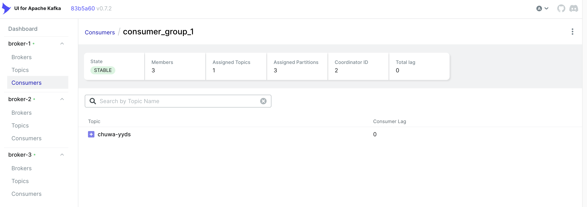
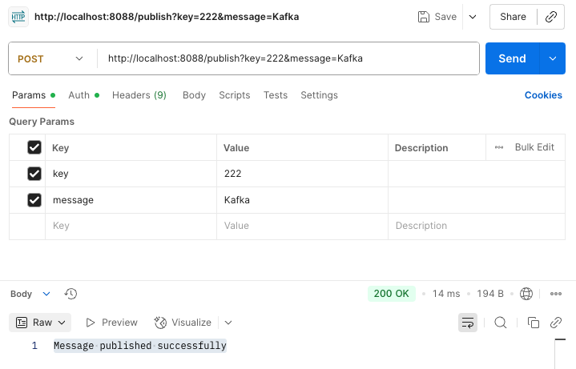
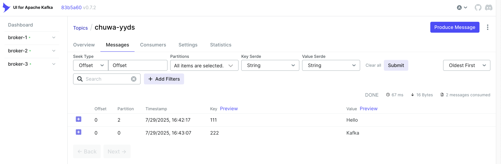
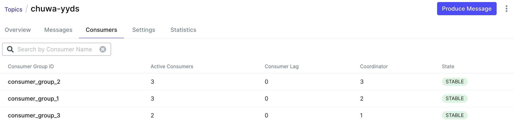
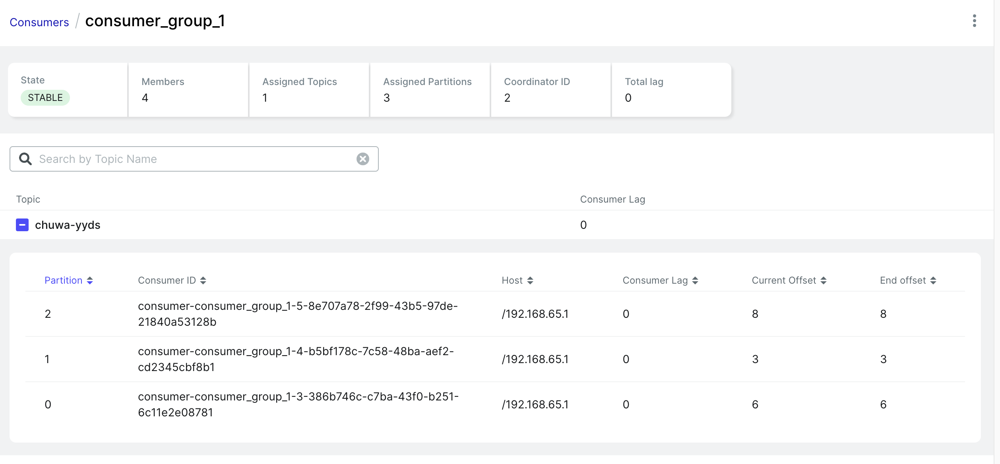
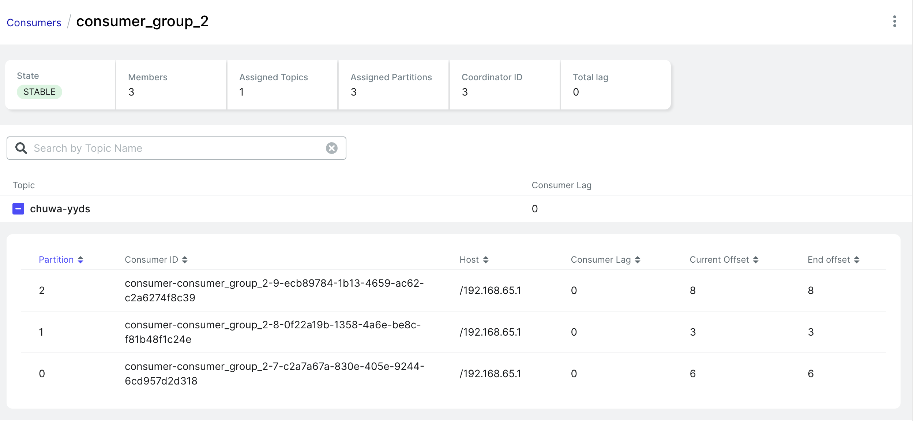
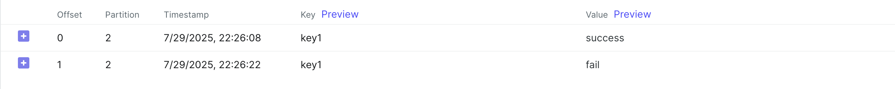
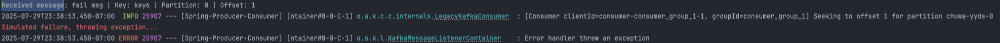
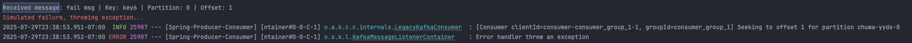
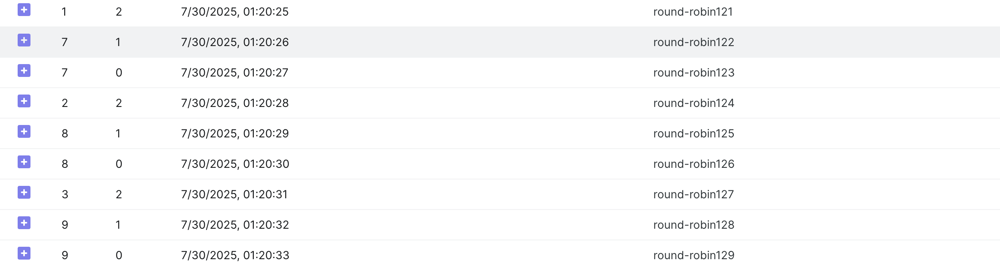

# HW15 - Kafka

Explain following concepts, and how they coordinate with each other:

- **Topic: Logical channel for messages.** Similar to **a database table or folder** - organizes related messages

  - A named stream of data based on their type or source. Like a topic called "payment-events" means a named channel where payment-related messages will continuously flow through.
  - Multiple consumers can subscribe to the same topic.
  - Can be divided into multiple partitions.

  - Configurable retention: Allows you to configure how long messages should be retained in a topic.

- **Partition: Scalability unit within topic.** It is like a **log file** - messages append to the end.

  - Partitions allow Kafka to scale horizontally and process data in parallel.
  - Each partition is an **ordered, immutable** sequence of messages(records).
  - Partitions are distributed across brokers, and can have their replicas on other brokers (**Leader/Follower**: One leader handles all reads/writes).
  - Has unique partition ID within a topic: Topic A and Topic B can both have Partition 0.

- **Broker: Kafka server instance.** Physical server that does the actual work.

  - It stores message data and handles read/write client requests.
  - Manages one or more partitions.
  - A Kafka cluster consists of multiple brokers.

- **Consumer group: A group of consumers working together to consume records from a topic.**

  - Each partition in a topic consumed by **only one** consumer in the group at a time.
  - Multiple consumer groups can read from the same topic independently.

- **Producer: Message publisher.** Application that sends messages into Kafka broker.

  - Producers can choose to send data to a specific partition or let Kafka determine it (e.g., based on key hashing or round-robin).
  - Producers can choose to receive ackowledgemrnt of data writes.

- **Offset: Message position tracker.** A sequential ID assigned to each record within partition.

  - Consumers use offsets to keep track of which records they have already read.
  - Offsets are **per partition, per consumer group **(stored ina topic __consumer_offsets).

- **Zookeeper: Cluster coordination.** 

  - Helps manage brokers, track metadata, and leader elections (Controller broker Election & Partition Leader Election).
  - Modern Kafka (v2.8+) is transitioning to **KRaft mode** to remove dependency on Zookeeper.

**How they work with each other:**

1. Producer → sends messages to → Topic
2. Topic → divided into → Partitions
3. Partitions → distributed across → Brokers, where the messages stored
4. Consumer Groups → read from → Partitions
5. Offset → tracks position in → Partition
6. Zookeeper → coordinates → Brokers

```
┌─────────────────────────── Kafka Cluster ──────────────────────────┐
│                                                                    │
│  Zookeeper/KRaft (Metadata & Coordination)                         │
│  • Broker registry: [Broker1, Broker2, Broker3]                    │
│  • Controller: Broker1                                             │
│  • Topic metadata: orders → 3 partitions                           │
│                                                                    │
├────────────────────────────────────────────────────────────────────┤
│                                                                    │
│   Broker1              Broker2              Broker3                │
│  ┌─────────┐         ┌─────────┐         ┌─────────┐               │
│  │ P0 (L)  │         │ P0 (F)  │         │ P0 (F)  │               │
│  │ P1 (F)  │         │ P1 (L)  │         │ P1 (F)  │               │
│  │ P2 (F)  │         │ P2 (F)  │         │ P2 (L)  │               │
│  └─────────┘         └─────────┘         └─────────┘               │
│                                                                    │
└────────────────────────────────────────────────────────────────────┘
      ↑                     ↑                     ↑
      │                     │                     │
Producer (OrderAPI)         │                     │
Writes orders:              │                     │
- Order1 → P0               │                     │
- Order2 → P1               │                     │
- Order3 → P2               │                     │
- Order4 → P0 (round-robin) │                     │
                            │                     │
                      Consumer Group: OrderService│
                    ┌──────────┬──────────┬──────────┐
                    │    C1    │    C2    │    C3    │
                    │ reads P0 │ reads P1 │ reads P2 │
                    │offset:150│offset:147│offset:152│
                    └──────────┴──────────┴──────────┘
```

| Step                        | Action                       | Details                                                   |
| --------------------------- | ---------------------------- | --------------------------------------------------------- |
| **1. Producer Sends**       | OrderAPI → orders topic      | `producer.send(topic="orders", key="123", value={order})` |
| **2. Partition Assignment** | Message → specific partition | Based on key hash or round-robin(no key provided)         |
| **3. Broker Receives**      | Leader broker stores message | Assigns offset (e.g., 151)                                |
| **4. Replication**          | Leader → Followers           | P0 on Broker1 → Brokers 2,3                               |
| **5. Consumer Polls**       | C1 requests from P0          | Gets messages after offset 150                            |
| **6. Processing**           | C1 processes order           | Business logic execution                                  |
| **7. Offset Commit**        | C1 commits offset 151        | Stored in __consumer_offsets                              |


Answer following questions:

1. Given N (number of partitions) and M (number of consumers,) what will happen when N>=M and N<M respectively?

- **N ≥ M** (Number of partitions ≥ number of consumers)

  - Each consumer gets assigned **at least one partition**. Some consumers get more than one.

  - N = M: 1-to-1 mapping, optimal usage

  - Example: N = 4 partitions, M = 3 consumers

    ```
    C1 → P0, P1
    C2 → P2
    C3 → P3
    ```

- **N < M** (Number of partitions ≥ number of consumers)

  - **Only one consumer per partition.**
  - The extra consumers get **no partitions** → they are **inactive**.

  - Example: N = 3 partitions, M = 4 consumers

    ```
    C1 → P1
    C2 → P2
    C3 → P3
    C4 → inactive
    ```

    

2. Explain how brokers work with topics?

   A topic is divided to multiple partitions which are distributed across brokers. 

   Each partition can have their replicas on other brokers: **leader/follower**. Leader in one broker handles all reads/writes and their replicas in other brokers as followers stay in sync to do backup.

   **When the producer sends a message to a topic:**

   It contacts any broker to get partition leader info, then sends the message to that leader broker. The leader broker will storage the message and sync it with other follower.

   **When the consumer fetches a message:**

   It asks any brother for partition assignment, then fetch the message directly from the leader broker of each assigned partition.

 

3. Are messages pushed to consumers or consumers pull messages from topics?

   Consumers **pull** messages from topics. 

   Consumers **periodically send requests** (`poll()` calls) to Kafka broker that hosts leader partitions the consumer is assgined to to ask if it has any new messages for the partitions. If yes, Kafka responds with available messages.

   

4. How to avoid duplicate consumption of messages?

   | Delivery Semantics          | Meaning                                                      | When                                                         |
   | --------------------------- | ------------------------------------------------------------ | ------------------------------------------------------------ |
   | **At most once**            | Messages may be **lost**, but never duplicated               | Offsets are committed **before** processing                  |
   | **At least once (default)** | Messages are not lost, but may be **delivered multiple times** | Offsets are committed **after** processing                   |
   | **Exactly once**            | Messages are **delivered once and only once**, with no loss or duplication | Kafka transactions are used with idempotent producers and atomic commits |

   Duplicate consumption of messages often happens under "**At Least Once**" delivery semantics. In Kafka:

   1. Consumer reads a message
   2. Processes it
   3. Commits offset to Kafka

   If the consumer crashes after step 2 but before committing the offset, Kafka will **re-deliver** the message on restart, resulting in **duplicate processing**.

   How to avoid:

   - Idempotent processing
     - Make your consumer logic idempotent: processing the same message multiple times has the same effect as processing it once.
     - Use idempotent key like `paymentId`, `orderId`, only insert/update a database record if key doesn’t already exist.
   - Manual offset commits: committing only after the message is fully processed.
   - Use an external deduplication store like Redis, PostgreSQL to track processed message.
   - Enable Exactly-Once Semantics (EOS) for Kafka Streams or Transactions

   

5. What will happen if some consumers are down in a consumer group? Will data loss occur? Why?

   No data loss if some consumers are down in a consumer group.

   When a consumer in a group dies, the **group coordinator** **rebalances** the remaining consumers and **reassigns** the partitions from the dead consumers. The new consumers will resume reading from the last committed offsets. 

   

6. What will happen if an entire consumer group is down? Will data loss occur? Why?

   No data loss if an entire consumer group is down.

   Messages remain in the topic **until they are consumed and the offsets are committed**, or until they expire due to **retention policy** (e.g., default is 7 days). If the entire group goes down, no one consumes, but Kafka keeps the messages in bvroker.

   When the group comes back, consumers will resume from the last committed offsets.

   So, according to the two situations above, as long as **offsets are committed correctly**, no messages are lost.

   

7. Explain consumer lag and how to resolve it?

   Consumer lag is the difference between **the latest message written to a partition** and **the last message processed (committed) by the consumer**. 

   ```
   Consumer Lag = End Offset - Current Offset
   ```

   Current Offset: Offset the consumer is currently at. Usually the **Committed Offset** in Kafka CLI.

   If Consumer Lag is 10, that means the consumer is 10 messages behind.

   It usually happens when consumer is too slow to process the message or network issues.

   How to resolve:

   - Scale out: add more consumers to the group to parallelize consumption

   - Optimize consumer code: reduce processing time per message

   - Adjust Kafka configurations: increase `fetch.min.bytes` or `max.poll.records` to fetch more messages per poll

     

8. Explain how Kafka tracks message delivery?

   Kafka doesn't know the status of the message delivery, but it uses **offsets** and **consumer group metadata** to track which messages have been consumed.

   1. Consumer polls data from assigned partitions.
   2. After processing, it commits the offset (manually or automatically).
   3. Kafka stores the committed offset in a special internal topic: `__consumer_offsets`.
   4. If the consumer crashes, Kafka uses the last committed offset to resume consumption.

   

9. Compare Kafka vs RabbitMQ, compare messageing frameworks vs MySql (Why Kafka)?

   Both Kafka and RabbitMQ are messaging systems, but they serve different use cases:

   - Kafka is a distributed event streaming platform, best for **high-throughput**, **log-based**, and **real-time data pipelines**.
   - RabbitMQ is a message broker, great for **task queues**, **short-lived jobs**, and **low-latency messaging**.

   **Main differences:**

   - Kafka stores data on disk and supports **replay**; RabbitMQ deletes messages after they’re consumed.
   - Kafka uses a **pull model**; RabbitMQ uses **push**.
   - Kafka is **horizontally scalable** with partitions; RabbitMQ is better for **simple workloads** and **routing patterns**.

   So use Kafka when you need durability, streaming, and scalability.
    Use RabbitMQ when you need fast, reliable task distribution with complex routing.

   | Feature                 | **Kafka**                                     | **RabbitMQ**                                                 |
   | ----------------------- | --------------------------------------------- | ------------------------------------------------------------ |
   | **Type**                | Distributed **log-based** event streaming     | **Message queue** broker                                     |
   | **Message Storage**     | Durable log (persistent by default)           | In-memory first, disk-backed for persistence                 |
   | **Consumer Model**      | Pull-based                                    | Push-based                                                   |
   | **Message Ordering**    | Guaranteed **within partitions**              | Not guaranteed globally                                      |
   | **Durability**          | Very high — persisted, replicated             | Good — needs config for persistence                          |
   | **Performance**         | High throughput, large-scale ingestion        | Low latency, transactional                                   |
   | **Replay Capability**   | Can re-read from any offset                   | Once acknowledged, message is gone                           |
   | **Delivery Guarantees** | At least once, exactly once (with effort)     | At most once, at least once                                  |
   | **Use Case Fit**        | Data pipelines, stream processing, analytics  | Background jobs (e.g., sending emails), task queues, real-time jobs, RPC |
   | **Scalability**         | Very high (horizontal scaling via partitions) | Moderate (clustered nodes)                                   |
   | **Consumer Groups**     | Yes, for parallelism                          | Not natively, uses queues or exchanges                       |

   Kafka is built for **event-based architecture**: it offers **high throughput, durability, replayability**, and **scalable decoupled communication** — none of which are native strengths of MySQL. While MySQL is essential for **storing** and **querying** structured business data, it is not designed for handling **real-time message flow** or coordinating **microservices**.

   | Category                | Messaging Frameworks (Kafka, RabbitMQ)                       | MySQL (or RDBMS)                       |
   | ----------------------- | ------------------------------------------------------------ | -------------------------------------- |
   | **Purpose**             | Communication between services (decoupling), real-time data flow | Persistent storage for structured data |
   | **Architecture Role**   | Data pipeline / event bus                                    | System of record / query layer         |
   | **Communication Style** | Asynchronous, event-driven                                   | Synchronous, request-response          |

   

10. On top of https://github.com/CTYue/Spring-Producer-Consumer

    1. Write your consumer application with Spring Kafka dependency, set up 3 consumers in a single consumer group. Prove message consumption with screenshots.

       In *KafkaConsumerConfig*:

       ```java
       @Bean
       public ConcurrentKafkaListenerContainerFactory<String, String>
       kafkaListenerContainerFactory() {
       
           ConcurrentKafkaListenerContainerFactory<String, String> factory =
                   new ConcurrentKafkaListenerContainerFactory<>();
           factory.setConsumerFactory(consumerFactory());
           factory.setConcurrency(3); //Set 3 individual consumers within a consumer group
           return factory;
       }
       ```

       

       

       

    2. Increase number of consumers in a single consumer group, observe what happens, explain your observation.

       When I increase number of consumers from 3 to 4, there are 4 members shown but only 3 of them have assigned patitions, which means the extra consumer remains inactive. This is because Kafka's rebalancing mechanism will ensure each partition has at most one consumer at a time.

       
    
    3. Create multiple consumer groups using Spring Kafka, set up different numbers of consumers within each group, observe consumer offset.

        In *KafkaConsumerConfig*:

        ```java
        @EnableKafka
        @Configuration
        public class KafkaConsumerConfig {
           @Value("${spring.kafka.bootstrap-servers}")
           public String bootstrapServers;
          
           @Value("${kafka.topic.name}")
           public String topic;
          
           // Helper method to create consumer properties， using groupId as param for each consumer group
           private Map<String, Object> consumerProps(String groupId) {
               Map<String, Object> props = new HashMap<>();
               props.put(ConsumerConfig.BOOTSTRAP_SERVERS_CONFIG, bootstrapServers);
               props.put(ConsumerConfig.GROUP_ID_CONFIG, groupId);
               props.put(ConsumerConfig.KEY_DESERIALIZER_CLASS_CONFIG, StringDeserializer.class);
               props.put(ConsumerConfig.VALUE_DESERIALIZER_CLASS_CONFIG, StringDeserializer.class);
               return props;
           }
           // Create multiple consumer groups
           @Bean
           public ConsumerFactory<String, String> consumerFactory1() {
               return new DefaultKafkaConsumerFactory<>(consumerProps("consumer_group_1"));
           }
        
           @Bean
           public ConcurrentKafkaListenerContainerFactory<String, String>
           kafkaListenerContainerFactory1() {
        
               ConcurrentKafkaListenerContainerFactory<String, String> factory =
                       new ConcurrentKafkaListenerContainerFactory<>();
               factory.setConsumerFactory(consumerFactory1());
               factory.setConcurrency(4);
               return factory;
           }
        
           @Bean
           public ConsumerFactory<String, String> consumerFactory2() {
               return new DefaultKafkaConsumerFactory<>(consumerProps("consumer_group_2"));
           }
        
           @Bean
           public ConcurrentKafkaListenerContainerFactory<String, String>
           kafkaListenerContainerFactory2() {
        
               ConcurrentKafkaListenerContainerFactory<String, String> factory =
                       new ConcurrentKafkaListenerContainerFactory<>();
               factory.setConsumerFactory(consumerFactory2());
               factory.setConcurrency(3);
               return factory;
           }
        
           @Bean
           public ConsumerFactory<String, String> consumerFactory3() {
               return new DefaultKafkaConsumerFactory<>(consumerProps("consumer_group_3"));
           }
        
           @Bean
           public ConcurrentKafkaListenerContainerFactory<String, String>
           kafkaListenerContainerFactory3() {
        
               ConcurrentKafkaListenerContainerFactory<String, String> factory =
                       new ConcurrentKafkaListenerContainerFactory<>();
               factory.setConsumerFactory(consumerFactory3());
               factory.setConcurrency(3);
               return factory;
           }
        }
        ```
        
        In *KafkaConsumerService*:
        
        ```java
        @Service
        public class KafkaConsumerService {
           @Value("${kafka.topic.name}")
           private String topic;
        
           @KafkaListener(topics = "${kafka.topic.name}", groupId = "consumer_group_1", containerFactory = "kafkaListenerContainerFactory1")
           public void listenGroup1(String message) {
               System.out.println("Received message: " + message + " from group: consumer_group_1" + " with topic: " + topic);
           }
        
           @KafkaListener(topics = "${kafka.topic.name}", groupId = "consumer_group_2", containerFactory = "kafkaListenerContainerFactory2")
           public void listenGroup2(String message) {
               System.out.println("Received message: " + message + " from group: consumer_group_2" + " with topic: " + topic);
           }
        
           @KafkaListener(topics = "${kafka.topic.name}", groupId = "consumer_group_3", containerFactory = "kafkaListenerContainerFactory3")
           public void listenGroup3(String message) {
               System.out.println("Received message: " + message + " from group: consumer_group_3" + " with topic: " + topic);
           }
        }
        ```
        
        I got the three consumer groups as follows and their offset after I sent several messages.
        
        
        
        **Consumer Group 1 (4 consumers, 3 partitions)**
        
       - Only 3 out of 4 consumers are active (1 idle)
       - Offset: Partitions consumed 6, 3, and 8 messages respectively
       - Lags: 0 (all messages consumed)
       
        
       
       **Consumer Group 2 (3 consumers, 3 partitions)**
       
       - Perfect match - each consumer handles 1 partition
       - Offset: Same consumption pattern (6, 3, 8 messages)
       - Lags: 0 (optimal configuration)
       
       
       
        **Consumer Group 3 (2 consumers, 3 partitions)**
       
       - Uneven distribution - one consumer handles 2 partitions
       - Offset: Same offsets as other groups (6, 3, 8 messages)
       - Lags: 0 (but unbalanced workload)
       
       
    
    4. Prove that each consumer group is consuming messages on topics as expected, take screenshots of offset records.
    
        In the screenshots shown above, we can see each consumer group maintains its own offset tracking independently, and all groups show lag=0, confirming successful consumption. 
    
    5.  Demo different message delivery guarantees in Kafka, with necessary code or configuration changes.
    
           1. **At-Most-Once**: Auto commit before processing. (risk of message loss, no duplicates)
    
              In *KafkaConsumerConfig*:
    
              ```java
              private Map<String, Object> consumerProps(String groupId) {
                  Map<String, Object> props = new HashMap<>();
                  props.put(ConsumerConfig.BOOTSTRAP_SERVERS_CONFIG, bootstrapServers);
                  props.put(ConsumerConfig.GROUP_ID_CONFIG, groupId);
                  props.put(ConsumerConfig.KEY_DESERIALIZER_CLASS_CONFIG, StringDeserializer.class);
                  props.put(ConsumerConfig.VALUE_DESERIALIZER_CLASS_CONFIG, StringDeserializer.class);
                  // at most once config
                  props.put(ConsumerConfig.ENABLE_AUTO_COMMIT_CONFIG, true); // default is true
                  props.put(ConsumerConfig.AUTO_COMMIT_INTERVAL_MS_CONFIG, 1000); // automatically commit its current offset to Kafka every 1000 milliseconds
                  return props;
              }
              ```
    
              In *KafkaConsumerService*: simulate failure of processing
    
              ```java
              @KafkaListener(topics = "${kafka.topic.name}", groupId = "consumer_group_1", containerFactory = "kafkaListenerContainerFactory1")
              public void listenGroup1(String message) {
                  System.out.println("Received message: " + message + " from group: consumer_group_1" + " with topic: " + topic);
                  if (message.contains("fail")) {
                      System.out.println("Simulation of processing failed");
                      throw new RuntimeException("Simulated crash");
                  }
              ```
    
              In this case, the message has been committed before processing, so even if the processing is failed, the offset still goes forward. Shown in the screenshot.
    
              
    
        2. **At-Least-Once**: Manual commit after processing. (no message loss, may have duplicates)
    
              In *KafkaConsumerConfig*:
    
              ```java
              private Map<String, Object> consumerProps(String groupId) {
                  Map<String, Object> props = new HashMap<>();
                  props.put(ConsumerConfig.BOOTSTRAP_SERVERS_CONFIG, bootstrapServers);
                  props.put(ConsumerConfig.GROUP_ID_CONFIG, groupId);
                  props.put(ConsumerConfig.KEY_DESERIALIZER_CLASS_CONFIG, StringDeserializer.class);
                  props.put(ConsumerConfig.VALUE_DESERIALIZER_CLASS_CONFIG, StringDeserializer.class);
                  // at least once config
                  props.put(ConsumerConfig.ENABLE_AUTO_COMMIT_CONFIG, false);
                  return props;
              }
                
              @Bean
              public ConsumerFactory<String, String> consumerFactory1() {
                  return new DefaultKafkaConsumerFactory<>(consumerProps("consumer_group_1"));
              }
                
              @Bean
              public ConcurrentKafkaListenerContainerFactory<String, String>
              kafkaListenerContainerFactory1() {
                
                  ConcurrentKafkaListenerContainerFactory<String, String> factory =
                          new ConcurrentKafkaListenerContainerFactory<>();
                  factory.setConsumerFactory(consumerFactory1());
                  factory.setConcurrency(4);
                  factory.getContainerProperties().setAckMode(ContainerProperties.AckMode.MANUAL); // Required for manual acknowledgment
                  return factory;
                
              }
              ```
    
              In *KafkaConsumerService*:
    
              ```java
              @KafkaListener(topics = "${kafka.topic.name}", groupId = "consumer_group_1", containerFactory = "kafkaListenerContainerFactory1")
              public void listenGroup1(ConsumerRecord<String, String> record, Acknowledgment ack) {
                  String message = record.value();
                  long offset = record.offset();
                  int partition = record.partition();
                  String key = record.key();
                
                  System.out.printf("Received message: %s | Key: %s | Partition: %d | Offset: %d%n",
                          message, key, partition, offset);
                  // Simulate failure of processing
                  if (message.contains("fail")) {
                      System.err.println("Simulated failure, throwing exception...");
                      throw new RuntimeException("Simulated processing error");
                  }
                  // Only commit offset after successful processing
                  ack.acknowledge();
                  System.out.printf("Acknowledged offset: %d from partition %d%n", offset, partition);
              }
              ```
    
              
    
              
    
              We can see Kafka re-deliver the message to the same consumer after a short delay.
        3. **Exactly-Once**: Idempotent + transactional (no message loss, no duplicates)
           
           Based on At-Least-Once case which only commit the offset after successful processing, Exactly-Once need idempotent processing logic, like using a unique message key to detect and skip duplicates. And In production, this can be further enhanced using Kafka’s transactional producer APIs.
    
    6. Write your own partitioning logic, to demo your messages will be assigned to different brokers, or you can also demo kafka's default round-robin paritioning logic, with code changes.
    
        **Note**: There's already a docker compose file in above git repo, you can start the 3 brokers (with zookeep) using docker-compose up command.
    
         In *KafkaProducerConfig*:
    
        ```java
        @Bean
           public ProducerFactory<String, String> producerFactory() {
               Map<String, Object> configProps = new HashMap<>();
               configProps.put(ProducerConfig.BOOTSTRAP_SERVERS_CONFIG, bootstrapServers);
               configProps.put(ProducerConfig.KEY_SERIALIZER_CLASS_CONFIG, StringSerializer.class);
               configProps.put(ProducerConfig.VALUE_SERIALIZER_CLASS_CONFIG, StringSerializer.class);
               // Default partitioner in Kafka > 2.4 is sticky partitioning
               // So need to add config for round-robin(Kafka >= 3.0)
               configProps.put(ProducerConfig.PARTITIONER_CLASS_CONFIG, "org.apache.kafka.clients.producer.RoundRobinPartitioner");
               return new DefaultKafkaProducerFactory<>(configProps);
           }
        ```
    
        In *KafkaProducerService*:
    
        ```java
        @Service
        public class KafkaProducerService {
        
           @Value("${kafka.topic.name}")
           private String topicName;
        
           @Autowired
           private KafkaTemplate<String, String> kafkaTemplate;
        
           public void sendMessagesRoundRobin(String message) throws InterruptedException {
               for (int i = 0; i < 10; i++) {
                   kafkaTemplate.send(topicName, null, message + i); // No key → round-robin
                   Thread.sleep(1000); // set delay between each send
               }
           }
        
        }
        ```
    
        In kafka UI, we can see the partition assigned round-robin.
       
        