### hw16 - Kafka

---
#### Explain the following concepts, and how they coordinate with each other:
Topic  
Partition  
Offset  
Broker   
Producer   
Consumer group  
Zookeeper  

---

**Topic**
- Acts as a **logical stream** of data.
- Topics are split into **partitions**.

**Partition**
- Each topic can have multiple partitions to allow parallelism.  
- Messages in a partition are ordered and immutable.

**Offset**
- A unique number for each message within a partition.
- Consumers use offsets to **track their read position**.

**Broker**
- A **Kafka server** that stores data and serves clients (producers/consumers).
- Each broker hosts one or more **partitions**.
- Identified by a unique **broker ID**.

**Producer**
- Sends (writes) data to **Kafka topics**.
- Decides which **partition** to send the data to (random, round-robin, or by key).

**Consumer Group**
- A group of **consumers** sharing the load of consuming from a topic.
- Each partition is consumed by only **one consumer** in a group.

**ZooKeeper**
- Coordinates and manages Kafka **cluster metadata** (broker info, controller election).
- Kafka is moving away from ZooKeeper (replacing with KRaft).


How They coordinate with each other:
1. **Producer** sends messages to a **Topic**, which is split into **Partitions**.


2. **Brokers** store these partitions.


3. **Consumer groups** read from the topic partitions using **Offsets** to keep track.


4. **Zookeeper** (or KRaft) keeps the whole cluster organized and running correctly.


---
#### Answer following questions:

---
#### 1. Given N (number of partitions) and M (number of consumers), what happens when N >= M and when N < M respectively?

---

Case 1: N ≥ M  (Partitions ≥ Consumers)
- Each consumer gets **at least one partition**.
- Some consumers may get **more than one** partition.
- **All consumers are active**.

Case 2: N < M  (Partitions < Consumers)
- Some consumers get **no partition** (remain idle).
- Each partition is assigned to **only one consumer**.
- Not all consumers are utilized.

Key Rule:  
Within a consumer group, a partition can be consumed by only one consumer at a time.


---
#### 2. Explain how brokers work with topics.

---


A **broker** is a Kafka server that stores and manages data for topics.


A **topic** is split into **partitions**.  
Each **partition** is stored on **one or more brokers**.


Kafka **replicates partitions** across multiple brokers for fault tolerance.  
One broker holds the **leader replica** (handles reads/writes).  
Other brokers hold **follower replicas** (for backup).


**Producer** sends data to a topic.   
Kafka **routes the data to a partition**.  
The **broker with the leader replica** stores the message.  
Other brokers **sync** the data if they hold replicas.  
**Consumers** fetch data from brokers that hold the partitions.  


---
#### 3. Are messages pushed to consumers or consumers pull messages from topics?

---

Consumers **pull (fetch)** messages from Kafka topics.
- They request messages from a specific partition and offset.


- This gives consumers full control over:
    - How fast they read
    - Where to resume (using offsets)


    


---
#### 4. How to avoid duplicate consumption of messages?

---

1. Use **Idempotent Processing**
- Ensure your consumer logic can safely run **multiple times** without side effects.
- Example: Before inserting into DB, check if the message ID already exists.


2. Track and Commit **Offsets Correctly**
- Use `enable.auto.commit=false` and **manually commit** offsets **after** successful processing.
- This avoids re-processing if the consumer crashes during handling.


3. Use **Exactly-Once Semantics (EOS)** (Advanced)
- Use **Kafka Transactions**:
    - `producer.initTransactions()`
    - Write to topic and commit offset in a single atomic transaction.
- Supported only when **both producer and consumer** are Kafka-aware.


4. Use **Deduplication Keys**
- Add a unique ID to each message (UUID, event ID).
- Use this to **filter duplicates** in consumer or downstream system (e.g. database).


Summary:

| Strategy                     | Prevents Duplicates? | Complexity |
|-----------------------------|----------------------|------------|
| Idempotent Processing       | ✅                   | Low        |
| Manual Offset Commit        | ✅                   | Medium     |
| Kafka Transactions (EOS)    | ✅                   | High       |
| Deduplication with Keys     | ✅                   | Medium     |


---
#### 5. What will happen if some consumers are down in a consumer group? Will data loss occur? Why?

---

Kafka does not lose data if consumers go down.

Kafka automatically reassigns the downed consumer’s partitions to the remaining active consumers.  

Once consumer comes back, it can resume from the **last committed offset**.


When Can Data Be Lost?
- If offsets are committed before processing, and then consumer crashes  →  Data may be lost.


- If Kafka retention time expires before message is read  →  Data will be deleted.


---
#### 6. What will happen if an entire consumer group is down? Will data loss occur? Why?

---

Kafka **will not lose data** just because the consumer group is down.

Messages continue to be written to the topic.  

No messages are consumed while the group is down.  

Messages remain in Kafka based on retention time (7 days by default).  

When group comes back, consumers in the group will resume from the last committed offsets.


---
#### 7. Explain consumer lag and how to resolve it.

---

`consumer lag` = `end offset` − `current offset` in a partition.

It shows how many messages the consumer is **behind** the latest data.


How to Resolve Consumer Lag:

| Solution                             | Description                                             |
|--------------------------------------|---------------------------------------------------------|
| Improve Consumer Processing Speed    | Optimize logic, reduce bottlenecks (e.g., DB writes)    |
| Add More Consumers                   | Increase parallelism (if partitions ≥ consumers)        |
| Increase Partitions (if needed)     | More partitions = more parallel processing              |
 


---
#### 8. Explain how Kafka tracks message delivery.

---

Offset-Based Tracking:
- Consumers track delivery by commiting the offset they have processed to Kafka.


- Automatically (default), Kafka stores offsets in a special internal topic called `__consumer_offsets`.


Kafka doesn’t "know" if your app processed a message — it only tracks offsets.   


It’s your job to commit offsets at the right time.


---
#### 9. Compare Kafka vs RabbitMQ. Compare messaging frameworks vs MySQL (Why Kafka)?

---

Kafka vs RabbitMQ:

|            | Kafka                  | RabbitMQ                |
|------------|------------------------|-------------------------|
| Model      | **pull** model         | **push** model          |
| Message Retention | Keeps messages for a **fixed time** | Deletes messages **after delivery** |
| Ordering   | **Guaranteed** per partition | Not guaranteed by default |
| Throughput | Very high throughput   | Lower than Kafka        |
| Use Case   | Event streaming, logs, analytics | Task queues, background jobs |
| Setup      | More complex (Zookeeper/KRaft) | Simpler to set up       |


Messaging Frameworks vs MySQL:

|        | Kafka (Messaging)               | MySQL (Database)               |
|--------|----------------------------------|--------------------------------|
| Purpose | Move data between systems        | Store structured data          |
| Streaming | ✅ Real-time                     | ❌ Not real-time                |
| Decoupling | ✅ Loosely coupled                | ❌ Tightly coupled              |
| Scalability | ✅ High throughput                | ❌ Limited for messaging        |
| Replayability | ✅ Yes, via offsets               | ❌ No built-in replay           |


Bottom Line:
- Use **Kafka** to **move data**.  
- Use **MySQL** to **store data**.
 


---
#### 10. On top of https://github.com/CTYue/Spring-Producer-Consumer:

**Note:** My solution code is in:   
https://github.com/ariannalangwang/Spring-Producer-Consumer/tree/hw16-kafka

---
#### A )   
Write your consumer application with Spring Kafka dependency.
Set up 3 consumers in a single consumer group. 

Prove message consumption with screenshots.

---

```java
@Bean
public ConcurrentKafkaListenerContainerFactory<String, String> kafkaListenerContainerFactory() {
    ConcurrentKafkaListenerContainerFactory<String, String> factory = new ConcurrentKafkaListenerContainerFactory<>();
    factory.setConsumerFactory(consumerFactory());
    factory.setConcurrency(3);  // Set 3 consumers within 1 consumer group
    return factory;
}
```

3 consumers in a single consumer group:
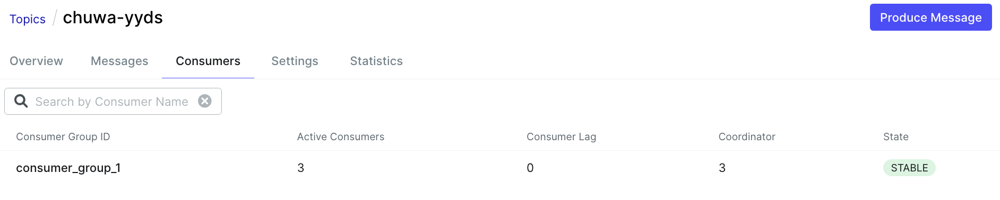

message consumption:
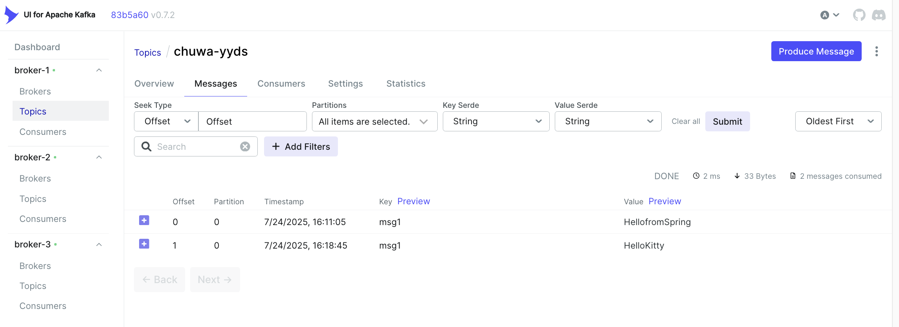


---
#### B )  
Increase number of consumers in a single consumer group. 

Observe what happens, and explain your observation.

---

Some consumers will show no assigned partition (idle).

Explanation:  
- Topic `chuwa-yyds` has 3 partitions.  


- Each partition in a topic can be assigned to **only one** consumer in a consumer group at a time. 


- There’s no parallelism gain after reaching the partition limit.


---
#### C )    
Create multiple consumer groups using Spring Kafka, set up different numbers of consumers within
each group, observe consumer offset.

---


Modify `KafkaConsumerConfig`:  
Update the config to include factories for each group:

```java
@Configuration
@EnableKafka
public class KafkaConsumerConfig {

    @Value("${spring.kafka.bootstrap-servers}")
    private String bootstrapServers;

    // Common consumer properties
    private Map<String, Object> commonConsumerProps(String groupId) {
        Map<String, Object> props = new HashMap<>();
        props.put(ConsumerConfig.BOOTSTRAP_SERVERS_CONFIG, bootstrapServers);
        props.put(ConsumerConfig.GROUP_ID_CONFIG, groupId);
        props.put(ConsumerConfig.KEY_DESERIALIZER_CLASS_CONFIG, StringDeserializer.class);
        props.put(ConsumerConfig.VALUE_DESERIALIZER_CLASS_CONFIG, StringDeserializer.class);
        return props;
    }

    // Group 1: 3 consumers
    @Bean
    public ConcurrentKafkaListenerContainerFactory<String, String> group1Factory() {
        ConcurrentKafkaListenerContainerFactory<String, String> factory = new ConcurrentKafkaListenerContainerFactory<>();
        factory.setConsumerFactory(new DefaultKafkaConsumerFactory<>(commonConsumerProps("consumer_group_1")));
        factory.setConcurrency(3);
        return factory;
    }

    // Group 2: 2 consumers
    @Bean
    public ConcurrentKafkaListenerContainerFactory<String, String> group2Factory() {
        ConcurrentKafkaListenerContainerFactory<String, String> factory = new ConcurrentKafkaListenerContainerFactory<>();
        factory.setConsumerFactory(new DefaultKafkaConsumerFactory<>(commonConsumerProps("consumer_group_2")));
        factory.setConcurrency(2);
        return factory;
    }

    // Group 3: 1 consumer
    @Bean
    public ConcurrentKafkaListenerContainerFactory<String, String> group3Factory() {
        ConcurrentKafkaListenerContainerFactory<String, String> factory = new ConcurrentKafkaListenerContainerFactory<>();
        factory.setConsumerFactory(new DefaultKafkaConsumerFactory<>(commonConsumerProps("consumer_group_3")));
        factory.setConcurrency(1);
        return factory;
    }
}
```


Then update `KafkaConsumerService`:  
Add listeners for each group, explicitly referencing their factory:

```java
@Service
public class KafkaConsumerService {

    @Value("${kafka.topic.name}")
    private String topic;

    // Group 1 (default): uses containerFactory="group1Factory"
    @KafkaListener(
        topics = "${kafka.topic.name}",
        groupId = "consumer_group_1",
        containerFactory = "group1Factory")
    public void listenGroup1(String message) {
        System.out.println("Group 1 received: " + message);
    }

    // Group 2
    @KafkaListener(
        topics = "${kafka.topic.name}",
        groupId = "consumer_group_2",
        containerFactory = "group2Factory")
    public void listenGroup2(String message) {
        System.out.println("Group 2 received: " + message);
    }

    // Group 3
    @KafkaListener(
        topics = "${kafka.topic.name}",
        groupId = "consumer_group_3",
        containerFactory = "group3Factory")
    public void listenGroup3(String message) {
        System.out.println("Group 3 received: " + message);
    }
}
```

"Consumers" tab in `kafka-ui`:
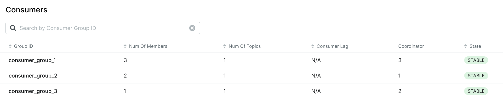


Now I hit kafka with a very high number of messages (999,999 messages to be exact), to observe how different consumer groups behave:
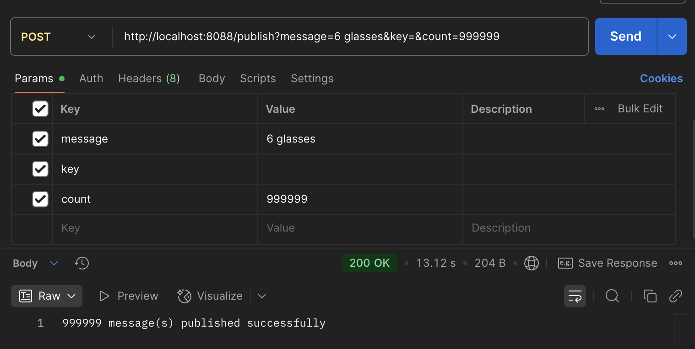


Result: we see a consumer lags in the picture.  
Notice consumer groups that have fewer active instances have larger lags.   
This makes perfect sense since fewer workers work more slowly than more workers.
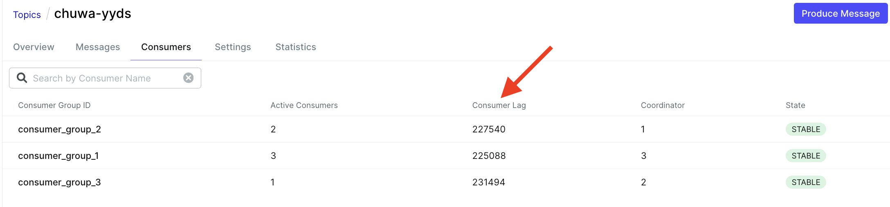


---
#### D )
Prove that each consumer group is consuming messages on topics as expected.

Take screenshots of offset records.

---
All 3 consumer groups are reading from topic `chuwa-yyds`.

Each consumer group acts as an independent subscriber to the topic `chuwa-yyds`.


You can see in the picture that all consumer groups subscribe to topic `chuwa-yyds`.
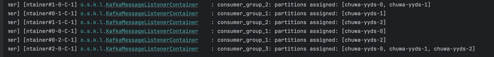

consumer_group_1:
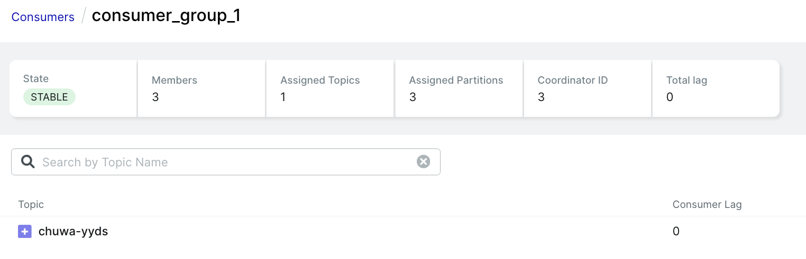


consumer_group_2:
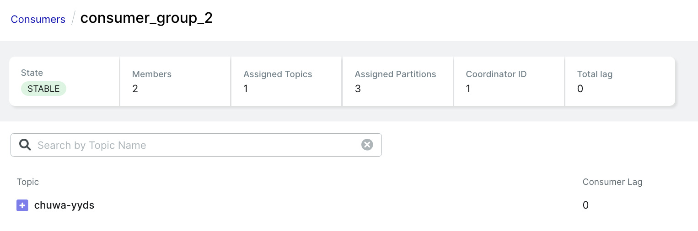


consumer_group_3:
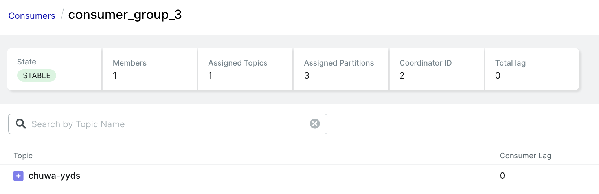


"Inner" topic automatically saved inside broker called `__consumer_offsets`:
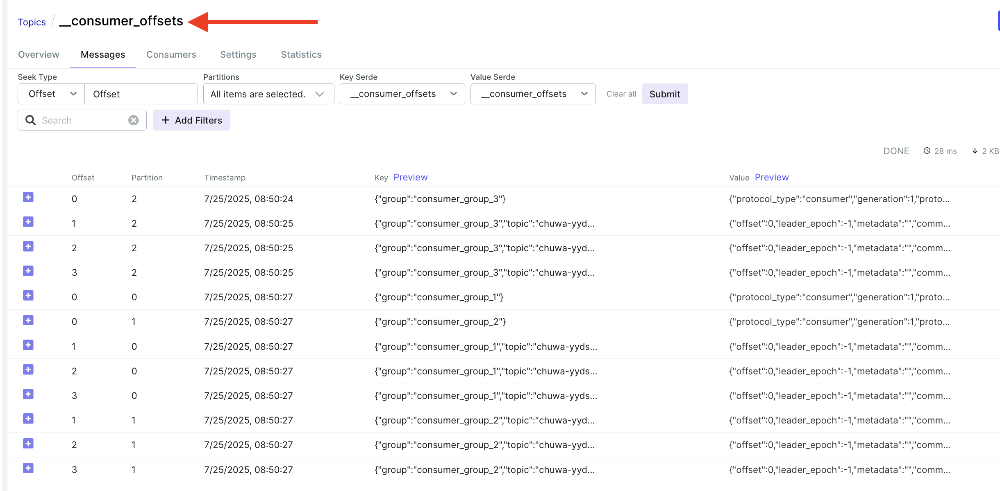


---
#### E )
Demo different message delivery guarantees in Kafka, with code or configuration
changes.

---

Kafka provides three levels of message delivery guarantees:

| Guarantee Level | Description                                                         |
|-----------------|---------------------------------------------------------------------|
| **At most once**  | Messages may be lost but are never redelivered.                     |
| **At least once** | Messages are never lost, but **may be duplicated**.                 |
| **Exactly once**  | Messages are **never lost nor duplicated** (requires extra config). |


---
1. **At Most Once:**
- Consumer commits offsets before message processing.
- If failure occurs during processing, then message will be lost.

In `application.properties`:
```properties
spring.kafka.listener.ack-mode=RECORD
spring.kafka.consumer.enable-auto-commit=true
```
`enable-auto-commit=true` commits offsets automatically, possibly before successful processing.


In `KafkaConsumerService`:
```java
@KafkaListener(
    topics = "${kafka.topic.name}",
    groupId = "consumer_group_1",
    containerFactory = "group1Factory")
public void listenGroup1(String message) {
    System.out.println("Group 1 received: " + message);
    // simulate crash
    if (message.contains("fail")) throw new RuntimeException("Simulated failure");
}
```
In above code, a message like "fail" would be lost if exception is thrown.


---
2. **At Least Once** **(preferred)**
- Kafka commits offset after successful message processing.
- If failure occurs before commit, then Kafka will redeliver the message and consumer can reprocessed the message.
- But this can lead to duplication of messages being sent to a consumer. So our code must have mechanisms to avoid duplicate consumption of messages. (see Q4 above for different strategies.)

In `application.properties`:
```properties
spring.kafka.listener.ack-mode=RECORD
spring.kafka.consumer.enable-auto-commit=false
```
`enable-auto-commit=false` means we must manually commit the offsets 
after successful processing, giving us full control.  
This is critical for `at-least-once` or `exactly-once` processing.


In `KafkaConsumerService`:
```java
@KafkaListener(
    topics = "${kafka.topic.name}",
    groupId = "consumer_group_1",
    containerFactory = "group1Factory")
public void listenGroup1(String message, Acknowledgment ack) {
    System.out.println("Group 1 received: " + message);
    ack.acknowledge();  // manually commit offset only after successful data processing
}
```
If crash happens before `ack.acknowledge()`, Kafka will redeliver the message.


---
3. **Exactly Once**
- No loss, no duplicates.
- Requires `Kafka transaction` support on the producer side.
- The consumer side needs `idempotency` and/or `transactional` guarantees.

Kafka does not support full `exactly-once` on the consumer side by default — you must ensure idempotent logic (e.g., via deduplication keys or DB transactions).


---
#### F )
Write your own partitioning logic, to demo your messages will be assigned to different brokers.

Or you can also demo kafka's default round-robin partitioning logic, with code changes.

---
I will demonstrate kafka's default round-robin partitioning logic.  

In `KafkaProducerConfig`, I added this line below to tell Kafka to explicitly use `RoundRobinPartitioner`.

```java
configProps.put(ProducerConfig.PARTITIONER_CLASS_CONFIG, "org.apache.kafka.clients.producer.RoundRobinPartitioner");
```


 
```java
@Configuration
public class KafkaProducerConfig {

  @Value("${spring.kafka.bootstrap-servers}")
  private String bootstrapServers;

  @Value("${kafka.topic.name}")
  private String topicName;

  @Bean
  public ProducerFactory<String, String> producerFactory() {
    Map<String, Object> configProps = new HashMap<>();
    configProps.put(ProducerConfig.BOOTSTRAP_SERVERS_CONFIG, bootstrapServers);
    configProps.put(ProducerConfig.PARTITIONER_CLASS_CONFIG, "org.apache.kafka.clients.producer.RoundRobinPartitioner");
    configProps.put(ProducerConfig.KEY_SERIALIZER_CLASS_CONFIG, StringSerializer.class);
    configProps.put(ProducerConfig.VALUE_SERIALIZER_CLASS_CONFIG, StringSerializer.class);
    return new DefaultKafkaProducerFactory<>(configProps);
  }

  ...
}
```


I sent 800 messages to kafka broker.  
**Note:** each message does not have a `message key`.  
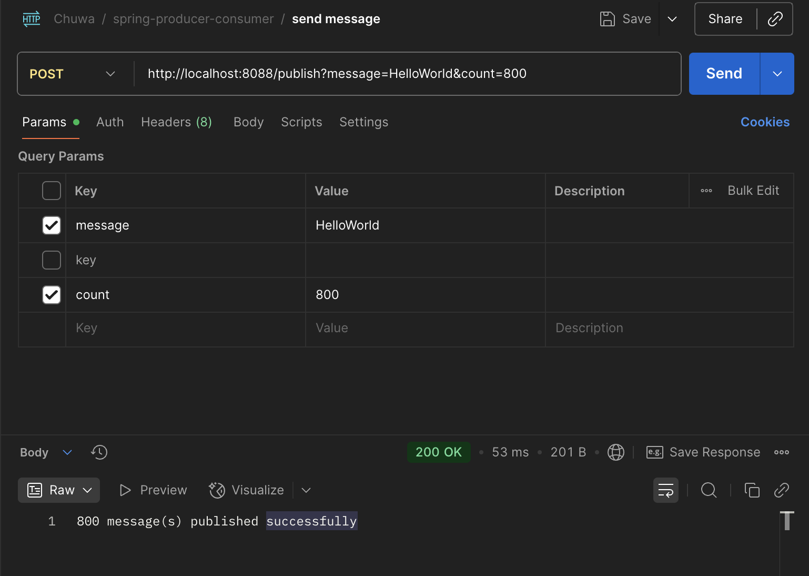

Outcome:
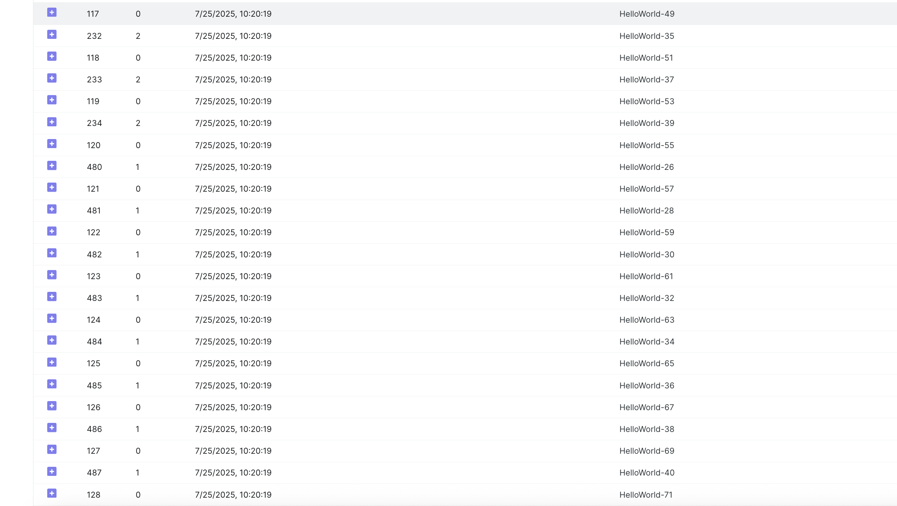


