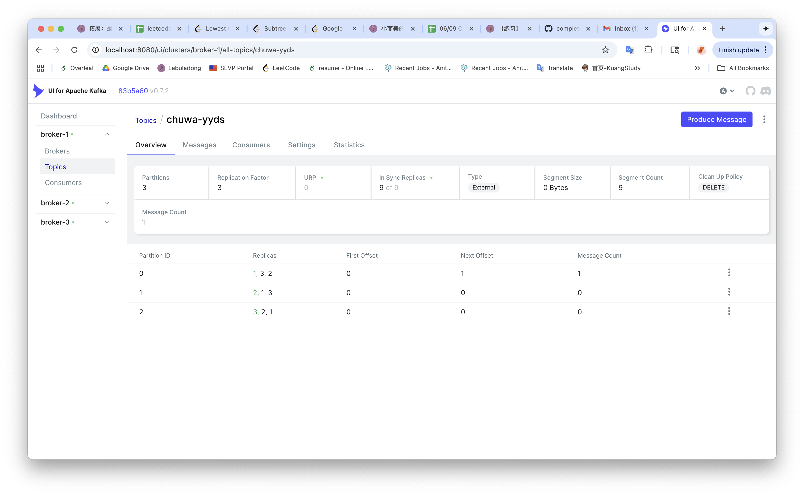
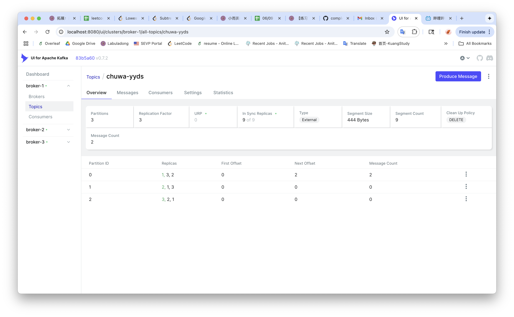
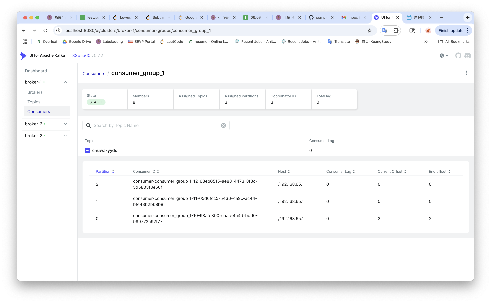

# HW16 Kafka

## Concepts

Explain the following concepts and how they coordinate with each other:

- **Topic**  
  A topic is a logical channel to which data is published and from which consumers read. Topics are split into partitions and are the core abstraction for streaming data in Kafka.

- **Partition**  
  A topic can be split into multiple partitions for parallelism and scalability. Each partition is an ordered, immutable sequence of records.

- **Broker**  
  A Kafka broker is a server that stores and serves Kafka topic data. It handles producers, consumers, and stores offset information (when not using an external offset store).

- **Consumer Group**  
  A set of consumers working together to consume messages from a topic. Each partition in a topic is consumed by only one consumer in the group at any time.

- **Producer**  
  A Kafka producer writes data to Kafka topics. It determines which partition to send the message to.

- **Offset**  
  The unique ID assigned to each message within a partition. Consumers use offsets to keep track of which messages they’ve read.

- **Zookeeper**  
  Kafka uses Zookeeper to manage cluster metadata, elect controllers, and coordinate brokers (note: recent Kafka versions can be run without Zookeeper using KRaft mode).

---

## Questions

1. **Given N (number of partitions) and M (number of consumers), what will happen when N >= M and N < M respectively?**

  - If N >= M: Each consumer will be assigned at least one partition. Some consumers may get more than one partition if N > M.
  - If N < M: Only N consumers will receive data; the remaining M-N consumers will be idle.

2. **Explain how brokers work with topics?**

  - Kafka brokers manage partitions of topics. Each topic is split into partitions, and brokers store these partitions. One broker is the leader for each partition, handling reads/writes. Producers send data to the leader broker of a partition, and consumers fetch from it. Brokers also replicate data to ensure fault tolerance.

3. **Are messages pushed to consumers or do consumers pull messages from topics?**

   Kafka consumers **pull** data from brokers at their own pace. This pull-based model gives consumers control over the rate of data ingestion.

4. **How to avoid duplicate consumption of messages?**

   Ensure idempotent processing on the consumer side and enable idempotent producer settings (e.g., `enable.idempotence=true`) to avoid duplicate sends. Exactly-once semantics can be achieved with transactional APIs and careful offset handling.

5. **What will happen if some consumers are down in a consumer group? Will data loss occur? Why?**

   - If some consumers in a consumer group go down, data will not be lost, because:
   - Kafka retains data in the topic partitions for a configurable retention time.
   - The remaining consumers in the group will rebalance and take over the partitions of the failed consumers.
   - As long as offsets are committed properly, new consumers will resume from the last committed offset, ensuring no message is lost.

6. **What will happen if an entire consumer group is down? Will data loss occur? Why?**

    - If an entire consumer group is down, data will not be lost because:
    - Kafka stores messages in topic partitions for a set retention period (e.g., 7 days by default).
    - Until messages expire, any consumer group can consume them by starting from the latest or a specific offset.
    - When the group comes back up, it can resume consuming from the last committed offsets, assuming those messages are still retained.

7. **Explain consumer lag and how to resolve it?**

   Consumer lag is the difference between the latest offset in a partition and the current offset that the consumer has committed.  
   To resolve it:
  - Scale the number of consumers.
  - Optimize consumer processing logic.
  - Increase partition count to allow more parallelism.

8. **Explain how Kafka tracks message delivery?**

   Kafka does not track delivery itself — consumers track their read progress via offsets. Offsets can be committed manually or automatically to Kafka or an external system to ensure reliable delivery tracking.

9. **Compare Kafka vs RabbitMQ, compare messaging frameworks vs MySQL (Why Kafka?)**

- Kafka vs RabbitMQ:
- Kafka is built for high-throughput, durable, and scalable event streaming; RabbitMQ is better for low-latency, flexible message routing. Kafka supports message replay and partitioned consumption.

- Kafka vs MySQL (Why Kafka):
- Kafka decouples services and handles real-time data streams efficiently, unlike MySQL which isn’t designed for messaging or high-throughput event handling.

---

## Programming Task (based on GitHub Repo)

> Link: [https://github.com/CTYue/Spring-Producer-Consumer](https://github.com/CTYue/Spring-Producer-Consumer)

- [ ] Write your consumer application with Spring Kafka dependency; set up 3 consumers in a single consumer group.
- [ ] Prove message consumption with screenshots.
- 
- [ ] Increase number of consumers in a single consumer group, observe what happens, explain your observation.
- Start with 2 consumers → they’ll be assigned the 3 partitions between them.
- Add a 3rd consumer → now each one gets exactly 1 partition.
- Add a 4th consumer → now one consumer gets nothing!
- Within a single consumer group:Each partition is consumed by only one consumer and a single consumer can consume multiple partitions. So if there are more consumers than partitions, the extra ones have nothing to do.
- [ ] Create multiple consumer groups using Spring Kafka, set up different numbers of consumers within each group, observe consumer offset.
- [ ] Prove that each consumer group is consuming messages on topics as expected, take screenshots of offset records.  
- 
- 