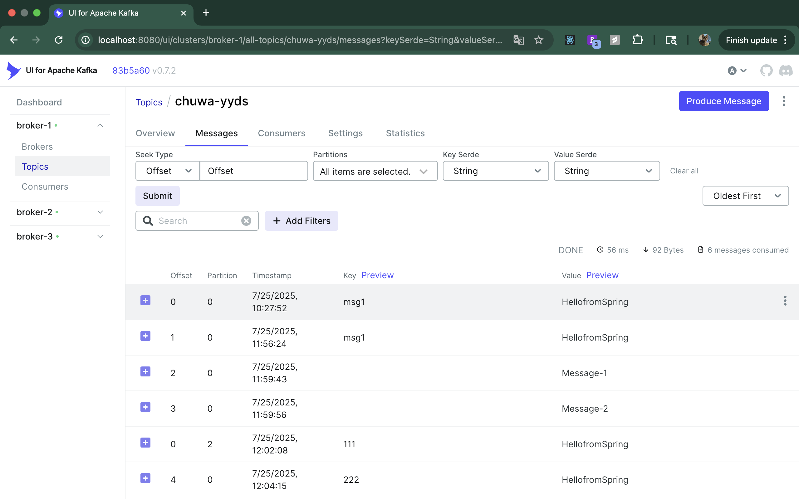
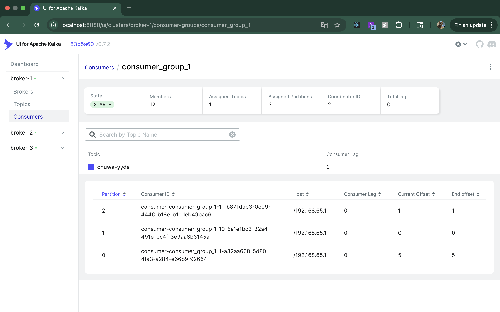
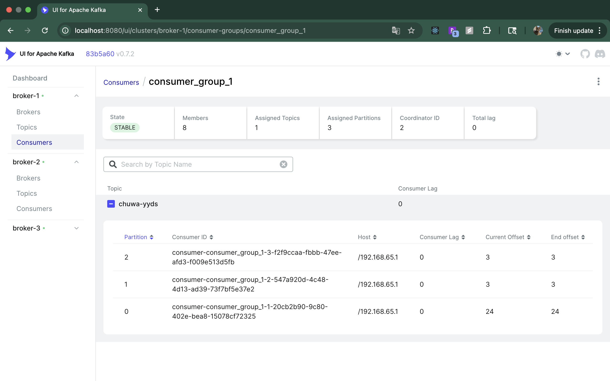
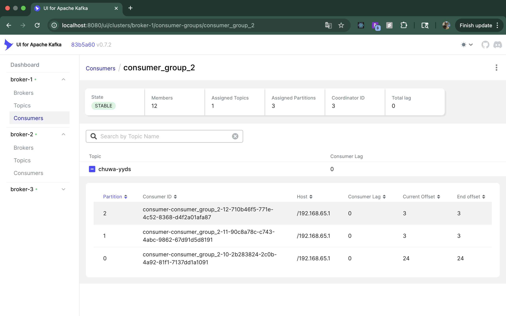
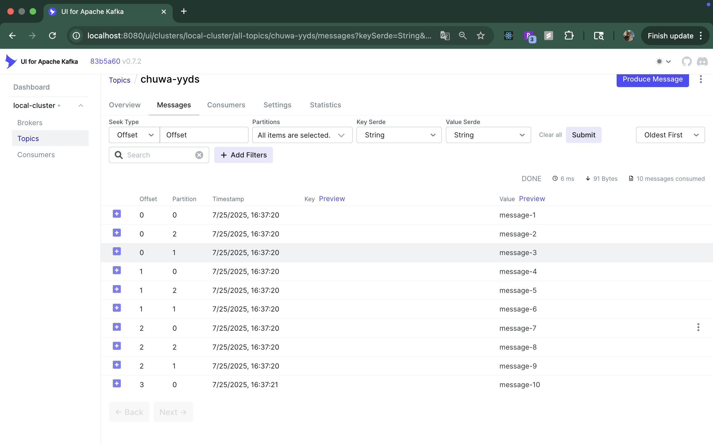

# HW16: Kafka

---

## 1. Explain following concepts, and how they coordinate with each other:

### **1\. Topic**

- A **Topic** is like a **category or channel** where messages are stored and organized.

- Example: If you have an app that tracks orders, you might have a topic called **“orders”**.

- All messages related to orders are sent to this topic.

### **2\. Partition**

- A **Topic** is divided into smaller parts called **Partitions**.

- Think of a topic as a **big folder**, and partitions as **subfolders** inside it.

- Each partition stores messages in **order** (like an ordered list), but different partitions are independent.

- Why partitions? To **scale**: multiple partitions allow multiple consumers to read in parallel and multiple producers
  to write at the same time.

### **3\. Broker**

- A **Broker** is a Kafka **server** that stores data and serves clients.

- A Kafka cluster usually has **multiple brokers**.

- Each broker stores one or more **partitions** of different topics.

- Example: If you have 3 brokers and 6 partitions, these partitions will be spread across those brokers.

### **4\. Producer**

- A **Producer** is the application or service that **sends data** (messages) to Kafka topics.

- Example: An order system producing an **order\_created** event and sending it to the “orders” topic.

### **5\. Consumer Group**

- A **Consumer Group** is a set of consumers working **together** to read data from a topic.

- Each message in a topic is delivered to **one consumer in the group** (load-balanced).

- Example: If you have 4 partitions and 2 consumers in a group, each consumer will read from 2 partitions.

### **6\. Offset**

- **Offset** is like a **bookmark** in a partition.

- It tells a consumer **where it left off** in reading messages.

- Example: If the last read message had offset 10, the next read will start from 11.

- Each consumer in a group maintains its own offset per partition.

### **7\. Zookeeper**

- **Zookeeper** is a separate service that helps **manage Kafka cluster metadata**.

- It tracks:

    - Which brokers are alive

    - Who is the leader for each partition

- It’s like a **manager** that keeps the cluster organized.

- **Note:** Newer Kafka versions are moving away from Zookeeper and using a built-in system called **KRaft**.

## ✅ **How They Work Together**

Here’s the flow:

1. **Producers** send messages to a **Topic**.

2. The **Topic** is split into **Partitions** for scalability.

3. Partitions are stored on **Brokers** in the Kafka cluster.

4. **Consumers** (grouped in **Consumer Groups**) read from these partitions.

5. **Offsets** track where each consumer left off.

6. **Zookeeper** coordinates the cluster: keeps track of brokers, leaders, and configurations.

---

## 2. Answer following questions:

### 2.1 Given N (number of partitions) and M (number of consumers,) what will happen when N>=M and N<M respectively?

#### ✅ **Case 1: N ≥ M (Partitions >= Consumers)**

- **What happens?**

    - Each consumer will **read from at least one partition**.

    - Some consumers may read from **multiple partitions**, but no partition will have more than one consumer in the
      same group.

- **Effect:**

    - Good load balancing (if N and M are close).

    - **Example:**  
      N = 4 partitions, M = 2 consumers  
      → Consumer1 reads from partitions 0 & 1  
      → Consumer2 reads from partitions 2 & 3

**Reason:** A partition can be assigned to **only one consumer in the same group**, but a consumer can read from *
*multiple partitions**.

#### ✅ **Case 2: N < M (Partitions < Consumers)**

- **What happens?**

    - Some consumers will **remain idle** because **you can’t assign more than one consumer to the same partition** in
      the same group.

- **Effect:**

    - Not all consumers do work; wasted resources.

    - **Example:**  
      N = 2 partitions, M = 4 consumers  
      → Consumer1 → partition 0  
      → Consumer2 → partition 1  
      → Consumer3 & Consumer4 → **idle** (no partitions to read)

---

### 2.2 Explain how brokers work with topics?

#### How Brokers Work with Topics

- Broker = Kafka Server
- A broker is just a Kafka server that stores data and handles client requests (from producers and consumers).
- In a Kafka cluster, we usually have multiple brokers for fault tolerance and scalability.
- A topic is a logical category for messages.
- A topic is split into partitions, and these partitions are distributed across brokers.
- Brokers don’t store entire topics; instead, each broker stores one or more partitions of a topic.
-

#### ✅ Example

- Topic: orders
- Partitions: 4
- Replication factor: 2
- Cluster: 3 brokers (B1, B2, B3)

- Partition distribution:

    - Partition 0 → Leader on B1, replica on B2
    - Partition 1 → Leader on B2, replica on B3
    - Partition 2 → Leader on B3, replica on B1
    - Partition 3 → Leader on B1, replica on B3

---

### 2.3 Are messages pushed to consumers or consumers pull messages from topics?

#### In Kafka, consumers pull messages from topics.

#### ✅ Why Pull, Not Push?

- Backpressure Handling
    - Consumers control how fast they read data.
    - If the consumer is slow, Kafka won’t overwhelm it because it pulls only when ready.
- Flexible Batching
    - Consumers decide how many records to fetch in one request (tuning latency vs throughput).
- Simple Error Handling
    - If a consumer fails, offsets tell Kafka where to resume.

---

### 2.4 How to avoid duplicate consumption of messages?

#### ✅ Why Duplicates Happen?

- Consumers read messages **by offset**, not by deleting them.
- If a consumer **crashes after processing a message but before committing its offset**, it will **re-read the same
  message** after restarting.
- This causes **at-least-once delivery** (the default in Kafka).

#### ✅ Ways to Avoid Duplicates

#### **1\. Commit Offsets After Processing (Synchronous Commit)**

- **How it works:**
    - Fetch messages → Process → Commit offset.
- Guarantees that **only processed messages are marked as done**.
- **Problem:** If the commit happens **before processing**, a crash will lose data.  
  If commit happens **after processing**, a crash may reprocess (duplicate).

#### **2\. Idempotent Processing**

- Make the **consumer logic idempotent** (safe to run multiple times):
    - Use **unique keys** (like order ID) to check if the message was already processed.
    - Example: If writing to a database, use **UPSERT** or **ignore duplicates**.

#### **3\. Enable Exactly-Once Semantics (EOS)**

- Kafka introduced **idempotent producers** and **transactions**:
    - **Idempotent Producer:** Prevents duplicate messages when retrying sends.
    - **Transactions:** Combine producing and committing offsets into one atomic operation.
- **Consumer → Process → Produce (to another topic) → Commit offset atomically**.

**Config:**

```properties
enable.idempotence=true
transactional.id=my-transaction-id
```

- This ensures **exactly-once processing**, but only if:
    - Use Kafka Streams **or**
    - Consumer writes back to Kafka using transactions.

#### **4\. Store Processed Offsets in External Storage**

- Instead of relying only on Kafka's offset commits:
    - Maintain a **processed message log** in a database.
    - Before processing a message, check if it’s processed.
- Useful for **critical financial or inventory systems**.

#### **5\. Use Compact Topics for Deduplication**

- If your message has a **unique key**, you can write it to a **compact topic**:
    - Kafka will keep only the **latest value per key**.
    - Consumers can rebuild the final state without duplicates.

---

### 2.5 What will happen if some consumers are down in a consumer group? Will data loss occur? Why?

#### If some consumers in a **Kafka consumer group** go down, here is what happens:

1. **No data loss**: Messages are **not lost** because Kafka stores them in the topic partitions on the broker.
   Consumers only *read* from these partitions; they don’t remove messages after reading.

2. **Rebalancing happens**: Kafka will **rebalance** the remaining consumers. This means the partitions that belonged to
   the failed consumers will be reassigned to the healthy ones.

3. **Processing slows down**: Since there are fewer consumers, the remaining ones have to handle more partitions. So
   message processing may slow down, but nothing is lost.

4. **Offsets stay safe**: Kafka tracks the **offset** (last read position) for each partition. When a consumer comes
   back, it can continue from where it left off.

**Why no data loss?**  
Because Kafka writes messages to disk in a distributed log and keeps them for a set retention period, independent of
consumer status.


---

### 2.6 What will happen if an entire consumer group is down? Will data loss occur? Why?

#### If an **entire consumer group** is down:

1. **No data loss**  
   Messages are **not lost** because Kafka keeps all data in the topic partitions on brokers for the configured *
   *retention period** (e.g., 7 days by default). Consumers only read messages; they do not delete them.

2. **Consumers stop processing**  
   Since there are no active consumers in that group, no messages will be processed until the group comes back.

3. **Offsets stay the same**  
   The consumer group’s last committed offsets are stored in Kafka (in the `__consumer_offsets` topic). When the group
   comes back online, it resumes from these offsets.

4. **Risk: Retention expiration**  
   If the consumer group stays down **longer than the topic retention time**, messages will expire and be deleted from
   Kafka. At that point, data is lost because it was never read.

✅ **Why no immediate data loss?**  
Kafka acts as a durable log. Data is only removed after the retention period or size limit is reached, not when
consumers go down.

---

### 2.7 Explain consumer lag and how to resolve it?

#### **What is Consumer Lag?**

Consumer lag means the **consumer is behind** the producer.  
In other words:

- Messages are written to the topic faster than the consumer is reading them.
- Lag = **(last message offset in partition) - (consumer’s committed offset)**

Example:  
If the latest message in a partition is at offset **1000**, and the consumer has processed up to **900**, the lag is *
*100**.

#### **Why does it happen?**

- Consumers are **slow** (e.g., heavy processing, network issues).
- **Not enough consumers** for the number of partitions.
- **Producer writes too fast**.
- Temporary issues (rebalance, consumer restart).

#### **Why is it a problem?**

- Messages are **delayed** for downstream systems.
- If lag grows too big and **retention time expires**, old messages might be deleted before the consumer reads them → *
  *data loss risk**.

#### **How to Resolve Consumer Lag?**

1. **Add more consumers**  
   More consumers in the group → partitions are divided among them → each consumer has less work.
2. **Optimize consumer processing**
    - Make message handling faster.
    - Use **batch processing** instead of single-message processing.
3. **Increase partition count**  
   More partitions → better parallelism (but only if you also increase consumers).
4. **Check consumer settings**
    - Increase `fetch.max.bytes` and `max.poll.records` so the consumer reads more data in one poll.
    - Tune `max.poll.interval.ms` if processing takes time.
5. **Use multiple consumer groups** (for different purposes)  
   Example: One group for real-time, another for analytics.
6. **Scale infrastructure**  
   If the system is CPU/memory bound, give it more resources.

---

### 2.8 Explain how Kafka tracks message delivery?

Kafka tracks message delivery using **offsets**:

- Every message in a partition has a unique **offset** (like a position number).
- Consumers remember the last offset they read and store it in Kafka’s `__consumer_offsets` topic.
- Tracking happens per **consumer group**, so different groups can read the same messages.
- Messages stay in Kafka for a set **retention period**, even after being read.
- When consumers finish processing, they **commit the offset**. If they crash before committing, they’ll re-read
  messages (so **at least once delivery**).

---

### 2.9 Compare Kafka vs RabbitMQ, compare messaging frameworks vs MySql (Why Kafka)?

#### **Kafka vs RabbitMQ**

- **Kafka**: Distributed, high-throughput, great for streaming & event-driven systems, uses **pull model** (consumers
  pull data), keeps messages for a retention period.
- **RabbitMQ**: Traditional message broker, good for task queues, uses **push model**, deletes messages after delivery.

#### **Messaging Frameworks vs MySQL**

- **Messaging frameworks (Kafka, RabbitMQ)**: Real-time, decouples services, handles high-volume streams efficiently.
- **MySQL (DB)**: Stores structured data, not optimized for real-time messaging or high-throughput event streams.

#### **Why Kafka?**

- Handles huge data streams efficiently.
- Provides durability, scalability, and fault-tolerance.
- Supports replay of messages and event-driven architectures.

**Summary:**  
Kafka = best for real-time, large-scale event streaming; RabbitMQ = good for traditional queues; MySQL = for data
storage, not messaging. Kafka wins for scalability, speed, and event-driven systems.

---

### 2.10 Coding

- See in repo: https://github.com/WeixinLiu618/Spring-Producer-Consumer
#### Write your consumer application with Spring Kafka dependency, set up 3 consumers in a single consumer group. Prove
  message consumption with screenshots.
  



#### Increase number of consumers in a single consumer group, observe what happens, explain your observation.
    - Active consumers number is still 3.

    - Kafka rule: In a consumer group, each partition is consumed by only one consumer at a time.
      Since the topic has 3 partitions, only 3 consumers can actively consume.
      The other consumers will stay idle (no partitions assigned).

#### Create multiple consumer groups using Spring Kafka, set up different numbers of consumers within each group, observe
  consumer offset.
#### Prove that each consumer group is consuming messages on topics as expected, take screenshots of offset records.
  
  

#### Demo different message delivery guarantees in Kafka, with necessary code or configuration changes.

  ✔ At most once:

```properties
spring.kafka.listener.ack-mode=record
spring.kafka.consumer.enable-auto-commit=true 
```

- Use postman:
    - Test sending a normal message:  `http://localhost:8088/publish?message=test&key=233`
    - log: [At-Most-Once] Received: test-message
    - Test sending an error message: `http://localhost:8088/publish?message=error&key=233`
    - log: Fail with error message
- The message will NOT be retried because offset was committed before processing.
- In Kafka UI → consumer_group_id=at-most-once-group → Lag = 0.

✔ At least once（至少一次）:

```properties
spring.kafka.consumer.enable-auto-commit=false
spring.kafka.listener.ack-mode=manual
```

- Use postman:
- Test sending an error message: `http://localhost:8088/publish?message=error&key=233`
- log:

```vbnet
[At-Least-Once] Processing: error 
Error, message will be retried: error
```

- Message will keep reprocessing until successful or app stops.
- Kafka UI → Lag > 0 (uncommitted offsets).

✔ Exactly once（精确一次）

- Test:
- Send normal message: `http://localhost:8088/publish?message=ok`
- Should produce ok-processed in processed-topic.
- Send error message:`http://localhost:8088/publish?message=error`
- Log shows failure, transaction rolls back.
- processed-topic does not contain error-processed.
- When retried successfully, only one -processed record exists.


#### Write your own partitioning logic, to demo your messages will be assigned to different brokers, or you can also demo kafka's default round-robin paritioning logic, with code changes.
- default RoundRobin
- Updated producerFactory() for Round-Robin
```java
configProps.put(ProducerConfig.PARTITIONER_CLASS_CONFIG, "org.apache.kafka.clients.producer.RoundRobinPartitioner");
```

- In Producer Service, add:
```java
    // ✅ Round-Robin Partitioning Demo
    public void demoRoundRobinPartitioning() {
        for (int i = 1; i <= 10; i++) {
            int messageNumber = i; // effectively final
            kafkaTemplate.send("chuwa-yyds", null, "message-" + messageNumber)
                    .whenComplete((result, ex) -> {
                        if (ex == null) {
                            System.out.println("Sent message-" + messageNumber +
                                    " to partition: " + result.getRecordMetadata().partition());
                        } else {
                            System.err.println("Failed to send message-" + messageNumber + ": " + ex.getMessage());
                        }
                    });
            try {
                Thread.sleep(100); // ✅ 防止 Producer 粘性分区
            } catch (InterruptedException e) {
                Thread.currentThread().interrupt(); // 恢复中断状态
                throw new RuntimeException(e);
            }
        }
    }

```
- add a controller to demo round robin:
```java
   @GetMapping("/roundrobin")
    public String demoRoundRobin() {
        kafkaProducerService.demoRoundRobinPartitioning();
        return "Round-robin partitioning demo started!";
    }
```
- screenshot:

