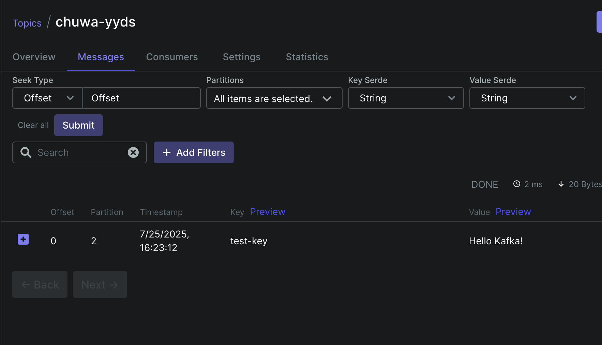
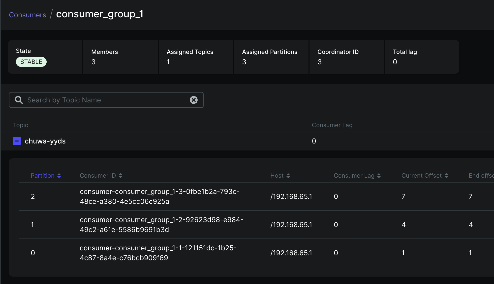
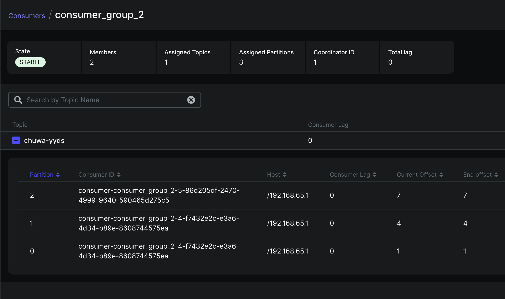
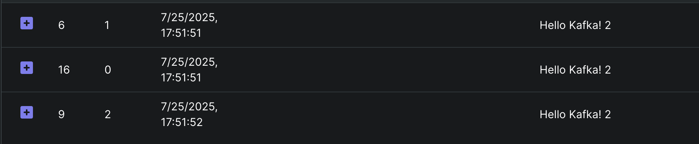

### Part 1
#### Explain following concepts, and how they coordinate with each other:  Topic  Partition  Broker  Consumer group  Producer  Offset  Zookeeper
**Topic**: A logical channel or category for organizing related messages. Topics are divided into partitions for scalability and parallelism. Each topic has a configurable retention policy.

**Partition**: Physical subdivision of a topic stored on disk. Partitions enable horizontal scaling and parallel processing. Each partition maintains an immutable, ordered sequence of messages. Messages within a partition are ordered, but ordering isn't guaranteed across partitions.

**Broker**: Individual Kafka server instances that store and serve data. Brokers form a cluster and handle client requests for producing/consuming messages. Each broker manages multiple topic partitions and replicates data for fault tolerance.

**Consumer Group**: Logical grouping of consumers that coordinate to consume messages from topic partitions. Each partition is consumed by exactly one consumer within a group, enabling load balancing. If a consumer fails, partitions are automatically reassigned to remaining group members.

**Producer**: Client application that publishes messages to Kafka topics. Producers determine which partition to send messages to using partitioning strategies (round-robin, key-based hashing, or custom). They can configure acknowledgment levels for durability guarantees.

**Offset**: Sequential identifier for each message within a partition. Consumers track their current position using offsets. Kafka stores consumer offsets in an internal topic, enabling consumers to resume from their last processed message after restarts.

**Zookeeper**: Distributed coordination service that manages cluster metadata, broker discovery, topic configurations, and consumer group coordination. In newer Kafka versions (2.8+), Kafka can run without Zookeeper using KRaft mode, storing metadata internally.

**Coordination Flow**: 
- Producers write messages to topic partitions on brokers. 
- Consumer groups coordinate through Zookeeper/KRaft to assign partitions among members. 
- Consumers read from assigned partitions, tracking offsets. 
- Brokers replicate partition data across the cluster for fault tolerance. 
- Zookeeper maintains cluster state and facilitates leader election for partition replicas.


### Part 2. Answer following questions:  

#### 1. Given N (number of partitions) and M (number of consumers,) what will happen when N>=M and N<M  respectively?  

**When N >= M (partitions ≥ consumers):**
- Each consumer gets assigned one or more partitions
- Some consumers may handle multiple partitions if N > M
- All partitions are actively consumed
- Maximum parallelism is M (limited by consumer count)

**When N < M (partitions < consumers):**
- Some consumers will be idle with no partition assignments
- Only N consumers will be active (one per partition)
- Remaining M-N consumers sit idle until rebalancing occurs
- This is suboptimal resource utilization

**Key point:** You can't have more active consumers than partitions in a consumer group. Kafka's partition assignment ensures each partition is consumed by exactly one consumer within the same consumer group.


#### 2. Explain how brokers work with topics?  

In Kafka, brokers are the servers that form the Kafka cluster and handle the actual storage and serving of data. Here's how they work with topics:

**Topic Distribution**: When you create a topic, Kafka automatically distributes its partitions across available brokers in the cluster. Each partition is assigned to a specific broker as the partition leader.

**Partition Leadership**: Each partition has one leader broker and zero or more follower brokers. The leader handles all read and write requests for that partition, while followers replicate the data for fault tolerance.

**Replication**: Based on the replication factor, Kafka creates copies of each partition on different brokers. If the leader fails, one of the in-sync replicas becomes the new leader.

**Load Balancing**: Kafka distributes partition leadership across brokers to balance load. Producers and consumers connect to the appropriate broker based on which partitions they need to interact with.

**Metadata Management**: Brokers coordinate through ZooKeeper (or KRaft in newer versions) to maintain cluster metadata, including topic configurations, partition assignments, and leader election.

The key point is that topics are logical abstractions - the actual data storage and serving happens at the broker level through partition distribution and replication.


#### 3. Are messages pushed to consumers or consumers pull messages from topics?  

In Kafka, **consumers pull messages from topics** - it's a pull-based model, not push-based.

Consumers actively fetch messages from brokers using the `poll()` method. This gives consumers control over their consumption rate and prevents overwhelming slow consumers. The consumer maintains its own offset position and can decide when and how many messages to retrieve in each poll cycle.

This contrasts with traditional messaging systems that push messages to consumers, which can lead to backpressure issues if consumers can't keep up with the message rate.


#### 4. How to avoid duplicate consumption of messages?  

Several approaches to handle duplicate message consumption in Kafka:

**1. Idempotent Consumer Logic**
Design your consumer to be idempotent - processing the same message multiple times produces the same result. Use unique message IDs or natural keys to detect and skip duplicates.

**2. Manual Offset Management**
Disable auto-commit (`enable.auto.commit=false`) and manually commit offsets only after successful processing. This prevents message loss but may cause duplicates on failures.

**3. Exactly-Once Semantics (EOS)**
Enable `isolation.level=read_committed` and use transactional producers with `enable.idempotence=true`. Requires Kafka 0.11+ and careful configuration.

**4. External State Store**
Maintain processed message IDs in Redis, database, or other external store. Check before processing each message.

**5. Database Transactions**
Combine message processing with offset commits in a single database transaction using Kafka Connect or custom implementations.

**Trade-off consideration**: Perfect deduplication is expensive. Often better to design idempotent processing logic rather than guarantee exactly-once delivery at the infrastructure level.

Most production systems use approach #1 (idempotent consumers) combined with #2 (manual offset management) for the best balance of reliability and performance.


#### 5. What will happen if some consumers are down in a consumer group? Will data loss occur? Why?  

When consumers in a consumer group go down, Kafka triggers **partition rebalancing**:

1. **Automatic reassignment**: The remaining active consumers will automatically take over the partitions that were assigned to the failed consumers

2. **Rebalance process**: Kafka's group coordinator detects the consumer failure (via heartbeat timeout) and initiates a rebalance across all remaining group members

3. **Temporary pause**: During rebalancing, message consumption is briefly paused while partitions are redistributed

4. **No message loss**: Messages remain in Kafka - they'll be consumed by the reassigned consumers starting from the last committed offset

5. **Increased load**: Remaining consumers handle more partitions, potentially impacting throughput if the group was already at capacity

The key benefit is **fault tolerance** - your application continues processing messages even with consumer failures, just with reduced parallelism until failed consumers are restored or replaced.


**Will data loss occur? Why?**

**No data loss will occur** in Kafka when consumers go down. Here's why:

1. **Messages persist on disk**: Kafka stores messages on brokers for the configured retention period, independent of consumer status

2. **Offset tracking**: Consumer progress is tracked via committed offsets - when a consumer fails, processing resumes from the last committed offset

3. **At-least-once delivery**: Failed consumers may reprocess some messages (between last commit and failure), but no messages are lost

4. **Durable storage**: Messages remain available for consumption until retention policy expires or manual deletion

**However**, data loss can occur in these scenarios:
- **Producer failures** without proper acknowledgment settings (`acks=all`)
- **Broker failures** without sufficient replication (`min.insync.replicas`)
- **Retention policy** expires before consumers recover
- **Manual topic deletion** or aggressive cleanup policies

The key point: **Consumer failures don't cause data loss** - they only affect processing latency and may cause duplicate processing if commits weren't recent.


#### 6. What will happen if an entire consumer group is down? Will data loss occur? Why?  

If an entire consumer group goes down, the partitions assigned to that group will remain unread and messages will accumulate in those partitions. Kafka doesn't automatically reassign partitions to other consumer groups - each group maintains independent offset tracking.

The key impacts:

- **Lag builds up**: Messages pile up in the partitions, increasing consumer lag
- **No automatic failover**: Other consumer groups won't pick up the slack unless explicitly configured
- **Retention risk**: If the group stays down longer than the topic's retention period, messages will be lost
- **Backpressure**: Upstream producers may be affected if they're monitoring consumer lag

When the consumer group comes back online, it will resume from its last committed offsets and process the backlog. The rebalancing protocol will redistribute partitions among available consumers in the group.

For high availability, you'd typically run multiple consumer groups or implement monitoring with alerting on consumer lag.

**No immediate data loss** occurs when a consumer group goes down. Here's why:

**Kafka's persistence model:**
- Messages are stored on disk in partition log files
- Data persists regardless of consumer state
- Retention is time-based (default 7 days) or size-based, not consumption-based

**Data loss scenarios:**
1. **Retention expiry**: If the consumer group stays down longer than the retention period, old messages get deleted
2. **Disk issues**: Hardware failures on brokers (mitigated by replication)
3. **Manual deletion**: Topic or partition deletion

**What's preserved:**
- All uncommitted messages remain in partitions
- Consumer group's last committed offsets are stored in `__consumer_offsets` topic
- Messages can be reprocessed from any valid offset

**Recovery behavior:**
When the group restarts, consumers resume from their last committed offsets. No messages between the last commit and downtime are lost - they're just delayed.

**Bottom line**: Consumer group failures cause processing delays and lag buildup, but don't inherently cause data loss unless the downtime exceeds retention policies.


#### 7. Explain consumer lag and how to resolve it?  

**Consumer lag** is the difference between the latest message offset in a partition and the current consumer's committed offset - essentially how far behind your consumer is from real-time data.

**Causes:**
- Slow message processing in consumer code
- Insufficient consumer instances relative to partition count
- Network/GC issues
- Rebalancing overhead

**Resolution strategies:**

**Scale horizontally** - Add more consumer instances up to partition count limit. Each partition can only be consumed by one consumer in a group.

**Optimize processing** - Profile and tune your message handling logic. Use async processing where possible, batch operations, and avoid blocking I/O in the consumer thread.

**Tune consumer configs:**
- Increase `fetch.min.bytes` and `fetch.max.wait.ms` for better batching
- Adjust `max.poll.records` to balance throughput vs processing time
- Set appropriate `session.timeout.ms` and `heartbeat.interval.ms`

**Monitoring** - Track `consumer_lag` metric per partition. Use tools like Kafka Manager, Burrow, or JMX metrics. Set alerts for lag thresholds.

**Architectural fixes** - Consider separating heavy processing from consumption using producer-consumer pattern, or implement backpressure mechanisms.

The key is identifying whether it's a throughput issue (scale out) or processing efficiency issue (optimize code).


#### 8. Explain how Kafka tracks message delivery?  

Kafka tracks message delivery through several mechanisms:

**Offset Management**: Each message in a partition gets a unique, sequential offset. Consumers track their position using these offsets, which are stored in the `__consumer_offsets` topic by default.

**Acknowledgments**: Producers can configure acknowledgment levels via the `acks` parameter:
- `acks=0`: No acknowledgment (fire-and-forget)
- `acks=1`: Wait for leader acknowledgment only
- `acks=all/-1`: Wait for all in-sync replicas to acknowledge

**Consumer Groups**: Kafka maintains consumer group metadata, tracking which partitions are assigned to which consumers and their last committed offsets. This enables automatic rebalancing and prevents duplicate processing across group members.

**Delivery Semantics**: 
- **At-least-once**: Default behavior with proper offset commits after processing
- **At-most-once**: Commit offsets before processing messages
- **Exactly-once**: Achieved through idempotent producers (`enable.idempotence=true`) and transactional semantics

**ISR (In-Sync Replicas)**: Kafka tracks which replicas are caught up with the leader. Only ISR members can become leaders, ensuring durability guarantees are met.

The combination of offsets, acknowledgments, and consumer group coordination provides reliable message delivery tracking across the distributed system.


#### 9. Compare Kafka vs RabbitMQ, compare messaging frameworks vs MySql (Why Kafka)?    

##### - compare Kafka vs RabbitMQ

**Architecture & Design Philosophy:**
Kafka is a distributed streaming platform built as an immutable commit log, while RabbitMQ is a traditional message broker following AMQP protocols. Kafka treats messages as events in an ordered sequence; RabbitMQ focuses on message delivery patterns.

**Performance & Throughput:**
Kafka excels at high-throughput scenarios - millions of messages per second - due to sequential disk writes and zero-copy transfers. RabbitMQ has lower throughput but offers more flexible routing and immediate message acknowledgment.

**Message Persistence:**
Kafka persists all messages to disk with configurable retention policies, enabling replay and reprocessing. RabbitMQ typically holds messages in memory until consumed, though it supports durable queues.

**Consumer Model:**
Kafka uses pull-based consumption where consumers track their own offsets, enabling multiple consumers to read the same data independently. RabbitMQ uses push-based delivery with acknowledgments, ensuring each message is processed once.

**Use Cases:**
Choose Kafka for event streaming, real-time analytics, log aggregation, and high-volume data pipelines. Choose RabbitMQ for complex routing scenarios, RPC patterns, task queues, and when you need guaranteed message delivery with sophisticated routing logic.

**Operational Complexity:**
RabbitMQ is simpler to set up and operate initially. Kafka requires more infrastructure knowledge but scales better horizontally and handles failures more gracefully in distributed environments.


##### - compare messaging frameworks vs MySql (Why Kafka)

**Why Not MySQL for Messaging:**

**Polling Anti-Pattern:**
MySQL requires constant polling to check for new messages, creating unnecessary database load and latency. Messaging frameworks push data to consumers immediately.

**ACID Overhead:**
MySQL's transactional guarantees are overkill for messaging scenarios. Every message insert/update involves transaction logs, locks, and consistency checks that hurt throughput.

**Scalability Limitations:**
MySQL vertically scales poorly for high-volume messaging. Sharding is complex and doesn't naturally fit messaging patterns. Kafka horizontally partitions data across brokers seamlessly.

**Message Ordering:**
Maintaining strict message ordering in MySQL requires complex queries with indexes on timestamps/sequences. Kafka guarantees partition-level ordering by design.

**Consumer Management:**
MySQL can't efficiently handle multiple consumers reading the same data without complex application logic. Kafka's consumer groups handle this natively with automatic load balancing.

**Why Kafka Specifically:**

**Purpose-Built for Streaming:**
Kafka's log-based architecture treats data as immutable events, perfect for event sourcing, CQRS, and real-time analytics pipelines.

**Durability + Performance:**
Sequential disk writes give Kafka database-level durability with much higher throughput than random MySQL writes.

**Fault Tolerance:**
Built-in replication, leader election, and partition reassignment. MySQL clustering is complex and expensive.

**Integration Ecosystem:**
Kafka Connect, Schema Registry, and streaming processors (Kafka Streams, ksqlDB) create a complete data platform. MySQL would require building this infrastructure from scratch.

**Bottom Line:**
Use MySQL for transactional data storage. Use Kafka when you need event streaming, real-time processing, or decoupled microservice communication at scale.


### Part 3. On top of 
https://github.com/CTYue/Spring-Producer-Consumer  
Note: There's already a docker compose file in above git repo, you can start the 3 brokers (with  zookeeper) using docker-compose up command.

#### 1. Write your consumer application with Spring Kafka dependency, set up 3 consumers in a single  consumer group.  Prove message consumption with screenshots.  
  

#### 2. Increase number of consumers in a single consumer group, observe what happens, explain your  observation.  
- Observation: 
  - 5 consumers created, only 3 get assignments (the rest 2 are in idle) 
  - You cannot have more active consumers than partitions within the same consumer group
- Explanation: 
  - Each partition can only be consumed by ONE consumer within a consumer group
  - Kafka evenly distributes partitions among available consumers
  - Extra consumers remain idle as standby, ready to take over if active consumers fail


#### 3. Create multiple consumer groups using Spring Kafka, set up different numbers of consumers within  each group, observe consumer offset


 **Independent Offset Tracking**
Each consumer group maintains its own offset position for each topic partition. Each group will have completely separate offset tracking for the `chuwa-yyds` topic.

  


 **Partition Assignment Differences**
With my topic having 3 partitions:

Consumer Group A (2 consumers): One consumer handles more partitions than the other
- Consumer 1: Gets partition 0 and 1
- Consumer 2: Gets partition 2


Consumer Group B (5 consumers):
- Consumer 1: Gets partition 0
- Consumer 2: Gets partition 1  
- Consumer 3: Gets partition 2
- Consumer 4 & 5: Remain idle (no partitions assigned)


#### 4. Prove that each consumer group is consuming messages on topics as expected, take screenshots of  offset records, 





#### 5. Demo different message delivery guarantees in Kafka, with necessary code or configuration changes.  

Spring Kafka provides several message delivery guarantee configurations that align with Kafka's core delivery semantics:

 **At Most Once Delivery**

Messages may be lost but are never redelivered. This is achieved by:

```java
@KafkaListener(topics = "my-topic")
public void consume(String message) {
    // Auto-commit enabled (default)
    // If processing fails after commit, message is lost
    processMessage(message);
}
```

Configuration:
```properties
spring.kafka.consumer.enable-auto-commit=true
spring.kafka.consumer.auto-commit-interval=5000
```

 **At Least Once Delivery**

Messages are never lost but may be redelivered. This requires manual acknowledgment:

```java
@KafkaListener(topics = "my-topic", 
               containerFactory = "manualAckContainerFactory")
public void consume(String message, Acknowledgment ack) {
    try {
        processMessage(message);
        ack.acknowledge(); // Commit only after successful processing
    } catch (Exception e) {
        // Don't acknowledge - message will be redelivered
        log.error("Processing failed", e);
    }
}
```

Configuration:
```java
@Bean
public ConcurrentKafkaListenerContainerFactory<String, String> 
    manualAckContainerFactory() {
    ConcurrentKafkaListenerContainerFactory<String, String> factory = 
        new ConcurrentKafkaListenerContainerFactory<>();
    factory.setConsumerFactory(consumerFactory());
    factory.getContainerProperties().setAckMode(AckMode.MANUAL);
    return factory;
}
```

 **Exactly Once Semantics**

Achieved through transactional producers and consumers:

```java
@Service
@Transactional
public class TransactionalMessageProcessor {
    
    @KafkaListener(topics = "input-topic", 
                   containerFactory = "transactionalContainerFactory")
    public void processAndForward(String message) {
        // Process message
        String processed = processMessage(message);
        
        // Send to another topic within same transaction
        kafkaTemplate.send("output-topic", processed);
        
        // Both consumption and production are atomic
    }
}
```

Producer configuration for transactions:
```properties
spring.kafka.producer.transaction-id-prefix=tx-
spring.kafka.producer.acks=all
spring.kafka.producer.retries=3
spring.kafka.producer.enable-idempotence=true
```

Consumer configuration for transactions:
```properties
spring.kafka.consumer.isolation-level=read_committed
spring.kafka.consumer.enable-auto-commit=false
```

 **At-least-once is most commonly used as it provides good reliability without the complexity of exactly-once semantics.**


#### 6. Write your own partitioning logic, to demo your messages will be assigned to different brokers, or  you can also demo kafka's default round-robin partitioning logic, with code changes.  


 **Round-Robin Mechanism**
When these conditions are met, Kafka distributes messages sequentially across all available partitions in a circular fashion:

```
Message 1 → Partition 0
Message 2 → Partition 1  
Message 3 → Partition 2
Message 4 → Partition 0 (back to start)
Message 5 → Partition 1
...and so on
```


**Hash-based partitioning**
When a key is provided, Kafka  uses **hash-based partitioning**:
- The key is hashed using a consistent hash function
- The hash determines which partition receives the message
- Messages with the same key always go to the same partition (ensuring ordering for that key)


 **To Enable Round-Robin Partitioning:**
add `PARTITIONER_CLASS_CONFIG` to `producerFactory` in `KafkaProducerConfig.java`

```java
@Bean
public ProducerFactory<String, String> producerFactory() {
    //...
    configProps.put(ProducerConfig.PARTITIONER_CLASS_CONFIG, RoundRobinPartitioner.class);
    return new DefaultKafkaProducerFactory<>(configProps);
}
```

