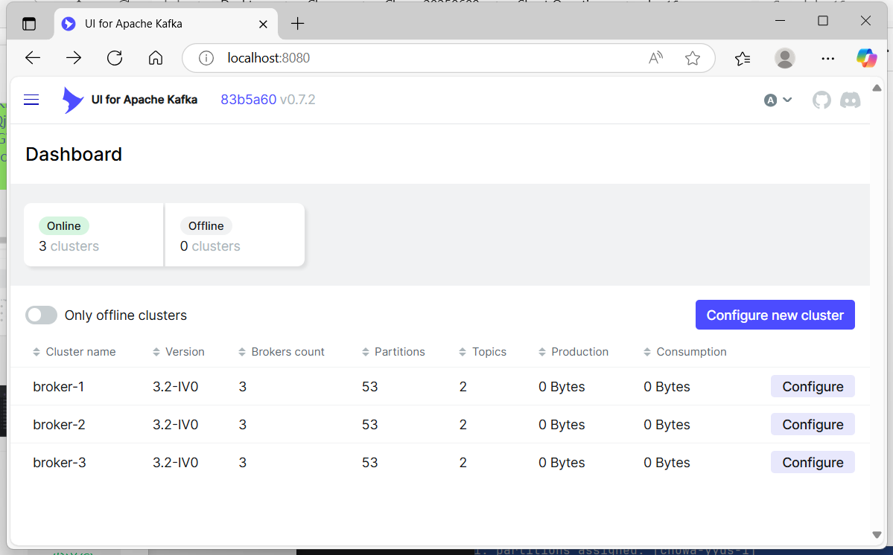
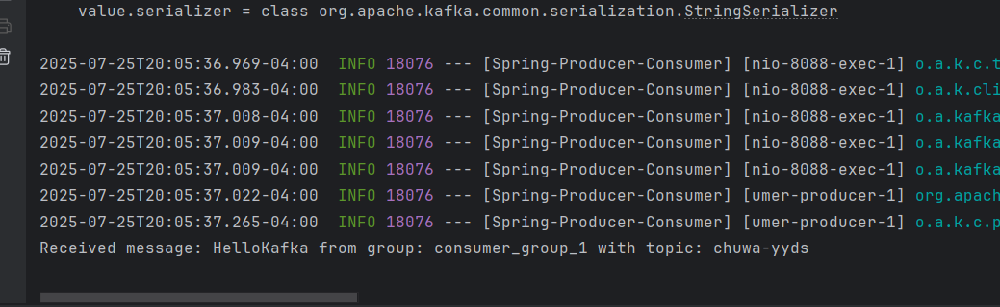
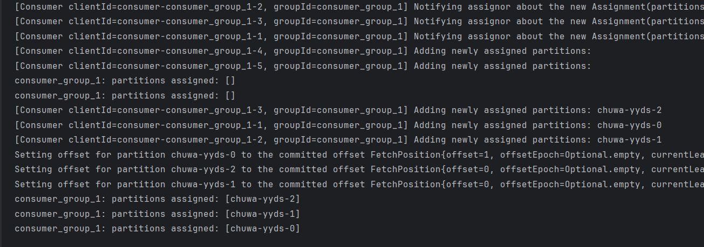

## Write your consumer application with Spring Kafka dependency, set up 3 consumers in a single
consumer group.
    
* 3 consumers:

* message received

## Increase number of consumers in a single consumer group, observe what happens, explain your observation.

*  Observation on Increasing Consumers in a Single Consumer Group

I increased the number of consumers in `consumer_group_1` from 3 to 5, while the Kafka topic `chuwa-yyds` has only 3 partitions.

From the logs, I observed:

- Only 3 consumers were assigned partitions (`chuwa-yyds-0`, `chuwa-yyds-1`, `chuwa-yyds-2`)
- The remaining 2 consumers showed `partitions assigned: []`, meaning they were inactive

#### Explanation:
In Kafka, each partition can only be assigned to **one consumer** within the same group to ensure message order and avoid duplication. Therefore, the **maximum number of active consumers equals the number of partitions**. Additional consumers in the same group will not receive any data unless the partition count increases.

This demonstrates **Kafka's partition assignment strategy** and **consumer scalability limitation within a group**.

## Create multiple consumer groups using Spring Kafka, set up different numbers of consumers within each group, observe consumer offset,

## Prove that each consumer group is consuming messages on topics as expected, take screenshots of offset records,

## Demo different message delivery guarantees in Kafka, with necessary code or configuration changes.

## Write your own partitioning logic, to demo your messages will be assigned to different brokers, or you can also demo kafka's default round-robin paritioning logic, with code changes.

