# Concept Explaination:
## 1\. **Topic**

A **Topic** is a named logical category where messages are stored and published.  
Examples: `"orders"`, `"payments"`, `"logs"`. (`__consumer_offsets` (Kafka internal topic), Dead Letter Queue Topic, etc)

A topic itself is **not stored on a single machine** — it is split into **partitions** for scalability.

---

## 2\. **Partition**

A **Partition** is the physical storage unit of a Kafka topic.  
Each partition is:

-   **Ordered** (messages inside a partition are strictly ordered)
    
-   **Append-only** (producer appends new messages at the end)
    
-   **Distributed** across different brokers
    

Partitions allow:

-   Parallel processing
    
-   Load balancing
    
-   Scalability
    
-   High throughput
    

Kafka guarantees ordering **within a partition**, not across the entire topic.

---

## 3\. **Broker**

A **Broker** is a Kafka server responsible for storing data and handling read/write requests.

Each broker:

-   Stores **some** partitions of different topics
    
-   Serves producers (write) and consumers (read)
    
-   Replicates partitions for fault tolerance
    
-   Controller Broker responsible for Partition Leader Election

A Kafka cluster consists of many brokers, enabling high availability.

---

## 4\. **Producer**

A **Producer** is a client application that sends messages to a Kafka topic.

The producer decides:

-   Which **topic** to send to
    
-   Which **partition** within the topic to write to  
    (Kafka supports default round-robin, key-based, or custom partition strategies)
    

Producers do **not** store data permanently — brokers do.

---

## 5\. **Consumer Group**

A **Consumer Group** is a set of consumers that **share** the work of reading a topic.

Rules:

-   Each **partition** is consumed by **only one consumer** within the group
    
-   But the **same partition can be consumed independently** by different groups
    

Consumer groups allow:

-   Horizontal scaling
    
-   Load balancing
    
-   Fault tolerance
    

Example:  
If a topic has 3 partitions, and the group has 3 consumers, each consumer gets 1 partition.

---

## 6\. **Offset**

An **Offset** is the sequential ID of a message **within a partition**.

Kafka does not delete offsets immediately.  
Instead, Kafka stores consumer offsets in an internal topic: **`__consumer_offsets`**.

Consumers commit offsets to record:

-   “I have processed messages up to offset X in partition P.”
    

Offsets allow:

-   Exactly-once or at-least-once processing
    
-   Restarting from the correct location
    
-   Monitoring consumer lag
    

---

## 7\. **Zookeeper** (Deprecated but still in PDF)

Traditionally, **Zookeeper** manages:

-   Broker metadata
    
-   Cluster membership
    
-   Leader election for partitions
    
-   Configuration
    

Kafka is moving toward **KRaft mode (Kafka without Zookeeper)** starting Kafka 3.3+, but the homework explicitly references Zookeeper.

# 1. Given N (number of partitions) and M (number of consumers,) what will happen when N>=M and N<Mrespectively?

A:
N ≥ M → all consumers get work; N < M → extra consumers stay idle

## Case 1: N ≥ M (Partitions ≥ Consumers)
Each consumer gets at least one partition.
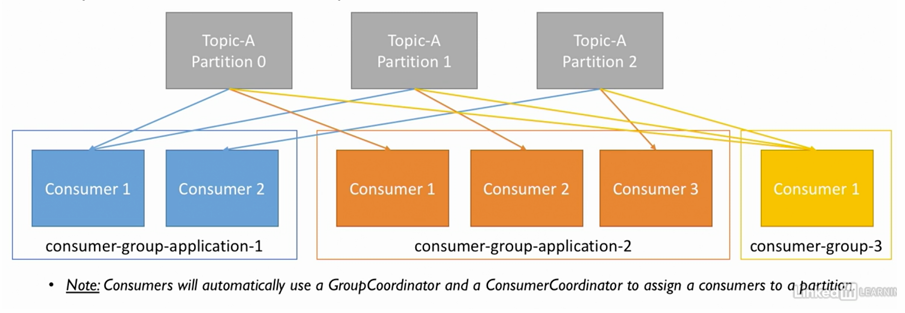

## Case 2: N < M (Partitions < Consumers)
Some consumers will be idle.
Kafka CANNOT assign the same partition to multiple consumers within a single group.
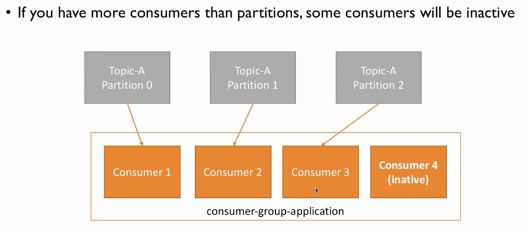

# 2. Explain how brokers work with topics?

A:
**Brokers store/replicate partitions, handle reads/writes, and maintain metadata.**

## **✔ Brokers store *partitions* of topics**

A topic is split into multiple partitions, and these partitions are distributed across brokers.

Example:

Topic: `orders` (3 partitions)

| Broker | Stores Partition |
| --- | --- |
| Broker 1 | P0 |
| Broker 2 | P1 |
| Broker 3 | P2 |

This enables:

-   Load balancing
    
-   Scalability
    
-   High availability
    

---

## **✔ Brokers replicate partitions**

Kafka uses replication for fault tolerance.

Example (replication factor = 3):

| Partition | Leader | Followers |
| --- | --- | --- |
| P0 | Broker 1 | Broker 2, Broker 3 |

-   **Leader broker** handles all reads and writes
    
-   **Follower brokers** replicate data and take over if leader fails
    

---

## **✔ Brokers perform partition leader election**

Historically done by **Zookeeper**, now by **KRaft**.

Leader election ensures:

-   Only one broker acts as leader for a partition
    
-   Followers can take over when needed
    

---

## **✔ Brokers communicate with producers and consumers**

-   Producers send writes → broker (leader partition)
    
-   Consumers fetch data → broker (leader partition)
    

Brokers also maintain metadata:

-   List of topics
    
-   Partition distribution
    
-   Consumer offset storage (via internal topic)
# 3. Are messages pushed to consumers or consumers pull messages from topics?
A:
**Kafka is pull-based — consumers poll brokers for data.**

Kafka uses a **pull-based** model.

## ✔ **Consumers pull messages from brokers**

Consumers *explicitly* request data by polling:

```scss
consumer.poll()
```

The broker responds with:

-   Available messages
    
-   Or empty results if nothing new
    

---

## ❌ Kafka does **NOT** push messages to consumers

This is different from systems like WebSocket or some AMQP brokers.

---

## Why Kafka uses a pull model?

### 👍 **Backpressure control**

Consumers pull only when they are ready → prevents overload.

### 👍 **Flexible batching**

Consumers decide:

-   How frequently to poll
    
-   How many records to fetch
    
-   When to commit offsets
    

### 👍 **Efficient for high throughput**

Pulling allows sequential disk reads and zero-copy transfer.

# 4. How to avoid duplicate consumption of messages?
A: Duplicate consumption happens when a consumer processes a message more than once.
Kafka cannot guarantee uniqueness by itself — you must design for it.

## (A) Commit offsets *after* processing (manual commit)
Correct pattern:`poll → process → commit offset`
In Spring Kafka / Java client:
```
consumer.commitSync();
```
This ensures no message is skipped.

## (B) Use idempotent processing on the consumer side
Even with proper offset handling, duplicates *can still happen* due to:
-   Consumer rebalance 
-   Network retries 
-   Broker retry
-   Producer duplicates

So consumer logic must be **idempotent**, meaning:
> Processing the same message twice produces the same result.
Typical techniques:
-   Use primary keys to detect duplicates
-   Store message IDs in Redis, MySQL, Kafka compacted topic
-   “Upsert” instead of “insert”
-   Check “wasProcessed(messageId)” before taking action


## (C) Enable idempotent producer + transactions (exactly-once)
Kafka supports **exactly-once semantics (EOS)** for streams and transactional producers.
Producer config:
```ini
enable.idempotence=true
transactional.id=<unique-id>
```
This ensures:
-   No duplicate writes in producers
-   No partial writes
-   Atomic "write + offset commit" in the same transaction
Used mostly by Kafka Streams and financial systems.

# 5. What will happen if some consumers are down in a consumer group? Will data loss occur? Why?
A: No,  when a consumer goes down, becaause Kafka uses heartbeats, If consumer stops heartbeating → Kafka kicks it out of the group. Then  Kafka reassigns that consumer’s partitions to **other active consumers** in the same group.
Because offsets are stored in `__consumer_offsets` (Kafka internal topic),The new consumer reads from last committed offset, No data is lost. At worst, **some messages may be reprocessed** (duplicate consumption)
Why NO data loss? Because:

1.  Messages remain stored in Kafka brokers (log files)
2.  Brokers replicate data across followers (RF ≥ 2)
3.  Only consumers crashed — the data is still in Kafka 
4.  Offsets tell Kafka where consumption left off Messages are safe until Kafka’s retention policy deletes them (e.g., after 7 days).

# 6. What will happen if an entire consumer group is down? Will data loss occur? Why?
A: No. 
A consumer group is logically just a set of consumers With a shared offset tracking position

If all consumers in the group go offline, 
### ✔ messages continue to accumulate in the topic.
Kafka stores messages for the configured retention period, such as:

```ini
log.retention.hours=168   (default: 7 days)
```

During this time:
-   No one is reading the topic
-   Messages stay safely stored in partitions
-   Offsets are unchanged
    

### ✔ When the consumer group comes back

They resume from:
-   Their last **committed offset**
-   Or from the position defined by `auto.offset.reset`

Example:

```pgsql
auto.offset.reset=latest   → skip old backlog
auto.offset.reset=earliest → read from beginning
```

## ✔ Why no data loss?

Because **consumers do not store data** — Kafka brokers do.

As long as:

-   Partition data is intact
    
-   Replication is healthy
    
-   Retention has not expired
    

→ **Messages remain available for that consumer group at any time.**

---

## ❌ When can data loss happen for a group?

1.  **Retention expired before consumers restarted**
    -   Topic keeps only 7 days
        
    -   Group was down for 14 days → older messages are deleted
    
2.  **Replication factor = 1 + broker failure**
    
    -   Partition is lost physically
    
3.  **Manual deletion or cleanup policies**
    
    -   Admin scripts
        
    -   Compacted topics (only store the latest Record for each unique key, like 2,3,2,5->the previous Record with id 2 is discarded.)
        

But **consumer failure never causes data loss** by itself.
# 7. Explain consumer lag and how to resolve it?
A:
## ✔ What is Consumer Lag?

**Consumer lag = (Latest message offset in partition) − (Consumer’s committed offset)**

In other words:

> **How far the consumer is behind the producer.**

If an end offser(partition's Latest produced offset) is 100 but the current offset(Consumer committed offset) is 10, then consumer lag is 90:
|||Consumer Lag|Current Offset|End Offset|
|------|------|------|------|------|
|partition-1|consumer-1|0|7|7|
|partition-2|consumer-2|90|10|100|

Lag can occur due to:

-   Consumer processing too slowly
    
-   Message production rate is too high
    
-   Consumer crash / rebalance delay
    
-   Consumer group too small
    
-   Long processing time per message
    
-   Network bottlenecks
    
-   JVM pauses (GC pauses)
    

---

## ✔ Why consumer lag matters?

High lag means:

-   Real-time data processing is delayed
    
-   Alerts, analytics, notifications come late
    
-   In extreme case → days of backlog
    

Kafka itself does **not** lose data due to lag (retention applies), but your application becomes **non real-time**.

---

## ✔ How to resolve consumer lag?

### **1\. Add more consumers to the group**

If partitions ≥ consumers → parallelism increases.

Kafka allows **only one consumer per partition** inside a group.  
So if you already have 10 partitions and 10 consumers → adding the 11th is useless.

---

### **2\. Increase number of partitions**

More partitions → more parallelism → more consumers can be used.

Downside:

-   Too many partitions increase overhead
    
-   Should be planned ahead
    

---

### **3\. Optimize consumer processing**

Reduce time spent per message:

-   Avoid heavy blocking operations
    
-   Use async processing
    
-   Use batching
    
-   Optimize database writes (bulk operations)
    
-   Use connection pooling
    
-   Tune consumer config (`fetch.min.bytes`, `max.poll.records`, etc.)
    

---

### **4\. Increase consumer poll frequency**

Long processing time without calling `poll()` causes:

-   Rebalance
    
-   Lag
    
-   Consumer kicked out of group
    

Fix by:

-   Increasing `max.poll.interval.ms`
    
-   Decreasing per-message processing cost
    
-   Offload processing to thread pool
    

---

### **5\. Scale hardware**

-   More CPU
    
-   Faster disk / SSD
    
-   Faster network
    

---

### **6\. Adjust retention if lag is temporary**

If lag is caused by spike but retention is too short:

```ini
log.retention.hours=168 → increase to 336
```

Prevents old data from being deleted before consumer catches up.
# 8. Explain how Kafka tracks message delivery?
A:
Kafka message delivery tracking consists of **three main components**:

1.  **Offsets**
    
2.  **Consumer commits**
    
3.  **Broker metadata**
    

### ✔ 1. Offsets inside each partition

Every message has a unique offset:

```sql
partition P0:
offset 10
offset 11
offset 12
...
```

Offsets never change and are immutable.

---

### ✔ 2. Consumer Commit Offsets

Kafka tracks **what the consumer has processed** via committed offsets.

Kafka stores these offsets in a special internal topic:

```nginx
__consumer_offsets
```

It contains:

-   consumer group ID
    
-   topic
    
-   partition
    
-   committed offset
    

This enables Kafka to know:

-   Where each consumer left off
    
-   Whether a consumer requires re-delivery
    
-   How much backlog (lag) exists
    

---

### ✔ Delivery semantics are controlled by commit timing

| Commit timing | Delivery semantic | Behavior |
| --- | --- | --- |
| Commit **before** processing | **At-most-once** | Possible data loss, fewer duplicates |
| Commit **after** processing | **At-least-once** | No loss, possible duplicates |
| Commit inside producer transaction | **Exactly-once** | No duplicates, no loss |

Kafka NEVER confirms message delivery to the consumer directly.  
Instead, Kafka **tracks delivery position**, not delivery itself.

---

### ✔ Why Kafka does NOT track “message delivered to consumer”?

Kafka is log-based:

-   Producers append to log
    
-   Consumers pull from log
    
-   Kafka does not need to know whether consumer “read” a message
    
-   Only cares about **offset progress**
    

This design gives Kafka:

-   High throughput
    
-   Simplicity
    
-   Decoupling of producers/consumers
    

# 9. Compare Kafka vs RabbitMQ, compare messageing frameworks vs MySql (Why Kafka)?
A:
## 🥊 **Kafka vs RabbitMQ**

| Feature | Kafka | RabbitMQ |
| --- | --- | --- |
| Type | Distributed log | Message broker (queue-based) |
| Message ordering | **Per partition guaranteed** | Not guaranteed (queues reorder) |
| Throughput | **Very high** (millions/sec) | Lower (tens/hundreds of thousands) |
| Storage | Log-based, long-term | Short-term queue (unless persist configured) |
| Consumer model | Pull-based | Push-based |
| Consumer scaling | **Consumer group** partition exclusive | Queue is consumed by competing consumers |
| Message retention | Time or size-based retention | Typically removed once consumed |
| Use cases | Big data pipelines, logs, events | Task queues, RPC-style workflows |

### ✔ RabbitMQ strengths

-   Low latency
    
-   Many messaging patterns (topic, fanout, RPC)
    
-   Automatic retries & dead-letter queues
    
-   Better for request-response systems
    

### ✔ Kafka strengths

-   Horizontal scalability
    
-   High throughput / durable logs
    
-   Replay ability
    
-   Event streaming
    
-   Distributed commit log architecture
    

Kafka is used for **logs, metrics, event-driven microservices, analytics, ETL pipelines**, not traditional task queues.

---

# 🥊 **Kafka vs MySQL (Why not just store messages in a database?)**

| Feature | Kafka | MySQL |
| --- | --- | --- |
| Writes/sec | **Millions** | Thousands |
| Scaling | Distributed partitions | Vertical scaling, sharding required |
| Ordering | Guaranteed per partition | No natural event ordering |
| Replay | Consumer resets offset | You must manually query |
| Decoupling | Producers/consumers decoupled | Tight coupling |
| Retention | Configurable: days–years | Costly and slow |
| Event streaming | Native | Not supported |

### ✔ Why MySQL is NOT good as a message queue

-   Random read/write overhead
    
-   Hard to scale horizontally
    
-   Not designed for event streaming
    
-   No consumer groups
    
-   No partition parallelism
    
-   Requires manual cleanup (delete old rows)
    

### ✔ Why Kafka is preferred over MySQL

-   Built for append-only logs
    
-   Extremely fast sequential writes
    
-   High compression
    
-   Zero-copy data transfer
    
-   Durable replicated storage
    
-   Partitioned for parallelism
    
-   Replayability
    

Kafka acts as:

> **A distributed commit log + scalable message system + durable event store.**

MySQL cannot compete for these workloads.

---

# ✔ FINAL SUMMARY

| Question | Summary |
| --- | --- |
| **7\. Consumer lag** | Difference between latest offset and committed offset; solved by scaling consumers, optimizing processing, partition increases, tuning |
| **8\. How Kafka tracks delivery** | Through committed offsets stored in `__consumer_offsets`; Kafka tracks *progress*, not per-message delivery |
| **9\. Kafka vs RabbitMQ vs MySQL** | Kafka = scalable event streaming; RabbitMQ = message broker; MySQL = not suitable for messaging |

# 10. On top of https://github.com/CTYue/Spring-Producer-Consumer
##   1. Write your consumer application with Spring Kafka dependency, set up 3 consumers in a single consumer group.
Prove message consumption with screenshots.

Intellij console log:

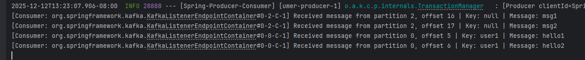

UI for Apache Kafka:

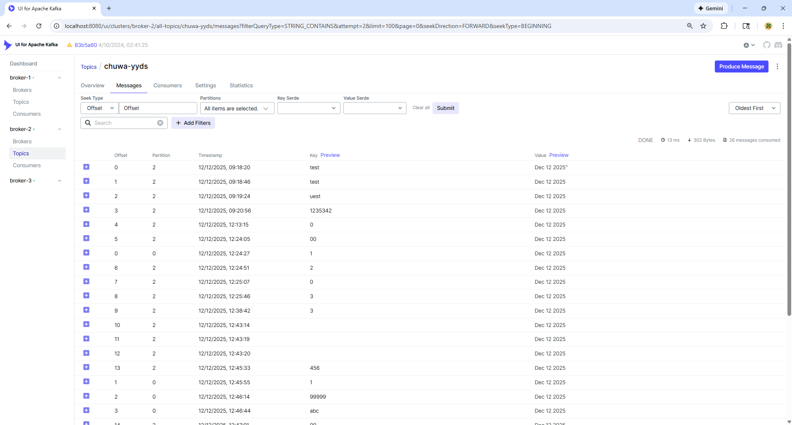

my custom consumer:

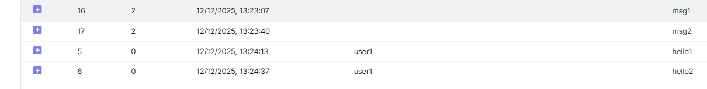
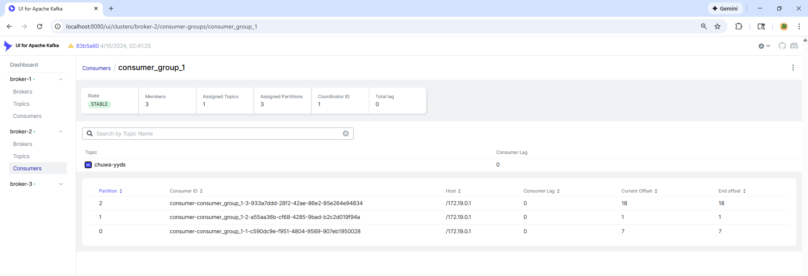

##   2. Increase number of consumers in a single consumer group, observe what happens, explain your observation.
In com.chuwa.demo.config.KafkaConsumerConfig.java, if we set consumers to be 5:

```
    @Bean
    public ConcurrentKafkaListenerContainerFactory<String, String>
    kafkaListenerContainerFactory() {
        ...
        factory.setConcurrency(5); // Set 5 concurrent consumers in the same consumer group
        return factory;
    }
```
In UI for Apache Kafka, we can observe even if we have 5 members in the consumer group, only 3 consumers are assigned partition. The extra 2 is idle.
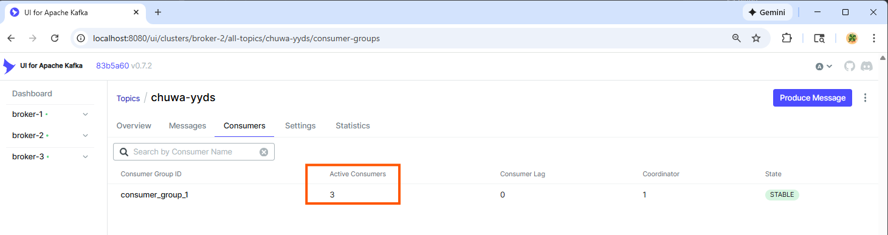
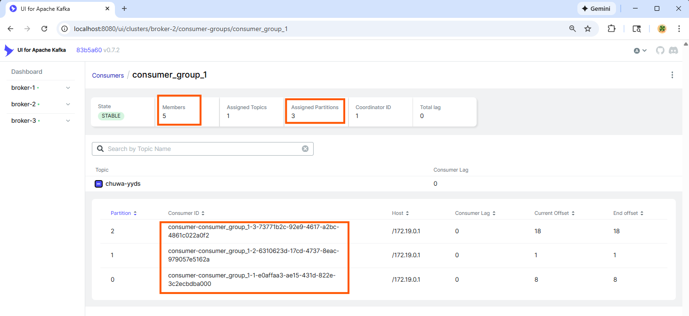

##   3. Create multiple consumer groups using Spring Kafka, set up different numbers of consumers within each group, observe consumer offset,
A:
The cose is in  https://github.com/SiyanWen/Spring-Producer-Consumer consumer_group_answer branch.

### Architecture Overview

  Consumer Group 1 (consumer-group-1): 3 concurrent consumers
  - Each consumer will be assigned 1 partition (3 partitions ÷ 3 consumers = 1:1 mapping)

  Consumer Group 2 (consumer-group-2): 2 concurrent consumers
  - 2 consumers will handle 3 partitions (one consumer gets 2 partitions, another gets 1)

  Consumer Group 3 (consumer-group-3): 1 consumer
  - Single consumer handles all 3 partitions

####  1. KafkaConsumerConfig.java - Created separate factories for each group:

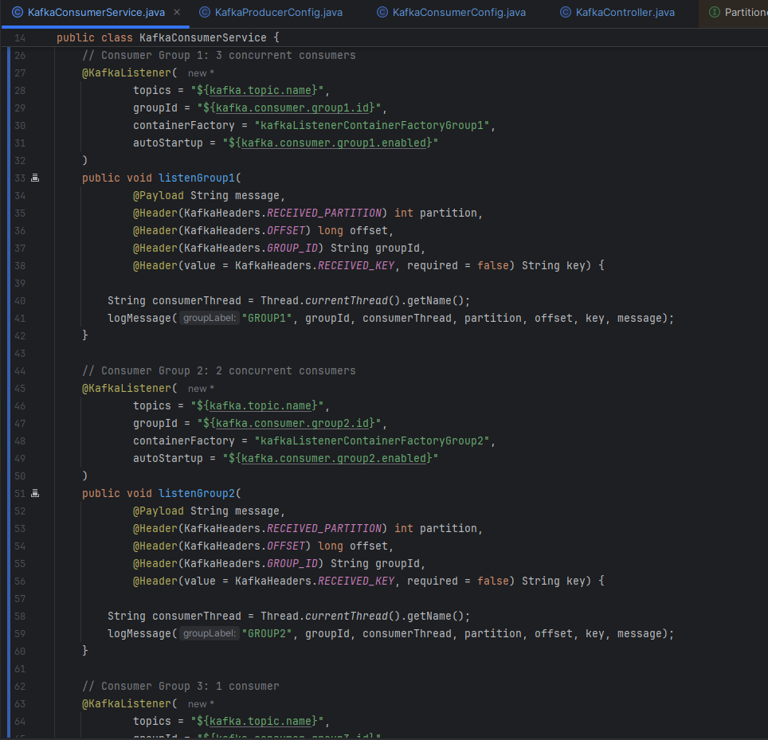
  - consumerFactoryGroup1() → 3 concurrent consumers
  - consumerFactoryGroup2() → 2 concurrent consumers
  - consumerFactoryGroup3() → 1 consumer
  - Added AUTO_OFFSET_RESET_CONFIG: "earliest" to consume from beginning

####    2. KafkaConsumerService.java - Three separate listeners:

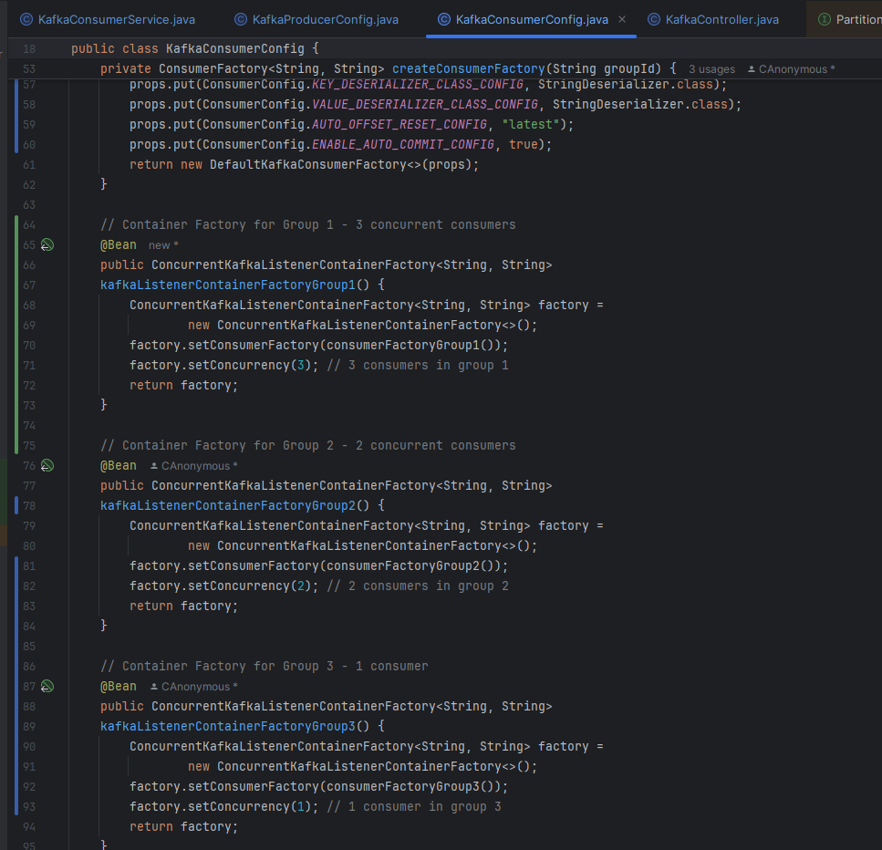
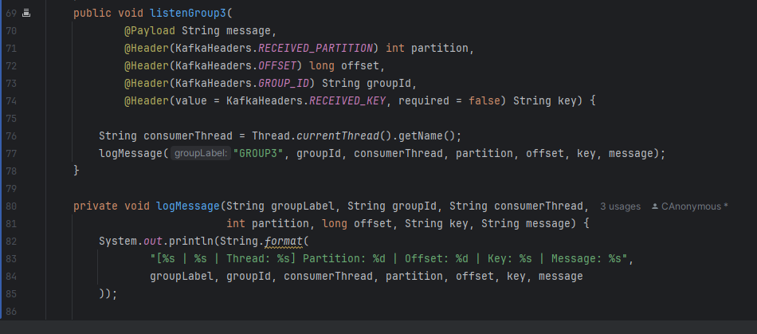
  - listenGroup1() - Uses containerFactory for group 1
  - listenGroup2() - Uses containerFactory for group 2
  - listenGroup3() - Uses containerFactory for group 3
  - Enhanced logging shows: Group ID, Thread name, Partition, Offset, Key, Message

####   3. application.properties - Defined consumer group IDs:

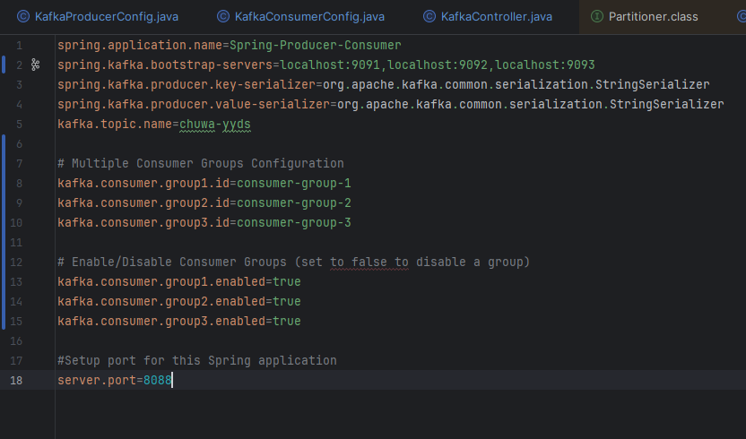
  kafka.consumer.group1.id=consumer-group-1
  kafka.consumer.group2.id=consumer-group-2
  kafka.consumer.group3.id=consumer-group-3

###  Testing & Observing Consumer Offsets

####  1. Start the application

  mvn spring-boot:run

####  2. Send test messages

  POST http://localhost:8088/publish?message=test1
  POST http://localhost:8088/publish?message=test2
  POST http://localhost:8088/publish?message=test3
  POST http://localhost:8088/publish?key=user1&message=hello

####  3. Check console output - You'll see messages like:

  [GROUP1 | consumer-group-1 | Thread: ...#0-0-C-1] Partition: 0 | Offset: 5 | Key: null | Message: test1
  [GROUP2 | consumer-group-2 | Thread: ...#0-1-C-1] Partition: 1 | Offset: 3 | Key: null | Message: test2
  [GROUP3 | consumer-group-3 | Thread: ...#0-0-C-1] Partition: 2 | Offset: 8 | Key: user1 | Message: hello

  Notice:
  - Same message appears 3 times (once per consumer group)
  - Each group maintains its own offset independently
  - Different thread names show different consumers

####  4. Check offsets via Kafka UI (Available at http://localhost:8080)

  - Navigate to Consumer Groups
  - View consumer-group-1, consumer-group-2, consumer-group-3
  - See partition assignments and current offsets for each group

####  5. Check offsets via CLI

View consumer group 1 offsets
```
  docker exec -it broker-1 kafka-consumer-groups \
    --bootstrap-server localhost:29091 \
    --describe \
    --group consumer-group-1
```
View consumer group 2 offsets
```
  docker exec -it broker-1 kafka-consumer-groups \
    --bootstrap-server localhost:29091 \
    --describe \
    --group consumer-group-2
```
View consumer group 3 offsets
```
  docker exec -it broker-1 kafka-consumer-groups \
    --bootstrap-server localhost:29091 \
    --describe \
    --group consumer-group-3
```
 List all consumer groups
 ```
  docker exec -it broker-1 kafka-consumer-groups \
    --bootstrap-server localhost:29091 \
    --list
 ```
###  Understanding Offset Behavior

  Independent Offsets: Each consumer group maintains its own offset position
  - Group 1 at offset 10, Group 2 at offset 15, Group 3 at offset 20 (all independent)

###  Offset Reset: Set to latest - new groups start from the latest messages of the topic

  Partition Distribution:
  - Group 1 (3 consumers): Consumer 1→Partition 0, Consumer 2→Partition 1, Consumer 3→Partition 2
  - Group 2 (2 consumers): Consumer 1→Partitions 0+1, Consumer 2→Partition 2
  - Group 3 (1 consumer): Consumer 1→Partitions 0+1+2
##  4. Prove that each consumer group is consuming messages on topics as expected, take screenshots of offset records,

In com.chuwa.demo.config.KafkaConsumerConfig.java, if we set .AUTO_OFFSET_RESET_CONFIG to be "latest" (earliest is from the beginning), each consumer group would start from the latest messages:
```
    // Helper method to create consumer factory
    private ConsumerFactory<String, String> createConsumerFactory(String groupId) {
        Map<String, Object> props = new HashMap<>();
        ...
        props.put(ConsumerConfig.AUTO_OFFSET_RESET_CONFIG, "earliest");
        ...
        return new DefaultKafkaConsumerFactory<>(props);
    }
```
To observe different offsets in each consumer group, we can Edit application.properties:
### 1. Enable only consumer group 1
```
# Enable/Disable Consumer Groups (set to false to disable a group)
kafka.consumer.group1.enabled=true
kafka.consumer.group2.enabled=false
kafka.consumer.group3.enabled=false
```
We send some messages:
  POST http://localhost:8088/publish?message=msg1
  POST http://localhost:8088/publish?message=msg2
  POST http://localhost:8088/publish?message=msg3
  POST http://localhost:8088/publish?message=msg3&key=1
  POST http://localhost:8088/publish?message=msg3&key=1

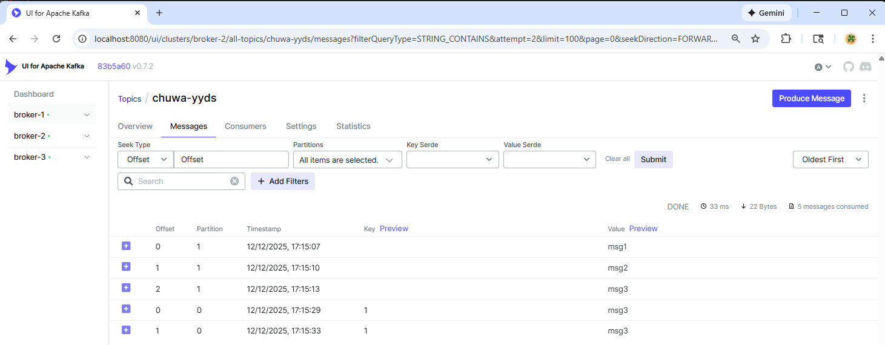

In **intellij console**, only consumer group1 receives messages:

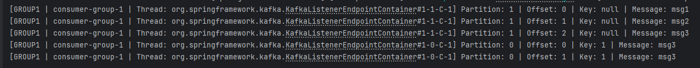

In  **UI for Apache Kafka**, only consumer group 1 is up:

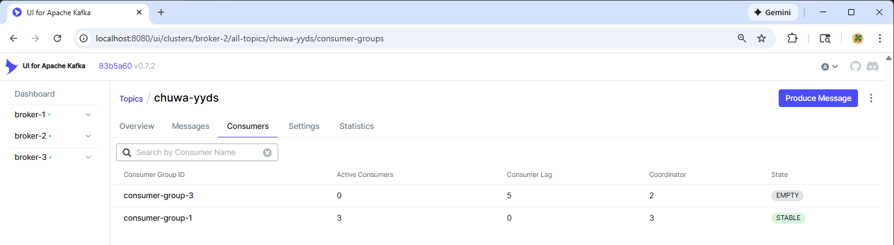
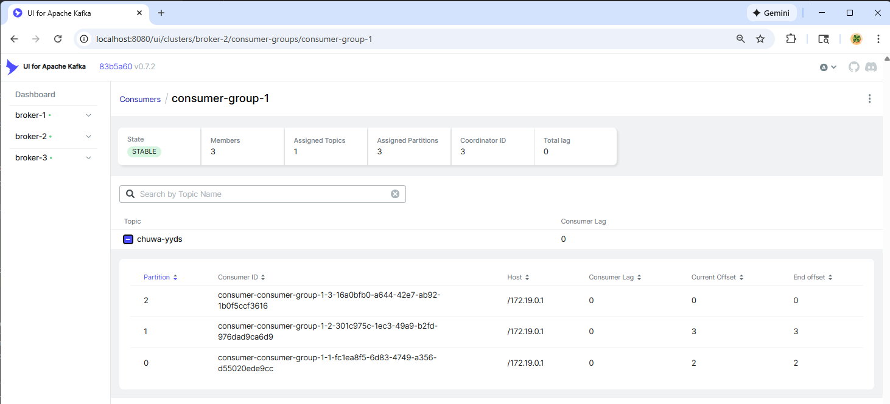
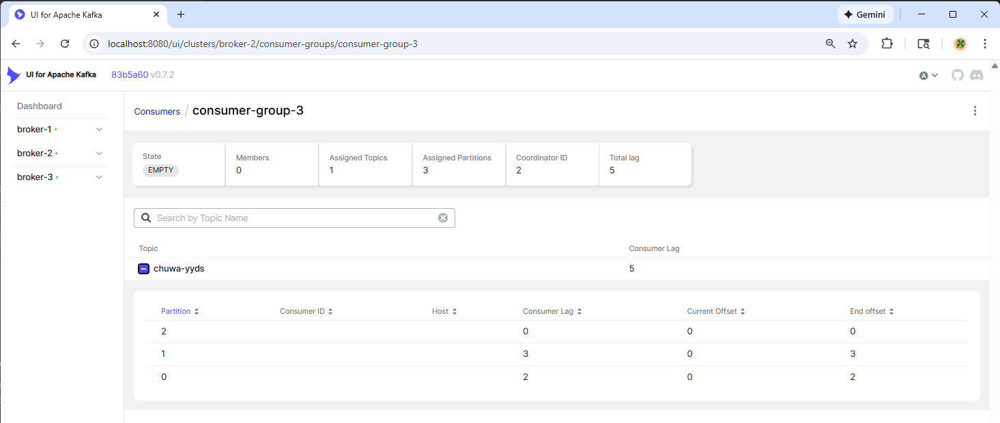

### 2. Then enable consumer 3 in application.properties:
```
# Enable/Disable Consumer Groups (set to false to disable a group)
kafka.consumer.group1.enabled=true
kafka.consumer.group2.enabled=false
kafka.consumer.group3.enabled=true
```
send more messages:
  POST http://localhost:8088/publish?message=msg6
  POST http://localhost:8088/publish?message=msg7
  POST http://localhost:8088/publish?message=msg8

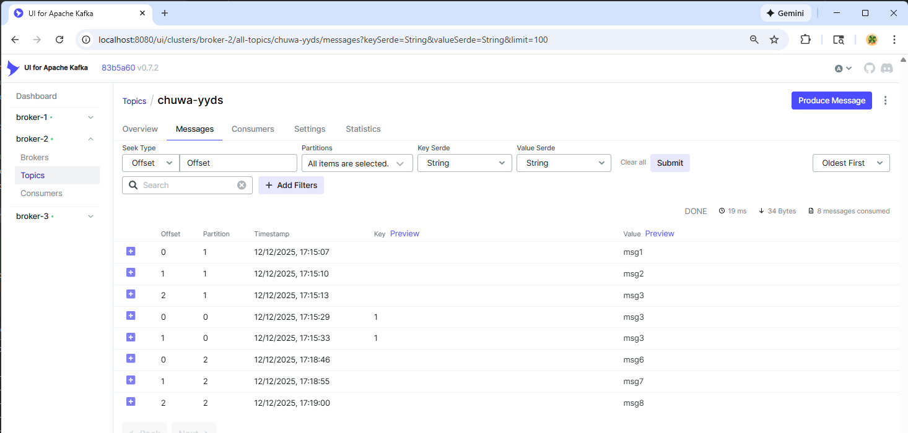

In **intellij console**, both consumer group1and 3 receive messages:

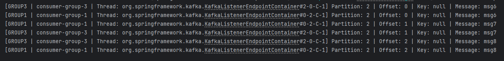

In  **UI for Apache Kafka**,  consumer group 1and 3 are up:

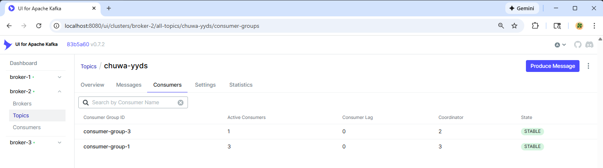
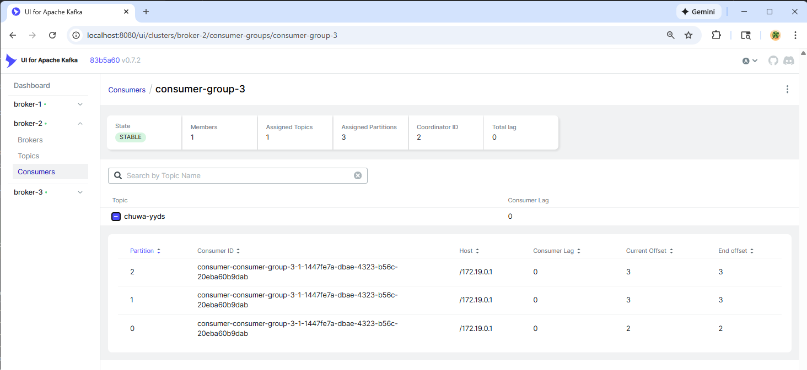
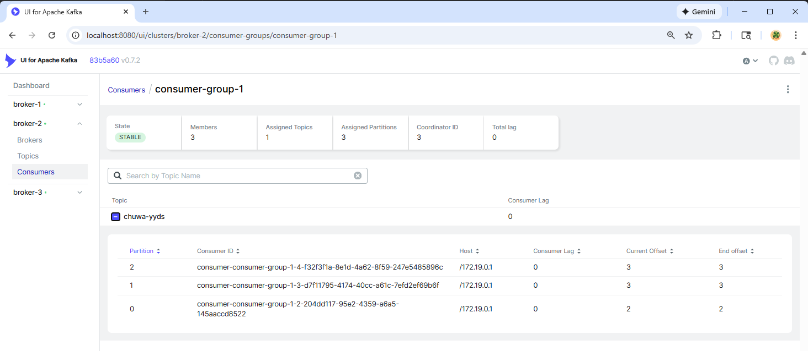


### 3. Then enable consumer 2 in application.properties:
```
# Enable/Disable Consumer Groups (set to false to disable a group)
kafka.consumer.group1.enabled=true
kafka.consumer.group2.enabled=true
kafka.consumer.group3.enabled=true
```
send more messages:
  POST http://localhost:8088/publish?message=msg9
  POST http://localhost:8088/publish?message=msg10
  POST http://localhost:8088/publish?message=msg11

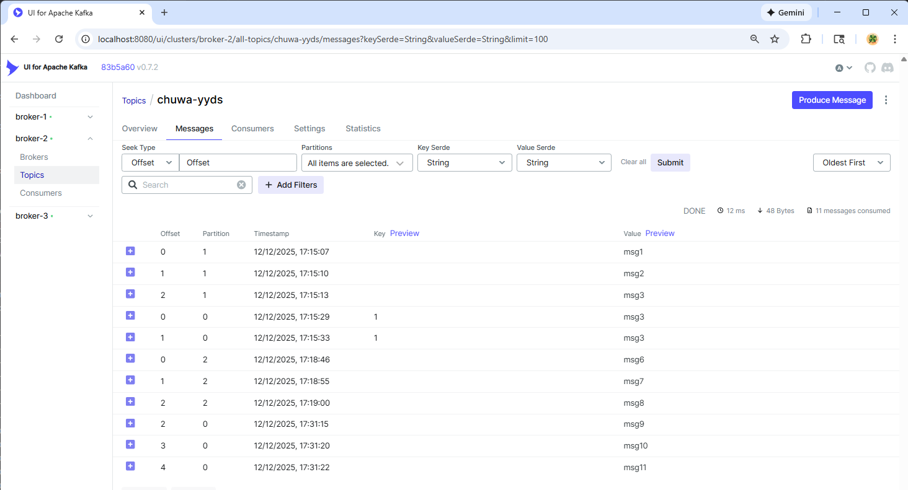

In **intellij console**, both consumer group1,2,3 receive messages:

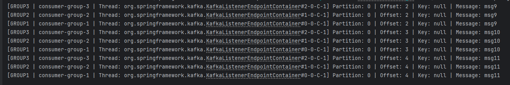

In  **UI for Apache Kafka**,  consumer group 1, 2, 3 are up:

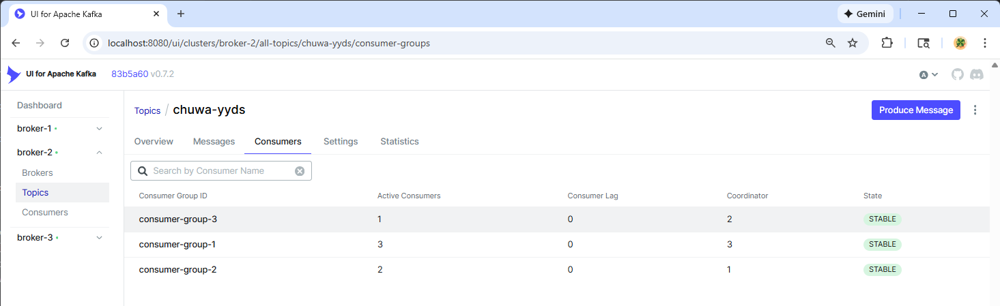
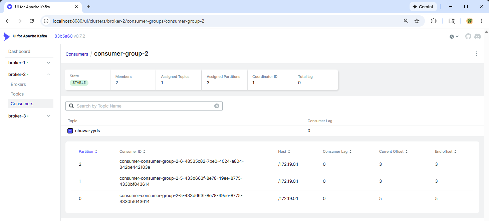
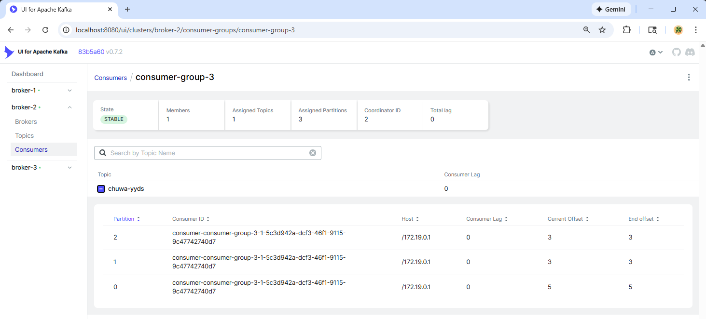
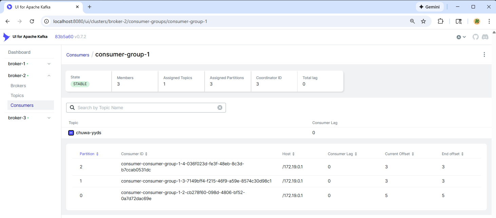

##   5. Demo different message delivery guarantees in Kafka, with necessary code or configuration changes.

A:
The basic version is in https://github.com/SiyanWen/Spring-Producer-Consumer delivery_guarantee_basic branch, and the DLQ (Dead Letter Queue) version is in delivery_guatantee_DLQ branch.

## Overview

### 1. At-Most-Once Delivery
- **Guarantee**: Messages may be **lost** but are **never redelivered**
- **Configuration**:
  - Producer: `acks=1` (leader only), `retries=0`(com.chuwa.demo.config.KafkaDeliveryGuaranteeConfig.java)
  - Consumer: `enable.auto.commit=true` (commits before processing)(com.chuwa.demo.config.KafkaConsumerConfig.java)
- **Use Cases**: Metrics, logs, monitoring data where occasional loss is acceptable
- **Risk**: If consumer crashes during processing, message is lost

### 2. At-Least-Once Delivery
- **Guarantee**: Messages are **never lost** but may be **redelivered**
- **Configuration**:
  - Producer: `acks=all` (all replicas), `retries=MAX`
  - Consumer: `enable.auto.commit=false` (manual commit after processing)
- **Use Cases**: Most common pattern - works well with idempotent consumers
- **Risk**: If consumer crashes after processing but before commit, message is reprocessed

### 3. Exactly-Once Delivery
- **Guarantee**: Messages delivered **exactly once** - no loss, no duplication
- **Configuration**:
  - Producer: `enable.idempotence=true`, `transactional.id` set, `acks=all`
  - Consumer: `isolation.level=read_committed`, manual commit
- **Use Cases**: Financial transactions, critical data processing
- **Risk**: Higher latency and overhead

---

## Configuration Comparison

| Setting | At-Most-Once | At-Least-Once | Exactly-Once |
|---------|--------------|---------------|--------------|
| **Producer** |
| acks | `1` | `all` | `all` |
| retries | `0` | `Integer.MAX_VALUE` | `Integer.MAX_VALUE` |
| enable.idempotence | `false` | `false` | `true` |
| transactional.id | - | - | `exactly-once-tx-` |
| **Consumer** |
| enable.auto.commit | `true` | `false` | `false` |
| isolation.level | `read_uncommitted` | `read_uncommitted` | `read_committed` |
| commit strategy | Auto (before processing) | Manual (after processing) | Manual (after processing) |

## Testing

To demo different message delivery guarantees, I wrote following Controller APIs:`/at-most-once`, `/at-least-once`, `/exactly-once/`, `/exactly-once/batch`, `/test/at-most-once/crash` and `/test/at-least-once/crash`.
For `/test/at-most-once/crash`, the `at most once` consumer would crash in the middle, but because the message is commited at beginning, the message wouldn't be re-delivered.

For `/test/at-least-once/crash`,  the `at least once` consumer would also crash in the middle, but the commit is manual and always be put at the end of the processing, so it wouldn't be comitted. If the consumer crash, or a network interruption happens, the consumer would dela with the lags.

To simulate the error, we can use a in-memory field Map<String, Integer> retryAttempts to track the retry times and bypass the exception and commit it when it reaches 3 times.

In real world, since this way is not reliable (the memory could lost after comsumer restart), we should use Dead Letter Queue (DLQ) to handle the "poison pill" to prevent it from blocking the entire partition.

```java
  @Autowired
  private KafkaTemplate<String, String> kafkaTemplate;

  private void sendToDeadLetterQueue(String key, String message, Exception e) {
      // Actually send to a DLQ topic
      kafkaTemplate.send("my-topic-dlq", key, message);
  }
```

Here we just log the error to mimic the DQL.

We also mimiced a consumer-side idempotency protection by checking idempotent key, which in real world should be part of the message payload and generated as an UUID type by the producer.

```java
  // Producer side - include idempotency key in message
  public class OrderEvent {
      private String idempotencyId;  // UUID generated by producer
      private String orderId;
      private BigDecimal amount;
      // ...
  }

  // When sending:
  OrderEvent event = new OrderEvent();
  event.setIdempotencyId(UUID.randomUUID().toString());  // YOU generate this
  event.setOrderId("12345");
  kafkaTemplate.send("orders", event);

  // Consumer side - extract from payload
  @KafkaListener(topics = "orders")
  public void consume(OrderEvent event) {
      String idempotencyId = event.getIdempotencyId();  // From message payload

      if (redis.exists("processed:" + idempotencyId)) {
          return;  // Already processed
      }

      processOrder(event);
      redis.set("processed:" + idempotencyId, "1", Duration.ofDays(7));
  }
```

For conveniency we just hardcode to return false for isDuplicate() on idempotency check.

**The basic version is in https://github.com/SiyanWen/Spring-Producer-Consumer delivery_guarantee_basic branch, and the DLQ (Dead Letter Queue) version is in delivery_guatantee_DLQ branch.**

### Normal single message processing by 3 consumer groups:

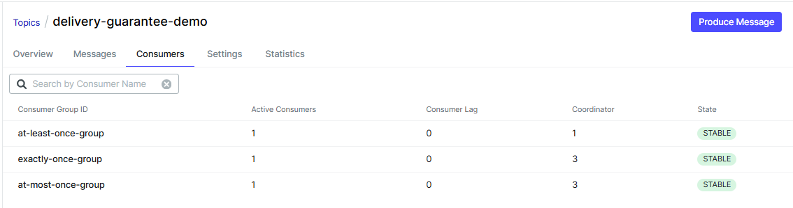
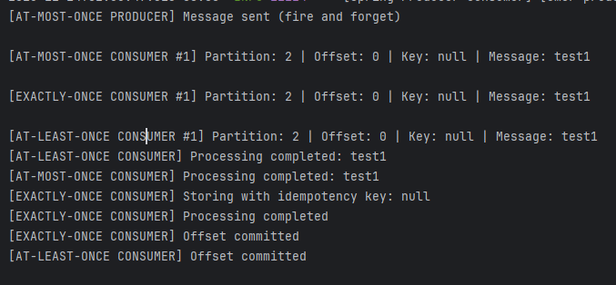
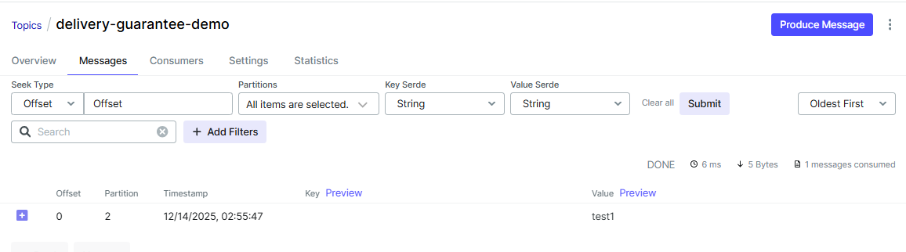
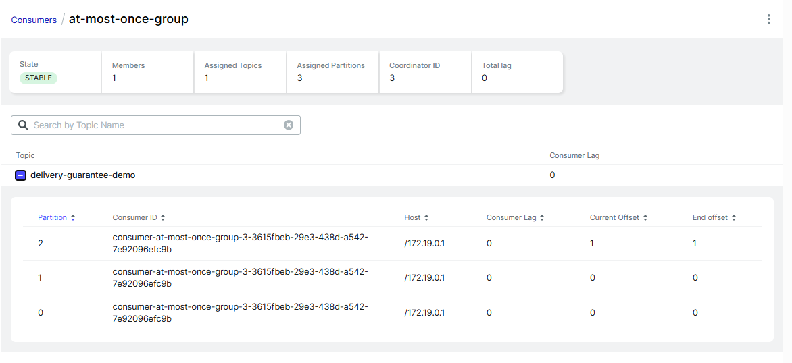
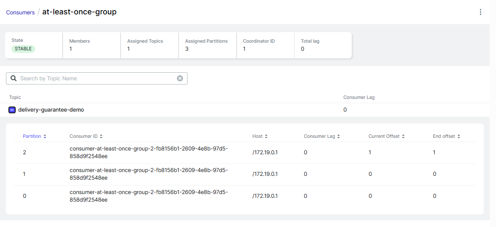
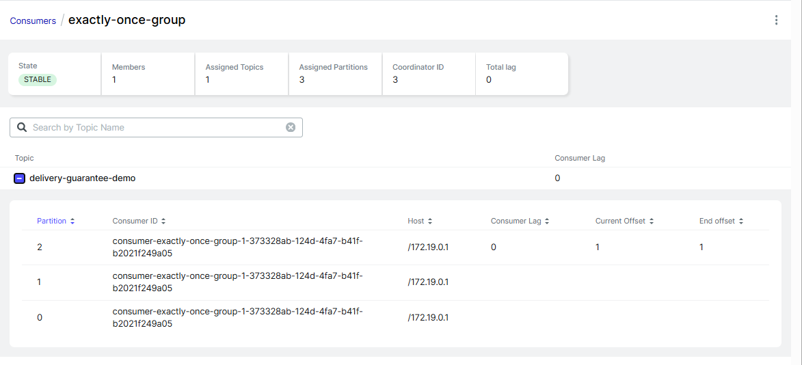


### crash test for at-most-once

send a message that contains "crash-at-most-once" (which would cause an unhandled exception during processing of at-most-once consumer).

We can see there is no `[AT-MOST-ONCE CONSUMER] Processing completed: crash-at-most-once` in the log, which suggests the message has never been processed.

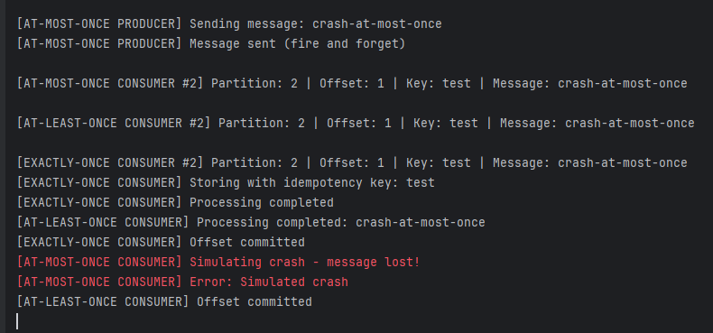
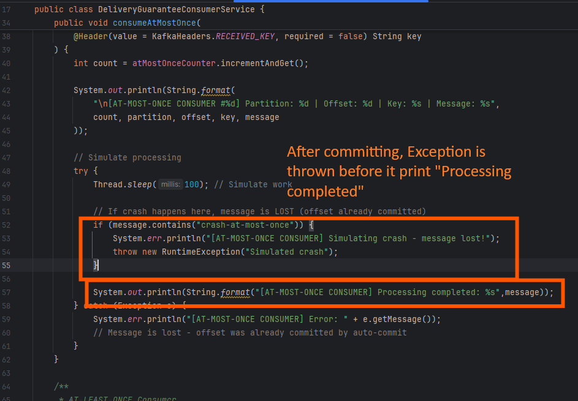

But there is no lag in every consumers.

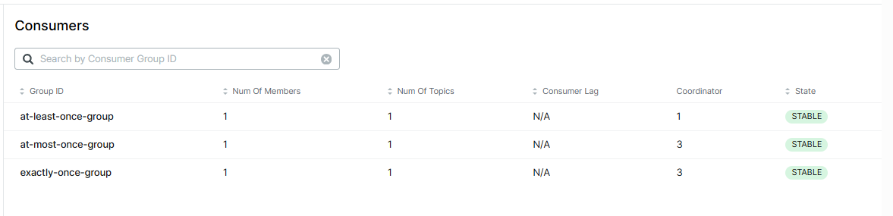
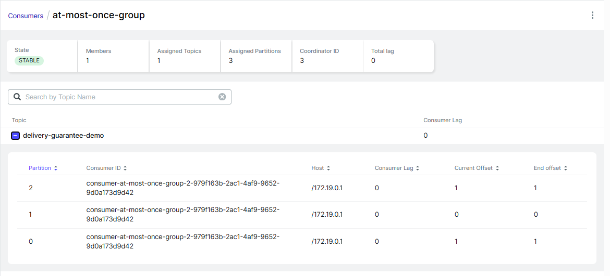
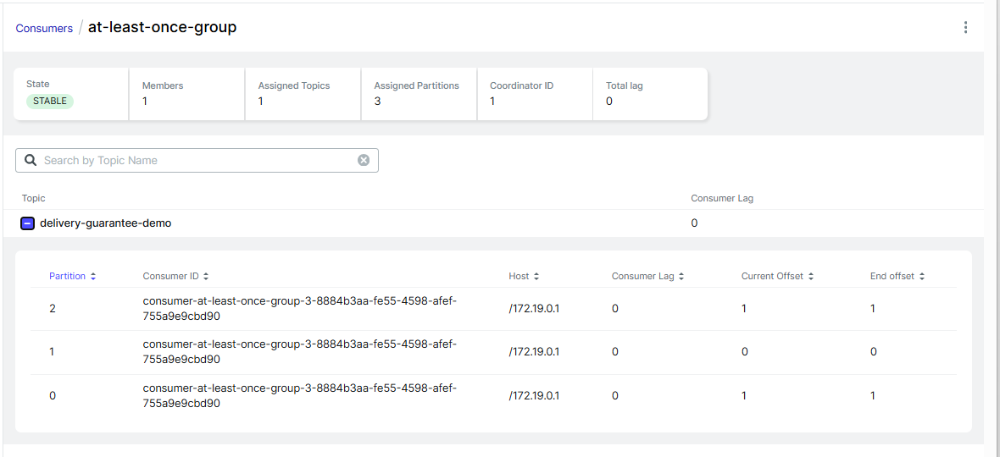
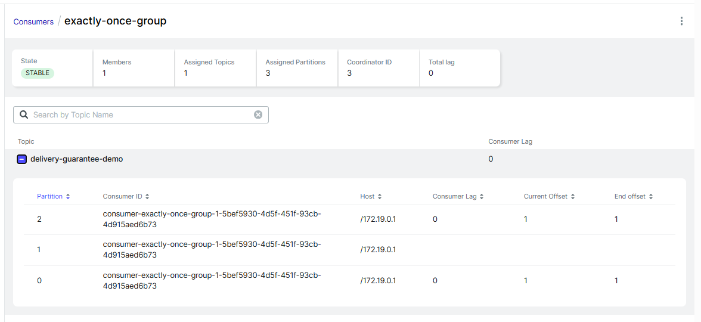

After shutting down backend, comment out the unhandled exception and restarting, no logging in intellij, indicating the message is not been re-processed.

### crash test for at-least-once

If we send a message that would crash the at-least-once consumer (message that contains "crash-at-least-once"):

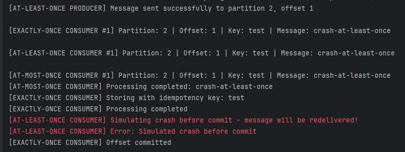

No `[AT-LEAST-ONCE CONSUMER] Processing completed: crash-at-least-once`.
No `[AT-LEAST-ONCE] Offset commited`.

The message is't processed, but it isn't committed, too.
There is a consumer lag in the at-least-once-group.

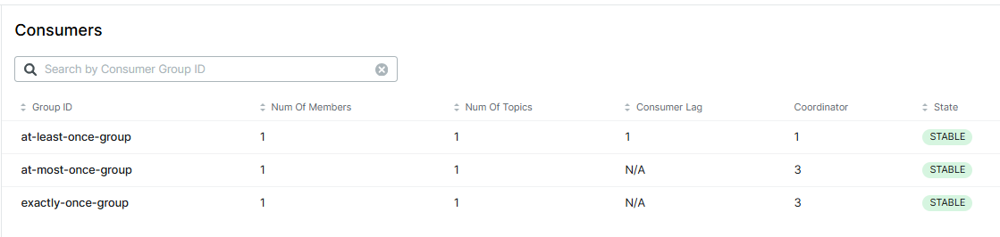
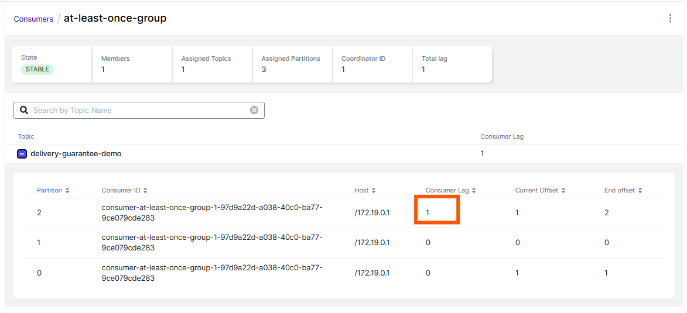

After shutting down backend, comment out the unhandled exception and restarting, the lags would be processed again.

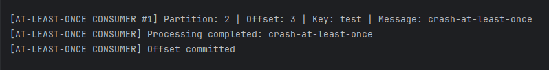

No consumer lag again.

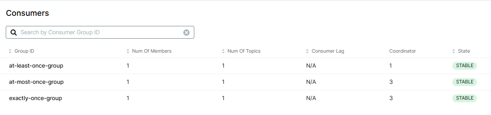

### use DLQ on at-least-once

Because that message is a "poison pill" so we should use Dead Letter Queue (DLQ). 

After using DLQ and a retry tracking map for each message (ConcurrentHashMap<>()), we make it jump out of "poison pill" after 3 attempts.

We no longer have lags in at-least-once consumer after sending a message contains "crash".

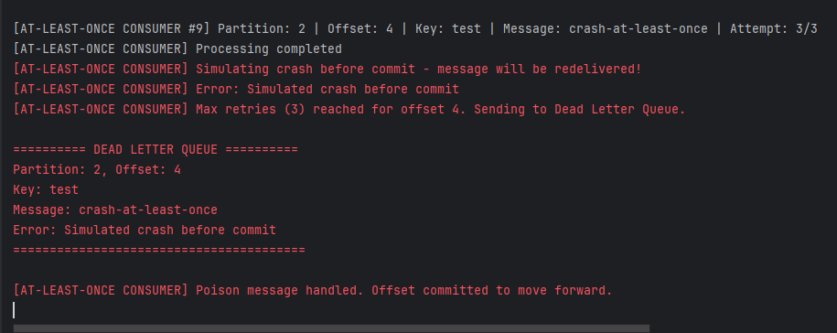
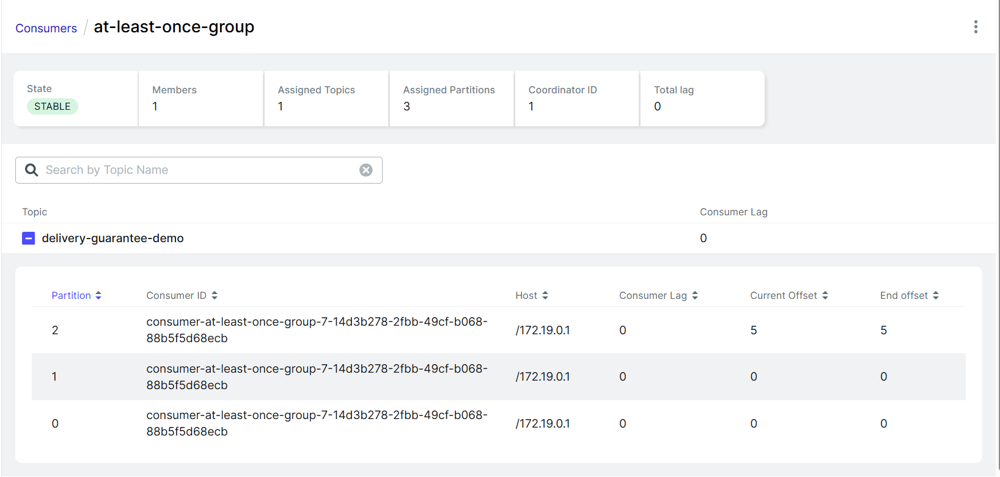

### exactly-once

For exactly-once, after sending a message:

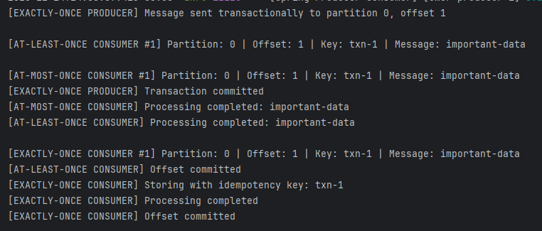

When the exactly-once producer commits a transaction, Kafka writes control records (COMMIT markers) to the log. These occupy offsets but are not consumable messages.
So both exactly-once and at-least-once consumers would have a lag, but it's control records (COMMIT markers).
At-most-once consumer doesn't have a consumer lag because:
  - Auto-commit commits based on the consumer's internal position
  - After polling, the consumer position advances past control records automatically

  | Consumer      | isolation.level            | Commit Mode | Lag |
  |---------------|----------------------------|-------------|-----|
  | at-most-once  | read_uncommitted (default) | Auto-commit | 0   |
  | at-least-once | read_uncommitted (default) | Manual      | 1   |
  | exactly-once  | read_committed             | Manual      | 1   |


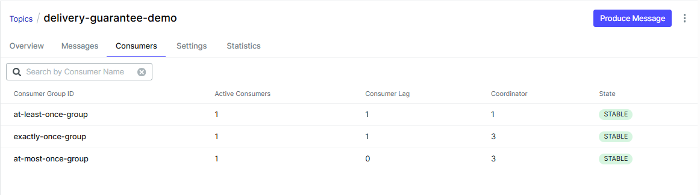

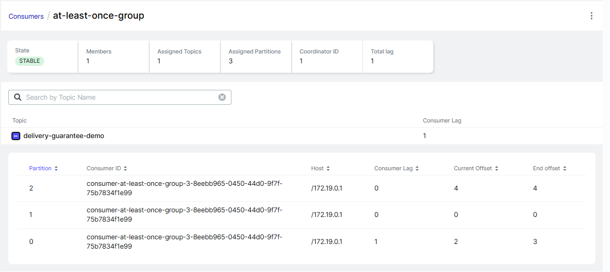
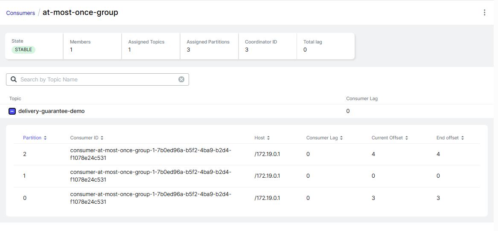

Since the idempotent key by kafka is not accessable by consumers, and it's hard to simulate a message with same idempotent key be sent twice (it consists of Producer ID (PID) + Sequence Number, not message kay or Application idempotency key), so we skip the interruption of exactly-once.

### `/exactly-once/batch` controller:
What it does:
- Sends multiple messages (default 5) as a single atomic transaction
- All messages either succeed together or fail together - no partial delivery

on the consumer side, it depends on the consumer's isolation.level:

isolation.level=read_uncommitted (default)

- Consumer sees messages immediately as they arrive
- May see partial batches if transaction hasn't committed yet
- Messages are indeed treated as 5 individual messages

isolation.level=read_committed

- Consumer only sees messages after transaction commits
- Either sees all 5 or none (no partial visibility)
- But still processes them as 5 individual messages (not a single batch)

Producer Transaction:
┌─────────────────────────────────────────┐
│  msg1 → msg2 → msg3 → msg4 → msg5 → COMMIT
└─────────────────────────────────────────┘

Consumer (read_committed):
  Waits... waits... waits... COMMIT detected!
  → consume msg1
  → consume msg2
  → consume msg3
  → consume msg4
  → consume msg5

Key Point

The transaction guarantees atomic visibility, not atomic consumption. The consumer still:
- Receives them one by one (or in poll batches based on max.poll.records)
- Commits offsets individually or in batches
- Can fail mid-way through processing the 5 messages

If you need the consumer to also process all 5 atomically (consume-transform-produce pattern), you'd need consumer-side transactions as well - which is a different pattern (read-process-write in a transaction).

Testing:

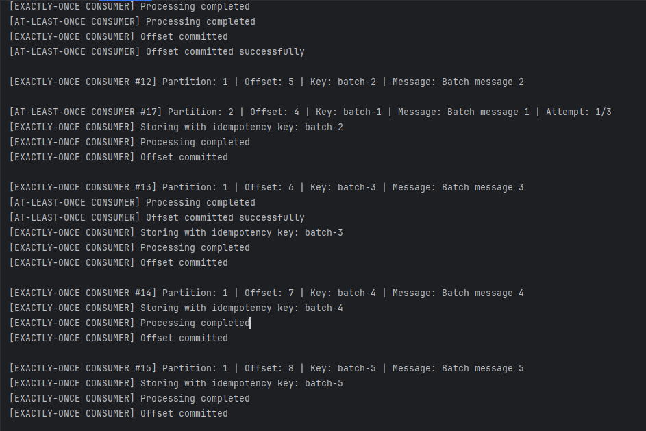
messages:
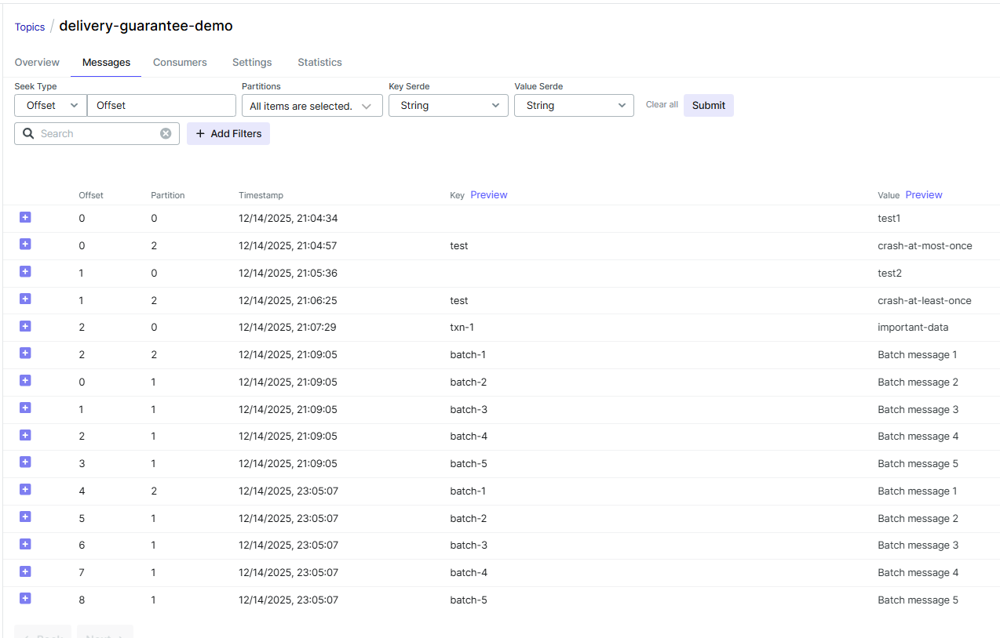
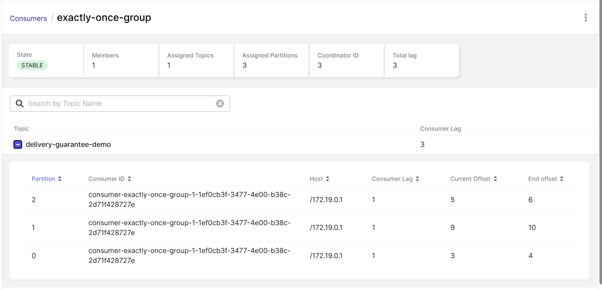

##   6. Write your own partitioning logic, to demo your messages will be assigned to different brokers, or you can also demo kafka's default round-robin paritioning logic, with code changes. 

**Note**: There's already a docker compose file in above git repo, you can start the 3 brokers (with zookeep) using docker-compose up command

### 1. Add custom partitioner.
In com.chuwa.demo.config,add CustomRoundRobinPartitioner which do hash on given message key and do Round Robun if the message key is null.
(Because Kafka would invoke 1partition()` twice, we need to use cache to prevent only using partition 1, 3, 5... when total number of partitions is even.)
```java
package com.chuwa.demo.config;

import org.apache.kafka.clients.producer.Partitioner;
import org.apache.kafka.common.Cluster;

import java.util.Arrays;
import java.util.Map;
import java.util.concurrent.atomic.AtomicInteger;

public class CustomRoundRobinPartitioner implements Partitioner {

    private final AtomicInteger counter = new AtomicInteger(0);

    // Cache to detect duplicate calls for the same message
    private final ThreadLocal<CachedPartition> cache = ThreadLocal.withInitial(() -> null);

    private static class CachedPartition {
        final String topic;
        final byte[] valueBytes;
        final int partition;

        CachedPartition(String topic, byte[] valueBytes, int partition) {
            this.topic = topic;
            this.valueBytes = valueBytes;
            this.partition = partition;
        }
    }

    @Override
    public int partition(String topic, Object key, byte[] keyBytes,
                         Object value, byte[] valueBytes, Cluster cluster) {

        int numPartitions = cluster.partitionCountForTopic(topic);

        // If key is provided, use key-based partitioning
        if (keyBytes != null) {
            return Math.abs(key.hashCode()) % numPartitions;
        }

        // Check if this is a duplicate call for the same message
        CachedPartition cached = cache.get();
        if (cached != null
                && cached.topic.equals(topic)
                && Arrays.equals(cached.valueBytes, valueBytes)) {
            // Same message, return cached partition (no increment)
            System.out.println("Custom partitioner (cached): " + cached.partition);
            return cached.partition;
        }

        // New message, compute partition using round-robin
        int partition = Math.abs(counter.getAndIncrement()) % numPartitions;

        // Cache the result for potential duplicate call
        cache.set(new CachedPartition(topic, valueBytes, partition));

        System.out.println("Custom partitioner (new): " + partition);
        return partition;
    }

    @Override
    public void close() {
        cache.remove();
    }

    @Override
    public void configure(Map<String, ?> configs) {
        // No custom config needed
    }
}
```
### 2. Add config to Producer.
A:
Code is in https://github.com/SiyanWen/Spring-Producer-Consumer custom_partitioner branch.
In com.chuwa.demo.config.KafkaDeliveryGuaranteeConfig, add:
```
props.put(ProducerConfig.PARTITIONER_CLASS_CONFIG, CustomRoundRobinPartitioner.class);
```
for the Producer Factory.

Test:

With partition key, the messages with the same key goes to the same partition:

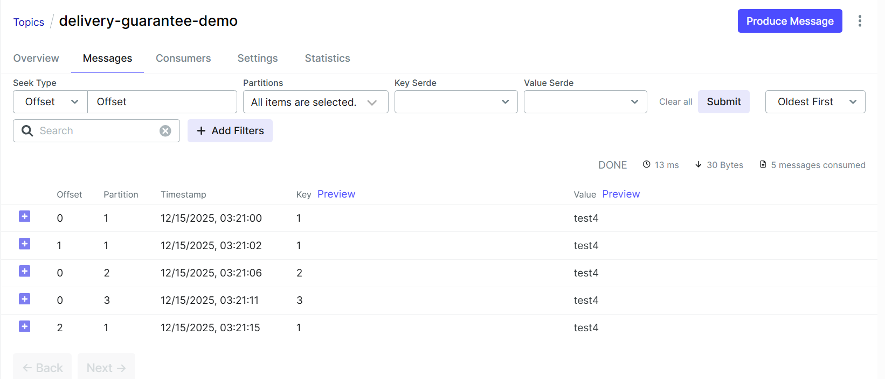

Without partition key, messages is distributed to each partitions in Round Robin way.

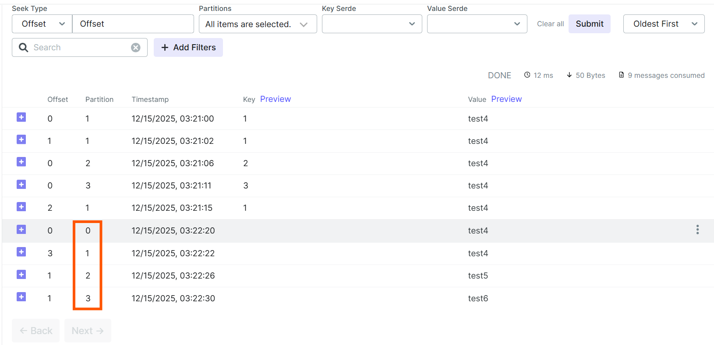

(Because the cache is seeing messages that have the same topics and message values as the same message, If you send two identical messages in a row (same content), the second message might get the cached partition instead of a new one. If that's a concern, you could add a timestamp or use a different caching strategy.)
