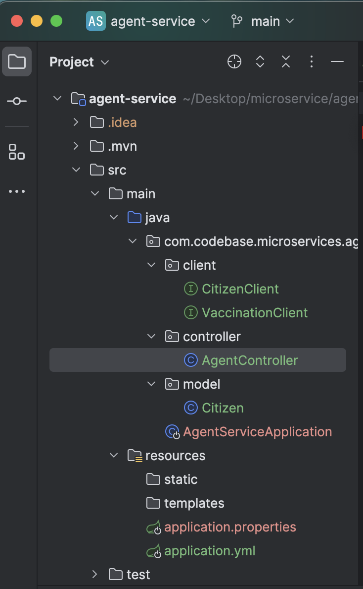
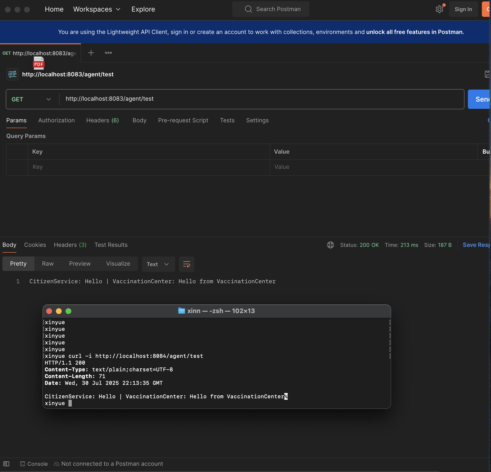

## 1.AgentAervice （microservice repo）
- Create a new service called  AgentService and register it to Euraka server and API gateway. use open feign  in AgentService to make calls to both CitizenService and VaccinationService (any endpoint is fine). (create your database record as needed)
Share your screen shot in markdown file.
example code will be provided after 07/28 in feign-client branch. try without looking at this first.

本服务用于聚合调用两个子服务——**CitizenService** 和 **VaccinationCenter**，并已通过 **API Gateway** 暴露给外部。

### 1.1 Service Registration
- Eureka Server: `http://localhost:8761`  
- 
  - `CITIZEN-SERVICE` (8081)  
  - `VACCINATION-CENTER` (8082)  
  - `AGENT-SERVICE` (8084)  

### 1.2 Gateway
| 路径                  | 方法 | 说明                       |
|-----------------------|------|----------------------------|
| `/agent/test` (Gateway) | GET  | 按 `Path=/agent/**` 转发到 `AGENT-SERVICE` 的 `/agent/test` |

### 1.3 Test
```bash
# 1. 直接调用 AgentService
curl -i http://localhost:8084/agent/test

# 2. 通过 postman API Gateway 调用
curl -i http://localhost:8083/agent/test
```

### 1.4 result
预期返回：CitizenService: Hello | VaccinationCenter: Hello from VaccinationCenter





### Workflow：
1. 用 Spring Initializr 新增 AgentService模块

2. pom.xml, application.yml 配置, gateway添加AgentService转发

3. Feign 接口（CitizenClient/VaccinationClient）

4. Controller (AgentController)

5. Test: EurekaServer（8761） -> CitizenService (8081)/VaccinationCenter(8082)/AgentService (8084) ->API_Gateway (8083)
单点测试：

curl -i http://localhost:8081/citizen/test → Hello

curl -i http://localhost:8082/vaccinationcenter/test → Hello from VaccinationCenter

聚合测试：

curl -i http://localhost:8084/agent/test
（8083也行，因为8083里配置了路由，会把 /agent/test 转发到 AgentService）


## 2. Message delivery semantics（Kafka repo）
- create your database/DAO and save the message in the  consumer. implement both At-Least-Once and At-Most-Once. share your screen shot in the markdown file

No matter whether the ack is sent or not, the data is committed to the database anyway.


If an error occurs before the ack, the data will not be committed to the database until the ack is sent. 


### Workflow：
1. pom.xml: 添加了 spring-boot-starter-data-jpa
   application.properties：
			spring.datasource.url=jdbc:mysql://localhost:3306/kafkaDemo?...
			spring.datasource.username=…
			spring.datasource.password=…
			spring.jpa.hibernate.ddl-auto=update
			server.port=8089
2. create Model (entity) and DAO (repo):
新建包 com.chuwa.demo.model，写入 MessageEntity：@Entity、id/msgKey/payload/consumedAt 字段。
新建包 com.chuwa.demo.dao，接口 MessageRepository extends JpaRepository<MessageEntity, Long>。

3. 配置 Kafka Producer & Consumer

4. 实现 Producer Controller

5. 实现 Consumer Service (At-Least-Once,  At-Most-Once)

6. 新增 docker-compose-single.yml 最简配置启动单机 Zookeeper + Kafka（9092/2181）


