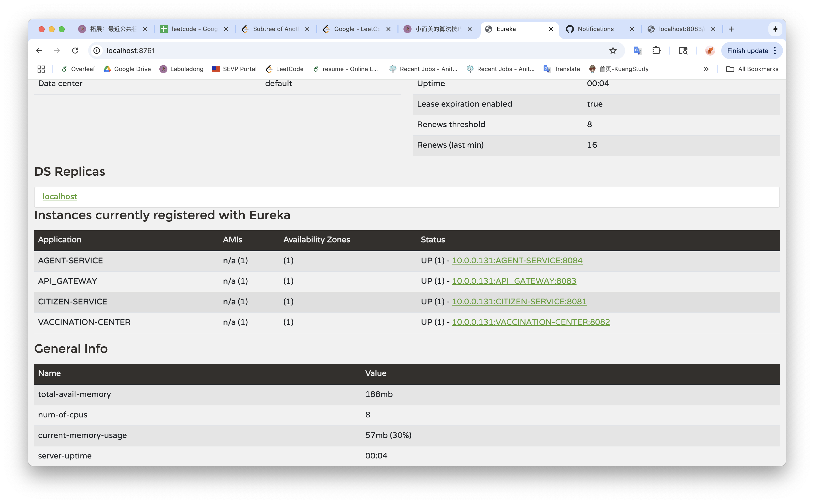
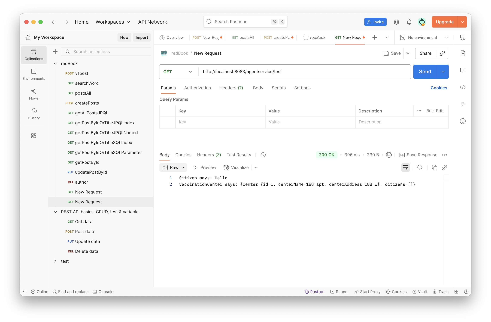
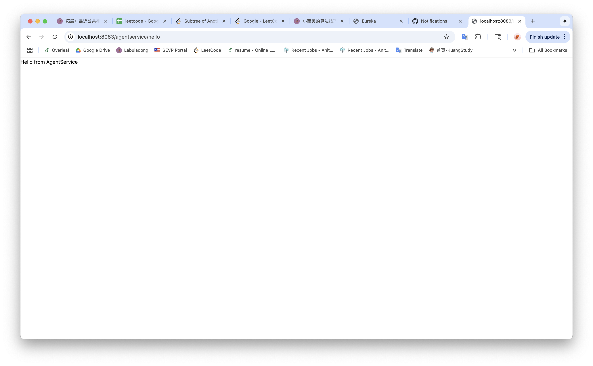

## 📌 Microservices Repo

### ✅ Task 1: Create a new service called `AgentService`
- [x] Registered with Eureka Server
- [x] Routed through Spring Cloud Gateway
- [x] Used OpenFeign to call **CitizenService** and **VaccinationService**

#### ✔️ Screenshot: AgentService registered in Eureka

#### ✔️ Screenshot: Feign client calls to CitizenService / VaccinationService

#### ✔️ Screenshot: API Gateway routing AgentService

---

## 📌 Kafka Repo

### ✅ Task 2: Create database/DAO and persist Kafka message in consumer
- [x] Implemented At-Least-Once delivery (with retries and idempotent checks)
- [x] Implemented At-Most-Once delivery (ack before processing)
- 
#### ✔️ Screenshot: At-Least-Once delivery implementation

#### ✔️ Screenshot: At-Most-Once delivery implementation

