# HW17 - MicroServices & Kafka Hands-on

1. [microservice repo](https://github.com/CTYue/microservices.git): Create a new service called  AgentService and register it to Euraka server and API gateway. Use open feign in AgentService to make calls to both CitizenService and VaccinationService (any endpoint is fine). (create your database record as needed)

   Share your screenshot in markdown file.

   Example code will be provided after 07/28 in `feign-client` branch. Try without looking at this first.

   **My repo:** https://github.com/hululu9/microservices/tree/hw17

   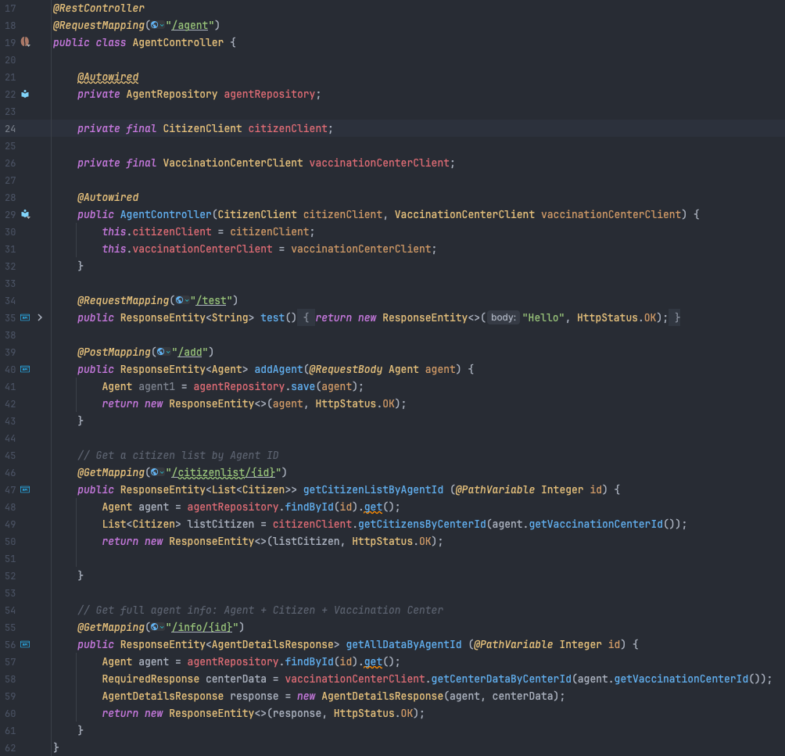

   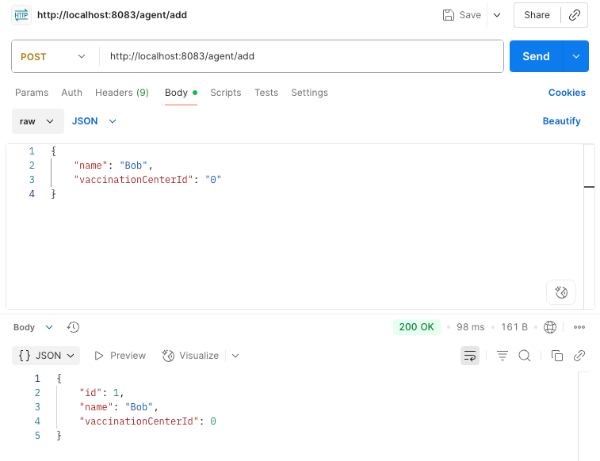

   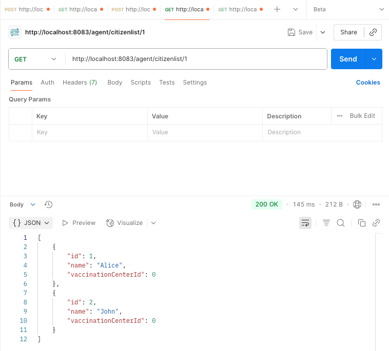

   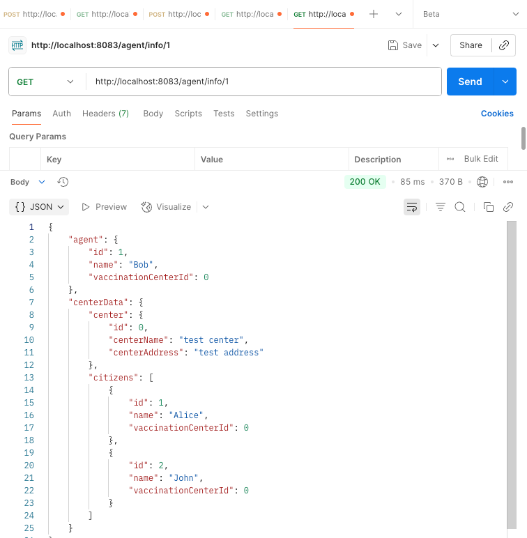

   

2. [kafka repo](https://github.com/CTYue/Spring-Producer-Consumer.git): Create your database/DAO and save the message in the consumer. Implement both At-Least-Once and At-Most-Once. Share your screenshot in the markdown file.

   **My repo:** https://github.com/hululu9/Spring-Producer-Consumer/tree/hw17

   - **At-Most-Once:**

   *KafkaConsumerService*:

   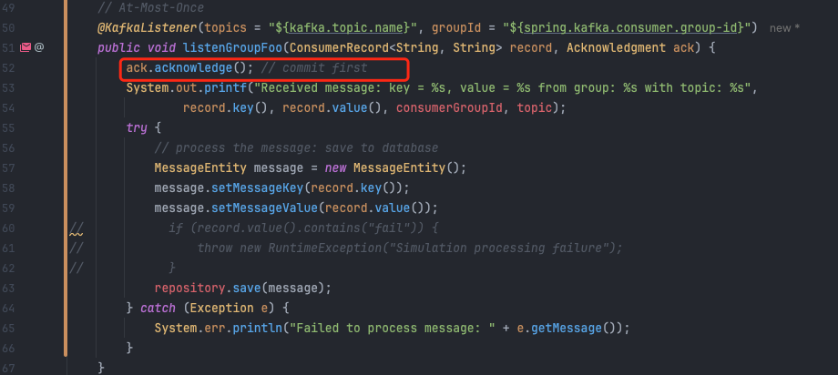

   *KafkaConsumerConfig*:

   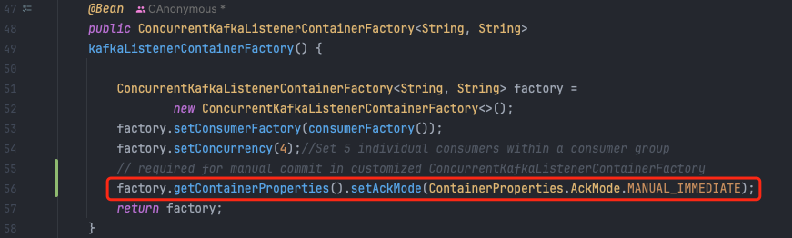

   *application.properties*:

   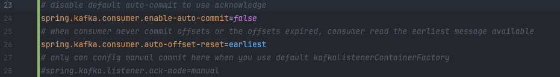

   **Test and results**:

    1. Processing data successfully: message shown in the UI, and data stored into the DB
   
      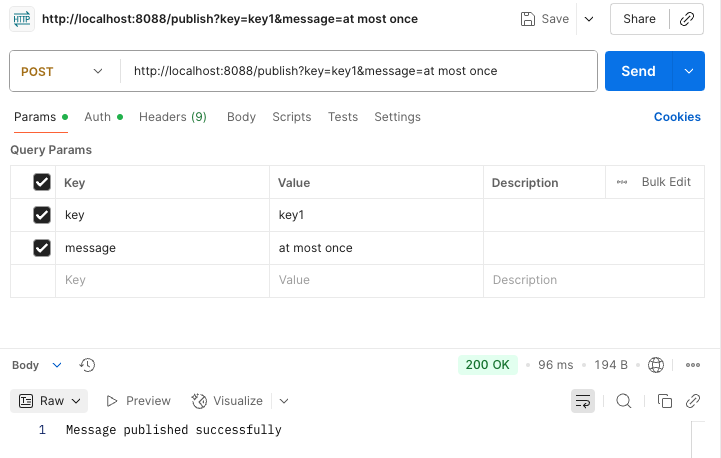
   
      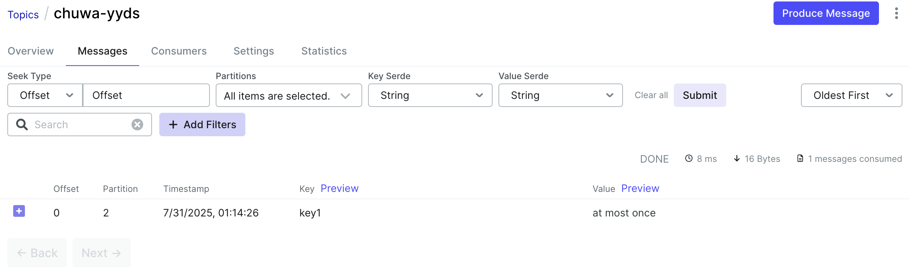

      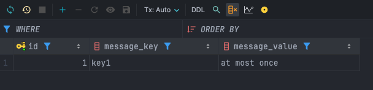

    2. Processing data fails: message shown in the UI, but no data stored into the DB

      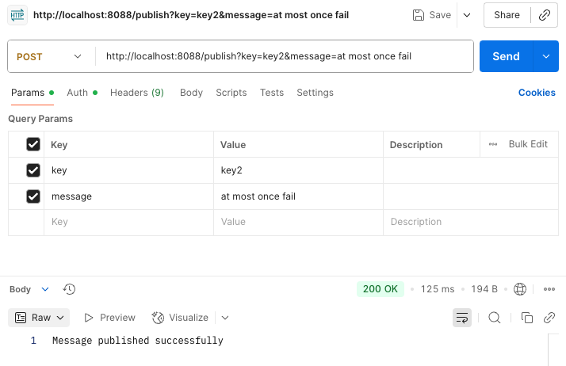

      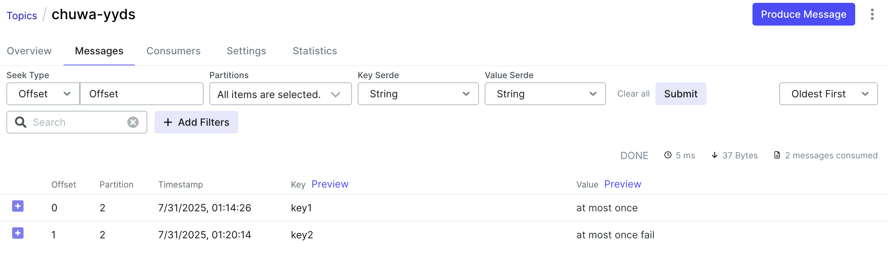

      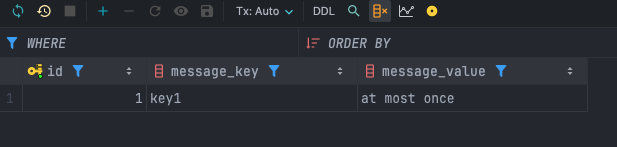
   
   

   - **At-Least-Once:**

   *KafkaConsumerService*:

   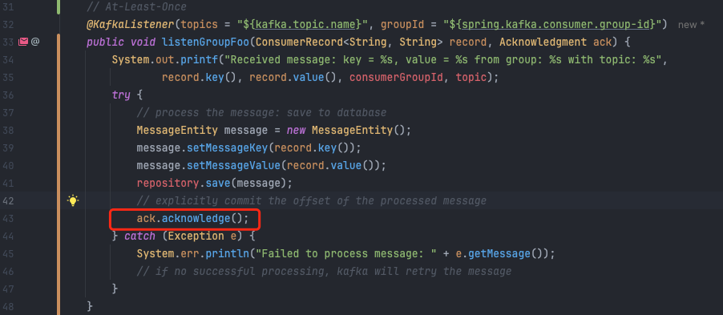

   *KafkaConsumerConfig*:

   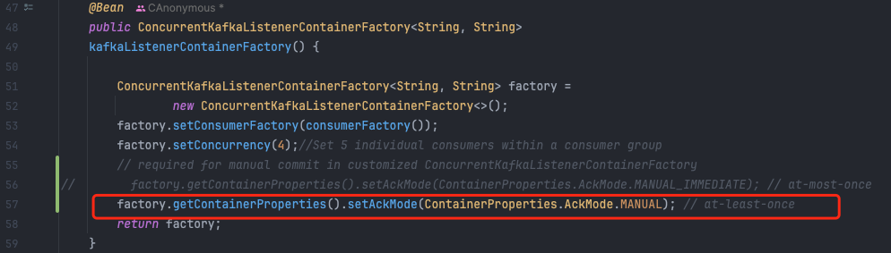

   **Test and results**:
   
   1. Processing data successfully:  message shown in the UI, and data stored into the DB
   
      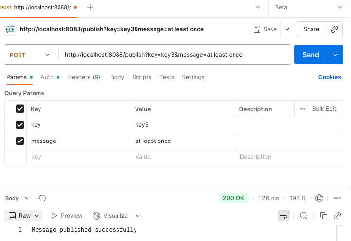
   
      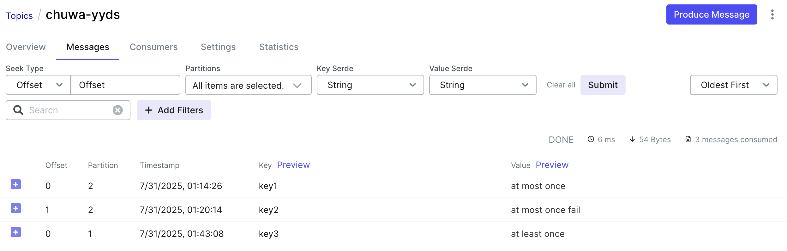
   
      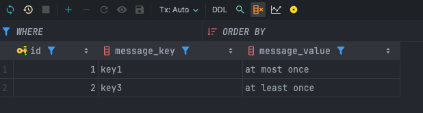
   
   2. Simulate failure: temporarily comment out `ack.acknowledge()` and restart the app. Kafka will **redeliver** the message(Consumer lag = 1: offset wasn’t committed) and **duplicate messages** in the DB.
   
      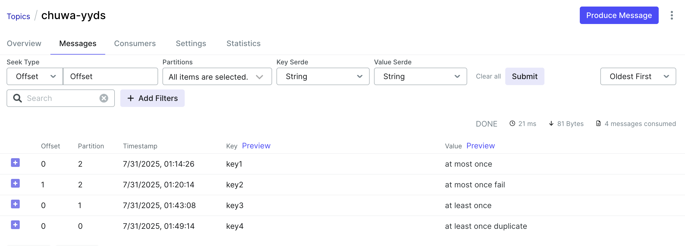
   
      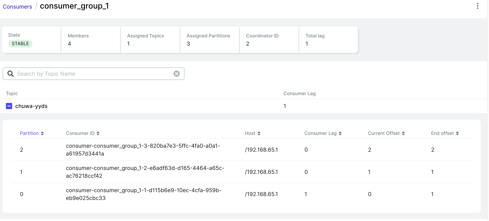
   
      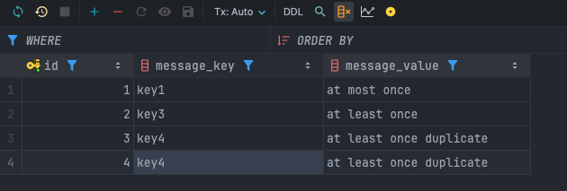
