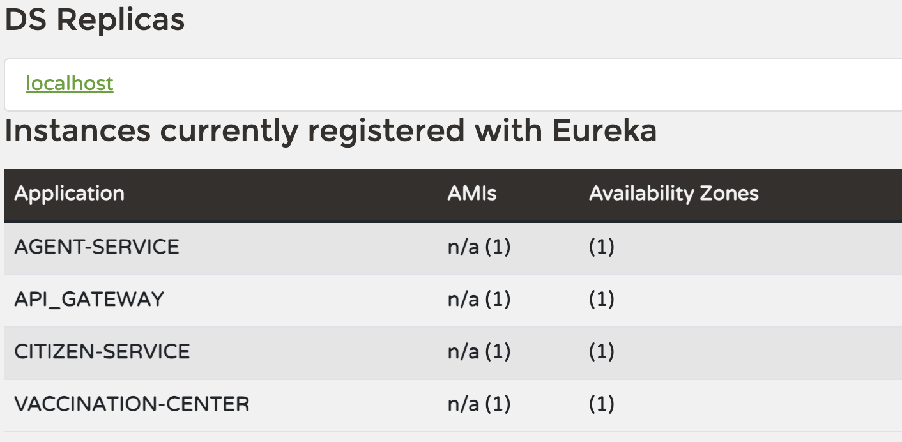
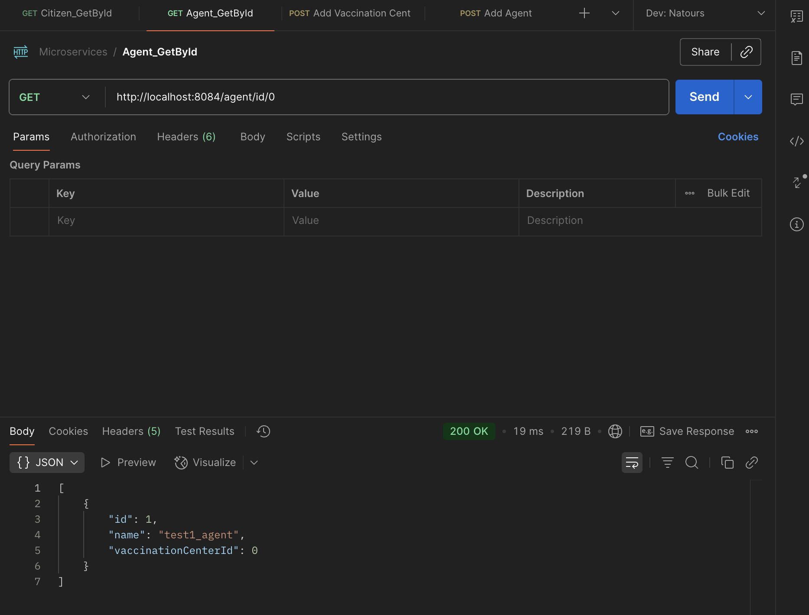
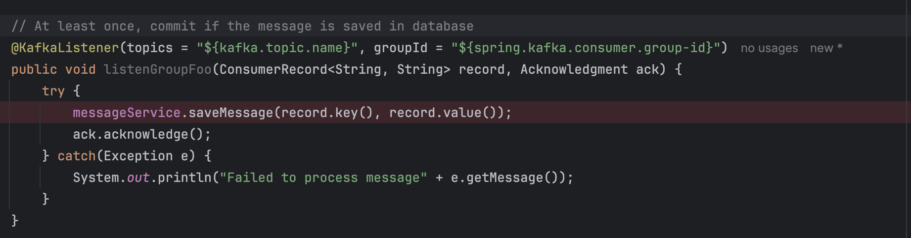
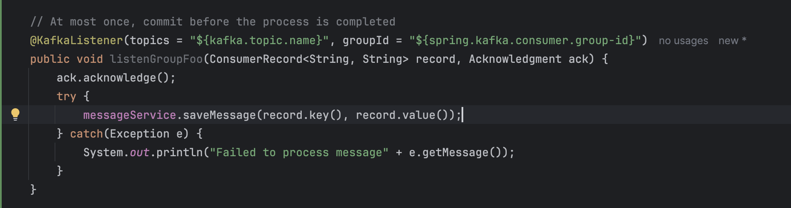
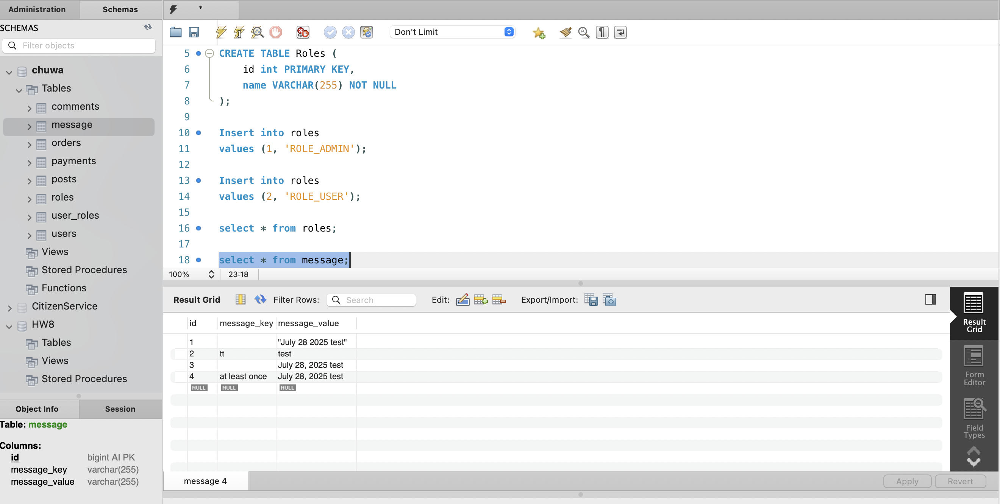
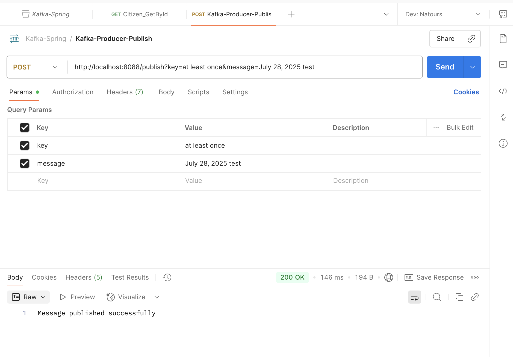

<h3> microservice repo: Create a new service called  AgentService and register it to Euraka server and API gateway. use open feign  in AgentService to make calls to both CitizenService and VaccinationService (any endpoint is fine). (create your database record as needed)
Share your screenshot in markdown file. </h3>

<h3> kafka repo: create your database/DAO and save the message in the  consumer. implement both At-Least-Once and At-Most-Once.  
share your screenshots in the markdown file </h3>

At least once, the commit occurs after process is completed.

At most once, the commit right before the process.

Database

PostMan Api Call

