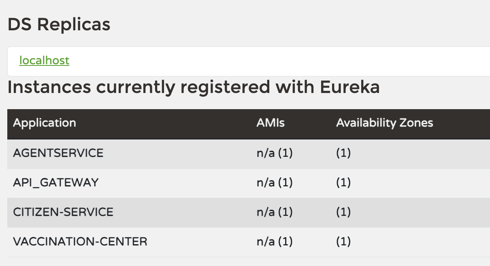
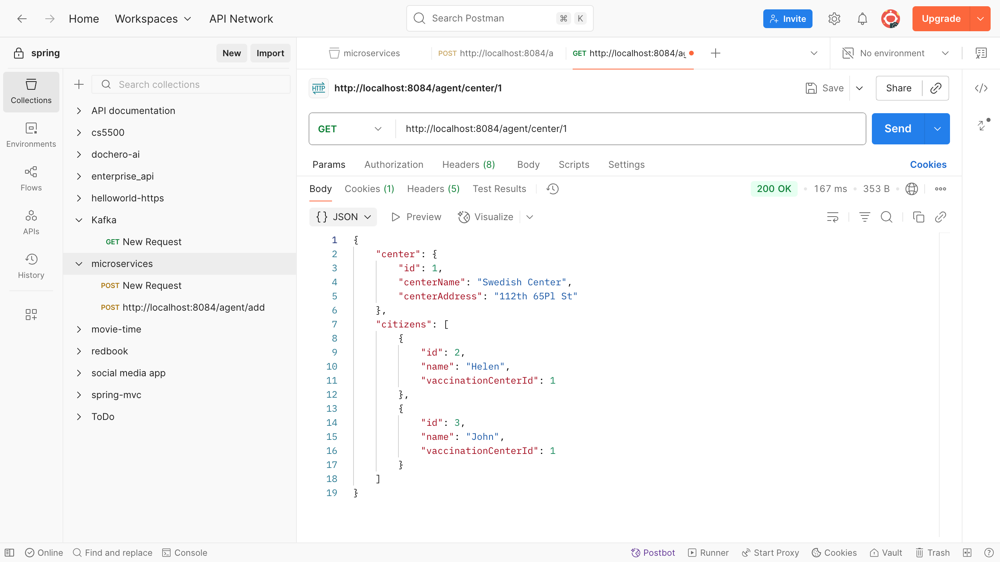
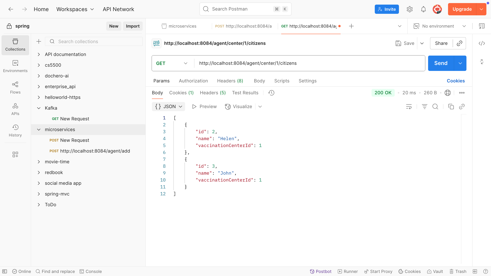
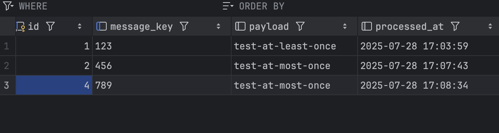

# HW17

---

### 1. Create a new service called AgentService and register it to Euraka server and API gateway. use open feign in AgentService to make calls to both CitizenService and VaccinationService (any endpoint is fine). (create your database record as needed)

- Codebase: https://github.com/WeixinLiu618/microservices

- Screenshots:
- 
- 
- 

---

### 2. Create your database/DAO and save the message in the  consumer. implement both At-Least-Once and At-Most-Once. share your screen shot in the markdown file

- Codebase: https://github.com/WeixinLiu618/Spring-Producer-Consumer

#### **At-Least-Once** (Default Kafka Behavior)

**Characteristics**:

- Process message **before** committing offset. Or Commit offset AFTER processing
- If processing fails → the consumer **will retry** (because offset is not committed yet).
- Risk: **duplicate processing** if retries happen → must implement **idempotency**.

**Steps**:

1. Disable auto-commit: `enable.auto.commit=false`
2. Commit manually **after saving to DB**.
3. Use `Acknowledgment` parameter in `@KafkaListener`.

```java
 // ---------- AT-LEAST-ONCE ------------ 
@KafkaListener(topics = "${kafka.topic.name}", groupId = "${spring.kafka.consumer.group-id}")
public void consumeAtLeastOnce(@Payload String message,
                               @Header(KafkaHeaders.RECEIVED_KEY) String messageKey,
                               Acknowledgment ack) {

    System.out.println("[AT-LEAST-ONCE] Received message: " + message + " from group: " + consumerGroupId);

    try {
        // Idempotency check
        if (!messageRepository.findByMessageKey(messageKey).isPresent()) {
            Message entity = new Message(messageKey, message);
            messageRepository.save(entity);
            System.out.println("Message saved: " + messageKey);
        } else {
            System.out.println("Duplicate detected: " + messageKey);
        }

        ack.acknowledge(); // Commit offset AFTER processing
    } catch (Exception e) {
        System.err.println("Error while saving message: " + e.getMessage());

    }
}
```

---

#### **At-Most-Once**

**Characteristics**:

- Commit **before** processing.
- If failure occurs during DB write, message is **lost** (never retried).
- Good for non-critical logs/analytics where duplicates are worse than loss.

**Steps**:

1. Commit offset **as soon as message is received**.
2. Then process the message (no retries if failure).

```java
// ---------- AT-MOST-ONCE ------------
@KafkaListener(topics = "${kafka.topic.name}", groupId = "${spring.kafka.consumer.group-id}", containerFactory = "atMostOnceFactory")
public void consumeAtMostOnce(@Payload String message,
                              @Header(KafkaHeaders.RECEIVED_KEY) String messageKey,
                              Acknowledgment ack) {

    System.out.println("[AT-MOST-ONCE] Received message: " + message);

    // Commit FIRST (risk: message loss if DB fails)
    ack.acknowledge();

    try {
        Message entity = new Message(messageKey, message);
        messageRepository.save(entity);
        System.out.println("Message saved (at-most-once): " + messageKey);
    } catch (Exception e) {
        System.err.println("Error while saving message (lost): " + e.getMessage());
    }
}
```

