### hw17

---
### 1. 
In `microservices` repo:   

Create a new service called `AgentService` and register it to `Eureka
   server` and `API gateway`. 

Use `open feign` in `AgentService` to make calls to both
   `CitizenService` and `VaccinationService` (any endpoint is fine).

Share your screenshots in this markdown file.

---

`AgentService` in Eureka as `AGENT-SERVICE`.


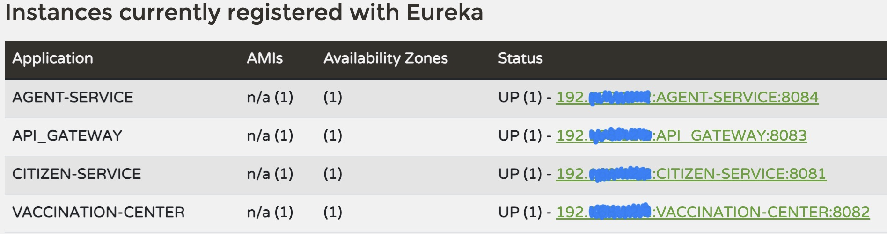

I wrote 5 end-points using `OpenFeign`:

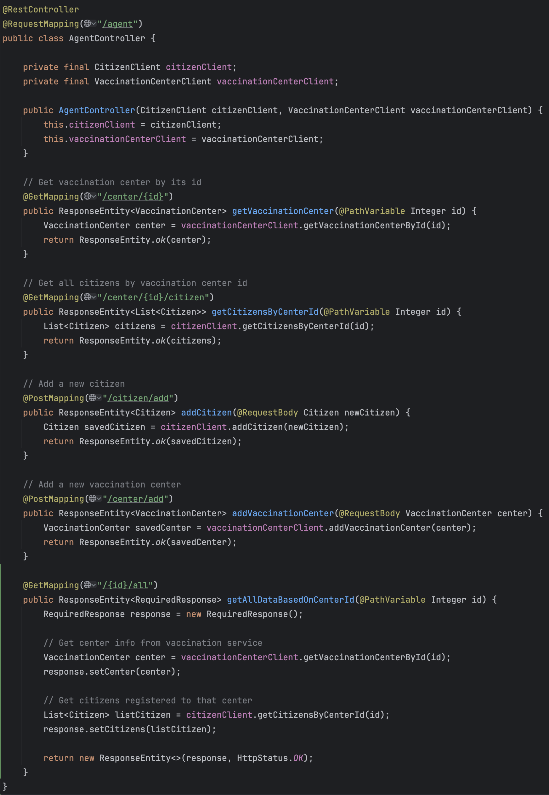


OUTPUTS:

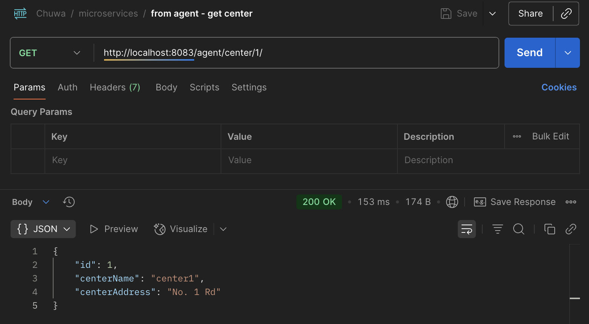


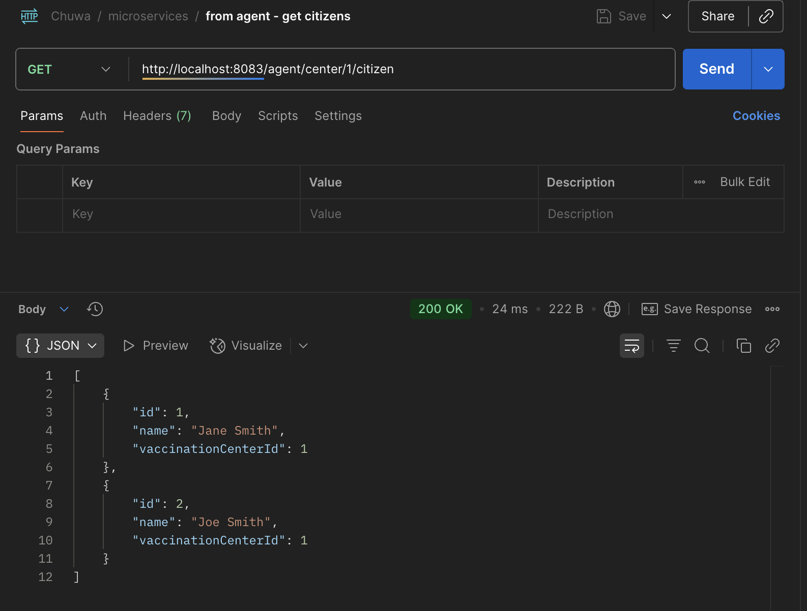


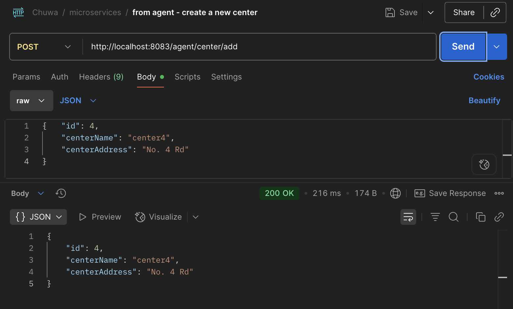


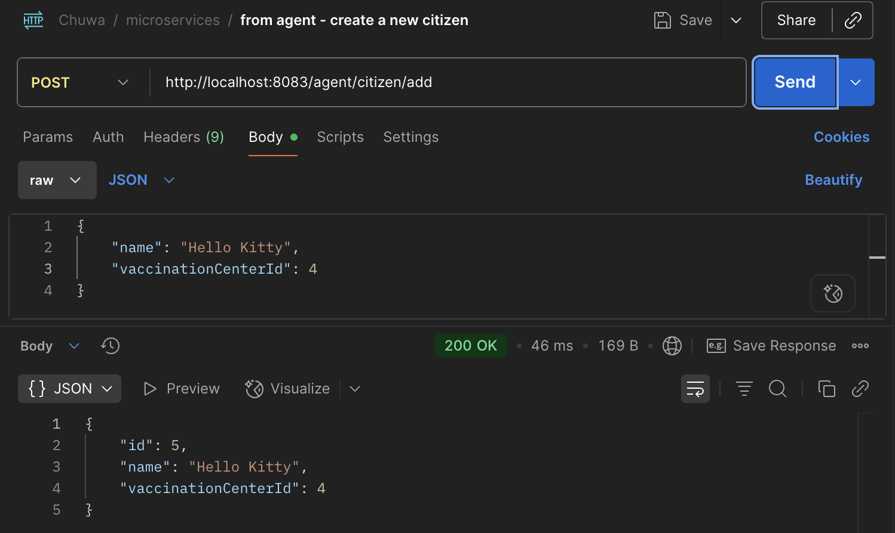

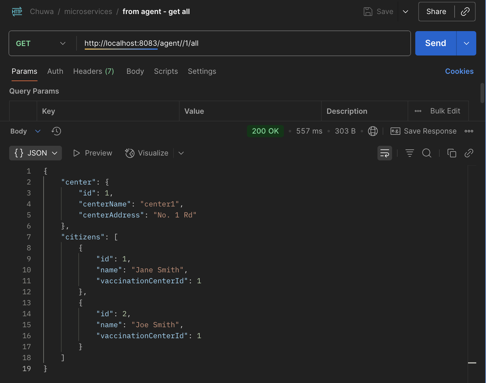


---
### 2.
In `kafka` repo:

Create your database and DAO, and save the message in the consumer.

Implement both `At-Least-Once` and `At-Most-Once`.
 
Share your screenshots in this markdown file.

---

### At-Least-Once:

Add in `application.properties`:
```properties
# For manually committing offsets
spring.kafka.consumer.enable-auto-commit=false
```

Config change for `ConcurrentKafkaListenerContainerFactory` in `KafkaConsumerConfig`:
```java
factory.getContainerProperties().setAckMode(ContainerProperties.AckMode.MANUAL);
```


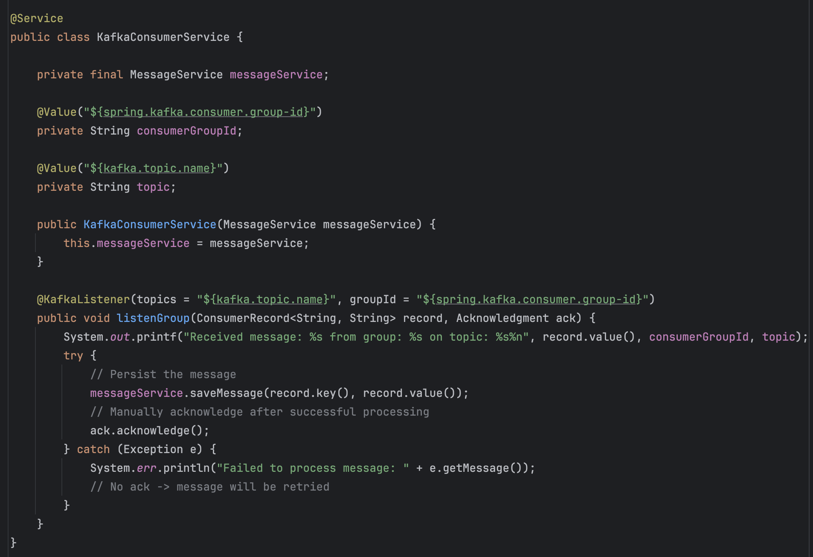


---
### At-Most-Once:

Add in `application.properties`:
```properties
# For manually committing offsets
spring.kafka.consumer.enable-auto-commit=false
```

Config change for `ConcurrentKafkaListenerContainerFactory` in `KafkaConsumerConfig`:
```java
factory.getContainerProperties().setAckMode(ContainerProperties.AckMode.MANUAL_IMMEDIATE);
```

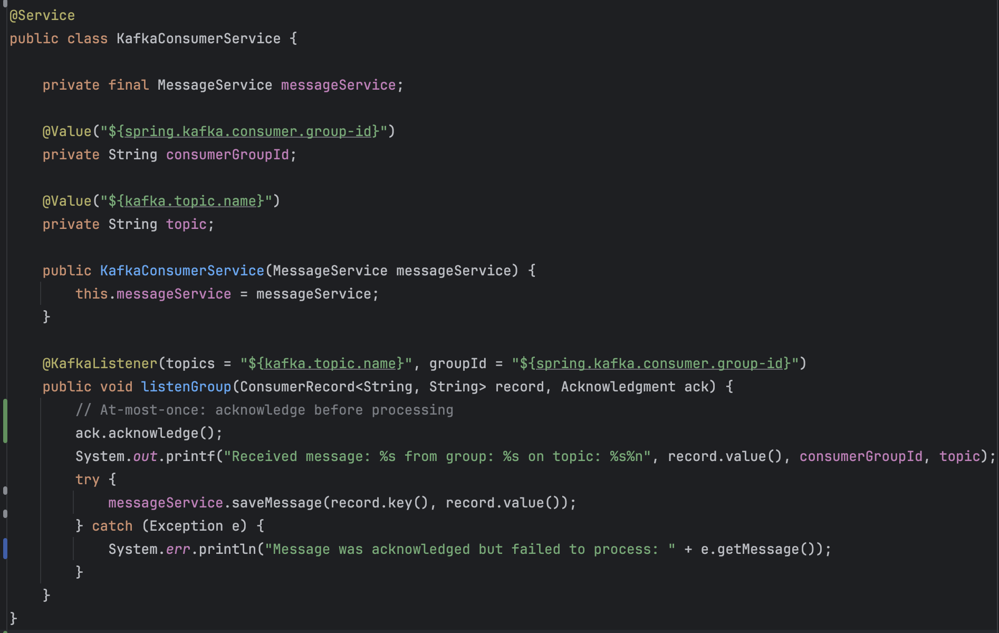

---

POSTMAN:

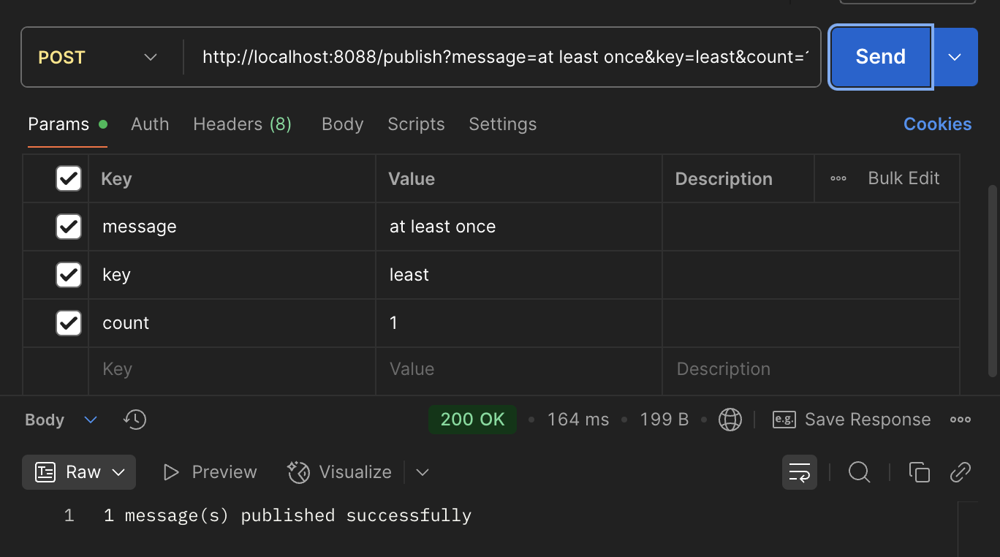

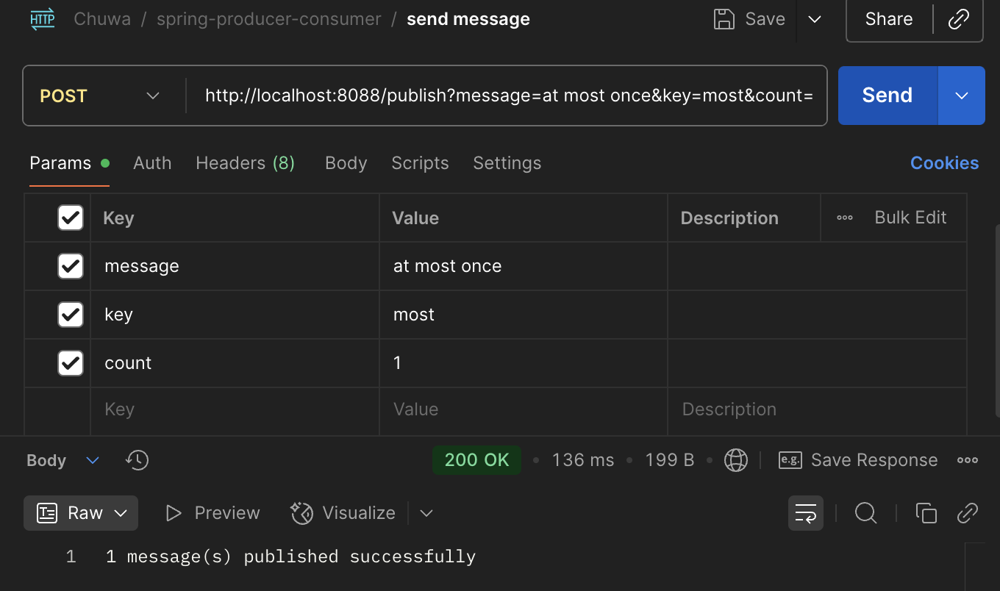

KAFKA-UI:

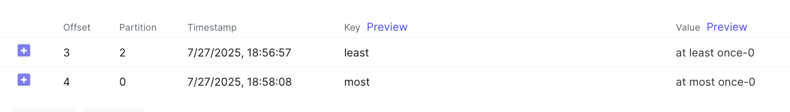

DATABASE:

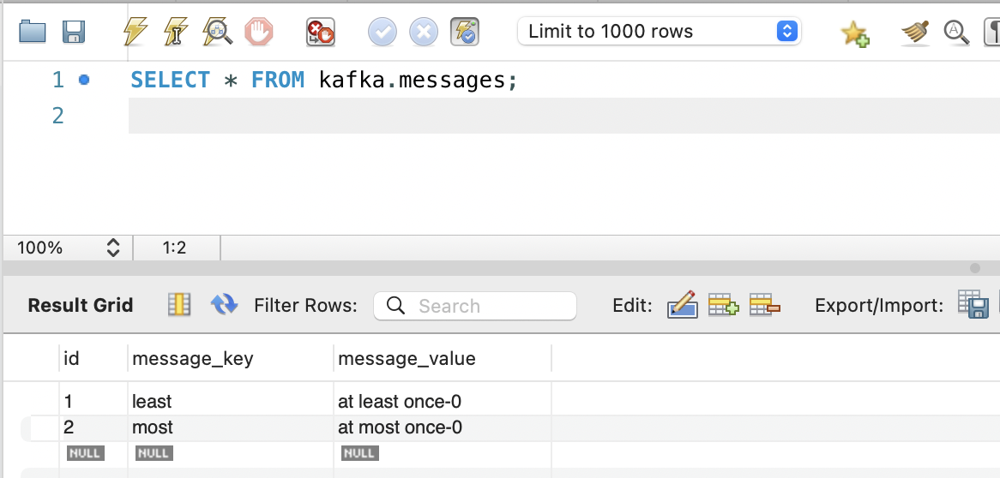
