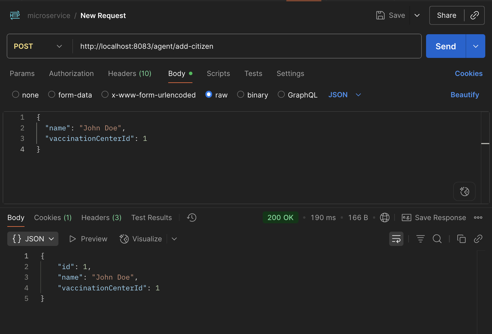
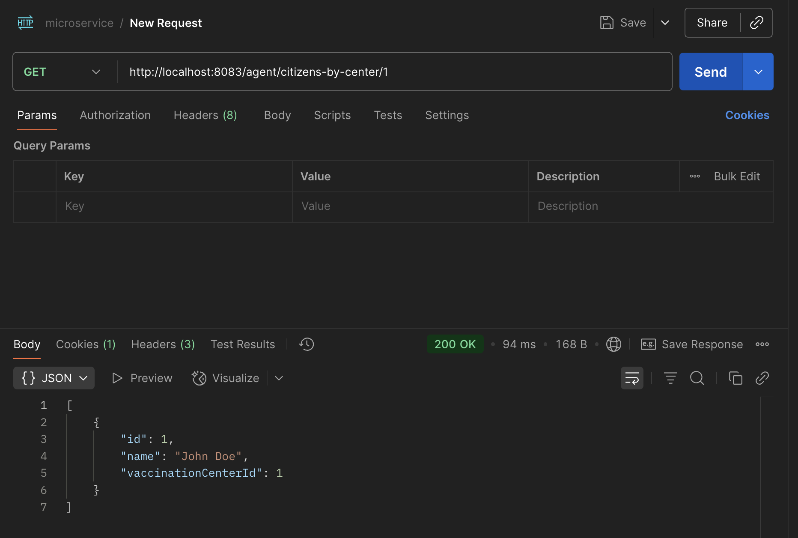
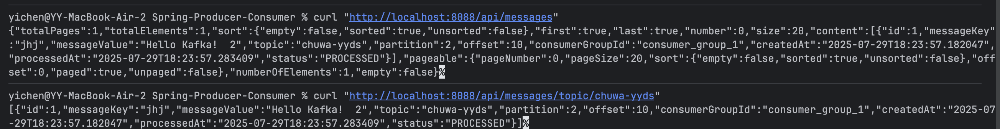
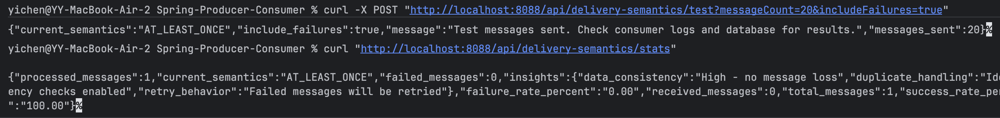

### 1. [microservice repo](https://github.com/CTYue/microservices)
- bring up services
  - config databases for client, vaccination services
  - create databases for client, vaccination services
- Create a new service called  AgentService and register it to Euraka server and API gateway. 
- use open feign  in AgentService to make calls to both CitizenService and VaccinationService (any endpoint is fine). (create your database record as needed)
- Share your screen shot in markdown file.
  - add citizen through AgentService
  
  - find citizens by agent 
  
- submitted repo: https://github.com/ethannchen/microservices

### 2. [kafka repo](https://github.com/CTYue/Spring-Producer-Consumer)
- create your database/DAO and save the message in the  consumer. 
  
- implement both At-Least-Once and At-Most-Once.  

- share your screen shot in the markdown file
   
   
- submitted repo: https://github.com/ethannchen/Spring-Producer-Consumer/tree/hw17