# 1. microservice repo (https://github.com/CTYue/microservices.git): Create a new service called  AgentService and register it to Euraka server and API gateway. use open feign  in AgentService to make calls to both CitizenService and VaccinationService (any endpoint is fine). (create your database record as needed)

Share your screen shot in markdown file.

example code will be provided after 07/28 in feign-client branch. try without looking at this first.

A:
Code is in https://github.com/SiyanWen/microservices/tree/create_agent_service create_agent_service branch.
  AgentService Structure

  AgentService/
  ├── pom.xml                          (Maven config with OpenFeign, Eureka Client, JPA)
  ├── src/main/java/.../AgentService/
  │   ├── AgentServiceApplication.java (@EnableFeignClients)
  │   ├── controller/
  │   │   └── AgentController.java     (REST endpoints)
  │   ├── entity/
  │   │   └── Agent.java               (JPA entity)
  │   ├── feign/
  │   │   ├── CitizenServiceClient.java     (Feign client for CitizenService)
  │   │   └── VaccinationCenterClient.java  (Feign client for VaccinationCenter)
  │   ├── model/
  │   │   ├── AgentResponse.java
  │   │   ├── Citizen.java
  │   │   └── VaccinationCenter.java
  │   └── repository/
  │       └── AgentRepository.java
  └── src/main/resources/
      └── application.yml              (Port 8084, Eureka registration, MySQL config)

  Key Features

  - Port: 8084
  - Service Name: AGENT-SERVICE
  - Database: MySQL (AgentService database - you'll need to create it)
  - Eureka: Auto-registers at http://localhost:8761/eureka/
  - API Gateway: Route added for /agent/**

  OpenFeign Clients

  CitizenServiceClient calls:
  - GET /citizen/test
  - GET /citizen/id/{id}
  - POST /citizen/add

  VaccinationCenterClient calls:
  - POST /vaccinationcenter/add
  - GET /vaccinationcenter/id/{id}

  AgentController Endpoints

  | Endpoint                       | Description                         |
  |--------------------------------|-------------------------------------|
  | GET /agent/test                | Health check                        |
  | POST /agent/add                | Add new agent                       |
  | GET /agent/all                 | Get all agents                      |
  | GET /agent/id/{id}             | Get agent by ID                     |
  | GET /agent/citizens/{centerId} | Get citizens via Feign              |
  | GET /agent/center/{centerId}   | Get vaccination center via Feign    |
  | GET /agent/details/{agentId}   | Get agent with citizens (composite) |
  | POST /agent/citizen/add        | Add citizen via Feign               |
  | POST /agent/center/add         | Add center via Feign                |

  Before Running
  1. Add pom file of each project to Maven project.
  2. In original code base, The API Gateway is missing the Eureka client configuration. It uses lb://
SERVICE-NAME which requires Eureka to discover services, but there's no Eureka configuration.
  We need to add following code to each application.yml file:
  ```java
  eureka:
    client:
      service-url:
        defaultZone: http://localhost:8761/eureka/
    instance:
      hostname: localhost
  ```
  3. complie each project through maven.
  
  4. Create the MySQL database:
    CREATE DATABASE AgentService;
    CREATE DATABASE CitizenService;
    CREATE DATABASE VaccinationCenter;
  5. Run each microservices.

  Screenshot:

  application.yml of Agent Service:
  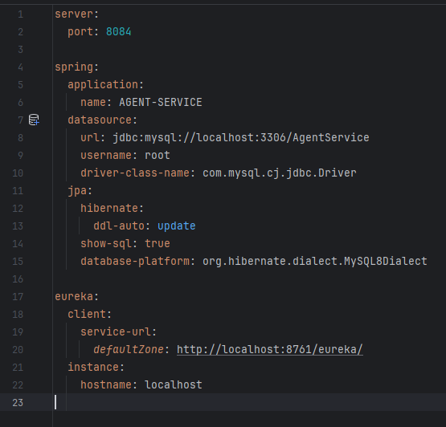

  ## 1. Test Citizen Service via Agent:

  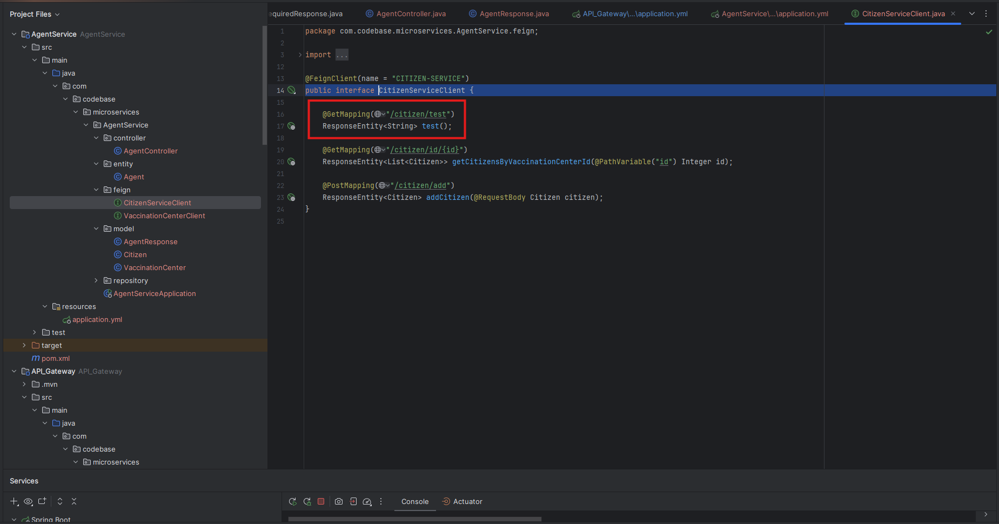
  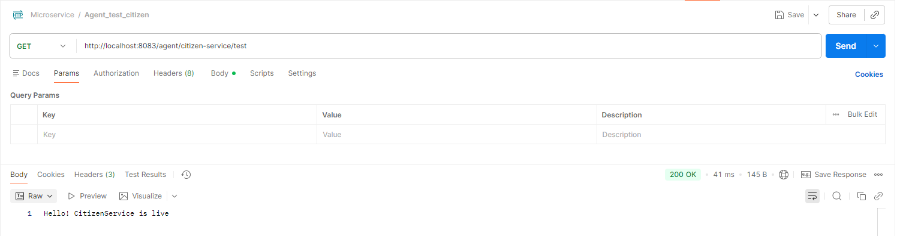

  ## 2. Add Citizen via Agent:

  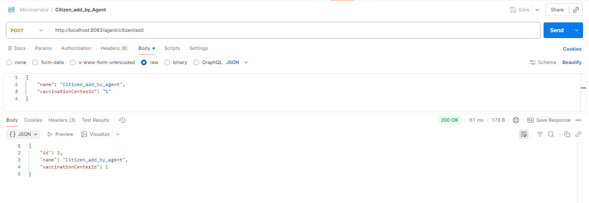
  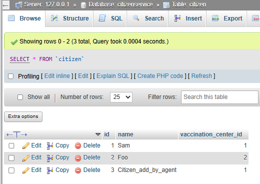

  ## 3. Add Vaccination Center via Agent:

  
  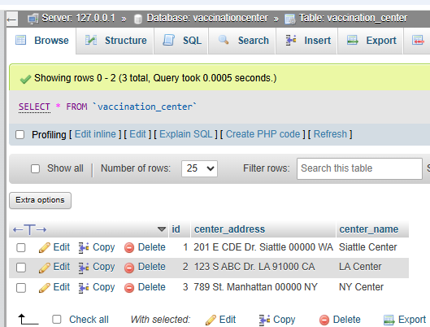

  ## 4. Get Citizen by Center via Agent:

  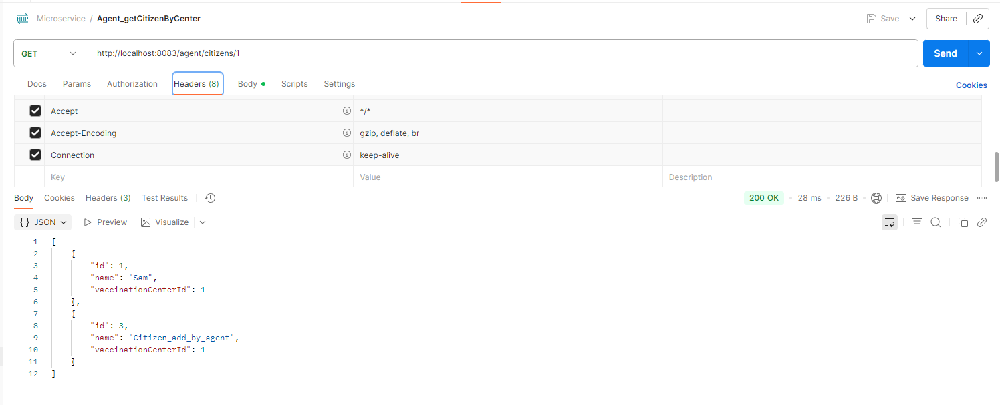

  Here it shows 2 citizens in Center 1.

  ## 5. Get Center by id via Agent:
  Here We first look up the agent by agent id, then use agent.getVaccinationCenterId() to get center id, then call CitizenService to get the Citizens via OpenFeign.

  ```java
      // Composite endpoint - Get agent with vaccination center and citizens info
    @GetMapping("/details/{agentId}")
    public ResponseEntity<AgentResponse> getAgentWithDetails(@PathVariable Integer agentId) {
        Agent agent = agentRepository.findById(agentId).orElse(null);
        if (agent == null) {
            return new ResponseEntity<>(HttpStatus.NOT_FOUND);
        }

        AgentResponse response = new AgentResponse();
        response.setAgent(agent);

        // Get Citizen from Citizen Service via OpenFeign
        try {
            int vaccinationCenter = agent.getVaccinationCenterId();
            response.setVaccinationCenter(vaccinationCenter);
            ResponseEntity<List<Citizen>> citizenResponse = citizenServiceClient.getCitizensByVaccinationCenterId(vaccinationCenter);
            response.setCitizens(citizenResponse.getBody());
        } catch (Exception e) {
            response.setVaccinationCenter(0);
            response.setCitizens(null);
        }

        return new ResponseEntity<>(response, HttpStatus.OK);
    }
  ```
  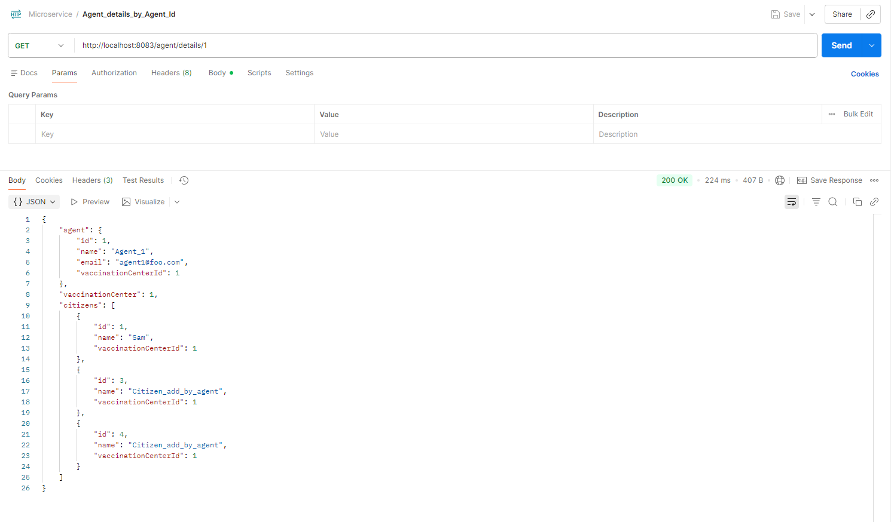


  ## 6. In addition, I added fallback for CitizenServiceClient:

  ###  1. Created CitizenServiceFallbackFactory.java - Uses FallbackFactory instead of simple Fallback (better error handling)
  ### 2. Updated CitizenServiceClient.java:
  ```java
  @FeignClient(name = "CITIZEN-SERVICE", fallbackFactory = CitizenServiceFallbackFactory.class)
  ```
  ### 3. Updated application.yml - Added both config variants:
  ```java
  spring:
    cloud:
      openfeign:
        circuitbreaker:
          enabled: true

  feign:
    circuitbreaker:
      enabled: true
  ```
  Now, when Citizen Service is down, 
  - GET /agent/citizen-service/test → Returns 503 with message "CitizenService is unavailable: [error details]"
  - GET /agent/citizens/{id} → Returns 200 with empty list []
  - POST /citizen/add → Returns null (503)

  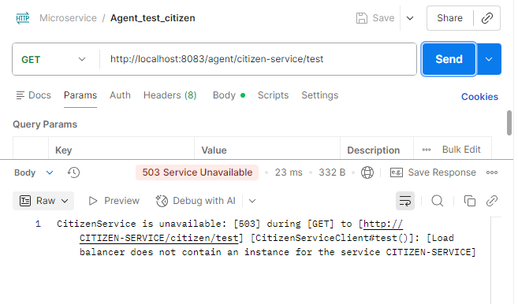
  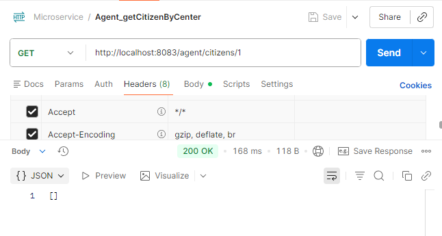
  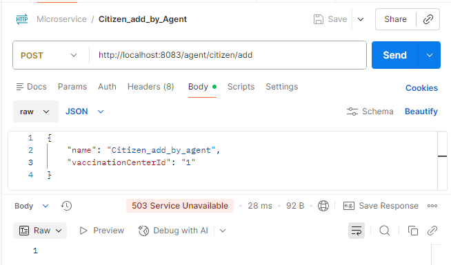


# 2. kafka repo(https://github.com/CTYue/Spring-Producer-Consumer.git): create your database/DAO and save the message in the  consumer. implement both At-Least-Once and At-Most-Once.  

share your screen shot in the markdown file

A:
Code is in https://github.com/SiyanWen/Spring-Producer-Consumer hw17_database_integration branch.

**Files Created/Modified**

##  New Files:

  1. entity/KafkaMessage.java - JPA entity to store Kafka messages with fields:
    - id, messageKey, messageValue, topic, partitionId, offsetValue, consumerGroup, deliverySemantic, createdAt
  2. repository/KafkaMessageRepository.java - Spring Data JPA repository
  3. service/AtLeastOnceConsumerService.java - At-Least-Once consumer
  4. service/AtMostOnceConsumerService.java - At-Most-Once consumer

##  Modified Files:

  1. pom.xml - Added MySQL and JPA dependencies
  2. application.properties - Added database configuration
  3. config/KafkaConsumerConfig.java - Added two new container factories

##  Delivery Semantics Explained

###  At-Least-Once (AtLeastOnceConsumerService)

  1. Receive message from Kafka
  2. Save to MySQL database
  3. Manually commit offset (acknowledge())
  - Auto-commit: Disabled
  - Ack Mode: MANUAL
  - Trade-off: Messages may be processed multiple times (duplicates), but never lost

###  At-Most-Once (AtMostOnceConsumerService)

  1. Receive message (offset auto-committed immediately)
  2. Save to MySQL database
  - Auto-commit: Enabled (100ms interval)
  - Ack Mode: RECORD
  - Trade-off: Messages processed at most once (no duplicates), but may be lost

##  Database Table

  The kafka_messages table will be auto-created with columns:
  - id (PK), message_key, message_value, topic, partition_id, offset_value, consumer_group, delivery_semantic, created_at

Sending a message through Postman:

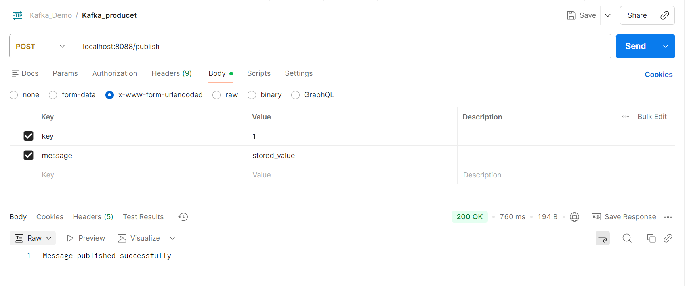

Intellij console:

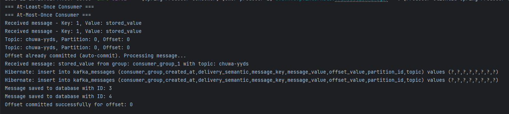

UI for Apache Kafka:

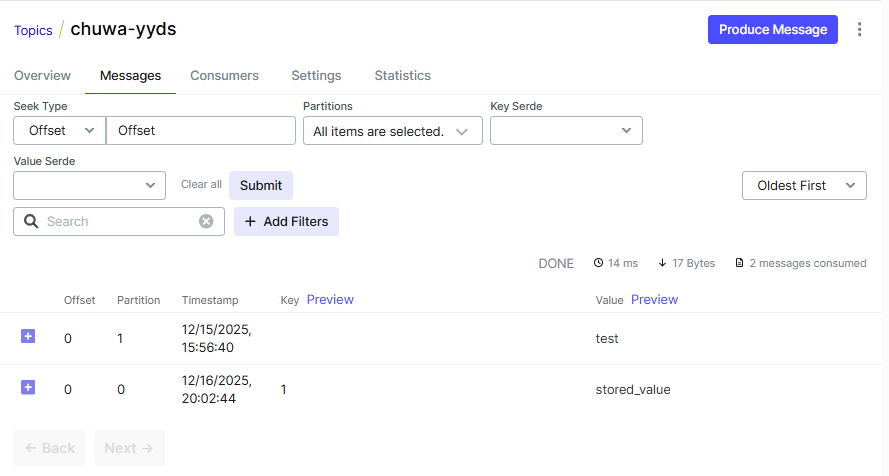

Database (xampp phpmyadmin ui)

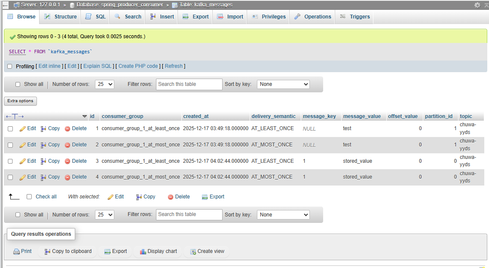