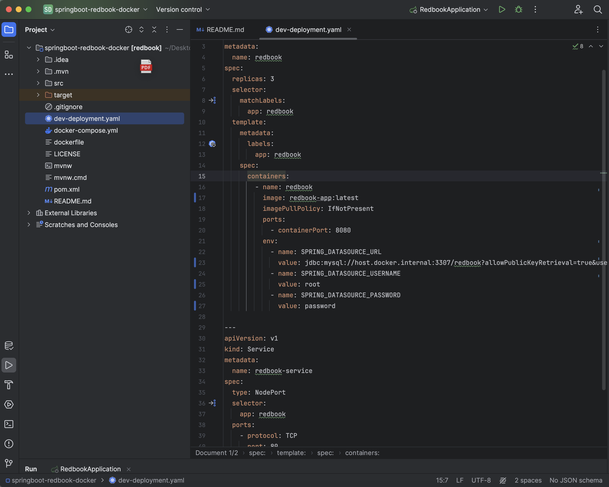

## Part3: 
### Dockerize Spring-redbook application using https://github.com/CTYue/springboot-redbook/tree/docker
### Start your local kubernetes and deploy above dockerized image to it, with dev-deployment.yaml. 
### The dev-deployment.yaml may not work, please update it accordingly.
### Please do some research on how to start docker-kubernetes context.


1. Start MySQL in Docker
```bash
docker run -d --name redbook-mysql -p 3307:3306 \
  -e MYSQL_ROOT_PASSWORD=password \
  -e MYSQL_DATABASE=redbook \
  mysql:8.0
``` 
2. Build the Spring Boot .jar
```bash
./mvnw clean package -DskipTests
```

3. Build Docker image (for Kubernetes)
```bash
docker buildx create --use        
docker buildx build --load -t redbook-app:latest .
```

4. Switch to local Kubernetes
```bash
kubectl config use-context docker-desktop
```

5. Update dev-deployment.yaml
```yaml
image: redbook-app:latest
imagePullPolicy: IfNotPresent

env:
  - name: SPRING_DATASOURCE_URL
    value: jdbc:mysql://host.docker.internal:3307/redbook?allowPublicKeyRetrieval=true&useSSL=false
  - name: SPRING_DATASOURCE_USERNAME
    value: root
  - name: SPRING_DATASOURCE_PASSWORD
    value: password
```


6. Deploy to Kubernetes
```bash
kubectl apply -f dev-deployment.yaml
(if already has: kubectl delete -f dev-deployment.yaml)
```

7. Check status
```bash
kubectl get pods
```
