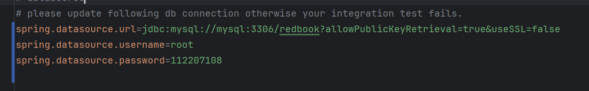
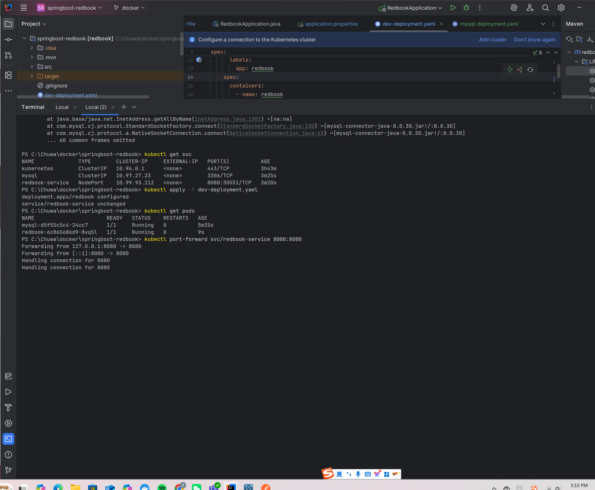
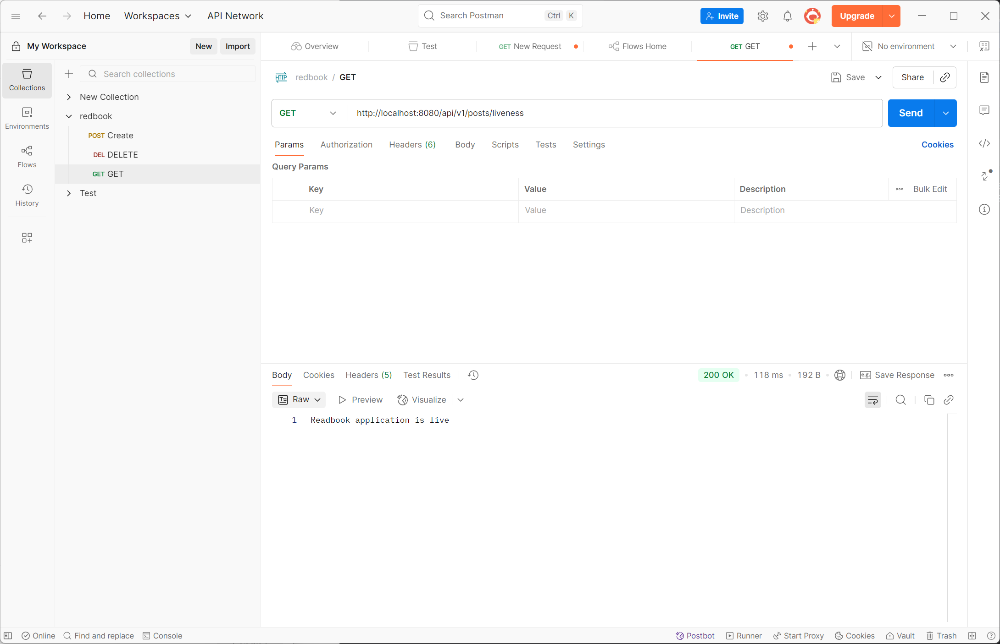

## 1. Built the Spring Boot Application JAR

* Why? This compiles Spring Boot app and generates the .jar needed for Docker.

* Purpose: Prepares the application artifact for containerization.
## 2. Built the Docker Image for Spring-Redbook
* Why? This creates a Docker image of Spring Boot application.


* Purpose: Deploy it into Kubernetes as a Pod.


## 3. Created a Kubernetes Deployment + Service for MySQL

* wrote a mysql-deployment.yaml file with
    * A Deployment for MySQL 8.0.
    * A Service named mysql to expose it inside the K8s cluster.

* Why? This runs MySQL **inside** Kubernetes, not as an external Docker container.

* Purpose: This allows Redbook Pod to connect to MySQL via Kubernetes internal DNS (mysql:3306).


## 4. Updated Spring Boot application.properties
* Why? To ensure the Spring Boot app connects to the Kubernetes MySQL Service name (mysql), not localhost or an IP.

* Purpose: Internal service discovery via K8s DNS.


## 5.Created a Kubernetes Deployment + Service for Redbook (dev-deployment.yaml)

## 6. Deployed Everything to Kubernetes
* Why? To create Pods and Services in the Kubernetes cluster.

* Purpose: To launch and wire up MySQL and Spring Redbook app inside Kubernetes.

## 7.Verified Pod Status
```
kubectl get pods
```

Ensured both mysql and redbook pods were in Running state.




## 8.  Port-Forwarded Redbook Service for Local Testing
* Why? To access the Spring Boot API from local machine.

* Purpose: Enables testing via Postman on localhost:8080.


## 9. (Debugging Key Step) Removed hostNetwork: true
* Why? hostNetwork: true bypasses Kubernetes DNS, making mysql unresolvable.

* Purpose: Removing it allowed Redbook Pod to resolve and connect to MySQL via Kubernetes Service DNS.


## What I did
### Run MySQL inside Kubernetes as a Pod
— via mysql-deployment.yaml (Deployment + Service)

AND

### Run the Spring-Redbook app inside Kubernetes as another Pod
— via dev-deployment.yaml (Deployment + Service)

### Both are connected through Kubernetes internal networking:
Spring Boot connects to MySQL via Service DNS name → mysql:3306

Kubernetes automatically routes the connection from your Spring Boot Pod to the mysql Pod using the Service named mysql.


