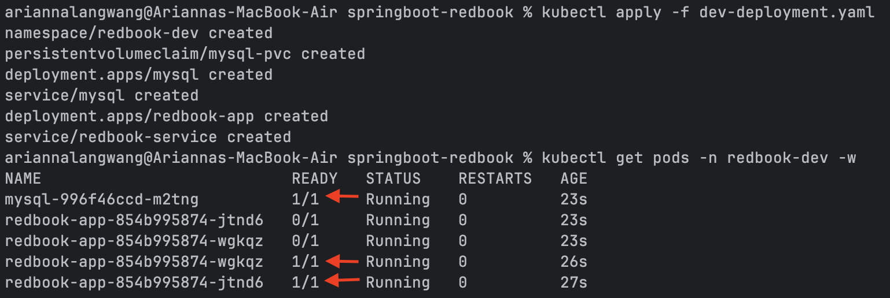
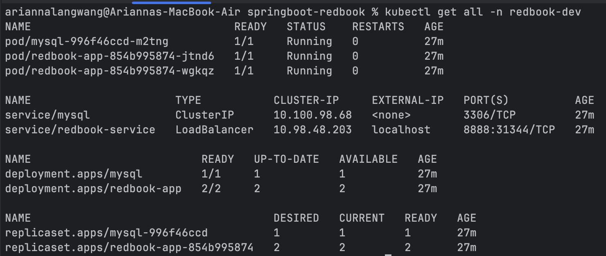
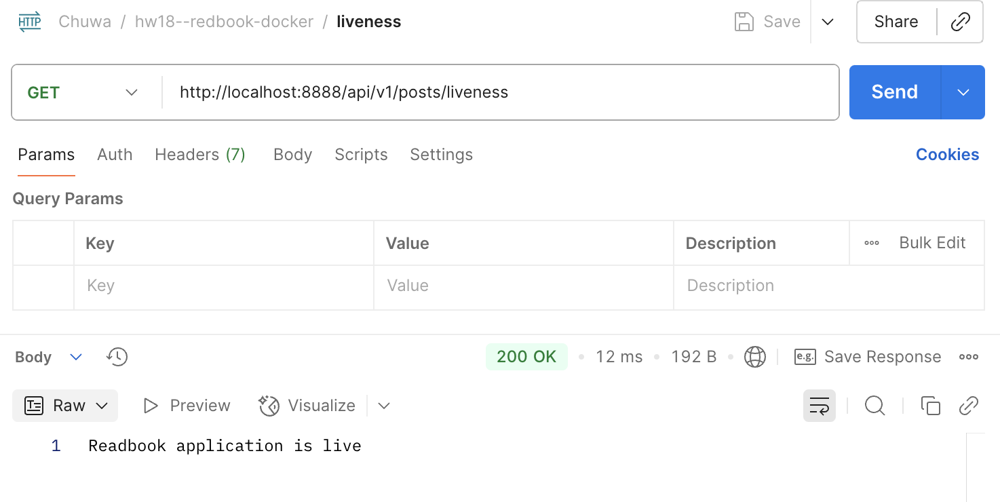
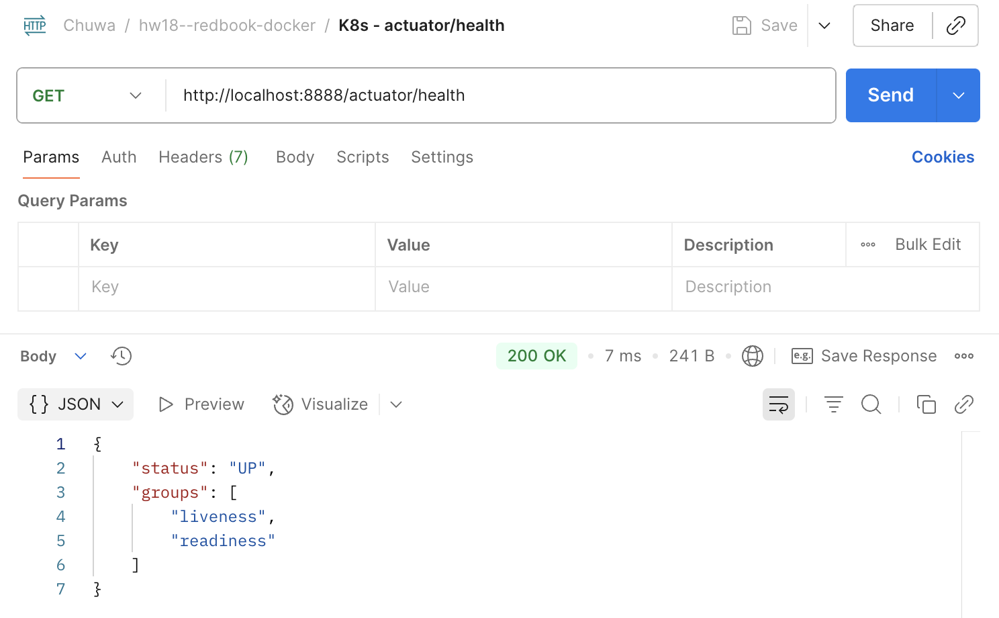
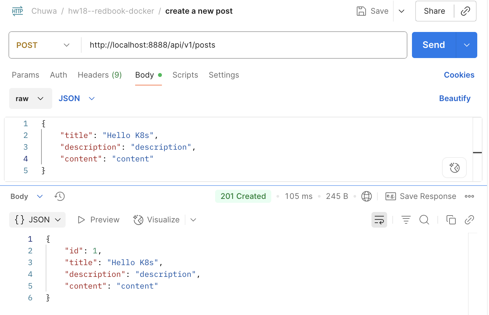
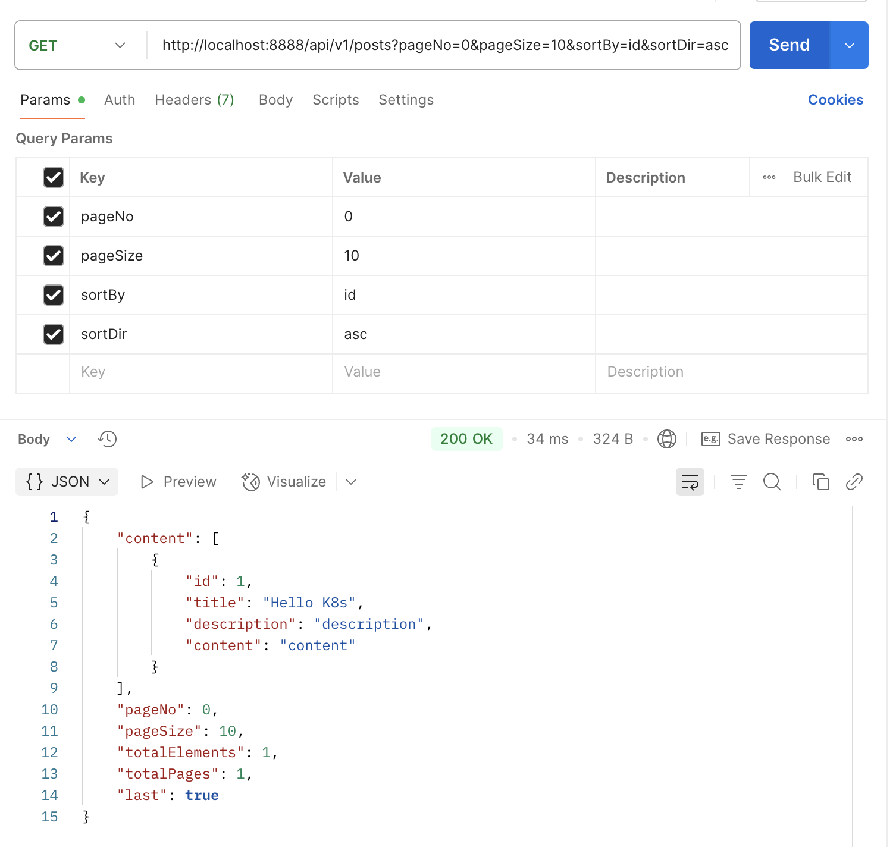

### hw18

---
#### Assignment Part 1: Cassandra Quiz (on Google doc)

#### Assignment Part 2: Kubernetes Quiz (on Google doc)

---
#### Assignment Part 3

1. Dockerize `Spring-redbook application` using https://github.com/CTYue/springboot-redbook/tree/docker
2. Start your local kubernetes and deploy above dockerized image to it, with `dev-deployment.yaml`.
3. The `dev-deployment.yaml` may not work, please update it accordingly.
4. Do some research on how to start docker kubernetes context.

---

**Kubernetes cluster is up:**

---

**Everything looks good:**

---
**CHECK IN POSTMAN:**

**Liveness Endpoint:**

**Readiness Endpoint:**

**I added `readinessProbe` and `livenessProbe` on path `/actuator/health` for the app in `dev-deployment.yaml`:**

**So I can check the results of the `readinessProbe` and `livenessProbe` by calling endpoint `/actuator/health`:**

**Create a new post:**

**Get post by id:**

