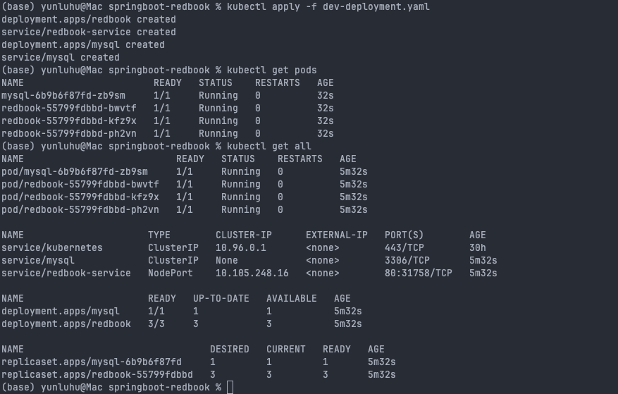
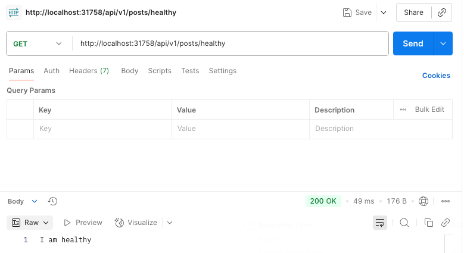

# HW18 - Kubernetes Hands-on

1. Dockerize Spring-redbook application using https://github.com/CTYue/springboot-redbook/tree/docker
2. Start your local kubernetes and deploy above dockerized image to it, with dev-deployment.yaml. 
3. The dev-deployment.yaml may not work, please update it accordingly.
4. Please do some research on how to start docker-kubernetes context.

From the screenshot, we can see the Rebook app and MySQL have been successfully deployed into **local Kubernetes cluster** using `dev-deployment.yaml`. 1 MySQL pod and 3 Redbook application pods are running and healthy. The services have been created as well, and we can use postman to test:

