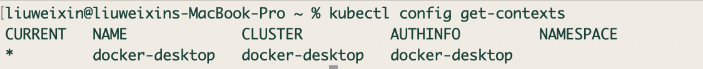
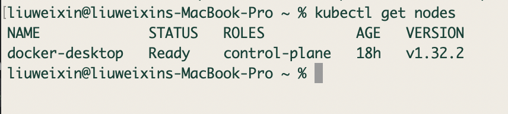
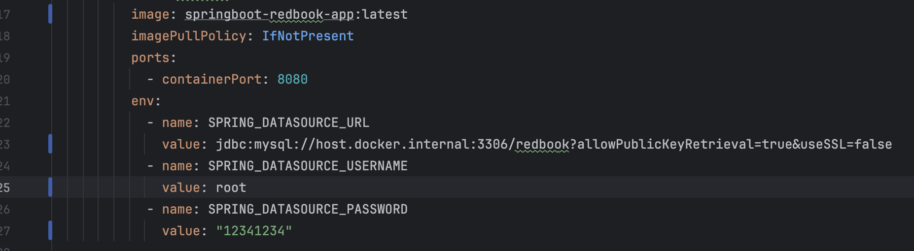
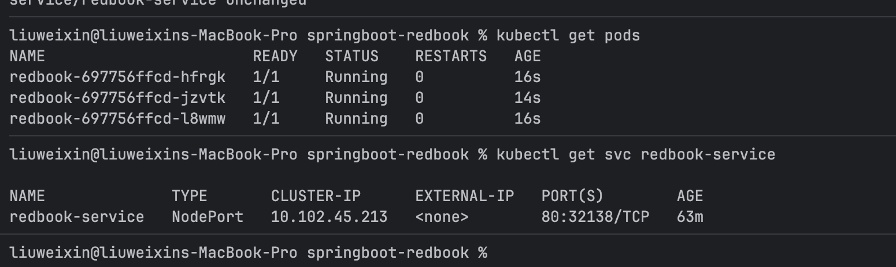
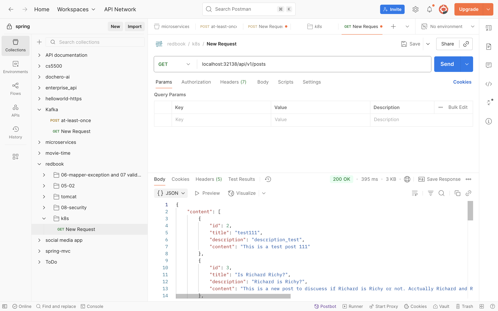

# HW 18 K8S, Docker, Cassandra

---
## Assignment Part 1: quiz

---
## Assignment Part 2: quiz

---

## Assignment Part 3:

1. Dockerize Spring-redbook application using https://github.com/CTYue/springboot-redbook/tree/docker
2. Start your local kubernetes and deploy above dockerized image to it, with dev-deployment.yaml.
3. The dev-deployment.yaml may not work, please update it accordingly.
4. Please do some research on how to start docker-kubernetes context.

### Start docker-kubernetes context.
✅ 1. Check if Kubernetes is enabled in Docker Desktop
- Open Docker Desktop → Settings → Kubernetes.
- Enable “Enable Kubernetes”.
- Click Apply & Restart.
- After enabling, Docker Desktop will set up a single-node Kubernetes cluster and configure the context.

✅ 2. Verify Installed Tools
```shell
docker --version
kubectl version --client
```

✅ 3. Check Current Kubernetes Context
```shell
kubectl config get-contexts
```


✅ 4. Verify Cluster Connection
```shell
kubectl get nodes
```



---

### Build a Docker image for the redbook application and deploy it to Kubernetes.

✅ Step 1: Maven clean and package
```shell
mvn clean package -DskipTests
```

✅ Step 2: Build Docker image
```shell
docker build -t springboot-redbook-app:latest .
```

✅ Step 3: Load image into Kubernetes (Docker Desktop uses local images automatically)


✅ Step 4: Apply Kubernetes deployment(Update `dev-deployment.yaml` at first)

```shell
kubectl apply -f dev-deployment.yaml
```

✅ Step 5: Check pods
```shell
kubectl get pods
```

✅ Step 6: Check service port:
```shell
kubectl get svc redbook-service
```


### For me, the port is 32138
### Test api with postman using port 32138




