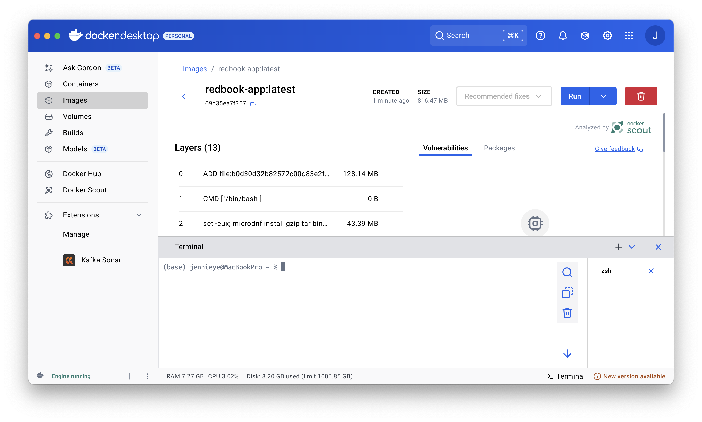
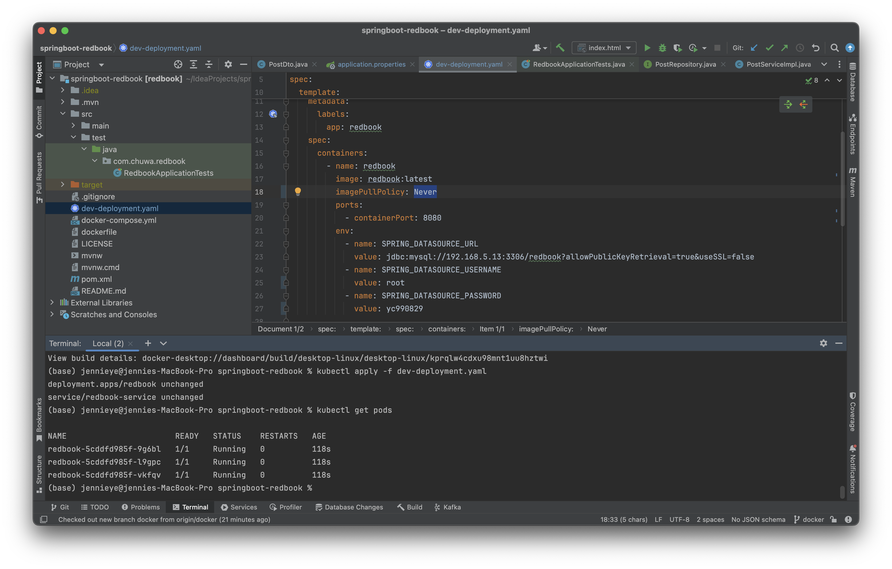

# 📘 Chuwa Assignment Part 3 - Dockerize and Deploy Spring Redbook

## 📍 Task Overview
This assignment requires containerizing and deploying the [`springboot-redbook`](https://github.com/CTYue/springboot-redbook/tree/docker) application to a local Kubernetes cluster.

---

## Task Breakdown

### Dockerize Spring-redbook application using https://github.com/CTYue/springboot-redbook/tree/docker

### Start your local kubernetes and deploy above dockerized image to it, with dev-deployment.yaml.

### The dev-deployment.yaml may not work, please update it accordingly.
### Please do some research on how to start docker-kubernetes context.