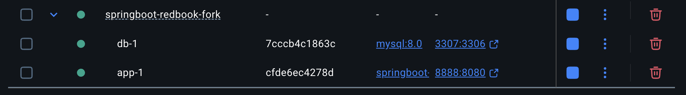

### Part 1 Cassandra Quiz
Quiz: https://forms.gle/nid3QRJGvwU9dDUc7

### Part 2 Kubernetes Pop Quiz
https://forms.gle/kUcTVEAXGFm8h3KRA

### Part 3
1. Dockerize Spring-redbook application using https://github.com/CTYue/springboot-redbook/tree/docker
   
2. Start your local kubernetes and deploy above dockerized image to it, with dev-deployment.yaml. 
   1. The dev-deployment.yaml may not work, please update it accordingly.  
   2. Please do some research on how to start docker-kubernetes context.   
Due: Aug 1st 2025 5:30PM Pacific Time