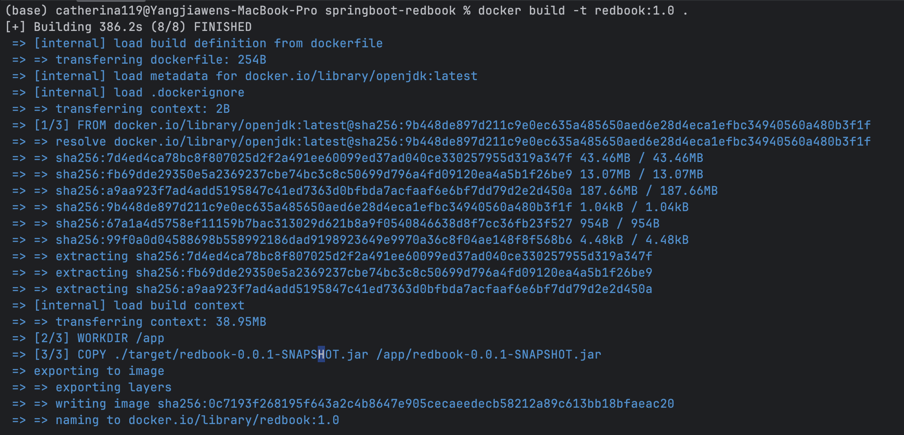
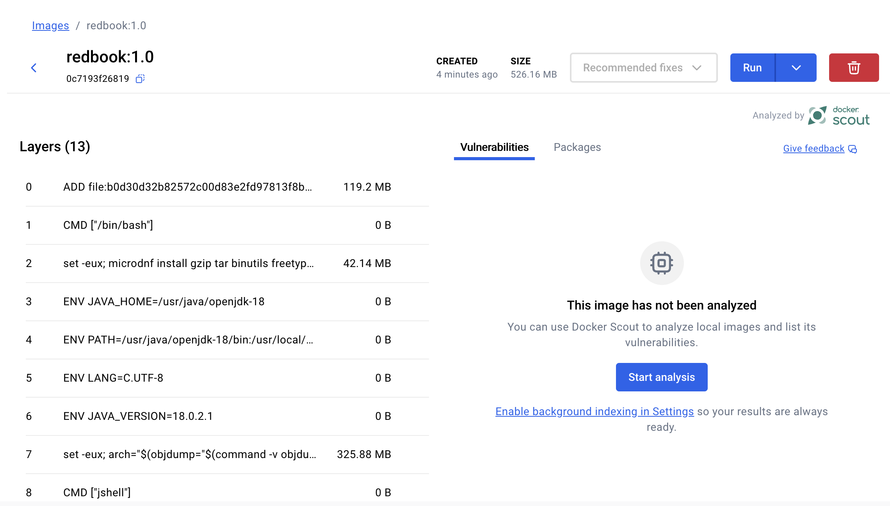
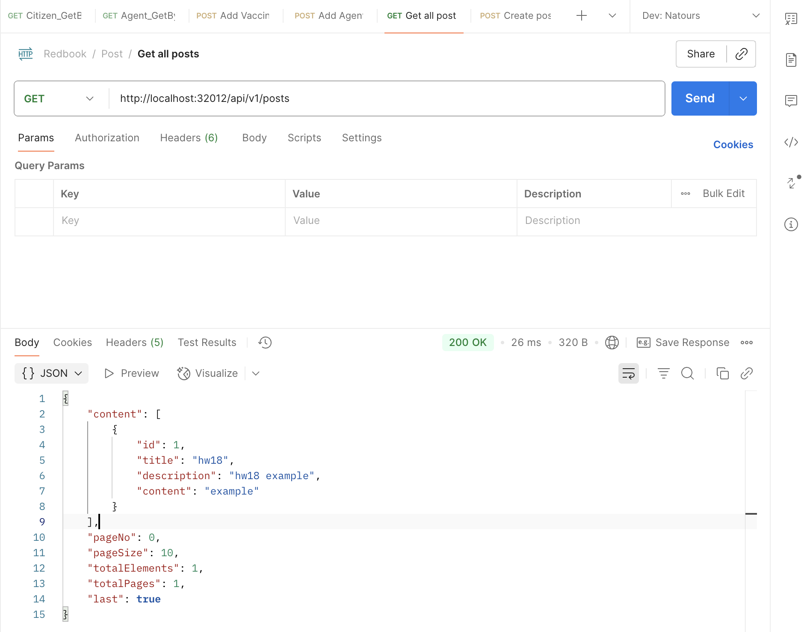

`
Dockerize Spring-redbook application using https://github.com/CTYue/springboot-redbook/tree/docker
Start your local kubernetes and deploy above dockerized image to it, with dev-deployment.yaml.
The dev-deployment.yaml may not work, please update it accordingly.
Please do some research on how to start docker-kubernetes context.
`
```
docker buildx create --use               
docker buildx build --load -t redbook-app:latest .
kubectl delete -f dev-deployment.yaml
kubectl apply -f dev-deployment.yaml
kubectl get pods
kubectl get svc  
```





