hw Quiz:

https://forms.gle/nid3QRJGvwU9dDUc7

https://forms.gle/kUcTVEAXGFm8h3KRA

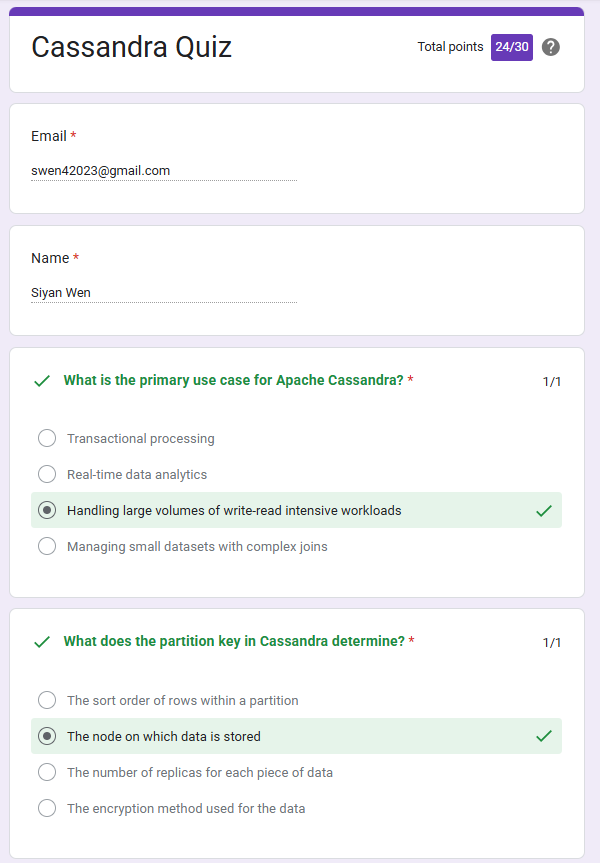
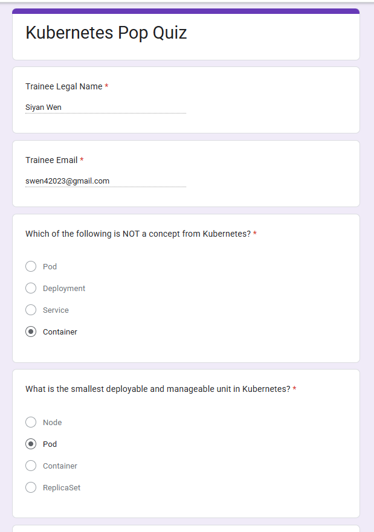

# 1. Dockerize Spring-redbook application using https://github.com/CTYue/springboot-redbook/tree/docker

A:


## 1. build image
generate the target/XXX.jar file:

```
mvn clean package  
```
dockerfile:
```java
# Base image
FROM eclipse-temurin:17-jdk-alpine

# Set working directory
WORKDIR /app

# Copy the built JAR file (build it locally first)
COPY target/*.jar app.jar

# Add build information
ARG BUILD_VERSION=unknown
ARG BUILD_TIMESTAMP=unknown
LABEL version="${BUILD_VERSION}" \
      build-timestamp="${BUILD_TIMESTAMP}"

# Expose port
EXPOSE 8080

# Run the application
ENTRYPOINT ["java", "-jar", "app.jar"]
```

build
```
docker build -t {image_name}:{image_tag} .
```
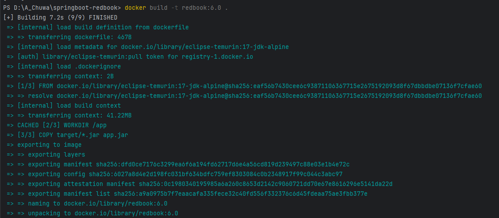

## 2. Run image
```
docker run --name redbook_container -d `
-p 8080:8080 `
-e SPRING_DATASOURCE_URL=jdbc:mysql://host.docker.internal:3306/redbook?useSSL=false `
-e SPRING_DATASOURCE_USERNAME=root `
-e SPRING_DATASOURCE_PASSWORD=secret `
redbook:6.0
```
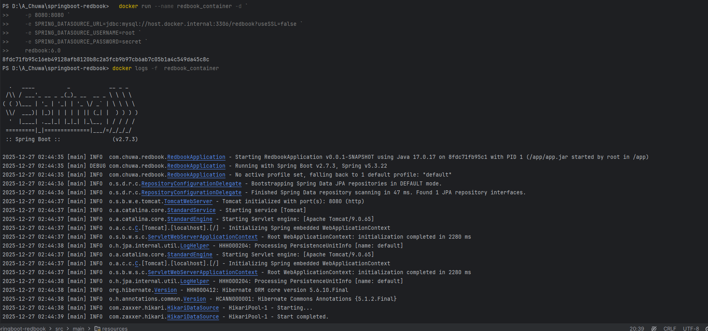

## 3. Send a request via Postman:

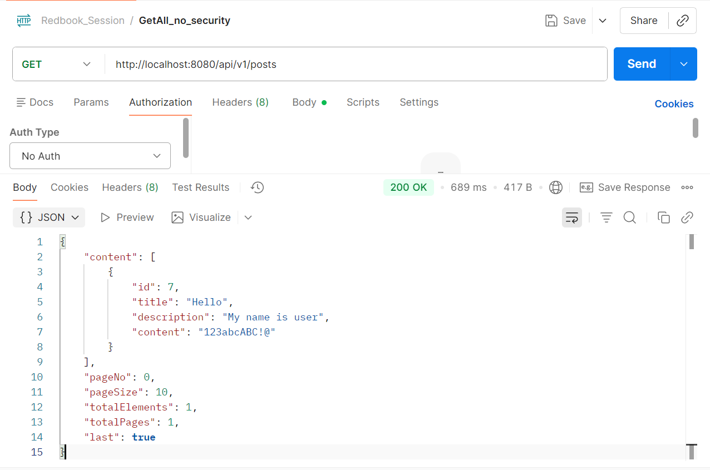

# 2. Start your local kubernetes and deploy above dockerized image to it, with dev-deployment.yaml. 


## Deploy to Kubernetes:
### 1. Manifest:
deployment.yml:
```yml
apiVersion: apps/v1
kind: Deployment
metadata:
  name: redbook-app
  namespace: redbook
  labels:
    app: redbook
    app.kubernetes.io/name: redbook
    app.kubernetes.io/version: "1.0.0"
spec:
  replicas: 4
  selector:
    matchLabels:
      app: redbook
  strategy:
    type: RollingUpdate
    rollingUpdate:
      maxSurge: 1
      maxUnavailable: 1
  template:
    metadata:
      labels:
        app: redbook
    spec:
      containers:
      - name: redbook
        image: redbook:6.0  # update with your image name and VERSION
        imagePullPolicy: IfNotPresent
        ports:
        - containerPort: 8080
          name: http
          protocol: TCP
        resources:
          requests:
            cpu: "100m"
            memory: "256Mi"
          limits:
            cpu: "500m"
            memory: "512Mi"
        livenessProbe:
          httpGet:
            path: /api/v1/posts/liveness
            port: 8080
          initialDelaySeconds: 60
          periodSeconds: 10
          timeoutSeconds: 5
          successThreshold: 1
          failureThreshold: 3
        readinessProbe:
          httpGet:
            path: /api/v1/posts/readiness
            port: 8080
          initialDelaySeconds: 30
          periodSeconds: 10
          timeoutSeconds: 5
          successThreshold: 1
          failureThreshold: 3
        env:
        - name: SPRING_PROFILES_ACTIVE
          value: "prod"
        - name: SERVER_PORT
          value: "8080"
        - name: SPRING_DATASOURCE_URL
          value: "jdbc:mysql://mysql:3306/redbook?useSSL=false&serverTimezone=UTC&allowPublicKeyRetrieval=true"
        - name: SPRING_DATASOURCE_USERNAME
          value: "root"
        - name: SPRING_DATASOURCE_PASSWORD
          valueFrom:
            secretKeyRef:
              name: mysql-secret
              key: MYSQL_ROOT_PASSWORD
---
apiVersion: v1
kind: Service
metadata:
  name: redbook-service
  namespace: redbook
  labels:
    app: redbook
    app.kubernetes.io/name: redbook-service
    app.kubernetes.io/version: "1.0.0"
spec:
  selector:
    app: redbook
  ports:
    - name: http
      protocol: TCP
      port: 80
      targetPort: 8080
      nodePort: 30080
  type: NodePort
  # If you're using a cloud provider with LoadBalancer support, you can use:
  # type: LoadBalancer
  # loadBalancerIP: "" # Optional: specify a static IP if needed
```
mysql.yml:
```yml
apiVersion: v1
kind: ConfigMap
metadata:
  name: mysql-config
  namespace: redbook
data:
  MYSQL_DATABASE: redbook
---
apiVersion: v1
kind: Secret
metadata:
  name: mysql-secret
  namespace: redbook
type: Opaque
stringData:
  MYSQL_ROOT_PASSWORD: secret
---
apiVersion: apps/v1
kind: Deployment
metadata:
  name: mysql
  namespace: redbook
spec:
  replicas: 1
  selector:
    matchLabels:
      app: mysql
  template:
    metadata:
      labels:
        app: mysql
    spec:
      containers:
      - name: mysql
        image: mysql:9.5.0
        ports:
        - containerPort: 3306
        envFrom:
        - configMapRef:
            name: mysql-config
        - secretRef:
            name: mysql-secret
        resources:
          requests:
            cpu: "100m"
            memory: "256Mi"
          limits:
            cpu: "500m"
            memory: "512Mi"
        volumeMounts:
        - name: mysql-data
          mountPath: /var/lib/mysql
      volumes:
      - name: mysql-data
        persistentVolumeClaim:
          claimName: mysql-pvc
---
apiVersion: v1
kind: PersistentVolumeClaim
metadata:
  name: mysql-pvc
  namespace: redbook
spec:
  accessModes:
    - ReadWriteOnce
  resources:
    requests:
      storage: 1Gi
---
apiVersion: v1
kind: Service
metadata:
  name: mysql
  namespace: redbook
spec:
  selector:
    app: mysql
  ports:
  - port: 3306
    targetPort: 3306
  clusterIP: None
```
namespace.yml:
```yml
apiVersion: v1
kind: Namespace
metadata:
  name: redbook
  labels:
    name: redbook
# If you already created redbook namespace, you don't need to run kubectl apply -f ./k8s/namespace.yaml.
```
### 2.  Apply

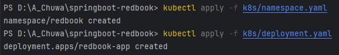

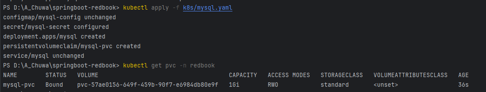

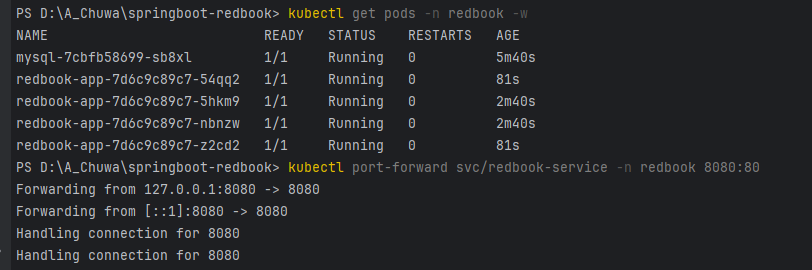

### 3. Test with Postman

Create Post:

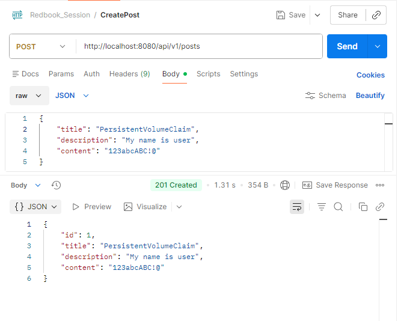

Get all Posts:

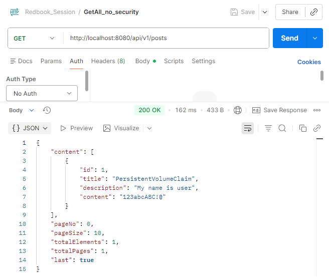

Because we are using Persistent Volume, the data persists even if we delete the mysql service and restart:

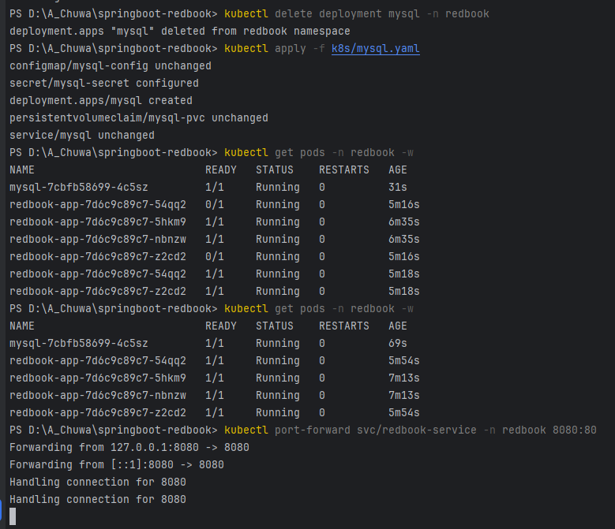


### 4. Cleanup

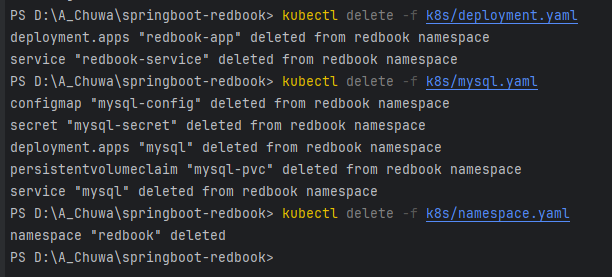

## Docker compose
I also tried to use docker-compose.yml in provided repository.

### 1. docker-compose.yml:

```yaml
services:
  app:
    build:
      context: .
      dockerfile: Dockerfile
    ports:
      - "8080:8080"
    environment:
      - SPRING_DATASOURCE_URL=jdbc:mysql://db:3306/redbook?useSSL=false&serverTimezone=UTC&allowPublicKeyRetrieval=true
      - SPRING_DATASOURCE_USERNAME=root
      - SPRING_DATASOURCE_PASSWORD=secret
    depends_on:
      db:
        condition: service_healthy
    networks:
      - app-network
    restart: on-failure

  db:
    image: mysql:9.5.0
    environment:
      MYSQL_DATABASE: redbook
      MYSQL_ROOT_PASSWORD: secret
    volumes:
      - D:\A_Chuwa\springboot-redbook\db-data:/var/lib/mysql
    networks:
      - app-network
    healthcheck:
      test: ["CMD", "mysqladmin", "ping", "-h", "localhost", "-psecret"]
      interval: 10s
      timeout: 5s
      retries: 5
      start_period: 30s

networks:
  app-network:

volumes:
  db-data:
```

### 2. docker compose up -d:
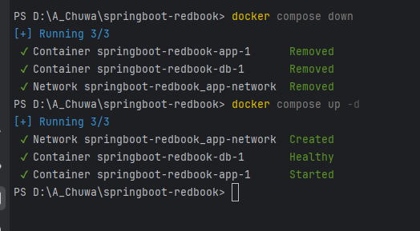

### 3. Send request via Postman:
Create Post:

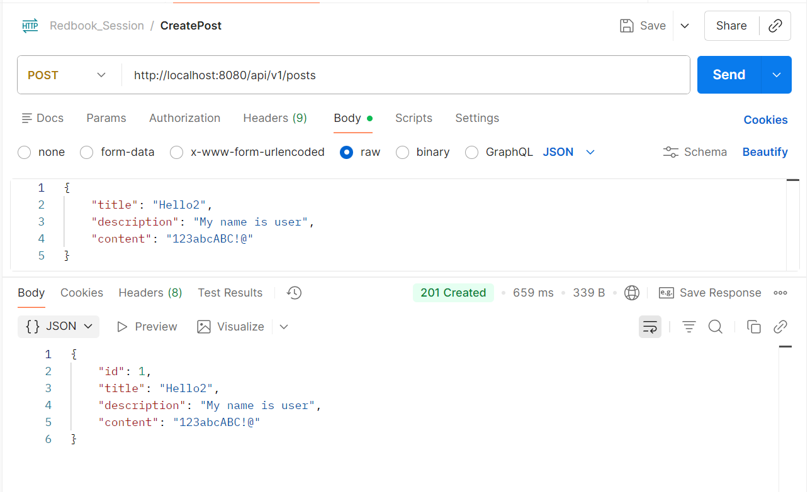

Get all Posts:

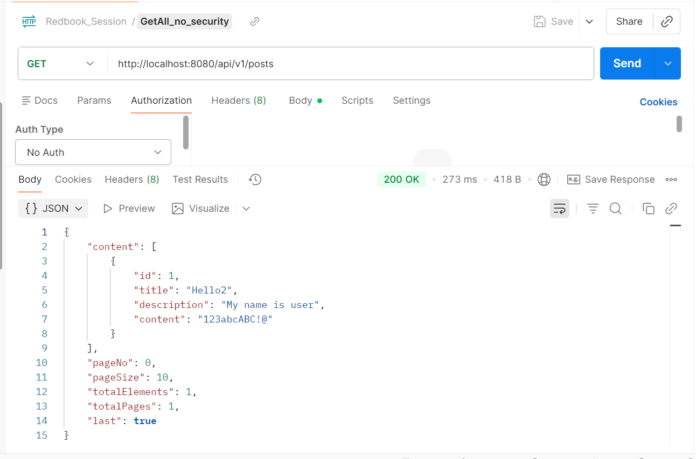

# 2. The dev-deployment.yaml may not work, please update it accordingly.
# 3. Please do some research on how to start docker-kubernetes context.
    Due: Aug 1st 2025 5:30PM Pacific Time
    GitHub - CTYue/springboot-redbook at docker
    Contribute to CTYue/springboot-redbook development by creating an account on GitHub.

A:

## Start Kubernetes Context:

1. On Windows 11, download WSL 2.

I already installed. To verify:

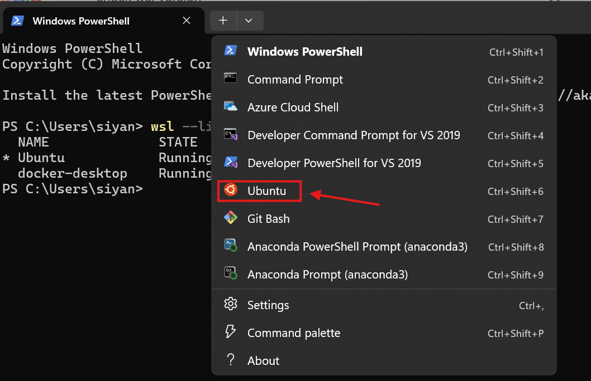

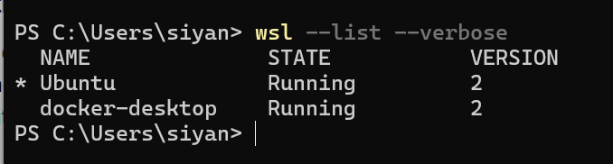

2. Enable WSL 2 in Docker.

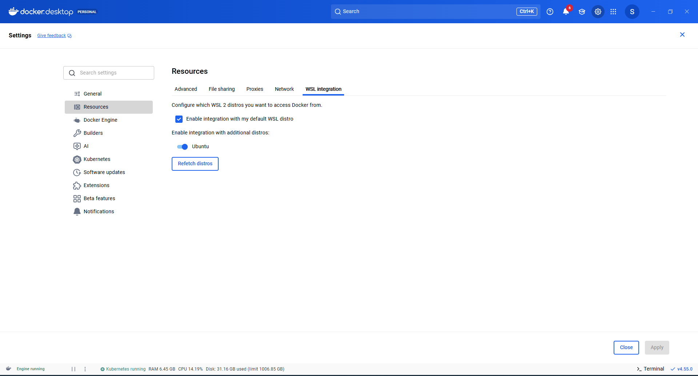

3. Enable Kubernetes in docker.

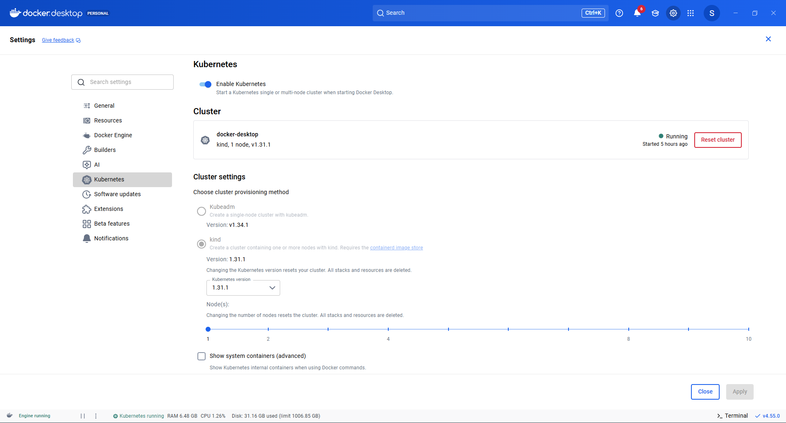

## Code submission:
Code is in https://github.com/SiyanWen/springboot-redbook/tree/dockerize_and_k8s_deploy branch "dockerize_and_k8s_deploy"