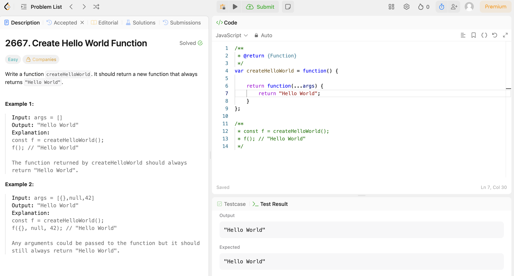
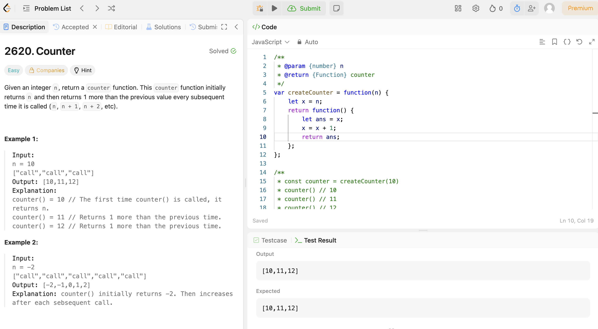
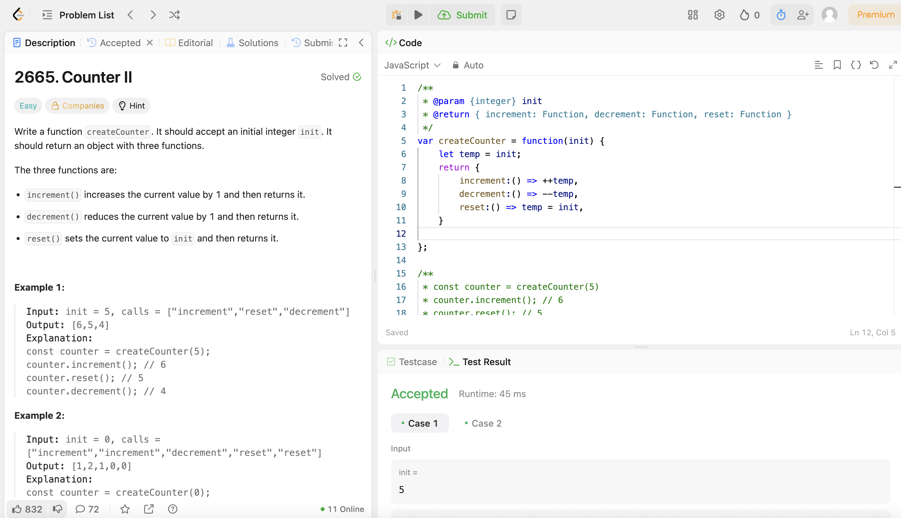
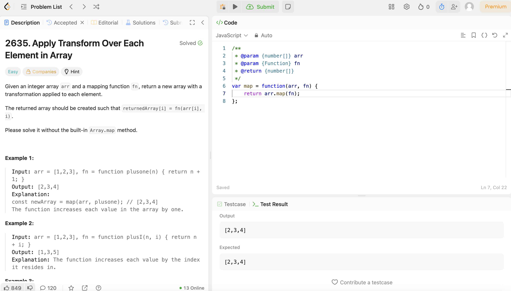
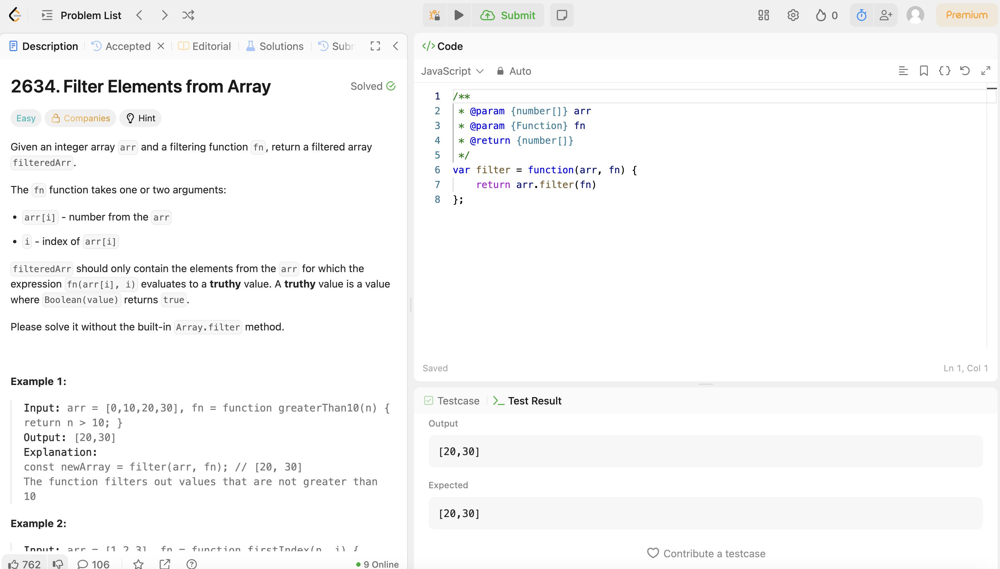

<p> 1. Read and practice all sample codes from 71-Dom-Bom-JavaScript-Typescript-Node.md on your local
   browser or an online compiler. </p>
<p> 2. Resolve 5 leetcode problems using Javascript. </p>











<p> 3. Compare let vs var , explain variable hosting with your own code examples. </p>

Variables declared by let are only available inside the block where they’re defined.
Variables declared by var are available throughout the function in which they’re declared.
```
function varScoping() {
  var x = 1;
  if (true) {
    var x = 2;
    console.log(x); // will print 2
  }
  console.log(x); // will print 2
}

function letScoping() {
  let x = 1;

  if (true) {
    let x = 2;
    console.log(x); // will print 2
  }

  console.log(x); // will print 1
}
```

<p> 4. Explain closure with code example </p>

A closure is the combination of a function and the lexical environment within which that function was declared. 
A closure allows an inner function to retain access to variables from its outer function's scope, 
even after the outer function has finished executing.

```
function createCounter() {
    let count = 0; // 'count' is a variable in the outer function's scope
    
    function increment() {
        count++; // The inner function 'increment' accesses 'count'
        console.log(count);
    }
    return increment; // The inner function is returned
}
const myCounter = createCounter(); // 'myCounter' now holds the 'increment' function
myCounter(); // output 1
myCounter(); // output 2
```

<p> 5. Explain Callback Hell with code example </p>


<p> 6. Explain Promise, Async, Await with code examples. </p>

<p> 7. Write an HTML page that generates a lucky number based on the date, time, and user inputs. Users
   should be able to get their random lucky numbers by clicking a button or using the enter key after typing
   the input. </p>

<p> 8. Write an HTML page that returns a user's GitHub repos (https://api.github.com/users/{user_id}/repos) in
   JSON format. The web page should have a text box and a submit button where users can provide the
   GitHub user ID. The fetch call should be asynchronous. If the call to the above API fails for any reason, you
   should return a customized, user-friendly error message. If you know more than one approach to
   implement the asynchronous call, please do it using different approaches.

<p> 9. Explain how Javascript implement asynchronous non-blocking feature </p>
1. Particularly: Event Loop, Macrotask, and Microtask with code samples.
   Please submit code, answers, and screenshots to your GitHub branch